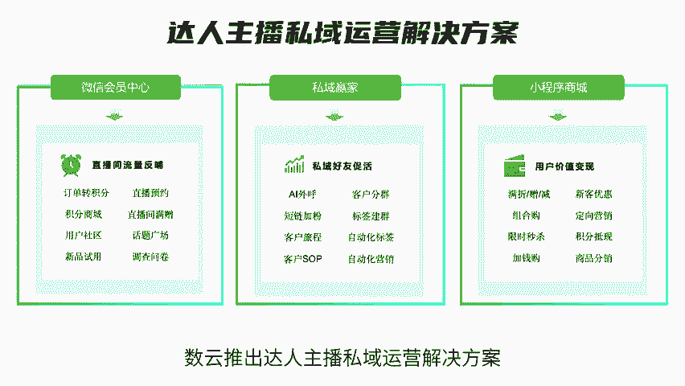
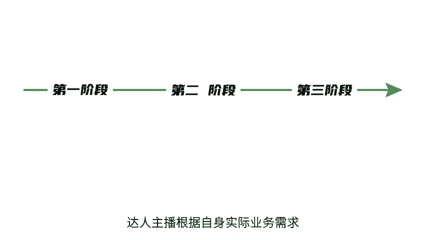
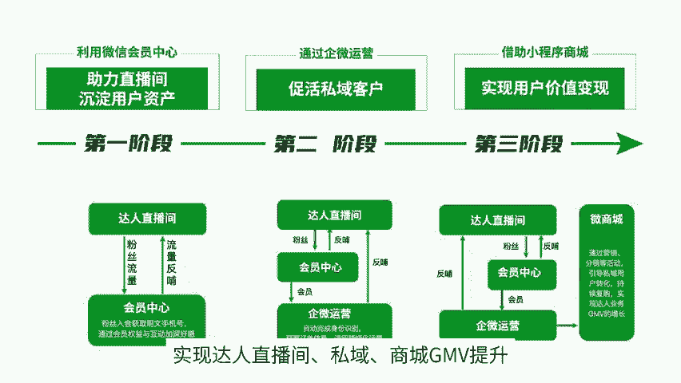
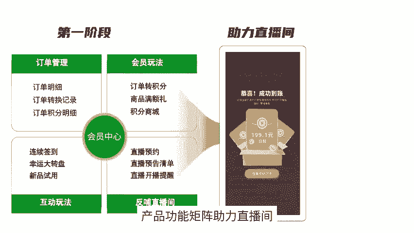
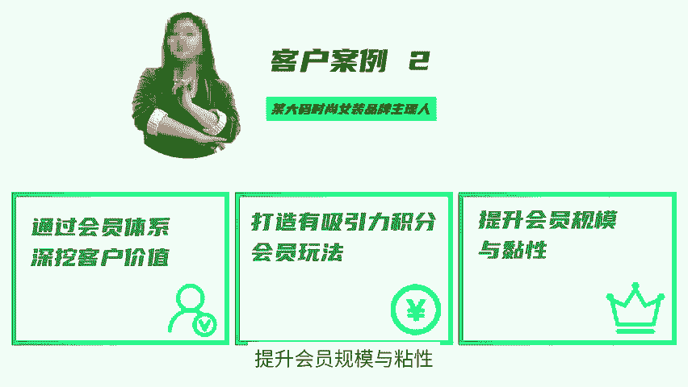
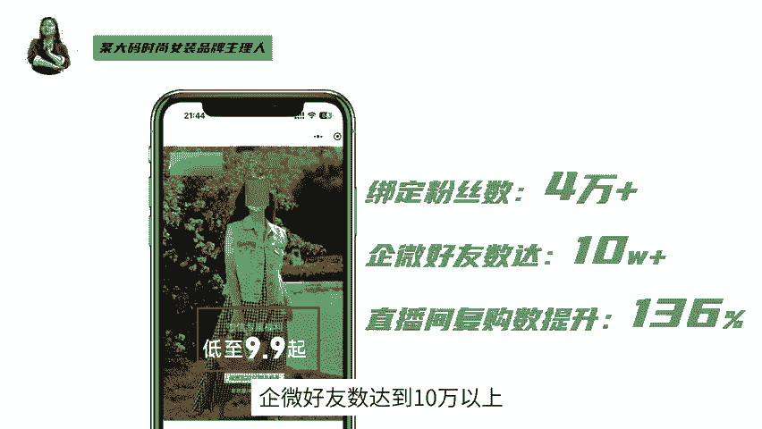
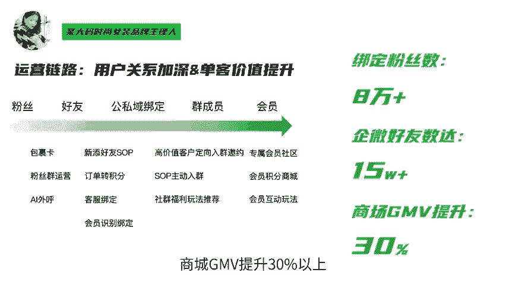
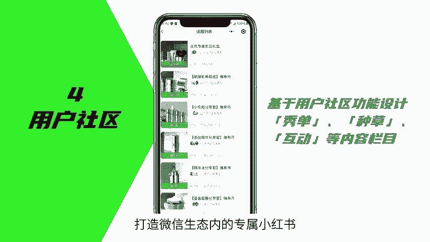
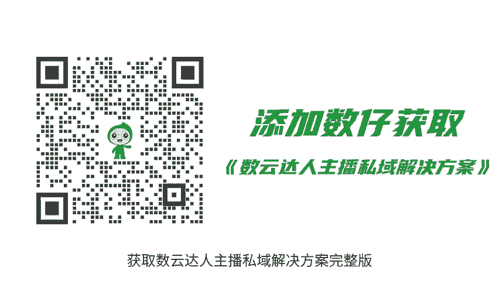

# 来了！数云达人主播私域运营解决方案，请查收！ - P1 - 数云营销学院 - BV1nWaoeiEYS

🎼随着平台去中心化流量竞争加剧，达人主播在平台获取的公寓流量逐步鉴定，做好私域经营，成为达人主播面临的关键课题。达人主播的粉丝运营，如何能产生持久价值，提升复购提升生命周期价值，反哺直播间。

数云推出达人主播私域运营解决方案，助力达人主播开展私域经营，一起来看看吧。一、达人私域运营三大阶段应用场景。达人主播根据自身实际业务需求，可以开展不同阶段的私域运营，实现达人直播间，私域商城GMV提升。

一般来讲分为三个阶段，第一阶段，基于微信会员中心助力直播间沉淀用户资产，通过微信会员中心订单管理，会员玩法互动玩法，反哺直播间等产品功能取证助力直播间，实现粉丝数增长，直播预约束。直播复购数增长。

某女装达人主播在全网有200多万粉丝前期面临的主要痛点是。

🎼直播间粉丝流动性强，无法准确获取订单数据用户分层，缺乏粉丝互动活动。该达人基于私域方案搭建达人专属会员福利社、订单转积分、商品满赠活动，补贴达人粉丝，以此获得粉丝长期信任与持续流量，反哺达人直播间。

从结果上看，绑定粉丝数达到44%，直播间预约束达到10万以上。第二阶段，基于微信会员中心加企业微信运营，实现私域促活经营好用户资产。通过叠加企微运营中的获客引流身份绑定客户里程，客户SOP等功能。

实现达人主播私域用户运营促活某代码时尚女装达人主播，希望通过会员体系深挖客户价值，为消费者打造有吸引力的转积分，花积分的会员玩法，提升会员规模与粘性。该达人一方面通过达人直播间引流进入微信会员中心。

同时，在会员中心设置会员等级与权益，提升粉丝粘性。

🎼引导消费者添加企微，实现消费者长期复购转换运营。从结果上看，绑定粉丝数达到4万以上，企微好友数达到10万以上，直播间复购数提升136。第三阶段，借助微信会员中心加企业微信运营加小程序商城。

实现用户价值持续变现。通过叠加小程序商城的满减新客营销，社区团购等能力，来实现私域用户价值转化以及增长。某女装达人拥有自营店铺，希望把淘气抖音店铺数据和直播数据做统一用户身份识别，在私域刺激消费者复购。

粉丝互动流量反哺直播间。该达人在运营策略上基用户身份变化，用户关系加深。通过微信会员中心，加企微加商城复合运营玩法，实现单客价值提升，整体GMV提升。从结果上看，绑定粉丝数达到8万以上。

企微好友数达到15万以上。商城JMV提升3%。

🎼是以上2、达人私域运营四大会员玩法推荐。一、订单转积分。消费者在小程序中通过订单转积分完成订单与身份绑定。2、直播间满减，把消费者引导着私域，同时掌握价格优势方止破价，稳定提升直播间客单价复购率。

3、直播预约达人主播可以设置直播计划，创建直播预约活动。通过私域群发、会员中心活动页、商城活动页等形式触达消费者。4、用户社区达人主播可以基于用户社区的功能设计，打造微信生态内的专属小红书激励粉丝互动。

达人主播私域运营，你学会了吗？如有需要欢迎添加数载咨询，获取数云达人主播私域解决方案完整版。

