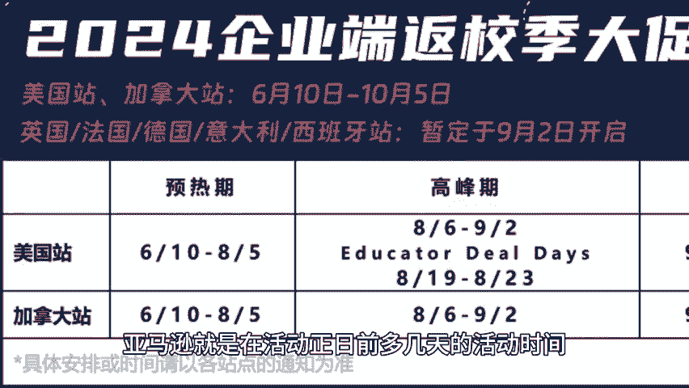
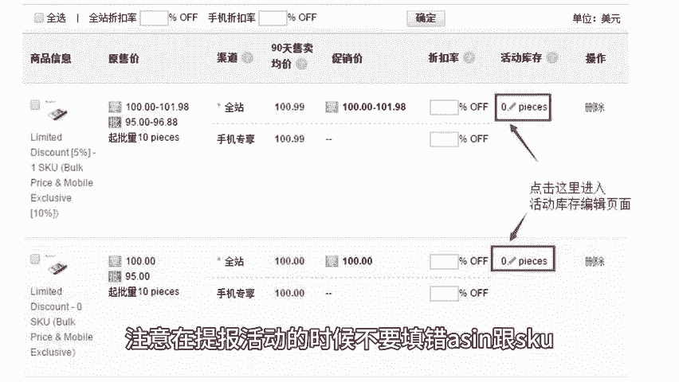
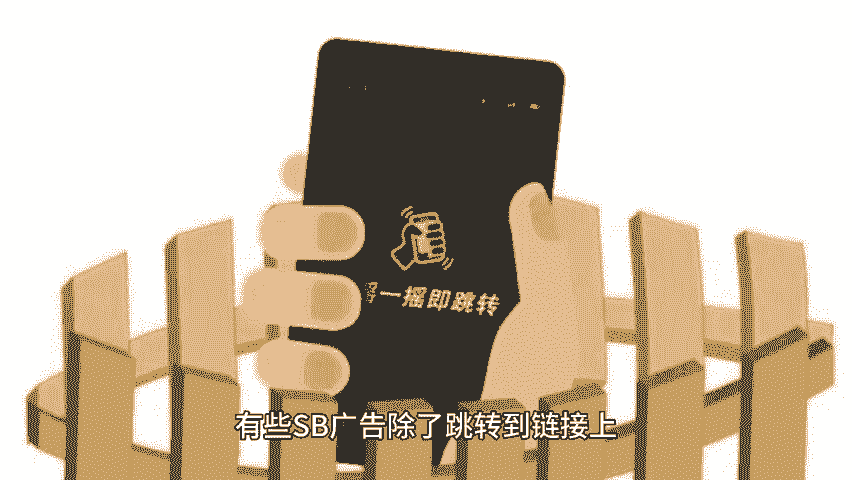
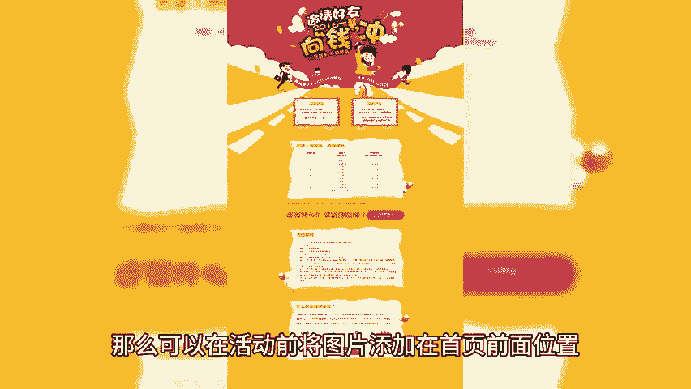
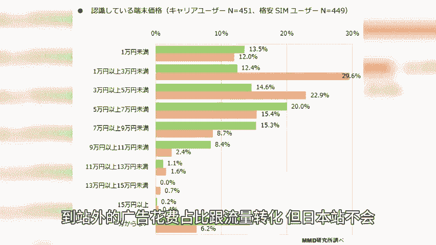
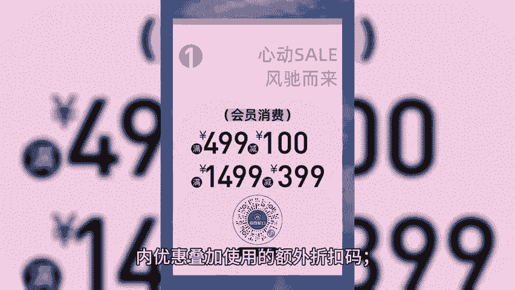

# 欧美秋季大促日本站早鸟运营技巧 - P1 - 小猛龙跨境俱乐部 - BV1Ry2gY1E9U

🎼日本站跟欧美站不同，日本站很多活动都会有找鸟计划。本期小猛龙给大家分享欧美秋季大促日本站早鸟运营技巧，同时为大家准备了亚马逊2024最新实操运营方案。老规矩回复亚马逊。

我来安排亚马逊就是在活动正日前多几天的活动时间。就像这次秋促正常是两天，但是日本站是17号到18号属于找鸟时间。

🎼有找经理提报的即可开始先行促销活动，没有的话，就只能按活动正日来找经理提报这样的活动的时候，注意一定要在规定的时间内提报通过的所有s都需要设置积分，注意提前取消与活动日时间重叠的店铺秒杀活动。

注意在提报活动的时候，不要填错s跟 school，特别是不同店铺需要提报的情况下，提前提报新品活动，比如月初秋促黑舞这些活动，都是提前半个月或者一个月提报的。那么我们在上架推广新产品的时候。

就可以提前上架产品，然后把链接提报上去，这样产品新品期，也可能可以通过这样的活动快速推起来。不过，中间需要主要到货时间跟推广节奏，利用这种大型活动宣传提高流量转化，我们经常会投放SB广告。

有些SB广告除了跳转到链接上，会设置跳转到旗舰店。

🎼面那么我们可以在旗舰店页面设置一张与活动主题相关的图片，大部分卖家旗舰店首页的装修是最好的。那么可以在活动前将图片添加在首页前面位置，然后再添加一个做促销的子页面，可以设置点击图片跳转到子页面。

那么我们的更多做活动产品也就可以得到展示了，给犹豫的客户提供更多选择。广告方面要注意做好防守跟闭环SPSD的镜投以及SD的回溯型广告在营销SP广告方面，日本站跟美国站不同的是。

美国站的SB广告亚马逊会投放到站外，通过导出广告位的表格可以看到投放到站外的广告花费站比跟流量转化，但日本站不会日本站的SB广告还是只有在站内投放。不过SD广告是可以投放到站外的。

只不过我们无法通过表格等方式去查看到。

🎼SD广告投放到站外的花费流量占比是多少？有时候SD广告花费会花的特别快，也有时候会突然没了转化。所以选择这种类型的广告的时候，要注意控制好预算。并且在进行SD广告投放的时候。

会发现广告出单跟投放的产品实际出单不一致。这是因为转化的新可能是同品牌的其他新营产品，而不是投放的产品和注意价格叠加，每年的活动总能听到，因为设置错了折扣或者优惠券叠加了，导致爆单的情况。

所以大家还是多检查，仔细一点，也是对自己的一种负责任呀。另外，现在日本站在优惠券设置那里更新多了一项选择，可以选择与管理促销的折扣是否叠加使用，这既是多了一层警示，也是增加我们的一种推广方式。

就类似乐天在设置折扣一样，可以设置平台内使用，以及在另外设置一个不与平台。🎼优惠叠加使用的额外折扣码，大家也可以通过这种方式结合在外做不同的推广策略，天幅有限，获取完整版日本站运营技巧。

以及更多亚马逊运营小技巧，点赞、关注评论，带你出海不迷路。

