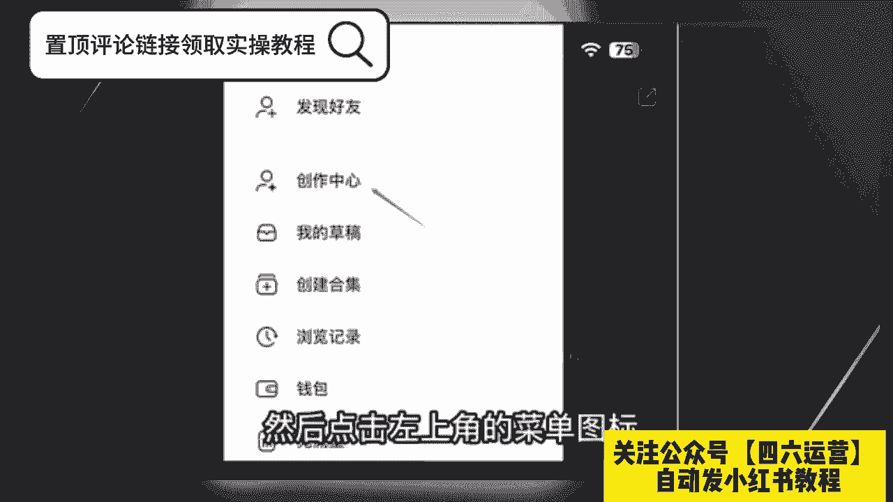
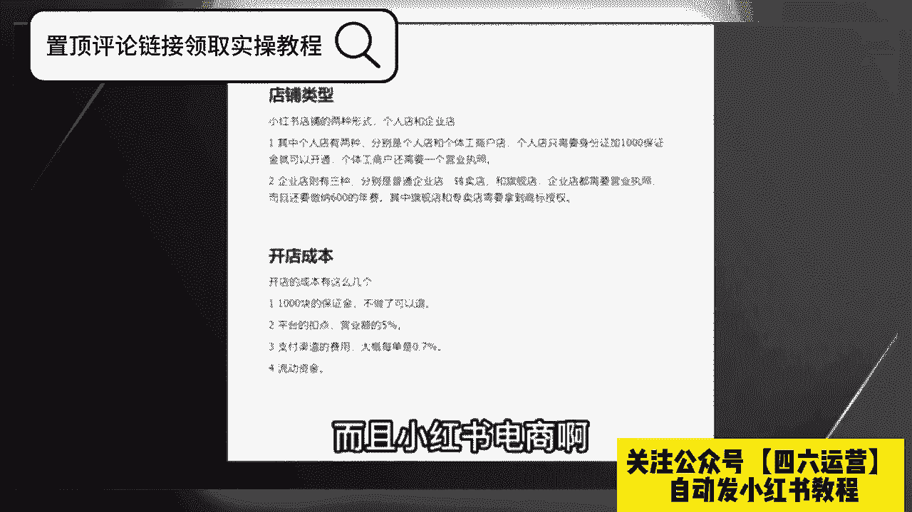
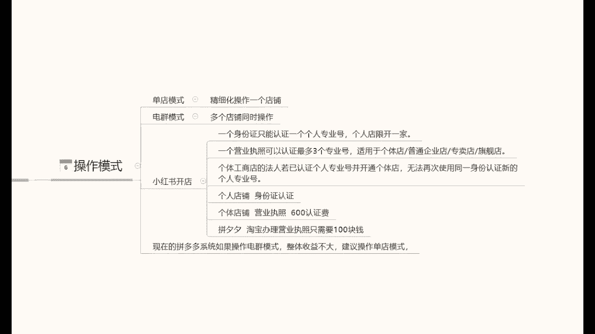

# 比刷剧还爽!!2024(全新)小红书运营网课，小红书运营大佬专为为学渣研制的小红书开店、小红书起号零基础保姆级教程，全程通俗易懂，纯干货无废话 - P1 - b萧枭 - BV17jaNeJECC

要说最近什么项目最火啊，那就必须要提到小红书电商，最近几个月呢，几乎整个互联网都在讨论小红书电商，我关注的几个商业博主啊，包括一些付费社群都在讨论他，我朋友圈月入五位数甚至六位数的比比皆是。

这个项目在年初的时候，我其实就有让团队跟进测试，我还在市面上买了一些课程学习，到现在单人单店一个月也能做个一两万块吧，今天我就用一个视频详细的给大家拆解一下，就是小红书电商到底怎么玩。

我会把整个小红书电商的流程，包括一些注意点，比如怎么开店，怎么选品，怎么做流量，一次性给大家讲清楚，你甚至都不用再去看别的相关视频和培训了啊，你就跟着我的视频去按图索骥就足够，你在这个事情上开始盈利了。

视频的结尾呢我还会给大家准备一份资料，里面有我找的课程啊，对你运营小红书电商呢会有很大的帮助，有需要呢直接去拿就可以了，言归正传啊，整个项目的逻辑啊其实也非常简单，它就三件事，第一个呢开店，第二个选品。

第三个流量，我们一个一个来讲，先说开店呃，开店其实没什么好说的啊，首先就是打开小红书，然后点击左上角的菜单图标。

再选择创作中心，然后点击更多服务这个选项，选择店铺，点击立即入住就可以了，你就按他官方要求的提交资料入住就行了，我居然看到有人把小红书开店包装成一个项目，拿出来卖，居然还有不少人买，这也是很奇特。

这里跟大家说一下小红书店铺的两种形式，个人店和企业店，其中个人店有两种，分别是个人店和个体工商户店，个人店只需要身份证，加1000保证金就可以开通了，个体工商户呢还要多一个营业执照，企业店呢就多一点。

企业店有三种呃，有包括那个普通的企业店，有专卖店和旗舰店，企业店都需要营业执照，而且还要缴纳600的年费，我们刚开始运营小红书电商的时候，你直接选择个人店就可以了，我们实测下呀，企业店和个人店一样。

平台并没有对企业店有什么流量倾斜，唯一的区别是个人店你只能开一家，而一份营业执照呢，你可以开三个店，你一个店如果都没做好，你开再多的店都是没有用的，而且小红书电商啊。

我觉得是不适合店群形式去做的，这是因为小红书的流量机制，它的电商自然流占比非常低，那你铺再多的电，再多的货有什么用呢，所以只要你看到有博主跟你讲什么小红书店群，我都觉得是在扯淡，小红书是要做矩阵的啊。

但不是店铺矩阵，而是账号矩阵，这个后面在流量获取那里，我会跟大家细说，开店的成本呢有这么几个，第一个就是1000块钱的保证金啊，不做了可以退，第二个呢是平台的扣点营业额的5%，第三个呢是支付渠道的费用。

大概呢每单是0。7%，第四个就是自己的流动资金啊，一开始大家做呢可以用无货源的方式去做啊，对资金要求也不高，你刚开始呢准备个2000块，3000块完全够了呃，开完店以后呢，我们下一步就是选品。

我们应该在小红书上卖什么的，选品其实也简单哈哈，在其他平台上的爆款，大概率在小红书上也能爆，目前小红书呢我是推荐三个渠道进行选品的，第一个是通过某东，某宝上面找那种小红书平台调性的爆款产品，呃。

身边有做电商的朋友，他自己在某宝的店铺卖的爆款，搬到小红书上，第一篇笔记就开始出单，第二篇笔记单量就已经破百了，第二个呢是通过某音的那个精选联盟，你在某音的精选联盟排行榜，你可以看到现阶段哪些品卖的好。

只要符合小红书用户调性的产品，直接搬运测试就可以了，第三个就是某多多的这个销量排行榜，选择适合小红书的类目排行榜，从中选择相应的爆品搬运到小红书，整个选品的逻辑，就是我们要利用市场来帮助我们选品。

而不是自己在那瞎想，我们要借助大卖家的选品能力，来弥补自己选品上的不足，所以我们只要判断一个东西啊，就是这些排行榜上的爆品，是否跟小红书的人群有匹配的可能，如果有，我就搬过来测一下对吧。

相当于是借助了别人的能力来帮我们自己选品，这样反而是最快捷而且是最稳妥的选品方式，肯定比你瞎测成功率要高很多，然后等你这个产品上架以后呢，就到了最重要的环节了，我们应该如何获取流量。

小红书他是个种草平台，你店铺九成以上的流量啊，都是来自你发的发的笔记，这就是为什么我之前说小红书不要铺店群，而要做账号矩阵，尽可能多的发笔记耗流量，它的通路就是用户通过你的笔记，然对你推的产品产生兴趣。

然后到达你的店铺完成购买，你堆一堆店铺对吧，你铺一堆店铺一个还不如多发笔记，多发几篇笔记的这个效果好，所以怎么在小红书上发笔记对吧，就是你小红书电商是否成功的关键，小红书这个平台你直接发硬广。

我觉得效果非常差对吧，本来小红书的这个用户群体认知就比较高，你直接发广告，你没有办法获得信任的啊，更不要提转化了，你发笔记的时候一定要用一个素人的角度，你知道吧，就是用户的角度去切入。

站在用户的角度去做种草内容，而不是官方视角，这才是真正有效的呃，这种种草笔记怎么做其实也很简单，就是去各大平台的商品评论里找，比如某音某宝，某东的商品买家秀，找到好看的素材，你直接copy下来用嘛对吧。

文案呢在买家评价上去做修改，这些买家的评价就是商品用户的使用体验，天然的适合用来做这个中考笔记，而且可以说是取之不尽了啊，然后呃当你单个账号的sop跑通了是吧，我们就可以开始举证引流了啊。

通过批量上小红书账号，批量发布笔记给我们的店铺来引流，来放大，那基本上整个小红书的电商的运营啊，就是我上面分享的这些，外面不管多少钱的培训啊，3000块也好，6000块，1万块也好，其实就是这些东西。

有些培训可能还没有讲的清楚啊，根据上面的几个点，我给大家准备了一份资料，里面包括了小红书账号的旗号运营的方法，以及一份小红书电商的视频课程，你如果打算经营小红书电商，你也不用看别的东西。

就跟着这份资料做足够，你开始盈利了，有需要的啊，点赞加关注，在评论区回复红书电商，我分享给你要有自信啊，你是最好滴，知道吗，大家好，今天给大家分享一个小红书，零基础开店的第二课时啊。

小红书的一个店铺注册呃，废话不多说呢，直接进入我们今天的一个内容店铺注册，小红书店铺注册的话，相当于来说的话，还是有需要我们注意的一些选项，因为他的一些店铺注册的内容的话，他不是很好找啊。

在我们戏台后台系统里面的话，它隐藏的比较深，它不像其他的呃，其他的平台直接打开就可以注册，首先呢我们店铺注册的话，就说我们的用个人的手机就可以啊，当然你如果说有备用的多余的手机。

用工作手机去操作的话也行啊，用手机下载小红书他的一个系统就可以了，手机下载小红书系统以后的话，账号注册，首先我们手机号登录我们那个账号啊，账号登录进去以后的话，点击我们那个他这个的话其实和微信一样。

在右下角啊，点击我们的那个人物头像就可以，就可以进入到我们的个人中心，然后登录账号就行，登录账号的话呃，他这个里面的话有一个小红书，注册之前的话，上节课内容也给大家讲过了，我们的一些开店基础的一个准备。

让大家让大家是准备过，小红书注册的一个账号的，登录这个账号以后呢，在右上角啊，点击我打开，在右上角或者是左上角，他有一个三角的一个斜杠啊，点击这三条杠以后的话，选择创作中心，点击创作中心以后呢。

然后点击更多的一个服务，更多服务进去以后的话，大概在嗯第三排选择开通店铺啊，就是第三个方框，它那里面的话是分为了四五个方框，每个方框里面的选项内容不一样啊，那个呢是设置我们的一个账户信息的。

其他的不用管，直接选择我们的一个店铺开通就可以，然后点击进去以后，它还会显示一个界面，界面的话它是以广告的形式推荐给我们的，我们在里面的话，它有一个点击立即认证就可以了，点击进去就可以注册账号。

其他的东西的话其实是不用看的，因为看了也没什么作用，我们对我们新手来说的话，那些东西看不看无所谓啊，点击立即认证的以后的话，按照他的一个正常步骤走就可以了，然后提交我们之前准备提前准备好的一个材料。

提交身份证的一个正反面，然后选择店铺的类型，这个里面的话注意一点啊，店铺的类型的话，它是分为三个类型的个人店，企业店，或者说是啊旗舰店等等，这里面的话我们正常前期操作啊，不管大家怎么样。

如果说有熟悉的话，可能就不需要了解这一点了，如果说不熟悉的话啊，大家开个个人店就行了，用个人店的话，本来就是让我们上手去实验操作的，本来A做任何数据啊，我们不管是做电商也好，或者是做店下的店铺也好。

我们大家都要有一个熟悉的过程，熟悉了以后的话，我们再按照这个模式去操作就可以了，所以说大家一定就要注意了，我们前期开个个人店铺，自己先把所有的流程熟悉以后呢，再去操作，不然的话我们所有的一个信息的话。

基本上嗯就是我们前面用力过猛，你后面就会对这些东西失去兴趣，为什么，因为我们前面已经失败了，你后面再做的话，就会对自己产生不那么信任的一种感觉，如果你做多了以后的话，你自己就放弃了。

而我们在做任何东西的时候，一定要先把自己的一个基础确认好啊，我们基础确认好了以后，我们有一定的基础了再去操作，所以说我给大家讲这些内容的话，就说我们按照步骤一步一步走，不要操之过急。

前面的话我们没有必要直接就说上来一一下，投个几万上呃，上10万哎，我非要把这个店做起来，没有必要啊，我们刚开始做店的话，投个两三千块钱，三五千块钱，其实是花个一个多月，两个月时间。

把整套流程熟悉了以后的话，后面会节约我们很多时间的啊，所以说大家注意点啊，然后继续我们的一个内容，首先要登录到达我们的一个选择店铺类型啊，选个人店铺就行了，其他的不用选了。

因为能看这个课程的基本上都是新手，所以说大家了解一下就行啊，然后填写店铺的一个信息，这些信息的话后面是可以修改的，我们随便填写一下，把信息尽量填准确就行啊，尽量的话就是在后期不要去修改。

修改的话影响是有，但不是很大啊，就是说没有必要啊，一次性弄好就行了，店铺信息填写完成以后呢，我们再进入下一步啊，直接完成我们的一个认真完成，我们的一个小红铺，店铺基本上呢就已经注册成功了。

他注册成功的话是三天的，有三天的一个反馈时间，但是基本上的话五到10分钟，他的反应对于其他平台来说的话会稍微慢一点，如果说我们去某多呀或者说某宝去注册，或者说是呃其他的这种交易平台。

去网网络交易平台去做的话，可能会快一点，但是小红书这边的话，因为他的系统还不是很完善，所以说我们有很多操作的空间，但是呢它同时它的一个系统反应速度有点慢，快的话五到10分钟慢的话可能要一天左右啊。

基本上都在这个时间范围以内，他的店铺才会注册成功，注册成功利润以后的话，我们才会去操作项目，也然后呢，这节课最后一个点，就是说我们把账号注册成功以后，在手机里面还要下载一个东西。

这个东西呢叫小红书的一个客服工作台啊，客服工作台的话，他和小红书的店铺的话呃是类似的，但是他是做我们售后的，就是我们店铺里面来订单以后的话，会需要这个小红书的一个客服工作台，他直接在小红书里面操作好。

操作不了的，没办法去聊天沟通，他相当于是额外引流到了另外一个平台里面，去做啊，所以说大家一定要把那个小红书的客，客服工作台给下一下啊，这个呢就是这节课的一个店铺注册内容，下节课呢给大家讲解一下。

小红书整体的一个店铺类型的一个区分啊，我们前面要做的话，我们到底去做什么店，伺候我们，大家好，今天给大家分享一个小红书，零基础开店第三课啊，店铺的一个类型，店铺类型。

这一节课的话是让大家充分的了解小红书，他整个系统里面，他的所有店铺类型和他的一个类型区分，那么直接开始我们这节课的内容，小红书的话，我们正常的一个店铺类型的话，它其实是可以分为很多种的，这里面的话。

我给大家把它全部都单独的列出来了，诶因为要给大家详细讲解一下，让大家了解整个小红书的一个，店铺类型的一个体系，我们在什么阶段应该怎么去操作啊，小红书的整体个人嗯，整体的一个店铺体系的话就是第一个个体店。

第二个呢是个体工商店户啊，第三个是普通的一个企业店，第四四个呢是专卖，第五个是旗舰啊，最后的话就是说一个是卖场型旗舰店，他这个的话其实也就是品牌推销商而已啊，那首先我们来了解一下啊，个人店。

什么是个人店呢，申请主体额，个人用户就是我们个人使用的，就是我们刚毕业也好，或者说是辞了工作，自己想做点小事情，就跟我们平常在外面摆地摊一样啊，这就是属于个体店，摆地摊的话，你也要注册一个营业执照。

或者说是一个小小规模的一个示范营业啊，让银行给你开通卡，然后给你开通支付权限，这个个体店的话就类似于这种啊，经营特点的话，就是说经营限定的精英零星的小额商品啊，比方说首饰啊，服装包包包包。

手机壳呀等等这些啊，多个品牌就是杂货铺，什么都可以卖，就看我们自己怎么去操作了啊，入住要求的话，这个的话基本上是比较简单的，他没有什么特定的一个入住要求，就是我们个人有个身份证就行啊。

额然后呢店铺命名的一个格式啊，专业号成泥，就是然后加我们的一个店名，就我们个体店他自己会系统给我们匹配名称的，这个的话不用管保证金的话，内部保证金和浮动保证金嗯，二者取高，这个怎么说呢。

保证金这一块的话，我之前也给大家说过啊，就是说1000块钱的保证金，这个是个人店铺的一个数据准备，如果说是超过1000块钱的话，那都是个体工商或者说是旗舰店专卖店那种，而且他的这一个整个保证金的话。

他的浮动都很明显，待会的话最后一点我会给大家详细讲解一下，他这个整个小红书的一个保证内膜，它是怎么划分等级的，好吧，那下面呢我给大家讲一下，什么是个体工商的一个店铺，个体工商店铺的话。

他和个人店铺不同呢，就是说嗯他的入住要求可能会稍微麻烦点，需要我们有一个营业执照啊，对品牌授权是没有需求的，只要我们自己有营业执照就可以了，其他的基本上都是一样的啊，他和个体店的话就是一个入住需求。

多了一个营业执照，其他都没什么区别，普通企业店的话，他和和其他的话也是包括下面的一些店铺，他所有的一个区别就是在入驻要求这一块啊，入驻要求这一块，他每一个店铺入驻的一个要求是不同的。

就看我们自己有没有这个资质去认证了，当然了，这个企业所有店铺的一个入驻要求，越简单的，你的权重肯定也就越低啊，越复杂的你的权重也就越高，但是我们前面嗯新人刚开始操作店铺的时候啊，没有必要弄那么高的要求。

做个个人店啊，自己测试一下有没有这个潜力，这个产品在这个小红书系统里面，好不好做就行啊，没有必要投入太多，普通企业店的话，入驻要求的话就是说啊申请主体为企业，就是我也有自己的公司。

或者我也要有自己的产品，我这个是有国家认证的啊，必须持有企业的营业执照就可以了啊，其他的话没什么需求，专卖点旗舰店，包括卖场型旗舰店啊，他只是说换了一个名称，专卖店的话录入要求的话就是营业执照啊。

品牌的一个认可自有品牌，非独立品牌啊，就是你的品牌我们自己啊，像阿迪啊那种都是国有的很知名的那种品牌，我们自己小企业也有自己的品牌，你只要在国家上面注册认认证认可就可以，这都是属于专卖店。

就是我卖我自己的产品啊，把我的资质刷上去就可以了，旗舰店的话也是一样的，他只不过是啊必须持有营业执照，必须持有品牌授权书，我自己没有品牌，但是我有别人品牌的一个授权书就行，卖场型专卖店的话。

这个具体要求回炉的话，可能根据平台的需求不同啊，它的内容也是不一样的，经营特点的话就是说零售的一个资质啊，并且开设经营多个品牌的一个旗舰店，但是嗯基本上在小红书里面没有这种店铺啊，因为这种店铺的话。

他小红书的流量和他不对标啊，因为小红书的整体流量的话，它是以女性为主，所以说它的产品的话不对标，很多的很多的那种大型的旗舰店的话，他不会在小红书上面去操作，所以说他会给了我们一个小卖家。

很有必要的一个生存空间，就是说他的竞争压力的话，没有其他其他平台那么大啊，就非常适合我们小卖家去操作一些嗯，小型的麦麦皮，这个就是说呃所有店铺类型的一个区分内容，最后一个啊，就是给大家讲解一下。

这些企业划分的一个保证金，因为他这个保证金的话嗯，基础保证金是1000块钱，但是基础保证金保证金之后的话，他还有额外的一个保证金，这个保证金的话呃，在这里呢给大家讲解一下内部保证金。

普通企业内部特殊类目和跨境内目，这里呢我给大家呃，把它具体内容呢给大家打出来，大家可以看一下啊，我在这里呢就不过多解释了，因为解释起来的话，其实大家搜资料的话其实也能找到，只是说有些人的话嗯。

他懒得去说是吧，那我在这里呢就给大家打出来了，大家看一下或者截图，对这方面感兴趣的话，可以去看一下，后面呢就是一个浮动保证金，内幕保证金的话，他基本上都是个固定的啊，下面呢就是浮动保证金。

这个的话就是说所有内容的话，浮动保证金是最重要的，大家一定要了解一下什么是浮动保证金，浮动保证金的话，它是根据我们店铺的一个成交金额来计算的啊，店铺成交金额小于5000。

就是我们店铺前面如果说没有交保证金，或者是没有其他东西，成交金额在5000块钱左右的话，他的保证金是零，但是我们起始资金保证金金是1000，不交这1000块钱的话。

你这个成交金额小于5000块钱是没有用的，我们交了这1000块钱的保证金以后的话，我们在5万以内的一个店铺，就是一个月的流动资金，在5万以内的话都是没有问题的，超过5万的话就不行。

5万到10万的一个保证金的话是3000，10万到50万到50万是5000，50万以上是2万，他的这个保证金都是浮动的啊，但是大致的一个需求的话都是在这个地方，就是我们店铺成交每个月的成交金额啊。

超过5万到10万，我们需要3000块的保证金，才能把这个店铺里面的钱提出来，不然提不出来，10万到50万是5000，50万以上是每个月是2万啊，当然了，我们做到这个时候的话。

如果说每真的每个月50万以上上的，一个成交金额的话，2万块钱的保证金也无可非厚非是吧，提现，然后呢提现的时候，他会查证我们店铺，就是保证金账户里面的一个资金是否充足，如果说资金不充足的话。

我们的资金一旦超过了5万，就是我交了1000块钱保证金，我我的资成交资金一旦超过5万，那我一毛钱都提不出来的啊，所以说大家一定要注意了，不有时候提提现这个东西的话。

一定要注意自己查看自己的保证金是否充足啊，就是说大家很多时候的话做东西就是往这些点，觉得自己的钱找不出来的，小红书坑我之类的啊，其实不会，他只是说他的一个类目的一个浮动保证金，在这个地方啊。

大家把这个这几个点注意好就可以了，这个呢就是我们这节课的一个内容啊，给大家讲解了一下店铺的一个类型，和我们店铺类型里面对应的资金保证金，和我们的一个替换方式，好吧。

那么下一个节课呢给大家讲解一下选品与货源，小红书上面我们做什么样的产品，选什么样的货源，怎么去操作啊，大家好，今天给大家分享一下小红书零基础开店，选品与货源啊的一个内容，嗯废话不多说。

直接进入我们今天的一个内容啊，给大家分享一下我们怎么去选品啊，怎么去选货，选品选货的话是我们小红书额的重重中之重，为什么，因为一个好的货源，才是我们一个赚钱最基本的一个选项的，最重要的基础条件。

因为我们的货源不好啊，我们选货不正确，我们怎么去操作这个店铺做起来了，你也赚不了多少钱，我们先不说赚不赚很多钱，你有可能还会亏本，所以说选品有货源的话，他在这个里面的话是非常重要的一个环节。

那首先我们了解一下什么是货源，会员的话，我在这里呢给大家分为了三个例子啊，第一个是线上会员，第二个是线下会员，第三个呢啊是工厂直销，首先我们了解一下什么是线上货源，线上货源的话就对我们小卖家来说。

或者说对我们新手来说的话，比较友好的一个东西呃，网络上面一件代发，或者说是其他网络上面，或者是我们所在百度啊，或者其他地方搜索的一些，这个就是线上会员一个平台，线上会员的话。

我在这里呢给大家随便举列列了一部分啊，这里面比较好的一个就是说啊，16881件代发，他这个里面的话产品比较多，在小红书上面去做的话，其实是非常好做的，而且它的产品价格比较低啊，量大啊，品类多。

因为他做的时间比较久，第二个呢就是再补一抹包，下面呢，我就不给大家详细解说它的好处和坏处了，这里呢我已经给大家列出来了一个字，母婴网五八批发货啊，315会员开箱网九幺啊，还有一个啊某多多。

某多多的话其实和1688是差不多的，我们可以把其他的资源型产品，拿来在小红书上面去操作，因为小红书的话，它对应的产品的话比较会会比较单一，不像嗯拼夕夕啊，母淘或者说是，京东啊之类的这种店铺一样。

因为他们基本上已经形成了一个固定的模式，小红书的话他是以笔记为搜索来源，而且他的一个货源的话呃也不是很稳定，他基本上的话和其他的平台一样，但是它的整体的一个后台系统，对比其他平台来说的话。

漏洞还是有点多，所以说我就给了我们一个操作空间，我们可以把其他的产品拿到小红书上面来卖啊，相当于小红书在抢其他平台的一个流量资源，而且他也成功了，它的一个整体的流量数据是非常大的，所以说线上货源的话。

我们拿其他产品在这个里面卖啊，其实也是能赚到钱的啊，就看我们自己怎么去操作，怎么去跟卖家谈，谈完以后的话，我们在小红书上面怎么去卖，怎么去包装我们自己的一个产品啊，其实就是二手货倒卖。

就看自己大家怎么去操作了，这个呢就比较好理解了啊，这个呢就是线上货源的一些平台，第二个呢是线下批发市场，线下批发市场的话，跟线上货源就区别就有点大了啊，嗯我们可以呢考虑全国我们本地区啊，你不管是县也好。

市也好啊，或者镇也好，他都当地的话，它都有一个批发市场，批发市场它它所有的东西出来以后都是成本价，我们只需要去这个里面的话去观察一下，跟批发市场的老板，或者说是我们中意的产品。

我总想拿它到小红书上面去卖，我们跟他商量一下价格，第一个我们可以说是二手会员或者是三种会员，这种会员的话，第一个价格比较低，第二个的话就是说竞争压力没有那么大，我们非常好的去操作，只要谈下来了。

我们不需要这么去囤货，我们或者说是我们每天卖出去多少，我再去拿货，再去直接弄，这是比较方便的一种方式，而且不需要囤货啊，货源也有保证啊，资金也充足，为什么说资金充足啊，因为钱到账以后我去发货。

他只需要我们之前预留的两三千块钱的，一个流动资金基本上就够了啊，再去怎么操作他的一个资金就循环起来了，所以说对我们前期要求就没那么高，不需要自己去囤货啊，去做什么对吧，当发现这个产品有市场以后。

我们再去操作效果就又不一样了，所以说线下批发市场的话，建议大家还是呃如果说网络上面你嫌麻烦，可以在线上平台收入会员，如果说不嫌麻烦，真想把小红书做好，或者说把我们这一个平台啊，这个产品做好。

我们都可以去搜索一下，去各地的一个市场，通过我们自己的一个运营模式，把我们的产品卖到其他市，来赚取这一个额外的流量，产品的一个交易炒股好吧，这个呢就是线下的一个批发市场，第三个点呢就是工厂直销。

工厂直销来说的话，他对于线下批发市场需求和要求会稍微高一点，因为的话他可能会囤货，而且需要找人家的老板去谈谈什么呢，我从你这拿货，或者是你帮我发货，我帮你去做推广，就看我们自己怎么谈。

而且你的一个所站在的立场是什么样的，你是想让他帮你发货，哎你只是说帮他代运营而已，然后的话从这个里面赚一些产品的，额外的一些成交金额也可以，或者说是你跟老板谈，我要你的是产品的货。

前期呢我到你这里先拿拿一点货啊，但是量不多，我先试一下，你这个产品在我这个平台里面好不好卖等等，看你自己怎么去交流，因为工厂直销的话是属于一手货源，刚刚的线下批发市场是属于二手货源，线上货源平台啊。

拼多多啊，1688啊，这些都是三手货源，他们三个的价格是不一样的啊，线上会员来说的话，它是比较贵的，线下货源的话只能算中等，但是工厂直销它是最便宜的啊，大家一定要注意这个点啊，这就是三个点的一个区别。

利润最大的就是工行，最小利润最小的是线上货源，所以大家一定要清楚这个点，你自己适合做什么啊，想要多少利润，怎么去谈，怎么去聊啊，就看你们大家自己了，所有的产品的话，在小红书上面其实都可以做的。

只要你不要不要去找那种大型的家具啊，电器啊都可以做，小红书的话她女性居多，我们可以做饰品，服装服饰，后面的话我会单独拿一节课给大家讲一下，小红书上面的话，他什么样的一个产品比较适合我们去做啊。

这个呢就是货源，下面是选品啊，货源和选品它是不一样的啊，货源只是说我们有了一个选货的一个渠道，我们怎么去选货，选品的话不一样，他是在选货里面再去挑品啊，这个里面的话我给大家列出来几个点。

大家都去参考一下，然后再用我们自己的方式去做一下对比，就知道怎么去选品了，选品的参考内容是哪几个呢，第一个价格，第二个人群，第三个市场，第四个需求，选择方式的话就是利润稳定和时效性，先从价格开始啊。

参展的参考内容的价格，就是首先就是我们这个选择产品的一个价格，我们比方说工厂直销也好，或者线上批发市场也好，或者说是1688，或者其他的一些批发平台也好，首先考虑产品的价格。

然后拿这个产品去小红书上面搜索，同类产品的一个内容，记住了，不要拿我们注册的店铺去挪拿一个新号啊，一定要记住开一个新号去搜索对应的价格，看看这些产品，然后再对比我们所找到的货源。

不要只要店铺不超过50家以上，就是同类产品价格区间差别不大的情况下，我们如果说利润不是很多，比他稍微卖贵一点都没关系，只要店铺就是收的时候不超过50家以上，基本上都是可以做的，这是线上货源。

线下批发市场的话，只要说是不超过60或者70家，都可以做工厂直销更简单，不超过100都可以做啊，用户利润高，这是价格，第二个是人群，什么是人群呢，就是说我们对应产品的一个人群，我选产品。

我们选女性产品对吧，因为小红书基本上都是女性为主，那我所有的产品对应的人群就是女性，那我们一定要选择女性喜爱的用户产品啊，尽量的话少卖男性用品，男性用品也能做，但是他整体的话一个对标太高了。

我们前期操作的话，对整个系统不熟悉的话，我们去操作是不好操作的，那人群里面的话，我们主要就是女性和年龄年龄，小红书的年龄是20~40，那我们选产品的时候，一定要选这类人群里面喜欢的一个产品，知道吧。

20~40或者再小一点，16~40这个之间的产品，女性用品喜欢什么，我们就可以参照这个一个范围去吃，找我们的产品，这范围就小多了吧，价格有了，人群有了对吧，然后就是市场需求。

搜索同类目里面的一个产品的市场需求，这个产品在小红书上面，或者说是在这一个嗯人群使用广不广泛啊，用的人多不多，产品价格在什么范围，把这几个点比出来以后的话，这价格人群市场和需求就基本上全部都出来了。

我们就知道选什么产品，卖什么价格，怎么去卖，只要是同类竞竞争店铺的话，说实话，我那会儿前面给大家说的啊，这个价格参考里面50家，70+100家店铺里面啊，我说的是产品销量破500以上的啊。

产品销量破500以下，他爱有多少有多少，那些都没有关系的，知道吧，它不会影响我们任何店铺的一个信息，只要说是产品销量，单品销量在500以上的，不超过50家，我们都可以去做好吧。

这个就是我们选品的一个参考内容，节后呢就之后呢就是我们选择方式，利润稳定，时效性，什么是利润，我这个产品在拼多多上，不在小红书上面，我们能赚多少钱，一单我们能赚多少钱，一定要把利润算出来。

利润不算出来以后，你别说我产品卖出去了，我小红书店铺也做活了，结果我亏本了，那就是我们利润没算好，所以说一定要把利润利润给算出啊，别自己做到最后自己把价格调错了以后的话，亏本，那就得不偿失了啊。

第二个是稳定，什么是稳定呢，产品货源一定要稳定，如果说大家做线上会员的话，建议大家选两到三家做同类产品的，去跟老板去谈买价啊，而且这里面有个小技巧，就是说不管是两家也好，三家也好，四家也好。

我们谈的时候，每家里面都走一点货，一家走主，三家走副，就是一家里面可能一天如果说我们出30单，这一家里面的话，我们一天可能25单，另外两个两单的一单一单就可以了，为什么我们保证一个主店铺里面的货源。

稳定就行，货源如果说不稳定的话，我们产品没法做了啊，你去店铺刚做起来还没多久诶，产品没有了，你去卖什么去对吧，那整个店铺就没用了啊，所以说一定要注意货源的稳定性非常重要，最后一个是时效性。

什么叫时效性呢，实现性就是产品的一个季节，春夏秋冬四季，我们的产品对应的季节去卖什么样的一个产品，我们提前做规划啊，所以一定要有个思想性，比方说我们卖夏季的或者卖冬季的，卖秋季的也好。

提前一个月去做这个产品，因为我们店铺起店的话，前期最少有一个月的准备时间，店铺起来以后的话，刚好到应季的时候，我们这个产品去卖啊，是最好卖的，当然也有4G都使用的产品，但这种产品的话嗯比较少。

但是它的一个竞争压力是非常大的啊，别人可能做了一年，做了两年，做3年，做4年，这个小小红书的一个店铺，而我们只是刚开始怎么去跟别人竞争呢，所以说大家选品的时候，一定要注意这个时效性啊。

这个呢就是我们今天的一个课程内容，选品与货源的一个准备，下节课呢给大家详细讲解一下，小红书的一个账号测试啊，因为小红书所有的账号的话，他不都不是都有权重的啊，他是有区别的。

所以说下节课给大家详细讲解一下，小红书的一个账号测试，我怎么去测试我们的账号能不能做啊，需不需要换号好吧，大家好，今天给大家分享小红书零基础开店第五课时啊，账号的一个测试。

为什么说是今天给大家分享一个账号的测试呢，因为小红书店铺的话，它和其他的平台不一样，所有的账号创作出来都有权限，小红书的账号不一样啊，小红书的店铺账号我们创建好以后的话，嗯他不一定都是有权重的啊。

就说有的账号的话，拿新号也好，新的手机号也好，是新人的一个身份证也好，或者说是我们拿有的时候运气不好，拿老号去做，就是手机号使用3年以上，5年以上啊，去注册注册小红书的账号的话。

有时候这种账号都没有权重的，他这个东西虽然说不是百分之百啊，那是10%的概率，就算是5%的概率，我们去操作你这5%的概率，你中中招人类对吧，整个账号都没有权重，我们做菜做的一个东西去操作这个小红。

投入再多的精力去操作小红书店铺也没用啊，对吧，因为你账号本来本身就没有权重，所以说我们在做电之前一定要测试造好，然后再去做小红书啊，那今天呢主要就是给大家讲解一下，这个账号测试我们怎么去操作就可以了。

小红店铺账号的一个测试的话，其实在测试之前啊，我先给大家讲解一下啊，账号测试可以在开店前进行操作啊，就是我们测账号的时候，不要把店铺注册完什么信息全部填写完了，再去做，再去测试这个账号。

我们一定要在开店之前去测试，也就是小红书店铺没有开始之前，我们就可以去操作店铺正常的一个操作了啊，就是呃在小红书上面发笔记啊，发同类的一个产品信息啊，测试我们这个店铺有没有权重就行了啊。

操操作方式呢也比较简单，准备三个账号就可以了，多的也不用三个，就三个里面的话肯定有一个人操作，或者说我们如果说想多做一些店铺的话，嗯多准备一些账号也可以，但是在这里呢给大家说一下，就说我们前面做的话。

准备个两到三个账号就可以了啊，基本上都是百分之百破的，就差了，就怕百分之内5%啊，把我们这个号遗漏的话，如果说账号没权重，我们操作以后前期准备全浪费了，没必要啊，就测试一下，也花不了多长时间。

基本上的话也就三天左右吧，三天到五天左右就可以出结果了啊，这里我给大家把操作步骤列了一下，第一个呢是多个账号发小红书的一个笔记，发一个内容就可以了，内容不用多，这个笔记发出去以后的话。

它起始之源就说我们笔记纯新的一个账号，纯新的一个笔发出去以后，大概2分钟以内，他那个小眼睛的话大概是在20个以上啊，但这个小眼睛的话基本上没有太大的作用，它是小红书的一个强推流量啊。

他不能确认我们这个账号有没有权重的，我们要观察三天以内的一个数据量，三天以内数据量怎么去观察呢，每天响应应在50以上，三天以后，整体的一个小眼睛在150以上就可以了，当然了啊，测试账号里面的话嗯。

有几个点要注意一下啊，这点呢我也得给大家列出来了，测试账号哪一个账号有小金，小眼睛超过50就可以了，每天啊三天要超过150，这个账号的权重的话，就基础权重就是有的，第二个就是超5号的一个测试内容。

是必须是原创啊，必须必须是原创视频，而且你的原创视频时间要超过15秒啊，最好是控制在20秒钟左右，一定要超过15秒，不然视频都发布不上去啊，视频也好，图片也好，不管是什么内容，你就算是打歌相互的交流。

点赞关注之类的都可以啊，但是一定要注意了啊，唱好账号测试，小眼睛就是我们这个小眼睛的话，就是我们单品的一个流量推广啊，小眼睛越多代表我们的账号权重越高，观看我们的用户越多啊，三天150个小眼睛左右。

账号测试内容必须是原创，如果说不是原创的话，没有权重的，你复制别人的产品过来做的话，可能你这个账号有权做，你复制别人的产品过来就没有权做了啊，一定要注意内容必须是原创，我们可以做稍微做一些修改啊。

或者是把别人的产品拿过来以后的话，做修改以后也是原创啊，就看我们自己怎么去操作，下面一个点呢就是说不要在同一id进行测试，我们这两三个账号的话，就是什么叫不要在同一id下进行测试呢。

一个手机我准备了三张卡换卡操作，那样是不行的，手机的id是绑定的，他绑定的是我们整个手机不是绑定的，手机卡的id啊，手机卡是没有id的，手机才有id啊，就是不能换手机操作，我们拿拿这个操作的话。

你用电脑操作都可以啊，但是不能用手机操作，电脑操作里面的话，可能需要用到那些嗯一部分对应的一个软件，也就是插件啊，我们去操作也可以，但是会比较麻烦嗯，如果说嫌麻烦的话，建议大家就是拿自己家里面人的手机。

用不同的id去测两三个手机就够了，因为我们前面测账号的话也不用那么多，除非我们去做店群，可能用15个，20个或者是30个啊，但是我们前期的话没有必要啊，一定要记住了，不要在同一id进行测试啊。

同一id进行测试的话，账号是没有权重的啊，本来你有权重的两个店铺，和一个没权重的两个点一，一个没权中店铺，用一个id去测测的话，这三个店铺都没用了啊，一定要注意这个1。5，最后一个是不能连接无线网啊。

如果说这个手机或者说这这三部手机，我们曾经在同一个WIFI下面啊，使用无线网去操作，需要退出无线网，一个星期以后再去操作，大家一定要注意了啊，测试的时候一定不能使用无线网，一定要用手机流量。

同时手机流量操作的时候，我们这个手机里面的无线网就是WIFI，绝对不能在一起，如果说这三个手机都连过这个WIFI，一定要一个星期以后把WIFI断开，一个星期以后再去操作。

不然的话没有选中也测不测不出来效果，他的一个数据全部是叠加的啊，那样的话就这整个测账号测试的话，基本上就白做了，所以大家一定要把这几个点分分辨好，分辨好的以后的话，我们再去操作，把这些准备做好以后的话。

我们再怎么去操作都没关系了啊，比如说所以说我给大家说的这个账号设施的话，一定要在开店前就去做一下啊，这个呢就是我们今天的一个账号测试内容，下节课呢给大家详细讲解一下，小红书的一个整体操作模式啊。

我们怎么去做我们的小红书店铺啊，他的模式也是不一样的，操作方法也不一样，今天给大家分享小红书零基础开店的第六课时，店铺的一个操作模式，小红书店铺的操作模式的话，我们其实可以把它分为几种的一个类型。

这里呢我给大家简单列了两个点啊，第一个呢是单点模式，第二个呢是店群模式，后面的呢是讲解我们小红书开店，我们需要准备的一些数据，首先我们讲解一下什么是单电模式啊，单电模式的话，它其实呢是比较简单理解的。

他就是精细化操作，我们做一个店铺就可以了，就是小红书的店铺，我们不用做，多做一个店铺就可以了，第二个呢是店群模式，是多店铺同时操作，就说做的是店群，我们可能拥有的店铺是十个，20个，30个。

40个或者是50个，店铺越多，我们投收益也就越大，当然了它相对的一个投入也比较多，首先呢我们了解一下单点模式，精细化操作一个点投，这个的话就是说我们在操作小红书的时候，我们不需要把这个精力的话。

全部用在那个电池模式里面，它和电驱模式的区别就是一个是单电，一个是多店，单店操作的话，它会相对来说，我们新人玩家操作，整个店铺的一个数据是简单一点啊，而且前期投入也比较小，嗯不像电池模式，投入的话。

可能会稍微大一点，单电模式它的优点在什么地方呢，嗯投入小，侧重点高，什么叫侧重点高呢，就是说我们操作这个店铺的话，他可以一直操作，而且店铺的话不需要经常更新啊，只需要定期的发布一下我们的一个笔记。

或者是更新一下我们的产品的一个内容，然后呢参与整个小红书店铺里面的一些活动啊，等等之类的，他整个整个投入的话，对比店群模式来说的话要小很多，但是他的一个利润点的话，其实和电气模式的话差不多。

嗯可能会比电讯模式还要高啊，也可能如果说我们操作不当的话，就会比电驱模式稍微小一点，这个呢就是单点模式，它的一个操作模式的一个大概框架啊，为什么说大概框架呢，因为单电模式操作的话。

它精细化要求的话比电池模式要多很多，它所有的内容全部都是精细化的，也就是说我们要把这个单店啊做的非常精致，电群模式呢多店铺操作，这里呢我就给大家讲解一下什么是多电操作啊，多点操作的话。

它和单点模式不同的之处，就是说我们一个人要控制很多个账号，正常的话我们一个人控制小红数字，多电的话，一个人大概可以控制十个电铺左右，也就是说我们在操作电球模式的时候嗯，一个人一天。

因为他的操作是比较重复的，只能控制十个店铺左右，就是每天不不停的更新我们店铺里面的数据，一个人一个人的话大概可以招做十个，如果说说超作电驱模式，我们有很大的规模，或者说是我们整个产业链啊。

就是我单品产业链里面的话，我想把这个店铺做起来，我可能会找四个人，五个人或者六个人做5~60个店铺，然后每个店铺里面去操作啊，当然操作它都是统一的，因为不统一的话，我们没办法操作这么多电。

操作模式是统一的，但是它的内容的话是每天重复的，需要去更新发售，也就是说我们这个电驱模式的话，是没办法像单电模式一样去精细化，我们整个店铺里面的一个数据的，他这个就是单电模式和巡电模式两个区别啊。

第一个呢单电模式要对个人来说的话，额投入小简单一点，电池模式的话就是投入大啊，操作复杂一点，但是它的一个收益效果的话会比它起电啊，比单店模式会容易很多，收益的话其实是差不多的。

只是说它起电的话就不像小红书那样呃，小红书我们做的话可能兼职啊，或者是做些什么的，其他的事情都可以做单店模式，但是店群模式的话就一定要全职了，为什么呢，因为你没有其他精力再去做别的事情了。

你每天光管理这十个店铺的一个时间量嗯，就够你忙的了，所以说这就是单电模式和纯电模式两个区别，那么下面呢我给大家讲解一下啊，单电模式嗯，今天在这节课里面呢，我就不给大家多讲，因为他的一个内容特别精细化啊。

会涉及到的点非常多，没办法多讲，那我这里呢给大家，今天主要着重讲解一下店群模式，电球模式的一个操作方式，电群模式的话嗯，它整体的一个操作模式的话其实都是差不多的，这里面的话开店，他这里面唯一涉及到一点。

就是我们店群模式开店，怎么去开小红书开店啊，我们前期呢也有课程给大家讲解了，小红书开店的话，一个身份证只认认这一个专业号啊，限定开机啊店铺，但是如果说我们有营业执照的话，是可以开三家店铺的啊。

也就是说我们一个是一个一个本人的身份证，可以开三家的小红书的一个店铺，找三个人或者四个人，就可以开12家左右的一个店铺，适用于个体店铺，或者说是企业店普通店的一些营收，然后呢这个里面给大家讲解一下啊。

这个讲解的内容是什么呢，讲解的就是说我们怎么去办理，多个店铺的一个认证，个体供应商的话，法人若已认证个人专业店并开通个体店的话，无法再使使用同一身份证，所以说我们要找两三个人的身份证拿它去注册。

你自己注册也可以，你找别人代办也可以啊，这个里面的话看你们个人代办的，可能的话可能价格方面的话可能还便宜一点，如果说自己办的话，就说安全稳定一点，代办的话有一定的风险性啊，这里能给大家说清楚。

然后个人店铺的一个身份认证，个体店店铺营业执照认证费是600啊，如果说我们去拼夕夕，或者说是某宝办理营业执照的话，只需要100块钱，但是营业执照个人认证认证费，是我们自己出的啊，呃大家要搞清楚啊。

营业执照认证费是自己出的，那找别人帮你代办，只是说帮你去完成，完成了一个跑腿的一个工作而已啊，也就是700块钱左右，办一个下来，一个下来的话可以开三个店，三个店的话。

你整个一个人一个人操作十几个店铺下来的话，大概就是需要两三千块钱，3000块钱左右啊，这十个店铺你就能申请下来，也就是说你可以开十家店，但这十家店的话我们再去操作的话，每家店有1000的保证金。

就相当于是1万块钱，也就是13000UI3的话，再加上我们其他的一些投入，其他基本上也没什么投入了，因为它不需要像单点模式一样，需要去啊整理资料啊，囤货呀，或者说是一个资金周转，因为它不需要啊。

他只需要我们前面他也需要资金周转，但是没有像单店的话，可能需要左轮没那么多，他这个里面的资金周转的话，会费用会少很多啊，但是他前期的花费高，不过这些钱呢都是可以取出来的，就看我们自己怎么去判断了。

只是他前期第一笔投入的话，比对比单店的一个投入的话会大很多，单店前期投入的话大概在5000块钱左右，像店群模式，一个人一个人啊，自己去操作的话，可能就要1万31万5左右，如果说是你要操作更多的电两。

20个点，30个点，40个电，那么按照我这个方式，你们大家自己可以算一下大概需要多少钱啊，5万块钱左右，就是说整个电池模式做起来的话，大概前期投入的话需要5万块钱左右，所以大家一定要注意了啊。

单电模式和电锯模式它的区别就在这个两个点，第一个单电模式的话投入小啊，收益可以，但是整体精细化的一个操作的话，就看我们个人的一个操作能力了啊，能不能把自己的小红书店铺做起来，电驱模式就不一样了。

电驱模式的话它的操作会简单一点，但是我们做小红书店铺之前，还可以做做电信模式，现在做电信模式的话，收益其实也没那么高了啊，所以说大家嗯，对于整个小红书店铺的一个操作模式的话，怎么去操作。

自己选什么模式去操作，就看我们大家自己了，然后现在的话嗯说实话现在整个系统里面的话，就是说嗯某淘也好，某多也好，他的一个店群模式都是不适合的，但是在小红书里面的话，整整体来说电驱模式可以操作。

但是嗯对比其他两个平台啊，它可以操作，小红书里面建设操作店群也有一定的收益，但是这个收益时间的话不能保证，因为它的整个系统的一个体系的话，正在慢慢的成熟，所以说我们大家在选择操作模式的时候啊。

大家多注意一下，建议大家的话还是说去做单店模式好一点，店群模式的话，因为前期投入太多了，没有必要啊，我们把单电模式学习透了以后的话，再去做电群也会容易很多，那么这节课的内容就到这里。

下节课呢给大家详细讲解一下我们整个的一个，小红书的一个商品管理啊，它里面包含了单店模式的一个商品管理。

