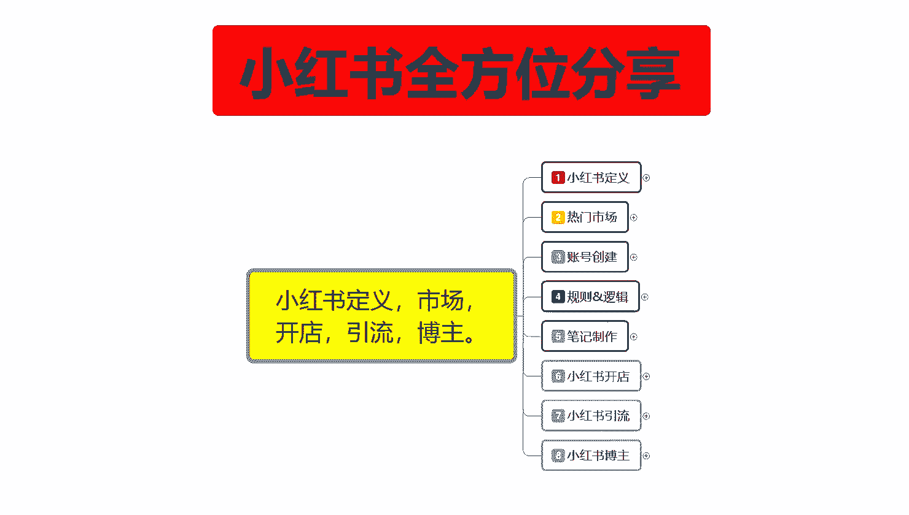
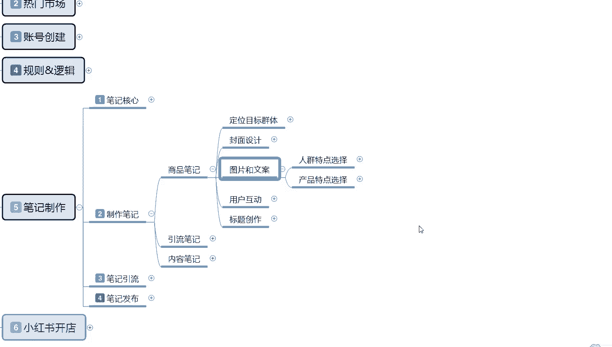
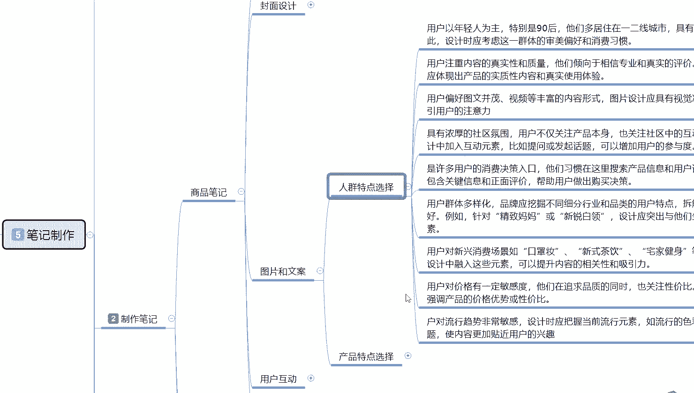
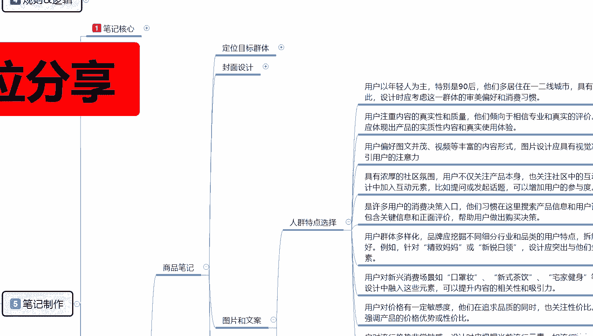
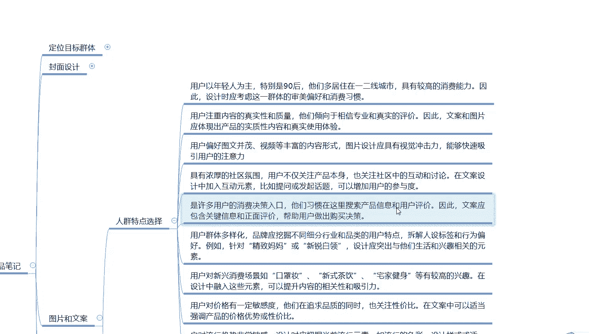
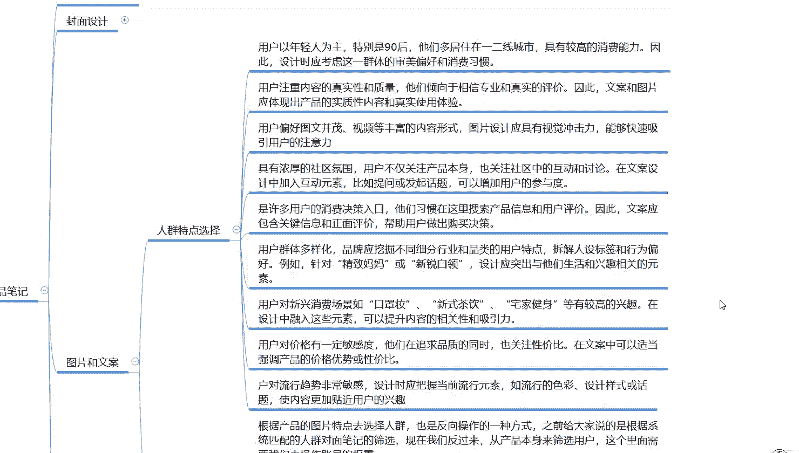
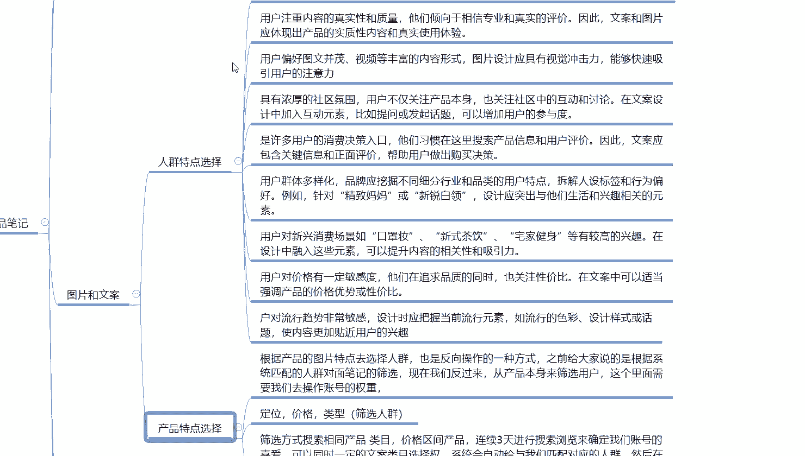
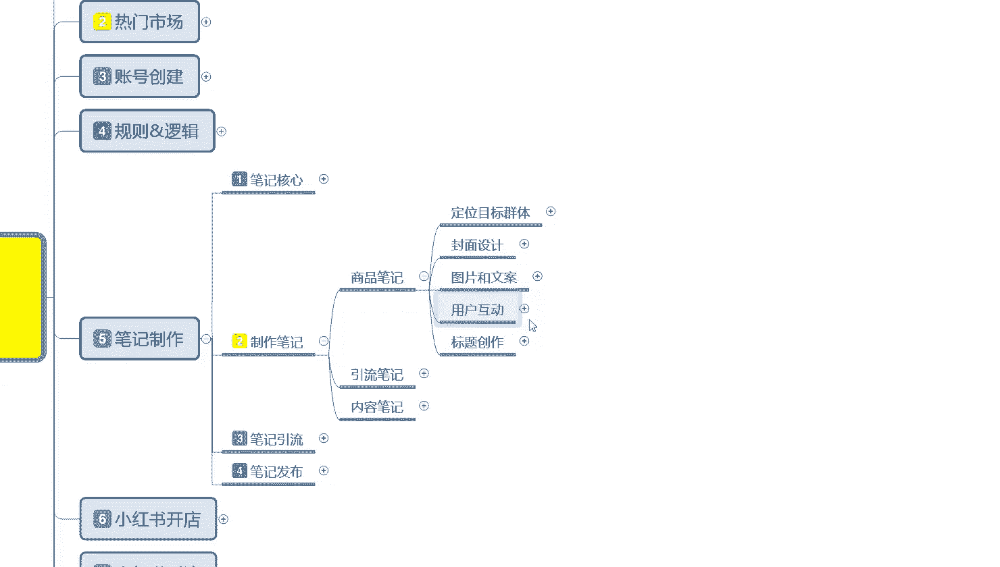

# 比刷剧还爽!!2024(全新)小红书运营网课，小红书运营大佬专为为学渣研制的小红书开店、小红书起号零基础保姆级教程，全程通俗易懂，纯干货无废话 - P11：10、小红书新账号笔记制作（4） - 秋枫不入睡 - BV1AAtHebEvj

大家好，今天给大家分享的是小红书全方位整体分享的制作笔记内容。这一节课的话是给大家讲解商品笔记里面的一个文案和图片的一个制作。

商品你笔记里面啊，你可以把它理解为你做商品也行，不做商品也行，你把它做引流和发笔记发布的内容都是可以的啊。他们的。公式和方法基本上都是一样的。所以说因为商品比内容比较多。

所以说我把它放在上面去给大家进行的一个分享。图片和文案的话，这里面的话就是一个人群人群特点的一个选择和产品特点的一个选择。他们两个相互匹配之后。

啊，就是你的图片和文案所需要选择的一个对应内容。

我们先看人群特点选择啊。人群特点选择是什么意思呢？就是说小红书用户的话，他本来是以年轻用户为主，特别是90后，他们多居住的话就是一线城市、二线城市，三线城市、四线城市也有。

但是他们的消费购买能力的话就相对会差一点。日常的话基本上都是一线二线的大城次，在小红书上面，这种比较追求时尚高端的一个女性用户啊。在小红书上面去逛。

然后的话寻找他适合他们的商品或者他们感兴趣的内容去进行了解。了解过后的话，才有一定的精力去购买你的商品，或者说关注你，看你下一步更新对他自己有没有什么帮助之类的实际性内容。所以说。这帮女性用户的话。

他们具有较高的消费能力。因此呢设计的时候应该考虑这一群体的一个审美观和消费能力。还有消费习惯。比如说一号线城市，你比方说北北沙广深啊，对应季节不同，穿着不同，他们所喜欢面临的一个环境不同。

你可以去设计产品。当然了，这个的话人群特点设计的话，还要看你自己有没有能力去设计这个产品。如果说你没有的话，那你只能根据产品的一个特点去设定人群啊，就是他们两个可以正反互换。什么意思呢？

要不就靠人群选产品，然后再去推广你的产品，效果会很好。退而求其次，如果说你没有这种组织能力，或者说没有这种对应的产品，那你就只能选择产品去选人群，通过你的产品，然后扩大你的人群范围选项。

去选择对应的人群来购买你的产品啊。第一个呢是主观意思，第二个是被动意思。

把这两个点把它弄清楚啊。第二个呢就是呃小红书呢他的用户注重的内容真实性和产品的一个质量。就是说小红书上面一二线城市女性的话，他在上面需要寻找的是对自己有帮助的。你正常发文的那种笔记的话。

如果说对用户呃搞笑类的或者说是开心类的啊，能提升他的心情，他偶也会看一下。但是他的一个消费转化能力的话就比较差。就是你想做引导，引导到其他地方去了解的话啊，难度有点高。就是说你在小红书上面，你要。

发笔记的时候一定要有真实性。啊，还有你自己的一个专业度。这个里面体现的话，就只能靠你的文案和图片去进行体现。体现你的产品的实质内容和真实性。所以说你的评论区一定要火，你的评论区不火，别人是不会去观看的。

有时候他观看你图片内容，40%到50%的时间都是在评论区里面查找答案。啊，所以说你做笔记的时候一定要注重。不要把所有的答案都直接写在笔记内容文案上面，你也要去评论区进行引导。人群特点选择的话。

这个里面说实话重点内容的话就是。你通过商品选择人群或者通过人群选择商品，看你们大家自己怎么去。呃。调解。把它划分出来，然后的话去针对性的做选择，让小红书系统对你的商品和你的账号进行录入。

然后定型定型以后，你后续发放的笔记，通过排名获得更多的一个展示和曝光机会。然后看你的内容喜爱程度，有没有用户更加的喜欢。如果说你的产笔记内容是正常的，就是呃文案真实性可以，内容质量也可以。

产品的价格也算合理。对吧就说价格不要太虚高，也算合理。你包括做引流笔记内容也一样，你做内容笔记内容也一样。你前面我们先不做商品，你直接去做引流，也是按照这一套模式去走的。

只是说用商品笔记这个方式来给大家进行分享的话，它的内容会更加完善，更加完美一点啊。呃，这项内容我就不一一给大家解释了。因为这些内容的话，说实话实质性的内容就是我刚刚给大家讲的。

你们所需要了解的是你是通过人群来创造商品，还是通过商品来创造人群？然后你所发放的笔记内容里面包含的真实性啊，连贯性和稳定性达不达标。达标以后，你属性没有问题的话，我们在前期你把自己商品人群做完。

就是你账号对应的人群，你账号创建支出所对应的人群。然后的话去评论区里面进行评论跟进，拿小号引导这几步做下来。那你的一个图片和文案基本上就没什么太大问题了。这里面主要的图片和文案选项。

我没办法去给你们去做一对一的针对性分享和讲解。因为我不知道你们做出的的是什么产品啊，我只是说以我的经验来给你们进行分享而已。这里边的话有一个图文并茂，然后的话就是社区氛围。

后续的话就是用户的一个消费决策入口。然后呢就是用户群体的一个多样化。

啊，这些我就不给你们进行分享了。因为它的一个实质性内容的话，基本上就是我刚刚刚打出来的文字那些内容，你们了解一下啊，有兴趣的可以把那个视频点暂停，然后自己去好好观察一下。然后产品特点的一个选择是什么呢？

根据产品的一个图片特点去选择人群，也是反向的一个操作。就是我之前给大家说的人群特点是通过。人群来选择我们自己的推广商品，但是产品特点是通过产品来选择特定的人群推广。这个里面的话，你要定位的就是价格。

类型就是筛选你自己的人群，自己把人群筛选出来。以后以后的话就是定位目标群体里面人群筛选出来，通过你的产品去选择你对应的人群就可以了。

基本上都是比较简单和方便的筛选方式的话就是搜索相同的一个呃产品类幕价格区间和产品，连续三天进行搜索浏览，来确定我们账号的一个喜爱。可以同时一定的文案内幕选择权。

就是系统它会通过这个方式判定你自己的一个呃社区范围。社区范围选择以后的话，它会给你划分类型。类型的话就是你自己观看的。类目价格和产品区间的一个方式。通过这几个点来判断你自己是否喜爱。

后续的话他的人群还有消费能力的话，是通过你自己购买行为或者用户的购买行为，在你店铺里面进行购买的一个行为来进行判断和划分的。系统会自动匹配与我们匹配对应的一个人群。简单点的意思就是你看什么样的账号。

你发放的笔记就会推给什么样的账号，概率的话大概是在70%左右。剩下30%的话是额外添加的其他流量或者新用户的。像我们这样呃做账号的一种流量推广模式。意思就是说有可能是小红书新进来的一个账号。

或者说他通过搜索的方式来查找同类型的一个笔记，你会获得30%这样的一个额外流量。其他70%流量的话，基本上都在方品笔记里面的一个流量渠道里面。当然了，你做引流笔记和内容笔记的话也是一样的。

但是他没有搜索渠道，搜索渠道的话就是65%的一个概率。系统它会自动给你进行匹配啊，匹配以后的话，然后再去通过我们发送的一个笔记反馈给类似于我们搜索同样内容的一个用户。这个就是做人群定位有啊。

产品特点选择里面。

那这一节分享呢就给大家分享到这。下一节呢给大家讲解一下那个小红书，我们笔记发放出去以后的一个用户互动，我们应该怎么去操作？

