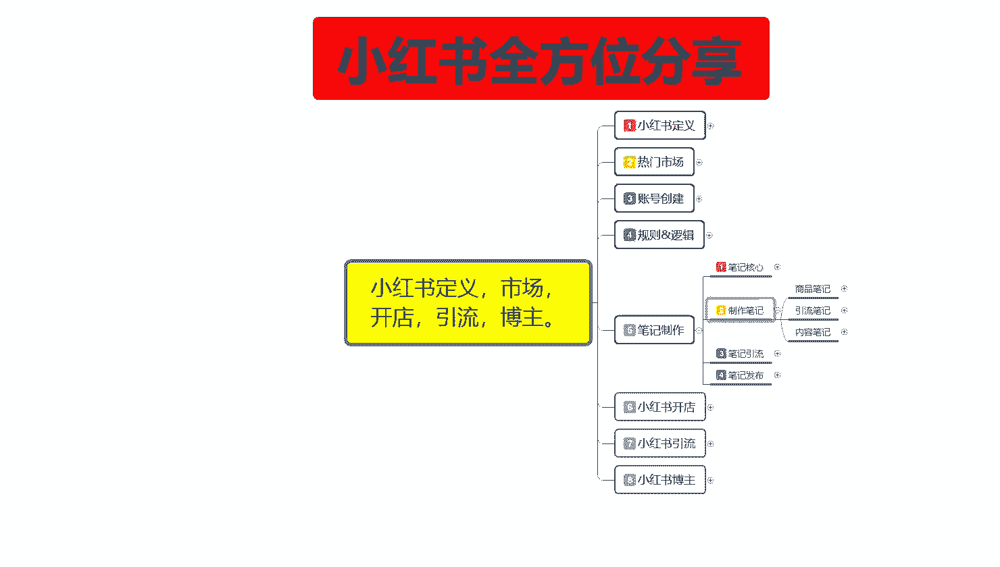
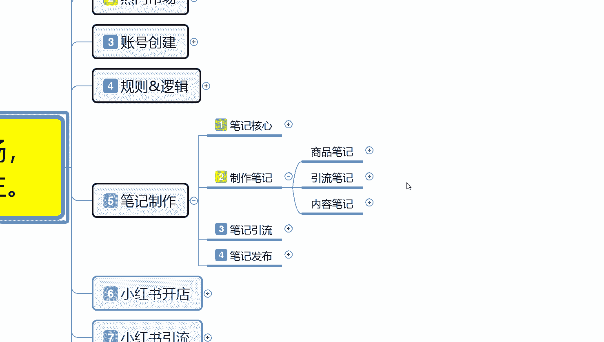
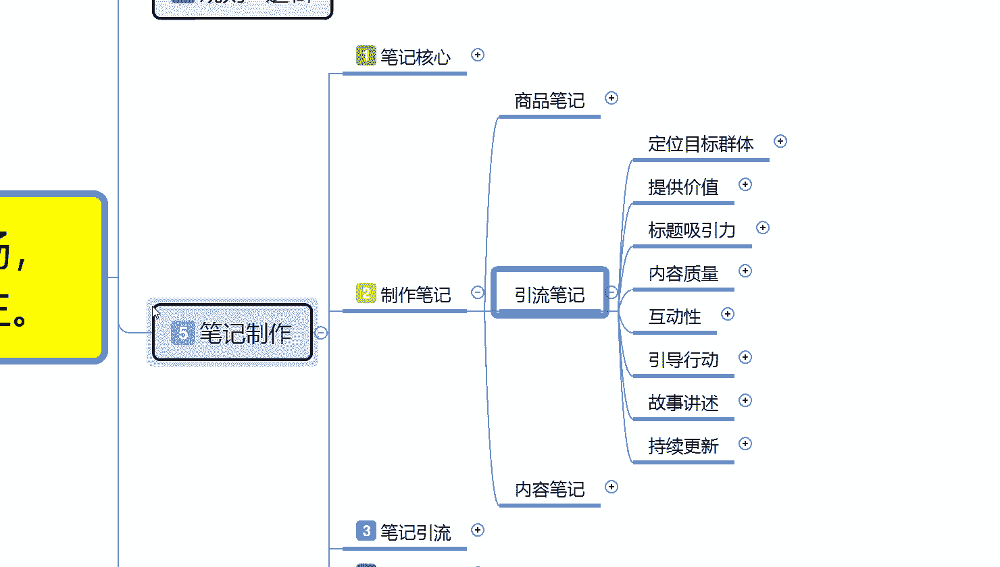
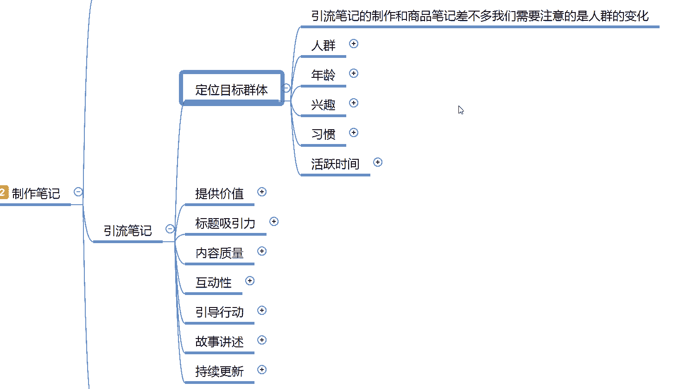
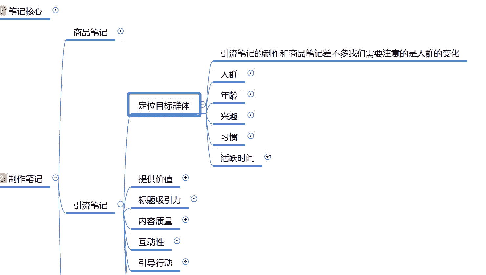
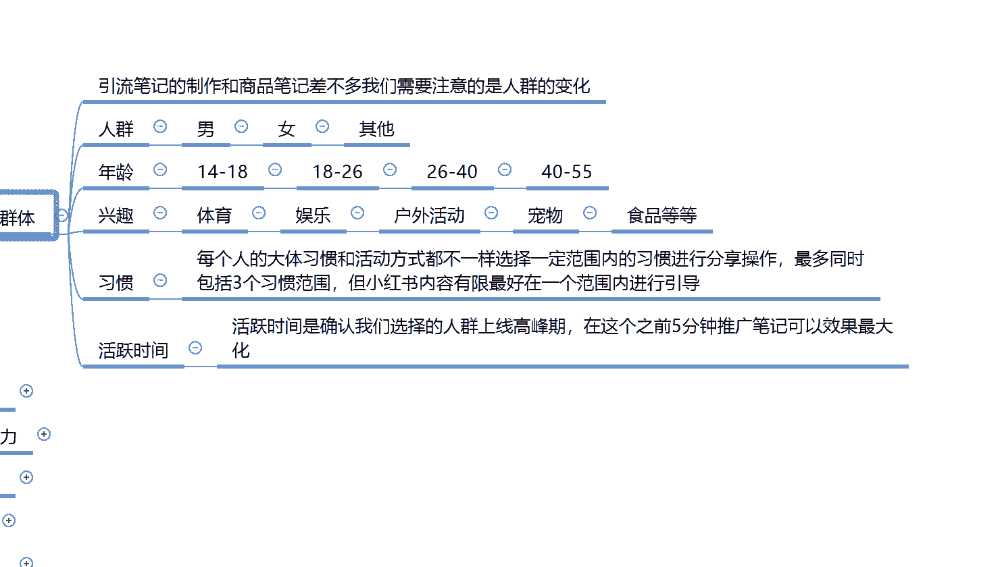
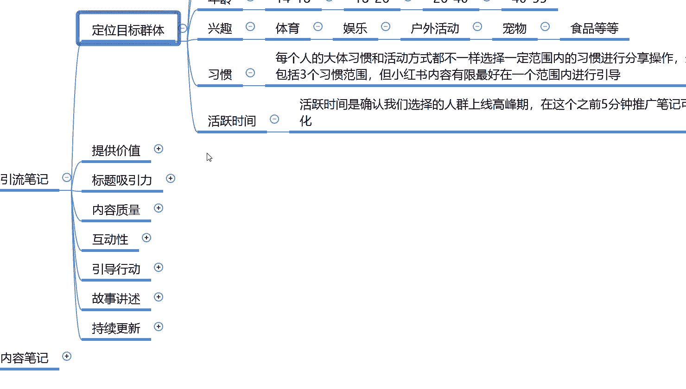
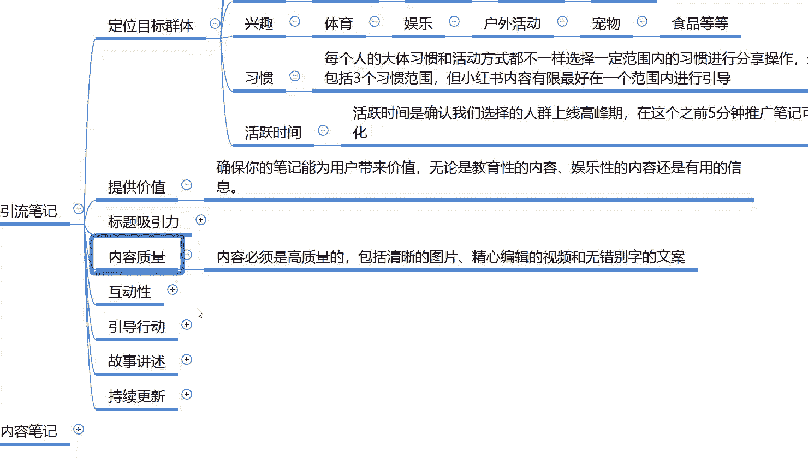
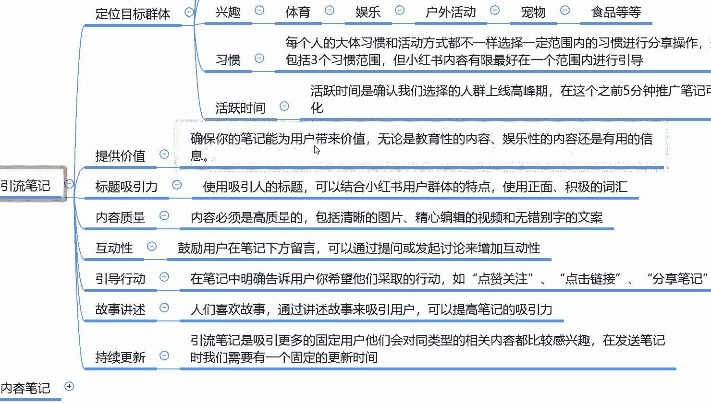
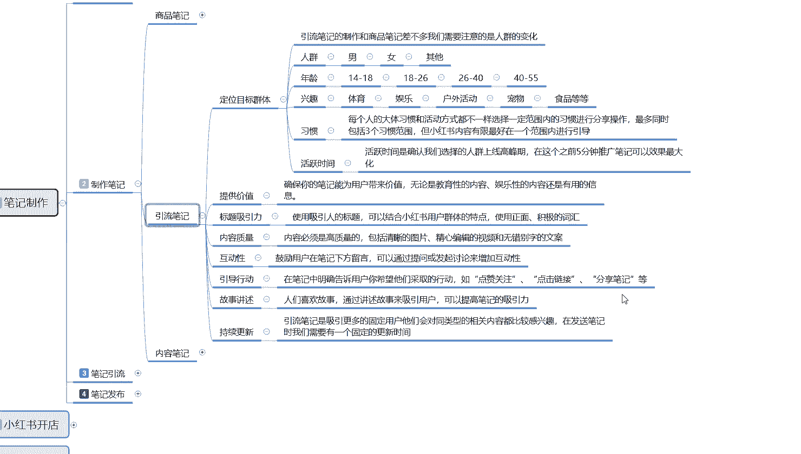

# 比刷剧还爽!!2024(全新)小红书运营网课，小红书运营大佬专为为学渣研制的小红书开店、小红书起号零基础保姆级教程，全程通俗易懂，纯干货无废话 - P13：12、小红书新账号笔记制作（6） - 秋枫不入睡 - BV1AAtHebEvj

大家好，今天给大家分享的是小红书全方位整体分享的第五大课时笔记制作的内容。这节课的话是给大家分享的是引流笔记的制作方式。

之前呢已经给大家分享了一个商品笔记。因为商品笔记的话，它包含的内容会多一点。所以说是先给大家讲个商品笔记。但实际应用的话，我们应该是先做引流笔记，然后做内容笔记之后再去做商品笔记，按照这个顺序来的。

因为引流笔记的内容的话，它是包含了商品笔记和那个内容笔记里面的。也就是他们都是互通的，只是说它的一个兼容性没有商品笔记那么高。

所以说我就给大家先讲的商品笔记。这节课的话是给大家讲解一下那个引流笔记。重复的内容呢，我就不过多的进行分享了。这个里面呢首先第一个呢是定位目标群体，其实和商品笔记定位目标群体是一样的。

只是说它的定位目标群体的话，我们自己去选择的时候是根据自己的一个特性来选的。

他包括人群年龄。

兴趣习惯和活跃的一个时间。这个里面唯一的一个区别的话就是呃习惯和活跃时间。

其他的兴趣也好，年龄也好，基本上的话都和那个商品比记的一个人群年龄是一样的。我们在制作商品笔记的时候，唯一要。把控的啊就是引流笔记和商面笔记，它区别唯一要把控的就是说人群的一个变化度。

人群变化的话就是说年龄14181826264040到55这几个阶段基本上是没什么变化，包括你人群的种类里面唯一的就是说他的一个兴趣。体育、娱乐、户外、宠物、食品等等。然后呢是习惯每个人的话。

大体的习惯和活动方式的话基本上都是不一样的。选择一定范围的一个习惯进行分享操作。最多的时候的话就说你一个账号，就是我们自己创建的小红书主账号啊，最多包括三个习惯范围。但小红书内容有限。

最好的话就是说我们在一个社区范围进行引导。我们刚开始选的时候都是三个社区范围。你比方说呃美妆、美食对吧？呃，户外运动等等，这些它都属于一个大类，它属于一个社区范围。我们在社区范围里面的话。

账号创建支出是可以选三个的。但是我们正常去操作账号的话，只会选择一个兴趣范围去进行选项。之后呢就是活跃时间，活跃时间的话是确定我们选择人群上线的一个高峰期。在这个高峰期之前5分钟去发布推广笔记就可以了。

其他的话基本上和商品笔记没有太大区别。只是商品笔记它发布的是商品关联类似的一个笔记。但是引流笔记或者说是内容笔记我们去发送的时候的话，你就关联的不是商品，关联的是我们自己想要推广的笔记内容。

就是没有实质性的商品。你是做引导也好，做其他的也好，你然后呃先讲内容，然后再宣传。按照这种方式去做的。所以说目标群体里面你就一个汛期，一个习惯和活跃时间，稍微注意一下就行了。

其他人群的话基本上都是一样的。

引流笔记里面稍微注重的啊就是提工价值。

内容质量。互动性之前已经说过了，引导性也说过了，其他的基本上都是一样的。我们稍微要注意的就是价值提供和内容自然两个方面，价值提供什么呢？就是说确保你的笔记能够用户带来价值。就说你要讲实在的一点的东西。

你的笔记推广出去以后，你如果说你是要做引流，或者说做商品笔记前期的一个引流，或者做。

你自己想把它拉到其他渠道去的一个引流，你都要有实在性的一个价值观。这个价值观的话，就是说无论你是教育性质的内容，娱乐性质内容或者是其他有用的信息都可以。但是你不能做虚假宣传。因为你需要线上购物的话，呃。

这些小红书用户啊，因为是女性用户非常敏感，他们会回来你的评论去进行评论删除，或者说是是进行负面的一个信息评论。到时候的话你的呃属性如果说。做起来了以后，你这些负面评论太多了以后的话，对你后续发展不利。

而且。会影响你的整体转化。你不管是你自己在做商品引流转化也好，你自己去拉到其他的交流群里面去做引引流转化也好，都是一样的啊。标题吸引和那个商品的话是一样的。因为小红书的话，你笔记制作出来以后的话。

唯一的一个区别就是你商品的话，你必须包含你自己的一个关键词，就是产品关键词。但是你这种引流笔记，我们自己做的引流笔记，你不需要包含商品关键词。啊，就这一个区别，就是说你有没有关键词都无所谓。

你只需要介绍你的一个内容，吸引更多的用户。如果说你下次发放商品笔记或者发其他的笔记，别人用户也会在你的呃推荐里面去搜索到你。因为推荐的话，他都是关注过的，对这一部分内容感兴趣的。你有没有更新呢。

有没有实时更新下一步内容，你偶尔更新一个商品或者更新一些其他东西的话，用户也是可以接受的。所以说他不会给你造成大量的一个用户流失。然后。内容质量方面啊，就是说内容必须是高质量的一个。笔记内容。

你笔记内容，你不管是发图片，发文案也好，发视频也好，都是一样的啊。这个的话和商品笔记是一样的，我就不过多讲解。然后说互动性引导性故事的一个讲述，还有持续更新。

这里面唯一要注意的就是故事讲述人们喜欢故事啊，通过讲述故事来吸引用户可以提高笔记的一个吸引力。就是说你的那个笔记发出去以后啊，以故事的形式。小说啊短篇等等这种方式去发是最好的。你不能说是以呃某一件商品。

然后的话你直接讲这个商品的优点缺点。这种方式发可以，但是它的整体效果的话，没有故事讲述性的这种效果也好啊，就是你自己随便编点故事呃，或者自己给自己的产品。做点那个背景啊，前景啊之类的都可以。

这个意思大家明白啊，就是说因为你做引流笔记的，你本来就是吸引用户吸引访客去的。你其他的呃你像商品笔记，它有固定的一个产品宣传。如果说你不准备做商品，你准备做引流，对吧？那你要有故事的吸引性。

吸引性达到以后的话，你就要去扩展。哪些东西可以改变目前对他们自己身体不好啊，或者是其他的这种引导方式啊，就是故事讲述性，你要有自己的一个完整思路才可以。呃，最后一个点呢就是持续更新。

为什么说持续更新发生最后一个点呢？就是说。引流笔记啊是吸引更多的固定用户，他们会对同类型的一个相关内容都比较感兴趣。在发送笔记的时候，我们要有一个固定的更新时间。比方说一天两篇笔记。

你一篇是在早上11点发，一篇是现在下午5点半发，或者是下午5点半，晚上8点半9点。这个时间段你要把笔记更新出去，让更多的用户去看它。而且你每天固定更新的时间。固定以后，你的用户群体。

他基本上都知道你是在什么时间段更新什么时候发放新的作品，他就会对你有第一印象，就是刻板的印象。哎，今天没什么事啊，小红书有人那个上回看的内容还比较感兴趣，然后更新了，我去看看。他会在等待你更新。

而不是期待你更新。因为他知道你的更新时间以后，他对你的关注度和粘稠度会更高。包括你下次更新的什么新奇的产品啊，你去卖商品啊都可以。就是说笔记制作，你包括引流笔记，它的主要作用就是吸引顾客的粘稠度。

让顾客更加认可你这个账号所发送的内容。认可之后，你后续做商品，做引流，做引导都可以啊。但是说你不能说是直接上来，你想做商品不做引流笔记，然后不做内容笔记，直接发商品笔记。我之前给大家说过。

那样是没有什么效果的。好吧，你做商品笔记之前先要做引流笔记之后再去做商品笔记。那这一节分享呢就给大家分享到这儿。这个呢就是笔记引流。我们所需要注重的一些重点，还有重复的内容。

我就不过多的给大家进行复述了啊，它整体的话和商品笔记其实没有太大的区别。所要注重的就是一个人群划分里面的一个习惯变更和活跃时间。然后的话就是你们笔记制作的时候，价值观一定要提。

啊，提供好提供好架子以后的话，就是故事讲述和持续更新。这两点把握住，基本上引流笔记就比较好做了。

