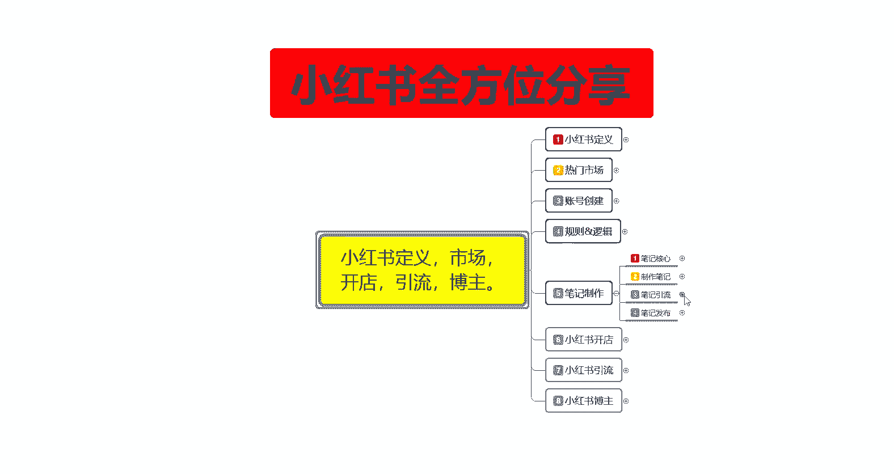
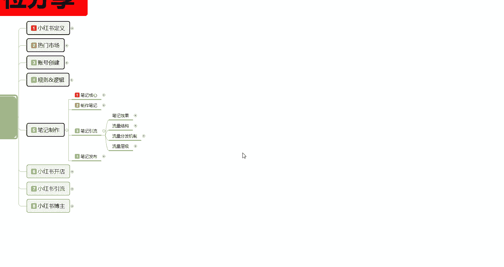
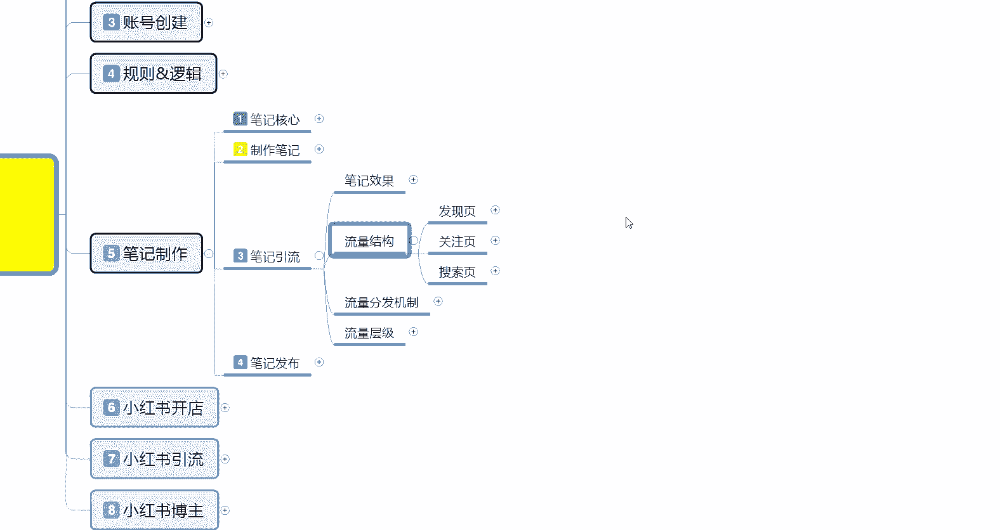
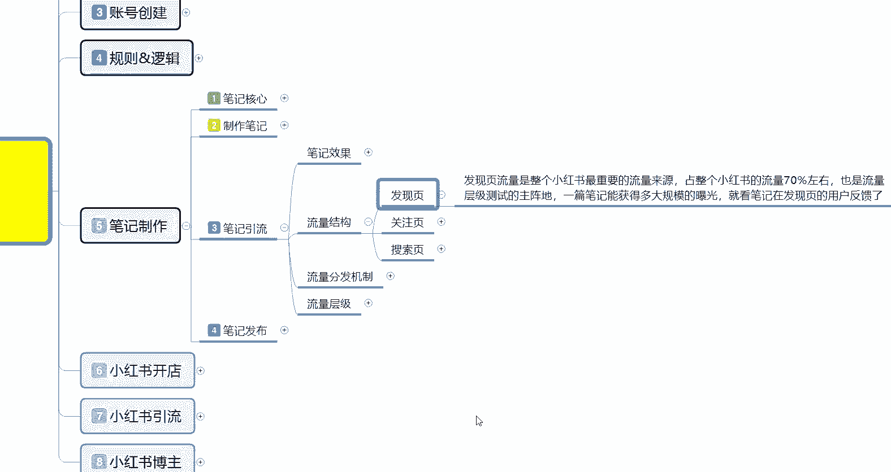
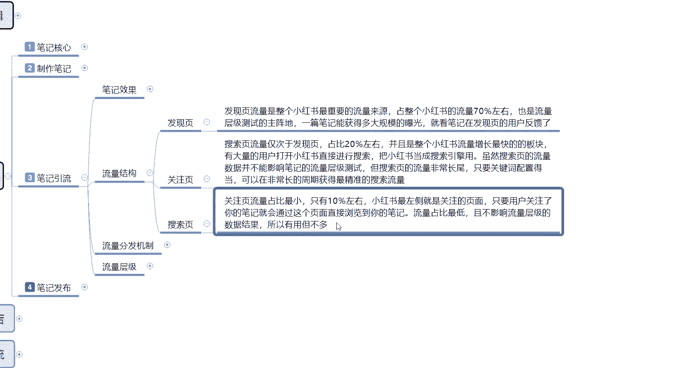
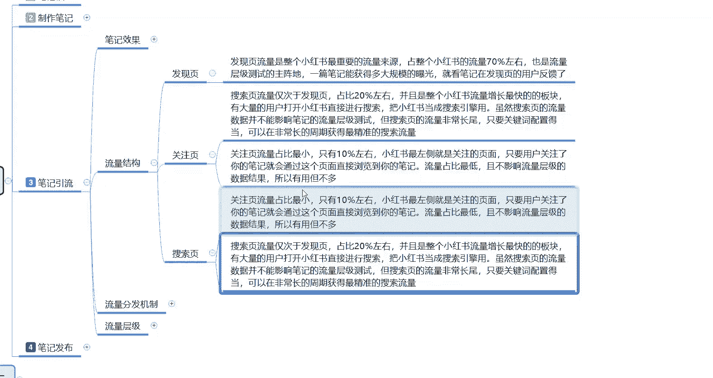
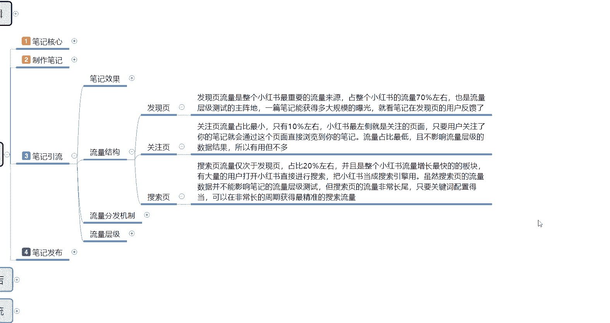

# 比刷剧还爽!!2024(全新)小红书运营网课，小红书运营大佬专为为学渣研制的小红书开店、小红书起号零基础保姆级教程，全程通俗易懂，纯干货无废话 - P16：15、小红书新账号笔记制作（9） - 秋枫不入睡 - BV1AAtHebEvj

大家好，今天给大家分享的是小红书全方位分享第五大课时制作笔记的一个内容。这节课呢还是笔记引流。第二大点的一个内容，流量的一个结构就是小红书。我们流量来源的一个整体结构。你要明白你自己的呃商品笔记。

引流笔记和内容笔记，他们所发放对应的一个渠道啊，获得的流量方式是什么。你不能说你自己盲目的把所有的流量全部发出去以后的话，你都不知道你的流量来源是哪里啊，那样的话，你后续你都不知道自己怎么去进步。

其实小红书的一个流量结构的话，目前来说还是比较简单的一个发现一个关注页，一个搜索页。它还有一个购物。但是购物的话，它是那个靠排名去做的，就是和淘宝呃，拼多多或者说是京东这种的话呃，类似他这个购物的话。

目前抖音上面也有呃，他们都是类似的。就说它靠的是你的产品排名销量排名、价格排名。然后的话靠你的成交排名和你店铺账号的一个粉丝综合排名来进行排名的。前期你新手如果说直接想在小红书上面去卖货。

去抢这个购物里面的一个排名的话，呃，你难度不亚于想花1块钱干1万块钱的事情啊，基本上就是这个样。因为你前期的话你没有权重的时候，你在那个购物里面你是排不上号了。就是说购物的话。

我就没有在这个地方给大家列出来。我这里呢只给你大家列了三个点，一个是发现，一个是关注。然后第三个是搜索。

我们先了解一下什么是发现眼啊。

发现页发现页的一个流量的话，它是整个小红书最重要的一个流量来源。就是说我们小红书，你不管是新号也好，老号也老号也好，你经常观看小红书的也好啊，它整个流量占比的话，基本上有小红书流量整体比例的70%。

就是我进入小红书以后，除非我目定性特别强啊，对某个方面比较感兴趣的话去做搜索。不然基本上我都是在发现页里面，就是发现新奇的一个事物。他会把你归纳为一个某一个社区。社区里面的话。

然后再给你进行产品的一个定位，会给你推2到3个类型的一个呃笔记内容，让你自己去观看查找。那它的一个整个占比的话是占小红书整个流量系统的70%左右的一个流量，也是流量测试成绩的一个主阵地。

就是你自己不知道自己在哪个层级。因为账号的话，它是有成级的，每个成级所发布的一个笔记的一个上限。啊，后续我会给大家讲。就说一篇笔记能获得的多大规模的一个曝光。就看笔记在发现页用户的一个反馈。

其他的一个反馈的话，你比方说关注页的反馈和搜索页的反馈其实没有作用的。他主要是看发现页。比方说系统给了你2000的基术曝光，那你的点击率，也就是小眼睛数量在220以上啊。

它可能就会把你的笔记归纳为优字型笔记，可能会给你推3天、4天、5天、6天、7天。啊，如果说你的笔记质量没有达到11%的一个点击，就是第一篇笔记发出去以后。你获得的小眼睛数量低于110或者说低于220啊。

它的笔记引流效果就是两天到3天左右。如果说你的账号还有违规，那可能只有半天或者一天的一个时间。没有违规的话，基本上就是3天以内。这个就是发现页。第二个呢是关注页。关注业的话。

说实话他其实就是搜索嗯怎么说呢？

这里面的内容反了啊，我把它调整一下。

关注页的一个流量占比的话，它是最小的，只有接近10%啊，不到。也就是说呃比方说我在小红书上面，我关注了你啊，然后的话我经常去看小红书的话，我可能偶尔感兴趣。我会去关注你的店铺有没有更新什么笔记之类的啊。

比例的话可能会比较小。但是它的一个流程的话是时间比较长的，什么意思呢？就是我关注你了以后的话，我不会经常的去看，但是偶尔我会去看看你有没有新的作品，新的内容进行发布。发布以后的话。我会随时进行跟进。

而且你这个粉丝数量它就不会掉，它就相当于属于你的一个固定粉丝。啊，这是关注页的一个效果。关注页的话，一般的话我们都是做内容笔记的。内容笔记。在关注页里面的话，就是因为它本来内容笔记的质量是最高的啊。

大家一定要弄清楚啊，内容笔记的质量是最高的，基本上都是从关注页里面去。它一个留存量的话可以达到40%。什么意思呢？就是说10个人搜索了你的一个内容笔及，观看以后的话，他最少有4到6个人。

最少有4个人左右啊，会对你的这个账号进行关注，希望你更新下一篇笔记。就是内容笔记的一个。为什么说内容笔记它是自然为王，就是这个方面啊，然后的话所有的内容笔记的话都基本上都是靠关注啊来给你增加人气的。

关注人气越高的话，后续给你的一个扶持力度也就越高。第三个呢是搜索页，搜索页是什么意思呢？是放大镜啊，不在其他地方，就是那个小小红书打开以后。右上角那个放大镜，放大镜里面你输入关键词进行搜索啊。

搜索页的流量的话仅次于发现页，它的占比的话接近20%。啊，20多，但是不不到25，基本上的话在2122左右徘徊。呃，整体占比的话，我在这边就是直接给大家列比的是20%。

毕且整个小红书流量增长最快的一个板块啊，就是这个搜索页。因为目前的话小红书它的那个商品。搜索。还有发现页，它整体的话，因为小红书目前的一个用户增长幅度没有以前那么快了。以前从那个1000万2000万。

到1亿2亿到现在3亿多的一个女性用户，基本上已经把中国女性用户70%都已包含进去。所以说小红书它的一个搜索页子里。因为对小户士了解透了以后，他的搜索页增长是最快，为什么？熟悉小红书的人。

他知道自己要去找什么，他用关键词直接去搜就可以了。所以说他的一个增长页面板块是最大的。而且这个板块页面里面搜索页里面有65%的流量啊，是普通的笔记，就是引流笔记啊，35%的笔记是商品笔记。大家弄清楚啊。

就是说你这里面20%左右的一个流量来源的话，它不全是商品啊。你搜索搜索页里面不是商品，它有65%的是。引流笔记的一个内容，剩下35%才是商品笔记的一个内容。你整体算下来的话，就是20%里面的35%。

如果说以。就拿100万用户来说吧，就是100万小红书用户。100万小红书用户里面发现页的一个流量占70%，就已经去了70万。那剩下20%左右的一个流量在搜索页里面就是20万访客，20万访客里面有35%。

那就是。7万的一个用户。才是去搜商品的。当然我这只是打个比例啊，它这个比例是这么计算的，它剩下65%的话，其实还是那个呃引流笔记，它不附带商品，其他的35%的话，基本上就是商品笔记。

就是它笔记发布推广以后的话，它里面是附带它账号下面的一个店铺。店铺里面的话卖产品的。他是通过这个方式的，所以说我们这个。怎么说呢？就是说你的笔记制作完成以后，为什么我给大家把它分类分类的时候。

我就给大家说过了啊，笔记是三个类型。第一个是做引流的，第二个说做内容的。第三个呢是商品笔记，商品笔记的你的主要作用就是在搜索页面里面去增强那35%的一个流量比例。引流笔记它就相当于占了发现页的70%。

然后占了搜索页里面的65%。所以说它接近有80%，接近90%的一个发现流量都是做引流的。就是你笔记做引流的效果会比做商品的效果，它辐射的人群要广得多。你做内容笔记的话。

内你只能在那个发现页和搜索页里夹缝中求生存啊。它正常的话，内容笔记基本上都是推给那个精准用户去做的。这个就是小红书笔记的一个流量结构。大家了解一下，自己心里面有个底，你不能说是嗯你开始做小红书的。

你对小红书自己那。你比方说你想做网红了，你天天没事，发个商品笔记对吧？你做个商品了，你没事，天天也发个商品笔记，你其实没太大效果。商品笔记的话。你只能增抢搜索页面里面35%的一个流量。

而且你们还要靠排名去增。你前期要做的就是先做引流笔记，把发现页和搜索页做好了以后再去做商品笔记。这时我才能吃最好的。那这节课的分享呢就给大家分享到这。下节课的话给大家讲解一下这个小红书流量分发机子。

