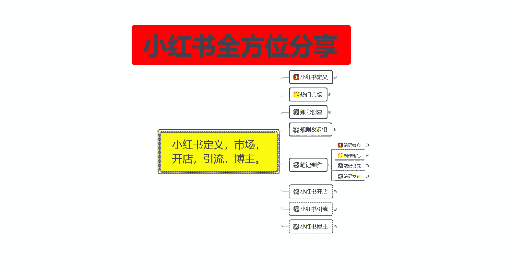
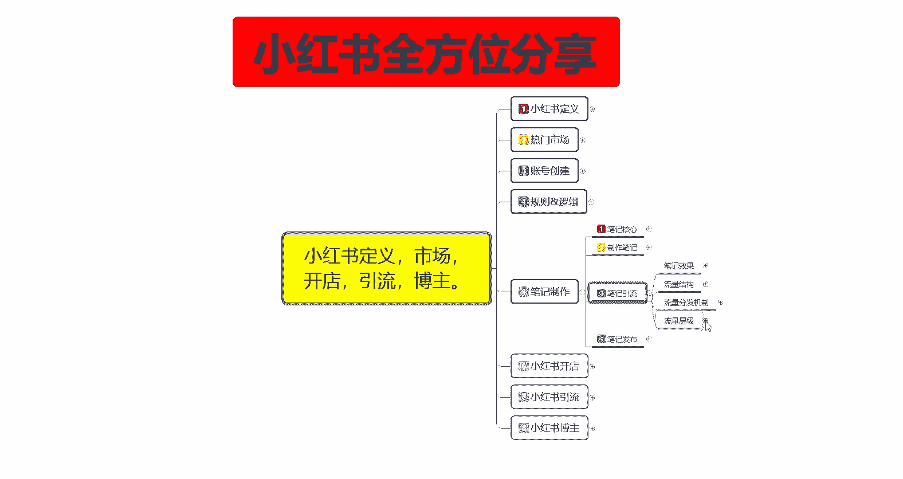
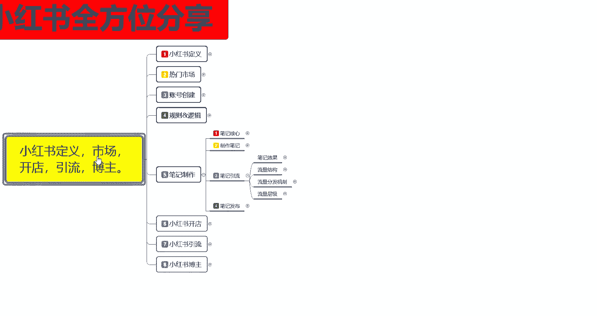
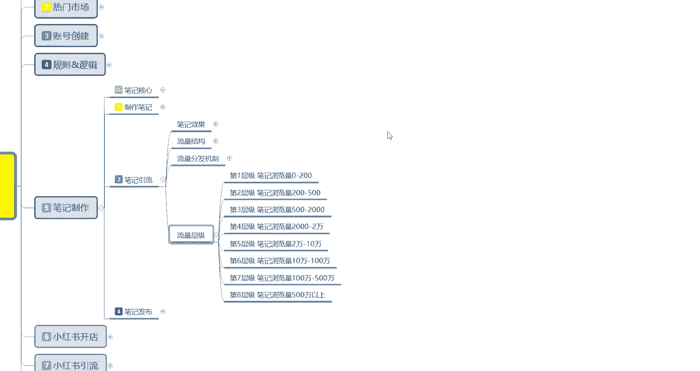

# 比刷剧还爽!!2024(全新)小红书运营网课，小红书运营大佬专为为学渣研制的小红书开店、小红书起号零基础保姆级教程，全程通俗易懂，纯干货无废话 - P18：17、小红书新账号笔记制作（11） - 秋枫不入睡 - BV1AAtHebEvj

大家好，今天给大家分享的是小红书全方位的一个整体分享。第五大课时笔记制作的一个内容。

这节课呢主要是给大家分享一下我们这个小红书的一个流量成集。流量成集是什么意思呢？就是我们小红书账号，它有一个隐藏的流量层级数据。呃，流量成级的话一共分为8级。它限定了我们笔记发放以后获得的一个流量。

也就是技术曝光获得的一个小眼睛数量。

这八个层级是什么计算的呢？就是第一层级。第二层级的话，基本上都是我们刚创建账号的时候自己发布笔记。笔记数量的话，我们获得的一个小眼睛数量是0到200。然后的话你往后面发多发两篇，或者说多等个几天。

基本上的话，笔记浏览量的话，小眼睛基本上都在200到500之间。第三层级是500到2000，第四层级是2000到2万，第五层级呢就是2万到10万，基本上到第五层级往后的话啊，自然流量你就已经到达顶峰了。

你无非就是第五层级接近往第六层级去靠啊，不会再超过这个数据了。第678说实在的，往678层级去靠的话，你在小屋上面你有需要有一定的资金投入，就是和官方去合作。

然后让官方官方呢帮你再额外的推成推荐流量才可以。不然的话，基本上没办法去到达6783个成级。呃，我们来了解一下，就是每一个成绩所对应的我们账号属性的一个内容。

因为你只有了解你自己账号和自己发布的一个内容，发布出去以后，系统给你的个评判。然后的话再确定自己在哪个层级才可以。因为你后续如果说怎么说呢？你就是笔记做的再好，你的等级层级达不到的话。

那你后续获得的一个消易级数了，他也不会超过你现有成级的一个上限。我们先来了解第一成绩啊，就是笔记的浏览量0到200。这个之间就是说只要你的笔记没有违规，就是你发布的笔记没有违规词，不管内容怎么样啊。

基本上都有200左右的一个略读量，就是小眼睛。你第一篇笔记基本上都有200左右。除非你发第二篇第三篇是在一天之内连续发放。后面两篇笔记的话，一个浏览量的话，大概在50到70左右。

或者说是你复制别人的一个呃笔记。然后自己来发这种的一个笔记的浏览量的话也会比较低。就说基本上你不管怎么去操作，只要笔记你发出去没有违规啊，基本上都有200左右的一个浏览量。就是说如果多篇笔记阅读持续。

经常一直你怎么不管怎么去发，都在200左右，就需要关注你是否收到违规的一个战争性啊。如果说没有的话，就说你的一个笔记质量肯定是有问题的。第二个呢就是第二层级笔记浏览量在200到500之间。

这种的话就是说属于正常的一个流量范围。大多数的账号的话，流量都能到达第二层级。如果说长期稳定在这个区间的话，你就要查自己的那个笔记里面的一个互动率，就是评论区活动活跃度。

然后的话查你的锤直度原创度以及内容的一个质量，就是说你的笔记的话呃发出去以后可能是不温不火，然后的话有人看，但是的话没有人进行评论。这个时候我的话就需要我们自己用小号啊去做引导做评论。

你不能说小红书的笔记你发出去以后让用户在里面啊自娱自乐。这种的话很多时候的话，小红书的笔记你都需要去做引导的。这个呢就是第二成绩，基本上浏览量的话，也就是小眼睛数量在200到500之间。

这个时候如果说你的评论区里面连2到3个的一个评论都没有的话，那你的笔迹你想往下一成绩突破根本就不可能。第三次升级啊，笔记浏览量的话是5000到2000。这个说的是小眼睛数量。

而不是说系统给你的一个基础曝光量。基础曝光量的话，大概你往上面要乘以10%到15%。就是乘以1到1515倍啊，也就是说你的点击率的话起码要在15左右。

11以上你才有可能获得2500到2000的一个点击率。你包括后续的也是一样啊，2万到10万，他给你给就相当于你有10万个小眼睛的话，他就是系统已经给了你。110万以上的一个展现曝光量。

不然的话你是没有办法达到10万的一个数据量的。而且你的点击率的话要在11%以上。就说第三层级的话，这种账号的话就说账号状态是正常的，以及内容质量只能说是一般啊，就是说还凑合。嗯。

但是你的一个互动力点点击率相比大盘的一个平行数据的话就偏低了。就是说你在整个行业类目里面，你的点击率的话没有达到大盘的一个整体需求，就是没有偏高啊。你只是说在正常范围以内。

所以说他给你的一个小已经数量的话，也就是2000到500之间。流量的话就只能进入第三层级。如果说达到这一层级的话，你基本上你的账号就在小红书里面已经超过了80%的小红书账号。当然了。

你跟那些其他的账号没办法去进行对比啊，这80%的话，基本上都是普通用户。然后的话平常没事的时候发一下，他可能都会获得500到2000的一个展丝量。如果说你要在小红书上面，你要去想套现赚钱啊。

卖货啊之类的，你最少也要到第四层级、第五层级才能。第四成级笔记浏览量的话是2000到2万。这个时候就已经说明你整个账号，就说你每篇笔记发出去发出去的话，你的笔记浏览量的话呃。

小眼睛数量大概在2000到2万之间的话，那说明你已经获得了一个不错的数据就已经超过了85%，接近90%的一个小红书账号了。简单点说，如果说你的数据超过2000。以后你往2万之内发展。

就已经可以往小报方面去操作了。就这篇笔记已经开始想开始报了，只是还没报起来。然后的话如果说你在3天之内没有报起来的话，那你往后续的话，他最最多给你推7天，那也就是达到上限。

也就只能获得2000到3000左右的一个效引力。如果说你慢慢的报起来以后，超过5000到接近1万的时候就已经开始报了。他的数据是持续爬升的，他最多的话可能会给你退15天15天。

如果说你还不能突破2万的话，那你就只能在第四层级待着。如果用户反馈的话，仍在增加，就是说平台的话，它会持续给你流量。只是说这个流量的话，它会变缓慢啊，就相当于你前面的笔记可能发出去3天就没有引流了。

这篇笔记发出去的话，可能会在3到7天之间。如果说你在3到7天之间能突破2万的数据的话，就会进入第五层级到2万到10万，他就会给你推广15天以上。如果说你达不到的话，基本上就是最多7天在2万左右。

或者说是1万左右一个小眼睛数量。第五层级笔记浏览量的话就是2万到10万。第五层级浏览量的话，也就是说我们自然自然流量的最后一关啊。依然是用户和互动的一个数据决定。

你是否进入下一个层级流量达到这个层级的话，笔记已经比较诉送了，基本上已经超过了98%。正常情况下，你已经超过了98%的一个小小红书用户了。

也可能的话有一定的粉丝比例基础以及权重比例较好的一个账号可能会比你高。就是那些已经开始在小红书外面走红的一些账号。正常的话，我们自然流量的话，基本上就只能到达这个阶段，2万到10万的一个小已金数量。

你再往上面走的话，你需要去给呃花钱做推广，不然的话你想往外面突破的话，到第六第七第八的话基本上上不去。第六层级就是说已经进入到热门笔记的一个门槛。到达这个阶段的话，笔记已经具备了一定的稀缺性。

就是说你的一个内容发出去的话，你本来就已经吸引了很多同类型的一个用户。而且你在这一某一个社区里面啊已经快接近顶点了。什么意思呢？就是说你这个社区的话，对于你来说，你已经可以往前一百去排了。

往这个方面去排的时候的话，小红书系统它还会去从其他的渠道给你额外进行引流。到达这个阶段的笔记的话，就说。稀有性已经非常高了，就是你的内容质量已经非常不错了。用户互动率啊，数据啊都比较好。然后呢。

也是从这一层期开始测试更多用户的一个后台数据端。就是说你的你的账号已经被小红书系统认定为优质账号。然后你每次发放的笔记的话，他会把你优先推荐给喜爱的人，或者说是类似喜爱的人，就是看到的人会更多。

基础上的呃基础的话，你就是达到了10万到100万之间。那他给你你就是不管你怎么去操作，你的笔记发放出去以后的话，只要不是乱发的。小红书笔记，它基本上就是第一时间就给你推荐出去了。

而且这个流量暴增的是非常快的。而且你基本上所有所有发送的笔记都认为是在7天以上的一个数据量。然后达到它的一个整体数据需求量的话，它会给你连续推广45天。就是你已经被小红书系统已经认可了。😡。

往后走第七层级，第八层级基本上都是一样的。只是说第七第八层级的话，你在小红上面很难看到。因为这种的时候已经是小红书官方大力支持的这种，基本上就已经是属于说小红书里面。呃。至尊级别的了啊。

这个时候的话你就已经不再愁什么用户啊之类的。因为适合你的用户，基本上都已经被你吸引过了，也都观看过你的产品。往七八层级去靠的话，你就需要去跟小红书官方平台合作了，而不是说靠自己自娱自乐。

然后的话花点钱呃再往上面推，那推不上去的。基本上到达第六层级，你花点钱还可以。但是到第七第八层级的话，你花钱都做不上去的啊，那需要你有有渠道有资源才可以。这个呢就是小红书整体的一个流量成绩。

主要呢就是让你们了解一下我们自己的笔记发放出去以后呢，你在哪个范围之内就是说不要盲目的追求呃。笔记发送的质量，然后觉得自己笔记发出去以后没有什么效果啊，它的效果是有的，只是说你所在的账号权重不够啊。

那这节分享呢就给大家分享到这，下一节开始呢给大家分享一下那个笔记发布的一些技巧。

