# 比刷剧还爽!!2024(全新)小红书运营网课，小红书运营大佬专为为学渣研制的小红书开店、小红书起号零基础保姆级教程，全程通俗易懂，纯干货无废话 - P1：小红书电商 - 顶端教学 - BV14ctUeyEQq

你的人生刚开始要说最近什么项目最火啊，那就必须要提到小红书电商，最近几个月呢，几乎整个互联网都在讨论小红书电商，我关注的几个商业博主啊，包括一些付费社群都在讨论他。

我朋友圈月入五位数甚至六位数的比比皆是，这个项目在年初的时候，我其实就有让团队跟进测试，我还在市面上买了一些课程学习，到现在单人单店一个月也能做个一两万块吧。

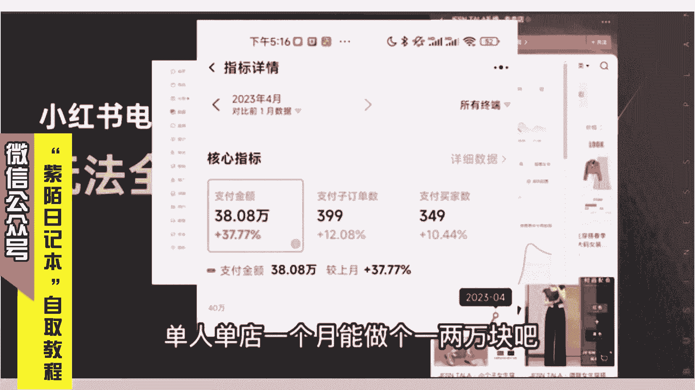

今天我就用一个视频详细的给大家拆解一下。

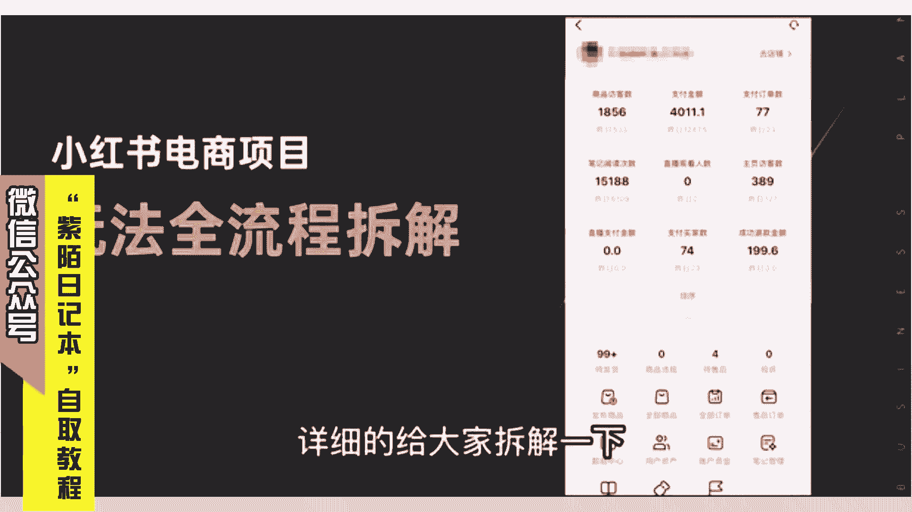

就是小红书电商到底怎么玩，我会把整个小红书电商的流程，包括一些注意点，比如怎么开店，怎么选品，怎么做流量，一次性给大家讲清楚，你甚至都不用再去看别的相关视频和培训了啊，你就跟着我的视频去按图索骥就足够。

你在这个事情上开始盈利了，视频的结尾呢我还会给大家准备一份资料，里面有我找的课程啊，对你运营小红书电商呢会有很大的帮助，有需要的直接去拿就可以了，言归正传啊，整个项目的逻辑啊其实也非常简单，它就三件事。

第一个呢开店，第二个选品，第三个流量，我们一个一个来讲，先说开店呃，开店其实没什么好说的啊，首先就是打开小红书，然后点击左上角的菜单图标，再选择创作中心，然后点击更多服务这个选项，选择店铺。

点击立即入住就可以了，你就按他官方要求的提交资料入住就行了，我居然看到有人把小红书开店包装成一个项目，拿出来卖，居然还有不少人买，这也是很奇特，这里跟大家说一下小红书店铺的两种形式，个人店和企业店。

其中个人店有两种，分别是个人店和个体工商户店，个人店只需要身份证，加1000保证金就可以开通了，个体工商户呢还要多一个营业执照，企业店呢就多一点，企业店有三种呃，有包括那个普通的企业店。

有专卖店和旗舰店，企业店都需要营业执照，而且还要缴纳600的年费，我们刚开始运营小红书电商的时候，你直接选择个人店就可以了，我们实测下呀，企业店和个人店一样，平台并没有对企业店有什么流量倾斜。

唯一的区别是个人店你只能开一家，而一份营业执照呢，你可以开三个店，你一个店如果都没做好，你开再多的店都是没有用的，而且小红书电商啊，我觉得是不适合店群形式去做的。

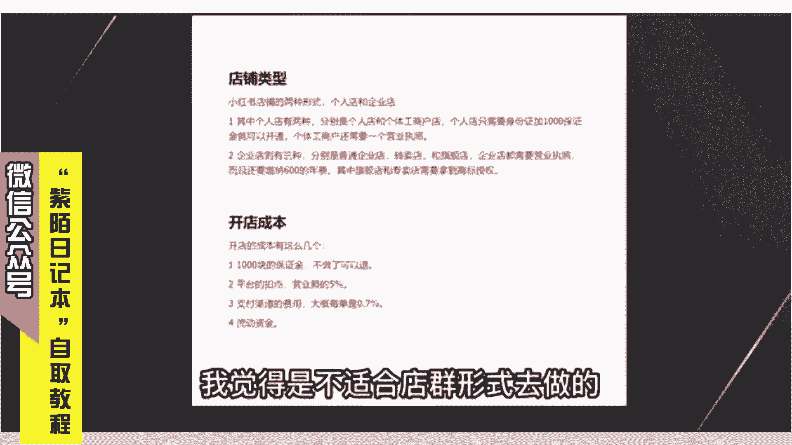

这是因为小红书的流量机制，它的电商自然流占比非常低，那你铺再多的电，再多的货有什么用呢，所以只要你看到有博主跟你讲什么小红书店群，我都觉得是在扯淡，小红书是要做矩阵的哈，但不是店铺矩阵，而是账号矩阵。

这个后面在流量获取那里，我会跟大家细说，开店的成本呢有这么几个，第一个就是1000块钱的保证金啊，不做了可以退，第二个呢是平台的扣点营业额的5%，第三个呢是支付渠道的费用，大概呢每单是0。7%。

第四个就是自己的流动资金啊，一开始大家做呢可以用无货源的方式去做啊，对资金要求也不高，你刚开始呢准备个2000块，3000块完全够了呃，开完店以后呢，我们下一步就是选品，我们应该在小红书上卖什么的。

选品其实也简单哈哈，在其他平台上的爆款，大概率在小红书上也能爆，目前小红书呢我是推荐三个渠道进行选品的，第一个是通过某东，某宝上面找那种小红书平台调性的爆款产品呃，身边有做电商的朋友。

他自己在某宝的店铺卖的爆款，搬到小红书上，第一篇笔记就开始出单，第二篇笔记单量就已经破百了，第二个呢是通过某音的那个精选联盟，你在某音的精选联盟排行榜，你可以看到现阶段哪些品卖的好。

只要符合小红书用户调性的产品，直接搬运测试就可以了，第三个就是某多多的这个销量排行榜，选择适合小红书的类目排行榜，从中选择相应的爆品搬运到小红书，整个选品的逻辑就是，我们要利用市场来帮助我们选品。

而不是自己在那瞎想，我们要借助大卖家的选品能力，来弥补自己选品上的不足，所以我们只要判断一个东西啊，就是这些排行榜上的爆品，是否跟小红书的人群有匹配的可能，如果有，我就搬过来测一下对吧。

相当于是借助了别人的能力来帮我们自己选品，这样反而是最快捷，而且是最稳妥的选品方式，肯定比你瞎测成功率要高很多，然后等你这个产品上架以后呢，就到了最重要的环节了，我们应该如何获取流量。

小红书他是个种草平台，你店铺九成以上的流量啊，都是来自你发的发的笔记，这就是为什么我之前说小红书不要铺店群，而要做账号矩阵，尽可能多的发笔记耗流量，它的通路就是用户通过你的笔记，然对你推的产品产生兴趣。

然后到达你的店铺完成购买，你堆一堆店铺对吧，你铺一堆店铺一个还不如多发笔记，多发几篇笔记的这个效果好，所以怎么在小红书上发笔记对吧，就是你小红书电商是否成功的关键，小红书这个平台你直接发硬广。

我觉得效果非常差对吧，本来小红书的这个用户群体认知就比较高，你直接发广告，你没有办法获得信任的啊，更不要提转化了，你发笔记的时候一定要用一个素人的角度，你知道吧，就是用户的角度去切入。

站在用户的角度去做种草内容，而不是官方视角，这才是真正有效的，呃这种种草笔记怎么做其实也很简单，就是去各大平台的商品评论里找，比如某音某宝，某东的商品买家秀，找到好看的素材，你直接copy下来用嘛对吧。

文案呢在买家评价上去做修改，这些买家的评价就是商品用户的使用体验，天然的适合用来做这个中考笔记，而且可以说是取之不尽了啊，然后呃当你单个账号的sop跑通了是吧，我们就可以开始举证引流了啊。

通过批量上小红书账号，批量发布笔记给我们的店铺来引流，来放大，那基本上整个小红书的电商的运营啊，就是我上面分享的这些。

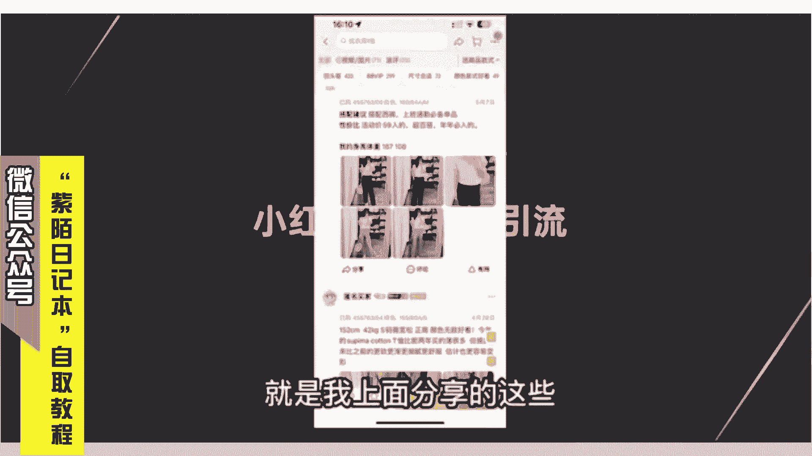

外面不管多少钱的培训啊，3000块也好，6000块，1万块也好，其实就是这些东西，有些培训可能还没有讲清楚啊，根据上面的几个点，我给大家准备了一份资料，里面包括了小红书账号的旗号运营的方法。

以及一份小红书电商的视频课程，你如果打算经营小红书电商，你也不用看别的东西，就跟着这份资料走足够你开始盈利了，有需要的啊，点赞加关注，在评论区回复红书电商。

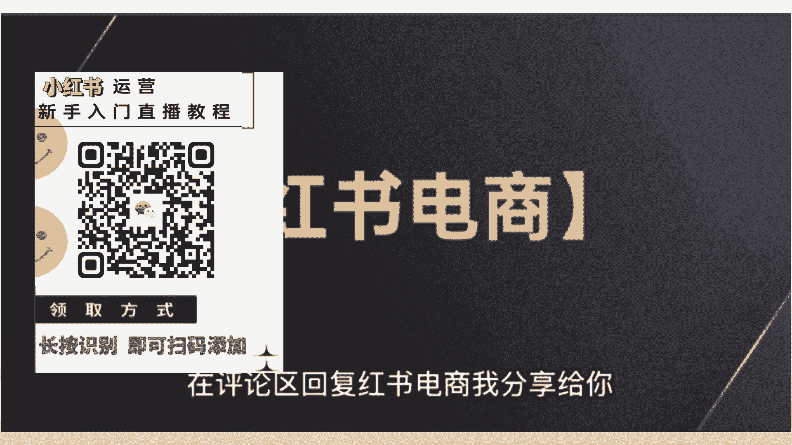

我分享给你，或者说我们现在要去选择一个互联网的这个，行业去变现，大部分人会想诶，好像这个抖音比较挣钱，对不对哈，好有用啊，但不知道怎么挣钱哈，没关系啊，很多人下意识会想说是这个抖音的这个平台啊。

那事实上啊，抖音它现在已经处在一个饱和期了啊，就是因为做的人太多了啊，在这个平台去变现，然后想要在这个平台赚钱的人有点太多了，市场是已经溢出来了啊，那么所以说小红书它其实也看。

看中了这个抖音这样的一个变现模式是吧，以前抖音哪有这个什么带货，哪有什么直播都没有啊，以前我们看更多看到是美女在那pk呀，在那跳舞啊，啊是这这些内容，然后包括刷视频看到也是娱乐等等啊。

但是自从抖音开了这个直播带货之后，开了这个橱窗带货以后啊，它相当于说把我们中国传统电商的呃，这个市场已经做到了一个瓜分，就比如说呢之前我们习惯性在淘宝买东西啊，在什么京东买东西。

现在更多我们会下意识觉得好像抖音上更便宜，对不对，好，那么呃小红书，它的一个模式其实跟抖音有点类似，它也是一个社交平台，也是一个分享作品的平台，但是小红书的区别在于，它不是说那种大批量的视频。

而是小红书更多是以图文的这个方式来进行，但是你想啊作为一个社交平台来讲，就作为小红书来讲，他如果说一直走这个图文的方式，他不挣钱对吧，平台不赚钱呃所以说他开始呢想要去借鉴啊，这个抖音的一个带货博士。

也想做出一个社交的带货平台，社交电商平台，那么所以说今天咱们才有这节课啊，因为小红书给大家提供了一个这个创业的机会，我不知道大家有没有关注到，这个在春节联欢晚会的时候啊，有第一个小品。

当时上场的第一个小品，在那里面出现了一个小红书的logo啊，我们以前看这个春晚基本上没什么广告吧，对不对，今年啊小红书直接把广告打到哪里去了，打到春晚去了啊，直接一个抱枕，最显眼的红色的抱枕在这里。

所以说他下血本了啊，那么我跟大家讲这个意味着什么啊，我们今天为什么会有这么一节课，因为小红书即将迎来它的流量爆发期，第一小红书自己花钱花巨资啊，再给自己的平台打广告，在疯狂的引流。

那么同时如果说未来我们在小红书的平台，去开店铺也好啊，还是说我们去做一个商业账号去打广告也好，那么我们会直接获得平台给予，我们的免费流量啊，就是你不用说像做抖音一样，我还要投抖加对吧。

我还得花钱在小红书我们去做账号的话，现在我们是可以完全封闭，不掏获得流量去争取收益的，然后今天我会详细跟大家讲几个玩法啊，来给大家看一下，一个的是我们怎么样来快速的去涨粉。

因为目前我们是处在一个零粉丝的一个状态，对不对，那这第一个啊，第二个呢怎么样去制作这个爆款的作品，因为既然我们想要在小红书平台去赚钱，首先你的作品得有人看，我得有粉丝是吧，有人能看到我的作品。

那么才能达到引流的一个效果啊，那么第三个如何打造值钱的这个商业账号，就说我的这个号如果说有粉丝了，有播放量了，我怎么把这些粉丝去变现变成钱啊，让他们来买我的产品，或者说呢我通过接广告，我来挣钱啊。

那以及呢我们今天也会讲到一个很重要的，我在不掏钱的情况下对吧，不花钱啊，然后呢并且呢我没有产品哦，我没有货源，在这种情况下，我们怎么样在不投资的这个情况下，我们去获得回报啊。

这是小红书这个平台目前能够做到的，那今天这节课的话呢，就是由我啊全程来跟大家讲一下，我们整个平台它的一个玩法啊，那么我叫小南，我做互联网的这个时间算比较长啊，15年开始做过淘宝，然后包括16年开始呢。

我们又接触了很多跨境项目，像什么虾皮呀，呃LAZ达啊，酷胖啊，速卖通啊，然后包括呢像亚马逊啊等等啊，18年我们也是最早一批在国内抖音，做视频带货的商家，然后我今天主要跟大家讲的几个方向。

也是我们不用去直播啊，就是你自己自己不用真人出镜，然后另外呢我们不用说去呃拍摄自己的生活呀，然后不用说自己原创去做这个视素材，一样可以挣钱的一些玩法啊，那现在我们先来介绍一下，这个小书平台到底是什么啊。

啊来我们有很多同学可能一进来云里雾里的，咱们今天在讲的是什么呢，啊讲的是这个小红书平台的变现玩法，也许这个平台有点冷门，有同学可能进来之后，连这个平台是什么都没听过啊，但没关系，我们先了解一下啊。

小红书，现在它其实是一个集合了所有的年轻人的，这样的一个平台啊，就我们现在已经有一个根深蒂固的感受，就是我如果说想买个什么东西，我会下意识打开小红书，先搜一下，比如说我现在要买口红对吧。

我不知道我这个白皮适合什么，黄皮适合什么，小红书搜索一下啊，我要出去旅游，我也不是问一下当地人说哪里好玩，什么东西好吃啊，啊我这小说搜的吧，武汉啊，这个哪个地方景点，江汉路怎么怎么样啊对吧。

什么东西好吃啊，然后去搜在小红书能直接给你答案，包括我今天我想买一个什么筋膜枪啊，我想买个按摩仪，人家小红书里面能够很全面的给你，把所有的这个品牌的介绍都给你写清楚，来我们看一下啊。

我直接打开这个小红书的界面，来我们搜索一下这种，你看一下对吧，我直接搜索一个什么美容仪，它的内容做的是很精细的啊，来咱们可以看一下啊，在这里面的话，他有很多这种专业的产品的分析来看到没有，对不对。

就这种啊很多个产品给你罗列在一块，然后给你做分析，非常专业，那所以说这个平台做的一个流量背书，做得很好啊，它里面针对性的客群是有很多的，就是想要购物的客户他是居多的，那所以说我们之后去做这个账号的。

机会也会比较大，那再一个跟大家讲一下小红书，它的一个发展历程啊，就在最早之前，小红书其实他是一个没有变现能力的平台，就是我们以前刷小红书，发现里面可多炫富的了，有没有什么香奈儿的包啊，怎么去买啊。

哪个款式当下的爆款，什么情人节限定是吧，然后包括呢买这个爱马仕的铂金包，你需要配货10万还是20个W啊，以前讲的是这些东西，名媛的下午茶啊，这个星空顶的豪车对吧，以前是刷的是这个东西啊。

但是这个大牌是不可能说，在小红书去开旗舰店的啊，所以说慢慢转型到后来呢，这个卖点什么化妆品啊，啊卖点这个护肤品啊啊，然后再到呢后来跟各种服装品牌去合作啊，再到现在什么花西纸啊，完美花西子啊，完美日记啊。

这个几十块钱的产品也开始出现在这个平台，所以说现在小红书它其实主打的一个方向啊，就是去做带货，那么所以说今天我们也会来教一下大家，我们怎么样来做这个模式啊，我跟大家简单先说一下。

这个百万买手计划是什么意思，为什么我前面在开课的时候，我就跟大家强调，我说现在是做小红书的黄金时间，对不对，黄金三个月啊，就从现在起往后数三个月时间。

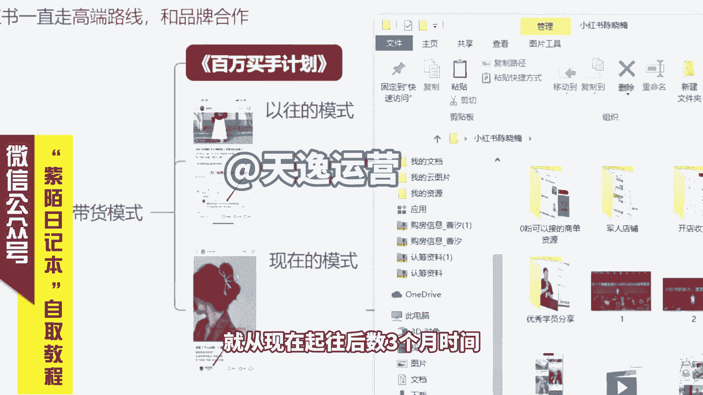

现在是平台直接给咱们免费上游的一个时候，为什么来我们看一下啊，他们这个CEO发布了这个新闻发布会，讲到了这么一个玩法，叫百万买手计划，就是他们现在在大力的招募有创业能力的人，有开店能力的人啊。

有电商经验的人，来到小红书去开店，去卖产品，不管我们的货有没有品牌，无所谓啊，就是能够开店，能够去成交，那么就可以为什么来，现在小红书要靠这一个玩法去翻身，我举个很简单的例子啊。

如果未来我们的店铺成交金额达到1万块钱，对不对，我卖了1万的货，那么平台能不能从我们手里抽成呢，可以他会获得5%的手续费服务费啊，相当于说你需要交钱给他是多少钱呢，500块直接从你手里扣走啊。

不会问你同不同意，看到没有，那如果说我们成交的是10万元，对不对，他直接能够从咱们手里啊获得5000元的分成来，同学们这个钱是不是挺多的是吧，这就是小红书啊，他未来走的一个方向，你开店卖货卖的越多。

你给平台创造的价值越多，那么他从你身上捞到油水越多，他给你的支持就越多啊，这就是小红书，现在跟我们所有的达人合作共赢的一个方式。

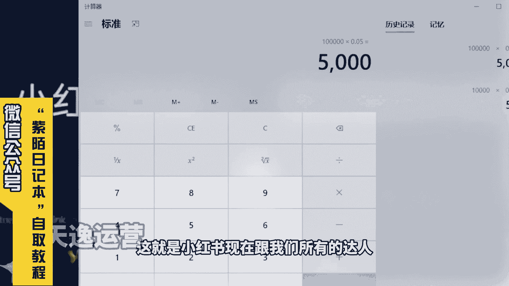

那么今天我们就算是个小白，我啥都不懂，只要你把这个店开起来，我们把产品上上去，把作品发起来啊，赚钱是很容易的，基本上7~15天左右是没有问题的啊，这个是一个百万买手计划，你看之前我们在小说。

你要买个东西很麻烦的对吧，我还得去搜啊，说这个你好链接有没有求个链接，这个裙子很漂亮啊，你还得到淘宝上去下单，是不是，那作为商家来讲，作为卖家来讲很亏的呃，作为作为小红书来讲很亏的。

明明是我自己平台引流的，我花钱来的，买来流量啊，结果跑到淘宝去买东西，钱被淘宝挣走了，对不对，那现在不一样啊，现在的一个玩法什么样的，来我放这个大图给大家看一下啊。

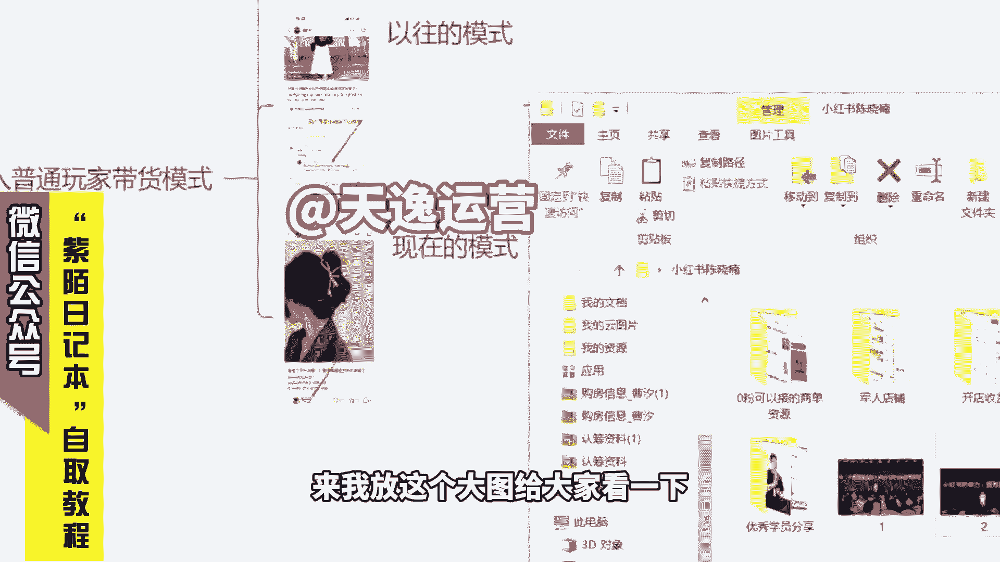

很方便，他的模式跟抖音几乎没有区别，就好比说今天我们看了这样的一个作品，一个卖手机壳的，但是小红书算很委婉啊，我们可以看一下。

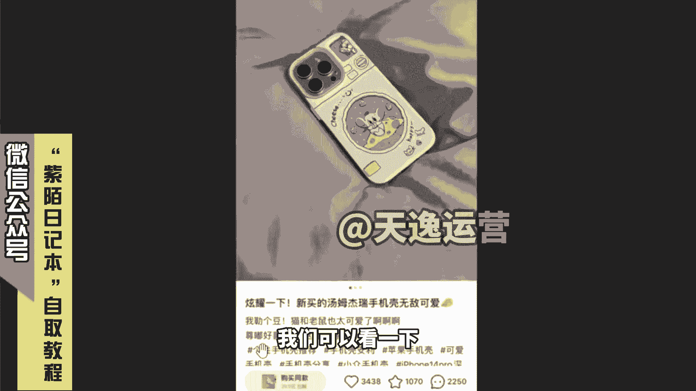

就这个卖手机壳的一个作品，他怎么写的，他不会告诉你像抖音一样，我告诉你今天我这个产品九块九包邮，买一个再送一个啊，赶紧进入直播间抢购，没有这种，它是什么啊，来你看炫耀一下新买的汤姆杰瑞手机壳对吧。

呃是不是他真的是他买的，不是我们通常会被这个标题引进来的吧，好像哦你真的在给我推荐一个好用的一个东西，实际上人家自己就是老板啊，他写文案把你先圈进来，这个小套路对吧，然后在左下角告诉你啊，购买同款。

直接点这个通道可以进入。

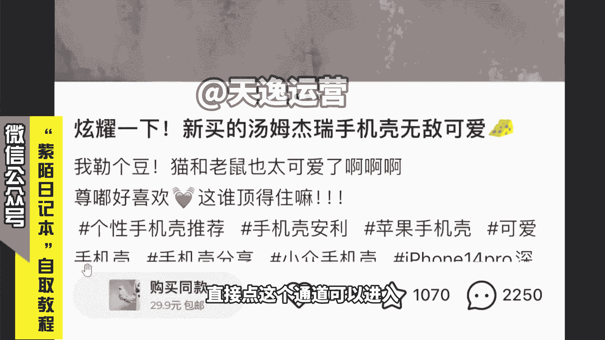

他就跟抖音的小黄车是一样的道理啊，然后进入到这个界面以，后，来你们自己看这个界面，熟不熟悉，小红书的购买通道，是不是跟抖音它是一模一样的对吧。

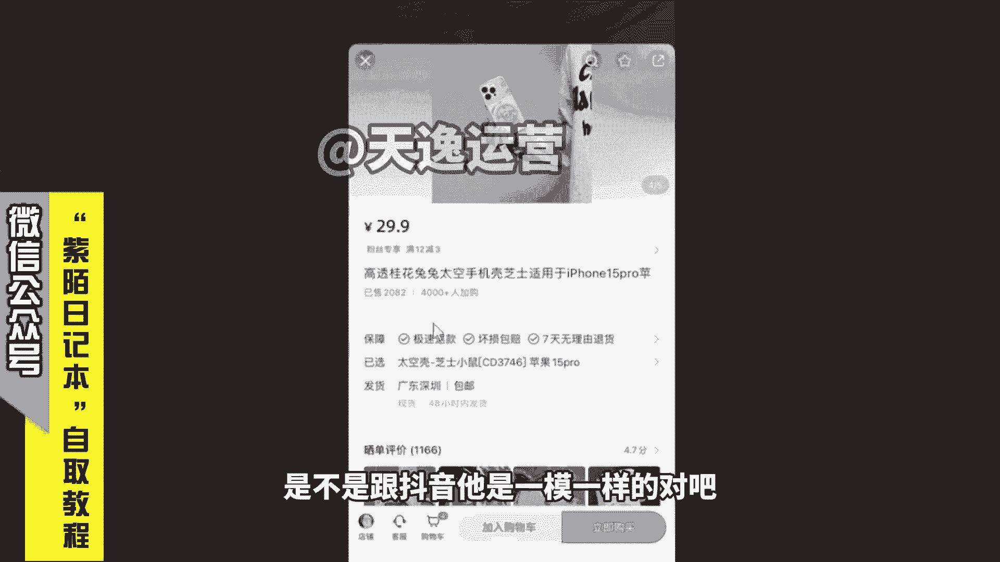

没有任何区别，一模一样的啊，来这里已售出产品价格等等对吧。

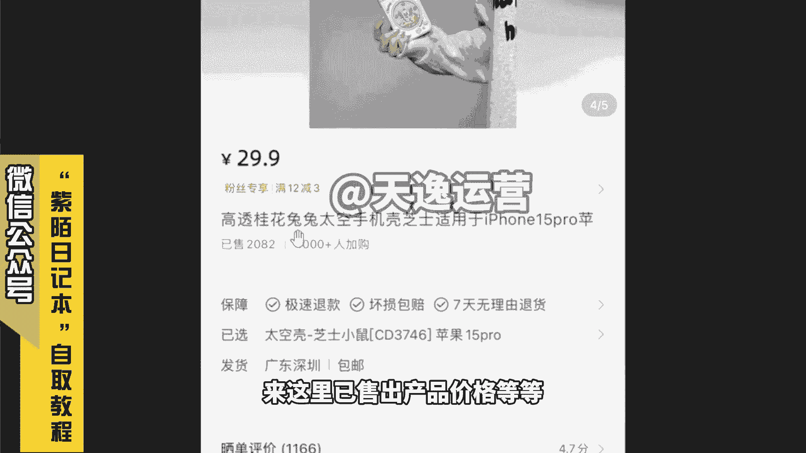

下面加入购物车，立即购买都是一样的。

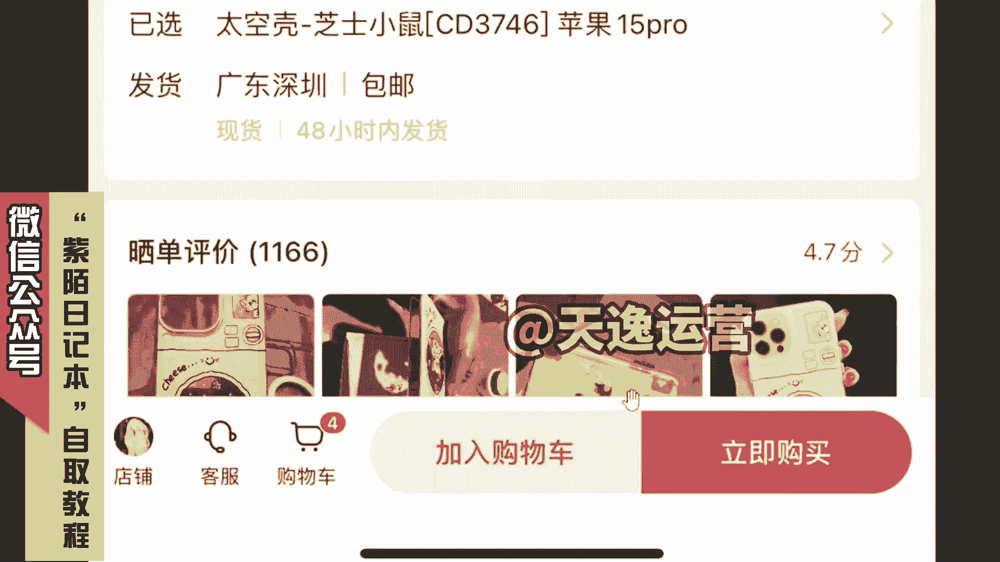

那么用户呢就可以直接下单，直接购买了，那么但是啊，小红书的产品通常比其他平台。

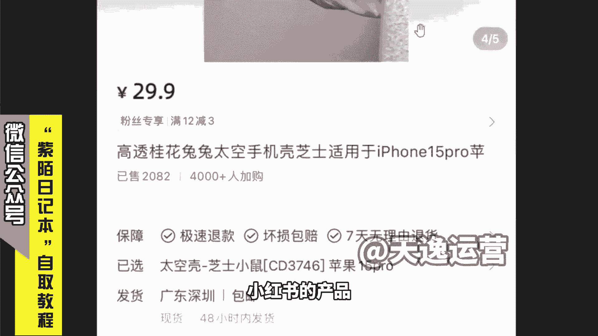

其实要更贵一点啊，但是用户并不会有这个想法，并不会因为价格高诶，他就不买了等等啊，刚才其实我们也讲到了这个，说到了一个抖音的这个玩法啊，抖音的这个方式，就是我其实说实话不太建议大家在做抖音。

因为我们像自己团队来讲的话，我们去年做抖音200多号人，去年年初的时候还有200多号人，然后我们缩减到80个左右啊，因为它投产比越来越低了，就相当于说如果你去做抖音，你不投钱的情况下没有回报。

而且抖音现在限流很重很严重啊，因为它的市场饱和的原因，太多人做橱窗带货了，导致呢，如果说你是个新号，或者说你的作品质量不是很高，不是原创内容，那么你挂了车就会被限流，挂了之后就被限流，因为太多了啊对吧。

但是小红书恰恰相反，你不挂车反而没流量，你挂了车，平台直接康康给你上流量啊，这就是区别，因为平台要靠你给他挣钱啊，要靠你给他挣钱，现在小红书做人很少啊，你今天比如说是今天我们听课的。

很多同学都不了解小红书，你在大街上随便拉个人，问问一下自己亲戚朋友了，不了解他，很多人不知道的对吧，那一个平台知道的人越少，机会越大，是不是，另外啊，小红书我们去做的话呢，要相当相较于来讲更简单一点点。

我们可以看一下他的一个素材啊，呃我们拿抖音的来对比一下，就说因为我们今天听课的时候，有同学也想说，老师会不会很难呢对吧，我做小红书这个作品，到时候我怎么去做呀，会不会很复杂呀等等啊。

同样的一个产品我们可以比较一下啊，然后这个视频的话是一个卖完美日记。

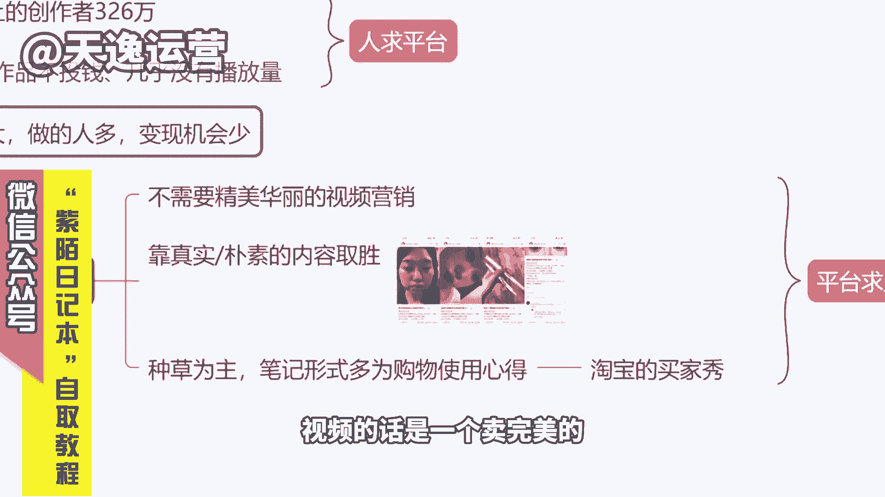

这个小小樱的一个卧蚕笔啊，一个美妆的一个产品，如果今天我们在短视频平台去做一个账号，你也许要达到这个效果，才能把作品才能把产品卖的出去，来，我们看一下啊，天呐这哪里是在画卧蚕，简直是在徒手捏卧蚕。

一笔两笔，三笔四笔，无论多少笔都不会手重，不会画脏，再用另一头的提亮轻轻画几下，卧蚕就蓬起来了，大家看到没有，这种是短视频平台，他的一个特点啊，因为人家要在两三秒之内，我必须拿个美女吸引到你。

如果说我第一秒我在抖音，看到是个普通的女孩的这个脸，可能我划走了对吧，我不感兴趣，因为美女太多了，就这个作品啊，她实际上那个带货能力不是很好，在抖音里面一个月才卖了500多个订单，卖了500多个订单。

为什么呢，因为作为消费者来讲，如果说我看到一个这么漂亮的女孩啊，我会被你吸引，但是我可能不会有下单那个冲动，因为我觉得你本来就好看对吧，你用完这个产品好看是应该的啊，但是我这么普通。

我用完你的产品能有这个效果吗对吧，这是作为消费者的一个想法啊，所以说他在抖音虽然说播放量高，但是带货效果不是很强，如果你们要做一个这样的作品，你最起码投入一个视频，找模特，找代拍。

800~1000块钱肯定是要的对吧，但是我们看一下啊。

在小红书完全不一样，其实小红书平台它的一个性质是属于哪一种呢，就是高端的买家秀平台啊，更高端的买家秀平台来我们看一下啊，这个是在小红书平台，一个月卖了3000多个订单的一个作品。

有没有发现他的这个女孩其实很普通，是不是在小红书你要放一个特别美女的，特别漂亮一个美女啊，反而可能点击率还不如这个啊，因为大部分的这个女生是想要去变美的啊，想要去改变的，那么他看到这个图之后。

对第一感觉很真实是吧，我们这二见钟情说了很真实的感觉，第二张图一看啊，化完妆之后变化确实很大，那我对你这个产品有兴趣，我觉得可能我化完也有这个效果，是不是，那你看几张图片，加上一个标题，加上一小段文字。

效果很好，小红书里面他没有说抖音那种几10万，几千万那种点赞的一个效果啊，3000多赞，1000多收藏，算是非常非常理想的这样的一个作品效果了啊，那么我们未来去做小红书也是一样的，我们有图片的素材。

加上取一个好的标题，加上一段对产品真正的描述，那么我们就可以达到一个带货的效果，你即使说我不会视频剪辑，那也一样是可以的，另外小红书平台现在很缺人啊，所以说我们去做的话呢。

相当于说你的第一个竞争比较小啊，竞争比较小，另外呢我们的机会比较大，当然在这里也给大家解释一下，什么叫做接广告挣钱呢，对吧，我又不是网红，又不是明星老师，你跟我讲这个接广告它现实吗，来我们看这里啊。

今天我们主要会讲的两个玩法，一个叫做商业合作，一个叫做我们的这个开店带货，那么第一个商业合作啥意思呢，我不需要你有10万20万啊，我不需要你有什么知名度，你只需要有1000个粉丝。

好来大家说我现在零粉丝，我没粉丝啊，待会上课我教大家怎么去涨粉啊，怎教你们怎么涨到1000粉来，当我们达到1000粉丝的时候，我们也能接广告，但是咱们接的广告不是10万20万的，我举个很简单的例子啊。

你今天不是接什么海蓝之谜，Sk two，香奈儿的广告啊，好比说有一个牙膏的品牌叫蓝天牌牙膏，我从来没听过不知名的品牌，小品牌对吧，那现在他想要打开自己的知名度，想让更多人认识到自己的品品牌。

他是花20万找一个网红给他做宣传，还是说我这样，我就我就找那些1000来个粉丝的博主，我每个人给你300块钱，我能找100个人给我发，每人我就给你300块啊，因为反正你粉丝不多对吧，我就给你300。

你也愿意发，然后呢，你去帮我宣传一下我的牙膏，一人我给三百一百个人去发，那这个时候用户每天登录到小红书，一打开蓝天牌牙膏，一打开蓝天牌牙膏哪个更划算，同学们哪个更划算。

但我觉得300是很低很低单价的一个价格啊，随着我们粉丝的增长，2000粉，3000粉，4000粉，不同的粉丝阶段价格是不一样的，三百五百七百一千递增的啊，跟我们的粉丝数量是有关系的。

那这个就是我们可以去接的广告，有好几个品牌是这么起来的，像那个呃分来这个来芬那个吹风机啊，现在抖音上很火，也是这么推起来的，还有呢这个像那个叫什么w i is的一个面膜，对吧，这些东西都是这么推来的啊。

它实际上本身没有多少市场份额，都是靠推广的人越多，把这个知名度打起来了，来这个就是我们今天可以去做的一个方向啊，我给你们看一下啊，就这个东西，我们实实在在拿这个后台给大家去瞧一下啊，你看一下像这个。

我看这个账号3000多粉丝来支持我们一个啊，我看一下这个同学什么情况啊，啊在物流公司上班的个同学，他是做了40多天的个账号，在小红书现在涨粉很快啊，然后你们看一下3000多的一个粉丝，对不对。

3345个粉丝数啊，素人是不是没有签约任何公司未签约啊，然后他的报价就是他接一条广告，二百四二百四啊，然后因为他的这里面的这个作品的话，他是这么想的，本身我跟他讲报价，你报三三百是完全可以的。

他说想打价格战，他就想自己报的便宜点啊，这个商家呢优先找他，所以说你看啊人家是一共接了就两个月以来，因为他没做多久，一共才做40多天，两个月以来接了44条，44×240块钱的话，大概是什么样的一个收益。

今天我讲的这个玩法是真正落地，就是你们也能做的是二百四一条的吧，这个价格啊1万块钱左右，两个月以来啊，如果说是之前做，不会说挣钱那么快啊，但是因为现在是流量风口，平台的单子多，然后平台的广告多。

所以说机会多，然后这个是一个包括像这个，你看1500多粉丝的啊，这个同学是才做一个多月时间，辽宁沈阳素人，你看也是现在黄金时期做号对吧，未签约任何公司都是普通人，直接咱们这可以看得到的啊，报价是300。

这个比较实在，想多挣一点的对吧，借了29条来，29×300，29×300多少钱啊，差不多在8000块钱左右，是不是，那这个钱大家想不想挣这个钱，想不想挣，对这个对这个项目感不感兴趣，感兴趣的话。

一会我们在下面讲啊，我们在下个环节就来教大家怎么去做这个商单，我们去讲这个玩法，这是一个啊，然后这是我们今天会讲的，第一个他是有门槛，必须1000粉丝啊，然后怎么去涨粉。

一会说第二个玩法的话是我们去开店，刚才我们有个同学叫彩华，好像啊，他说呃老师我没有货怎么办，我们今天要教大家这个玩法，第一个你说我没有粉丝啊，没关系啊，开店是不需要粉丝的，开店是不需要粉丝。

零粉丝就可以啊，零粉丝就行，然后另外呢，因为现在平台它是有个百万的一个，买手扶持计划，只要我们开了店铺，平台自己会主动给咱们推流量，那么你先开店，然后再去发作品，你的作品直接流量会比不开店的账号。

流量要更大，完全不用担心播放量的问题啊，这第一个，那么零粉丝我们就可以开店了，对不对，另外啊，我没有钱去拿货，没有钱进货怎么办，不需要啊，我们可以做代发，可以做无货源项目，就是我们去合作找产品。

找到商家之后，由商家直接帮我们发货，你只需要把他的产品挂在你的店铺就行了，找人发货啊，你把他的产品放到你的店铺，相当于说代发的形式，这个我们在后面也具体来讲啊，因为现在做店铺流量真的是非常夸张。

给大家看一下，这个是我们之前呃在这个中信银行做销售经理，就是推销信用卡的，然后他当时在做的时候，其实不算是最好的时机啊，因为这个是年前开始做的一个账号，他当时扶持不算多。

他是在这几个月开始这个店铺才慢慢起来的啊，然后你们可以看一下，他那个时候的一个单日支付金额，4554元，就是一天的，这个不是一个月啊，这是一天，然后呢昨日全天8000多的一个成交金额。

我们算他50%利润来讲，最起码是2000块钱左右的一个利润，对不对啊，所以大家做三个月的话呢，现在店铺单月的一个销售销售额是10万左右了，额达到10万级别的一个店铺了啊，你们到时候如果说去开店铺的话。

因为有这个百万买手计划，达到10万销售额，平台直接给你发现金奖励达到20万，30万，50万一样的平台直接现金奖励给大家啊，那我们如果说对这些感兴趣的话，具体怎么来操作，我们现在来讲啊。

好我们有赵怡慧同学说我发布的很少，点击率几乎没人，一会我来给大家分析啊，我们现在作为没有粉丝纯小白，什么都不会该怎么做，我接下来把没有流量，没有播放量，包括像甚至有同学说，老师我自己也去申请店铺了。

但是我那个店铺开下来，我店铺连人都不进啊，一天几十个流量的，特别可怕的啊，不知道该怎么办了对吧，我一会给你们来分析啊，一会来给大家解决，我们先讲第一个发布视频前的准备啊，我们先把这个注册账号的问题说了。

我前面讲过了，小红书上春晚了，他现在已经是让全国的人民在下载小红书，去使用小红书在打这个广告了，那么我跟大家讲，不仅是你们啊，现在绝对有很多公司，很多电商公司都瞄准了小红书这个风口了。

想要去批量注册账号了，那么所以说我建议大家，如果你想在这个平台多挣钱啊，你可以去联系你的父母，把父母的账号都拿来一起用，有亲戚的拿过来一起用，你不要说我只做一个号，做一个号收入有限啊。

你多做号收入是叠加的，所以说趁这个黄金时间赶紧把账号做起来，就跟抖音当时一样啊，做得早的呃是吧，草根都挣钱了，做的晚的你再厉害，没有办法，竞争太大了，蛋糕就那么多啊，不管你是男性还是女性，都是OK的啊。

来那么我建议大家，我们如果说还没有注册账号的，先暂时不要实名，为什么我跟大家说一下，有一点你们必须要接受，就是我们在做小红书的时候，他的起号是有概率的，比如说你注册了五个账号，对不对啊。

我就我就不算他五个账号，比如说我第一个账号啊，我就一个账号，然后你这个账号是不是百分百能挣钱，不不一定，你这个作品也许发的很好，很优质，但就是没有流量，那怎么办，这个号可以不要了。

如果我们等了两天三天播放量没有起色，直接注销啊，拿你这个手机号，隔天再注册一个新的账号，你也许你不断地注销再注册，不断注销再注册，差不多最多啊就五个左右，你肯定是能测出一个有流量的一个账号的，明白吧。

因为这个东西是有概率问题的，现在注册小数人太多了，平台的审核很严格，然后他是随机去推流量的，他不可能说每一个这个发作品人，我都给你推送啊，所以说他会有概率啊，那么为什么我建议大家五个账号一起做。

这也是概率问题啊，五个账号里面最起码起来两个三个，对不对，好剩下时间我再去测新号，就是这样的啊，所以说呢最好不要实名啊，因为你实名的话，要隔天才能注册新号，但不实名呢，你当天注销当天又能注册新的账号。

直到我们测出一个有流量的账号为止，然后嗯，包括像我们之前有很多同学是已经发过作品的，有没有发过作品的啊，你不管是这个变现作品还是什么其他的，自己的自拍啊，旅游啊，自己的小孩啊，通通隐藏掉啊，我跟大家讲。

你的账号千万不要删除任何一个作品，不要删任何一个作品，因为删了之后你的账号健康会受到影响，那么我们账号它其实分为两个属性，一个叫生活号，一个叫做商业号啊，今天我在课题图里面我也写了，我们要做商业号。

有价商业价值的删过怎么办，先发几个作品，到时候测下流量，如果流量不行，我们就注销啊，来跟大家讲一下生活号什么意思，就是你平时发的这个生活的内容比较多，那平台会直接认为你是一个用户，就是你是一个客户。

你是用户的这个角度，那么你的作品发出去，你发的再好，他只是给你推身边的人，或者说同城的人很难往外推啊，你的播放量是受限的，那么商业号不一样，商业号的推送是整个平台普遍去推，直接推荐页里面去推。

所以说这个是不一样的，那我建议大家啊一定要去养号，一定要去养号，然后这个养号怎么去做，来这样我我给大家总结一下吧，你们为什么没有播放量啊，我把这几个跟大家说一下，你们就应该更清楚来播放量，少的原因啊。

第一个首先你在注册账号的时候啊，就是我们在注册完账号的时候没有养号，然后直接去发作品，导致我们账户活跃度不够啊，平台认为你是机器号，或者说认为我们是营销号，认为我们是僵尸号，他不可能给你流量啊。

这个活跃度是不够的，然后第二个这个情况的话呢，就是嗯我们的账号属性没有转过来，账号属性问题啊，第三个作品内容啊，作品有违规额，这个东西的话，其实很多时候啊，有同学说老师我作品没有违规呀。

平台没有给我发违规提醒，他，只是因为你的账号已经给你限流了，他压根就不提醒你了啊，像这种账号没有接收到提醒，不代表你的作品就是好的，那这个内容违规是一个第四个啊，内容不好啊，就是你的内容质量不高。

然后还有一个你的品类，你要卖的这个东西，你要做的这个方向不是平台需要的，这些都可能导致我们没有播放量啊，都会导致没有播放量，来，我待会给大家讲一下，就是我们播放量正常应该是多少啊。

来我先说一下这个养号的问题啊，养号的话，其实就是等于说我们把账号活跃度提升上来，让平台认为我们是优质账号，然后给我们变现的机会，就像我刚刚讲的，如果说你不去养号，你账号没有活跃度，平台觉得我们是营销号。

对不对，那么他不会轻易的给咱们流量，那怎么做，现在有很多刷号的，我跟大家讲一下，很多刷号怎么刷，人家有自己的机子啊，就每天会自动去浏览作品，浏览半个小时就提升活跃度，但是这种机子刷号它是不能去点橱窗。

它就点不开购物车的，那如果我们之后想提升自己的活跃度，想让平台认定为我们确实是个真人账户，那么你就需要这样，你随便去刷视频，每天刷够半个小时，明天起啊，然后呢看到喜欢的不管什么类目，跟我们做的没关系啊。

就不管看到什么类目，你觉得还不错的，都去点赞评论，关注收藏，个别作品，最好是多刷一点带货的作品啊，然后到人家的店铺里面去浏览一下，到别人的产品那里去加点购物车，不用下单购买啊，就加购物车就可以了。

记住没有加购物车就行了，当我们有这个类似于真人的行为之后，那平台会判定为我们是健康账号啊，那这个时候即使说我的作品有违规行为，那么也没有关系，因为平台会给你发提醒，告诉你你的这个文章里面哪些文字。

或者说这个图片是违规的，请下架修改后重新再上传，那如果收到这个通知，代表我们的账号是OK的，是健康的，是还有机会挣能挣钱的，但如果说违规了，平台连提醒都不提醒，说明这个号没有用了，你就算他用了两年。

用了3年无所谓，我不要这个号了啊，我就直接注销了就算了，因为这个号他又不值钱，另外有一个很关键的点，因为咱们也知道啊，你要接商单，要接那种三百五百的广告，最少1000粉丝，那么很多人为了涨粉，快速涨粉。

他会干嘛发到别人评论区去啊，互关秒回这个东西千万别做，你做了一次这个号废掉了啊，我跟大家讲，千万不能这么做啊，因为现在平台对这个识别非常严谨，它跟抖音不一样，你但凡到别的评论区去引流。

这属于恶意引流行为，那么你的流量，你的粉丝如果说是从评论区来的，这个是无效粉丝是没有用的啊，这个是不可以的，我们的粉丝有效粉丝是什么，必须是用户，他在推荐页随缘刷到你的作品，点开你的作品。

看了你的作品之后，然后再点的关注，那么这个才叫有效粉丝啊，因为现在做的人越来越多，平台慢慢的专业化了，他对这个考核越来越严谨了，所以说这个我们一定要去注意啊，一定要去注意好，那这些我就说到这里啊。

那接下来我要也跟大家说一下，就是这种号，如果说你没有养号。

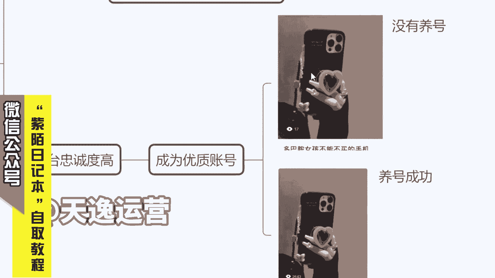

你的播放量也许就这样的，17个，看到没有同样作品，这是我们自己测的号啊，我们自己学生测的号一模一样的作品，换了一个号发，你看养过号的2000多就完全不一样。

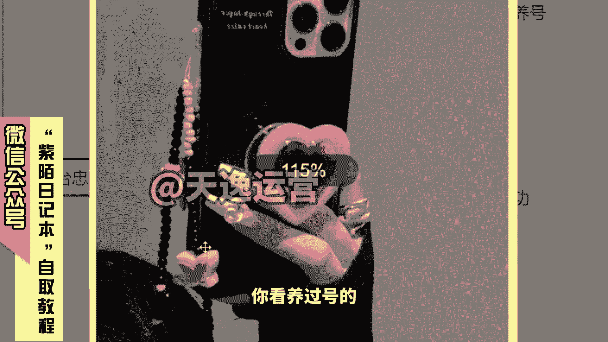

同样的内容文字图片改都没改，再发了一次，另一个号2000多了，一个播放量啊，2000多一个播放量是吧，是这样的啊，来那么这个的话呢就是属于我们一定要去做的，这个一定要去做的这样的一个行为，必须要养号啊。

想说老师我这个没有作品都有粉丝，那属于平台，有的时候估计别人刷粉啊，他那个错乱东西关注到你，那里去了，这个很正常嗯，我们很多这个新号刚注册完，隔天啊，这个连浏览作品都没浏览。

直接上来十几个粉丝都有这种情况啊，但这个粉丝是没有用的，就是我们的粉丝平台，在后台识别你的粉丝的时候，他只会识别通过你作品关注你的粉丝，其他都是不作数的，就比如说你2000个粉丝。

有效粉丝可能只有1700，是这样的啊，好那么我们怎么去测试这个账号，来给大家看一下啊，我们之后在养号完毕之后对吧，氧化完了以后啊，然后我们先发一篇作品，这个作品的话呢文字编辑好啊，认真去写。

然后图片呢我们真正准备好，然后去发呃，不过在这里呢我要强调一点，不管我们之后做什么账号啊，你上来的前两个作品，你不能直接表明自己是个卖家的身份，就像刚才我们看到那个卖手机壳的作品一样。

你要写的文案是这个东西是你买的啊。

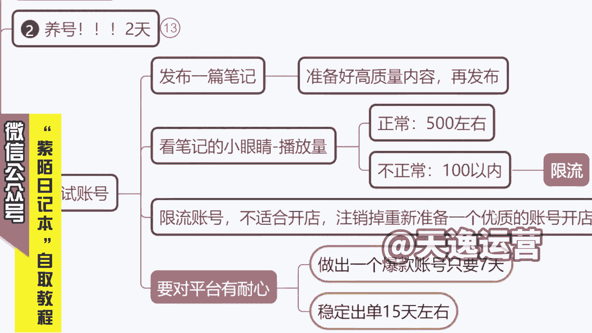

我买来的产品跟大家分享，我用的好用的东西，我来跟大家分享啊，你不能直接去发说啊，今天给大家分享一个手机壳啊，这个是我自己在卖的什么九块九，这个不能去这样做啊，前两个作品不要挂小黄车。

前两个作品只从分享者的角度去分享东西，不挂车，然后测完流量之后。

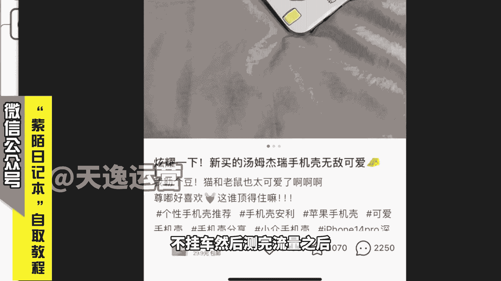

流量没问题，再开始挂车啊，来那么在这里给大家看一下啊，就是当我们在发了这个测试的作品之后，你等两个小时时间，两个小时过去了，如果说你的播放量在500左右，或者说更高，一千两千，那很好。

这个播放量算很正常，说明你的账号是正常有推流的，但如果说两个小时过去了，我们的小眼睛啊，100来个，70个80个呃，一一百七一百八都属于限流状态，都属于平台没有给你推流啊。

因为我们看到的这个100来个流量，他不是说真的有那么多人看了你的作品啊，很多时候是安慰性的一个数字，就是平台为了告诉你说啊，你这个作品是有人看的，安慰信给你镶了几个数字，不是真的有那么多人看。

所以说这个时候，我们的号都是属于限流的一个状态，就像我刚刚讲的号又不要钱注销了，再重新注册就可以了啊，这个东西因为小红书去测号的话，抖音的话可能你还得测两三个月呢啊，但是小红书的话呢。

它是属于说做一个爆款账号，需要七天左右时间啊，稳定出单的话，最起码15天左右的时间，15天左右的时间啊，来，那么同时呢我们在测了这个账号以后啊，我们发现你发的两个三个作品的播放量，都比较稳定的情况下。

那你可以尝试去开店，但是如果说我们发的两个三个作品，都是在100来个播放量啊，那这个时候我们就可以直接注销，然后再去注册新的这个账号了啊，然后呃因为是这样的，我们今天是两个直播间开课啊。

所以说公屏评论区可能问题会有点多，我不能说一一去回答，但是我拿个别也跟大家做个讲解呃，像刚才有同学讲到，说老师我有的是100多播放量，有的是一两千，这是什么情况呢，呃包括像有同学讲说。

老师我的播放量全部都在100多，但是我还在坚持发啊，呃这种情况的话，来这样啊，同学们如果说对自己的账号不是很确定的，我们可以下了课，把你的账号主页以截图的方式，然后发给你推课堂链接的那个助理老师。

我们的老师都很专业，下了课给大家逐个去分析一下好不好，看看你们的这个账号到底适不适合做，要不要注销，还是说可以继续做啊，你们可以下了课给助理老师发一下啊，但如果说你的播放量高，发的是生活类内容。

就比如说是你自己的自拍，是你出去吃了一个好的餐厅，那个播放量再高都不行啊，再高都不行，因为那是属于生活流量，我们要的是商业流量好，OK这个我们就过掉了啊，然后我给大家看一个。

我们之前一个学生做的一个号吧，跟大家讲一下啊，为什么人家的号能起得来，包括他之前为啥没流量啊，跟你们分析一下呃，我这个学生叫李继平，然后他是属于40多岁的年纪，没有做过抖音，没有做过小红书。

就任何短视频平台没有接触过的啊。

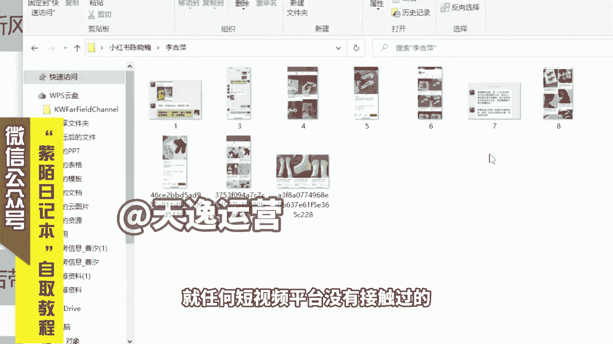

但是他的这个号现在能稳定，就一个月变现最起码在1万以上啊，给你们讲一下他的这个情况，他之前的这个作品，如果说有同学，你现在发作品没有流量，你也可以考虑一下，就是跟你的发的内容其实也会有关系，他是什么。

他内容实在是不好啊，因为这个审美是有问题的，当时我跟他有讲过，我说小红书的用户，其实更多是这种对生活品质有要求的啊。

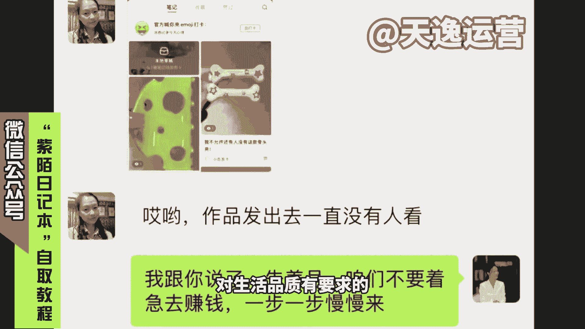

审美有一定要求的用户，所以说如果他去卖这个发卡是可以的，但是他去卖这种图案的发卡就不是很合适啊，就是不怎么好看，另外他找的这个素材拍得很随意是吧，没有什么呃稍微好看点的这个配色呀，地上就是地板。

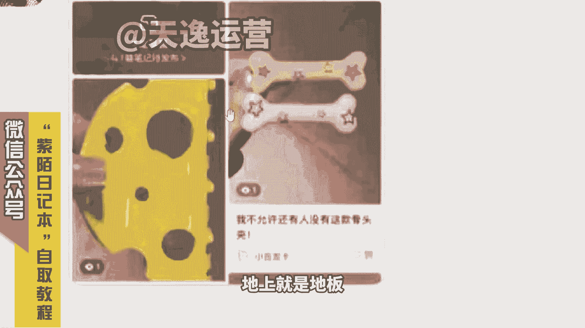

你要知道啊，我跟大家说一点啊，就他这个图，他这个视频当时发的，你看一个播放量是不是非常非常少，地上很脏啊，地上还有那种掉的头发。

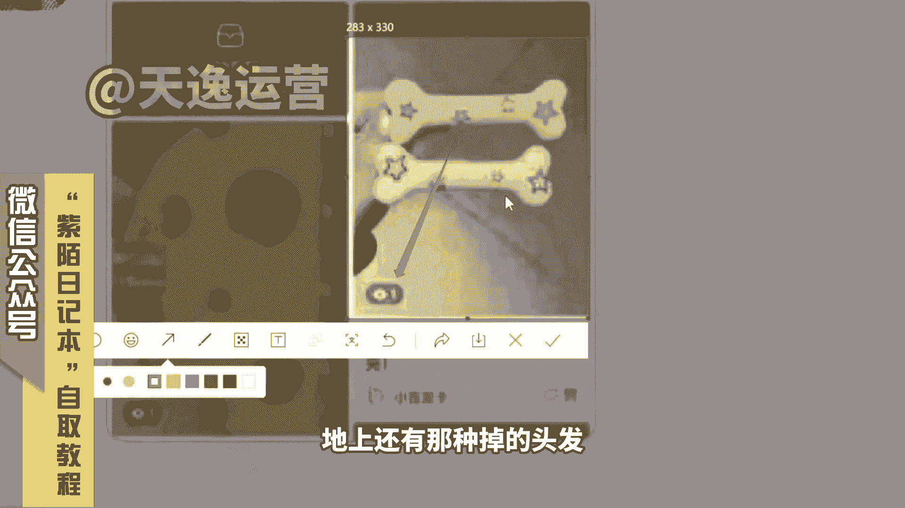

没有拖地那种脏的，你说这种作品发出去之后能有人看吗，没有我就跟他讲了，我说啊，但是我安慰我，没有直说委婉一点啊，我说先养号吧啊先养号。

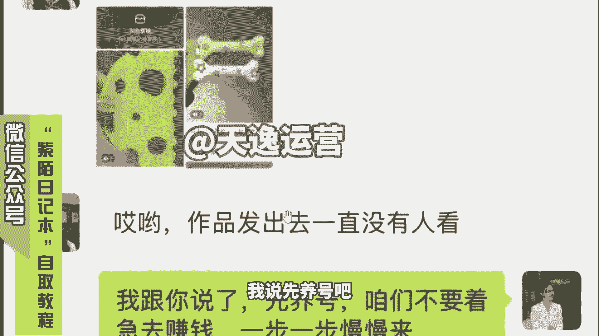

到时候再发，换一个号再发这个作品，因为这个作品实在是限流。

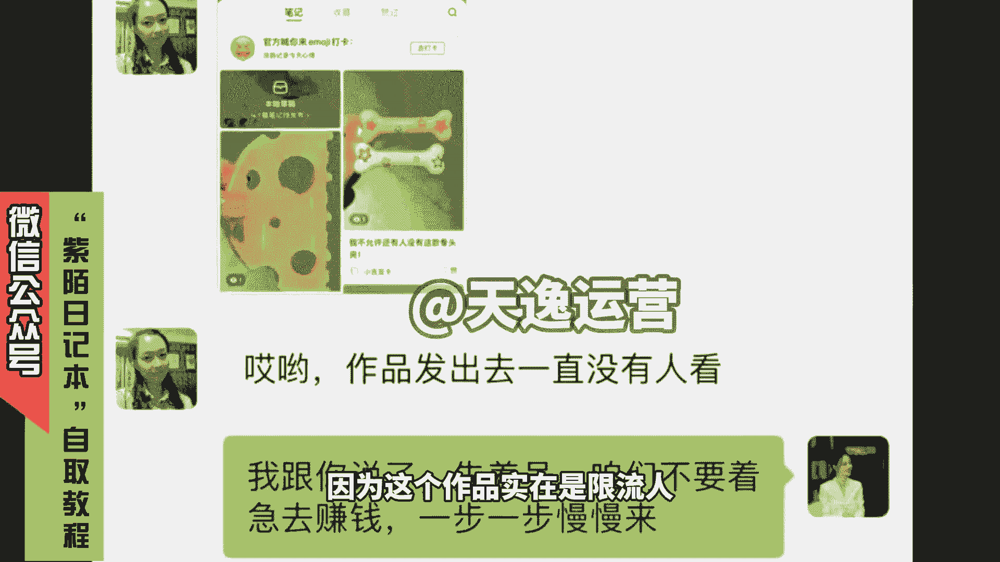

连人家连十几20几都没有，他就是一的播放量，然后后来让他换了以后，我跟他选了什么，我让他，我说你去做那种y two k的风格，就比如说这种很精致的发型，来看一下这种风格是吧，银色的布灵。

布灵的带带点小钻的这种发卡好，这些精致女孩她更喜欢，而且当时流行的一个元素叫y two k的一个风格，我说你换这些产品好，效果立马不一样，是不是同样是手拿这个产品，然后但是呢因为这个产品的颜值更高。

它的效果就更好啊，当然这个素材也不是他自己拍的啊，都是找这个品牌方去拿的来。

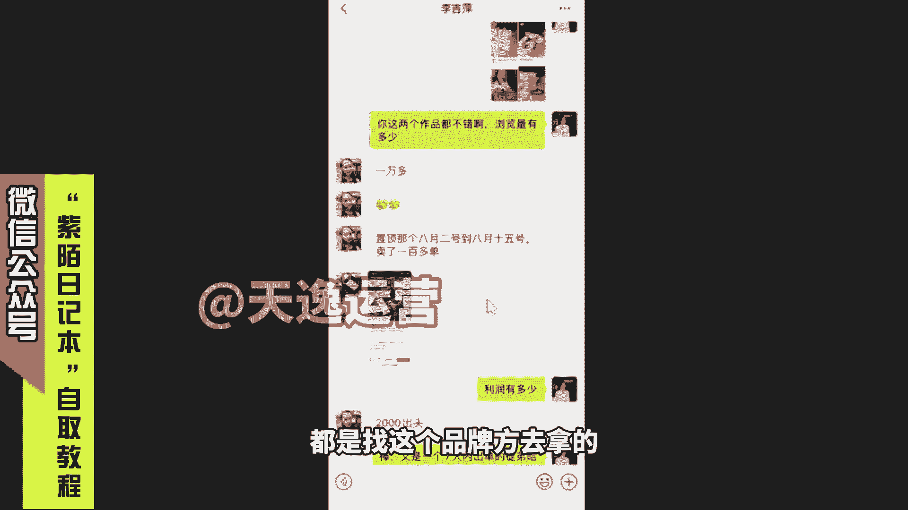

你看一下当时他13天时间换了产品之后，13天时间立马100多单啊。

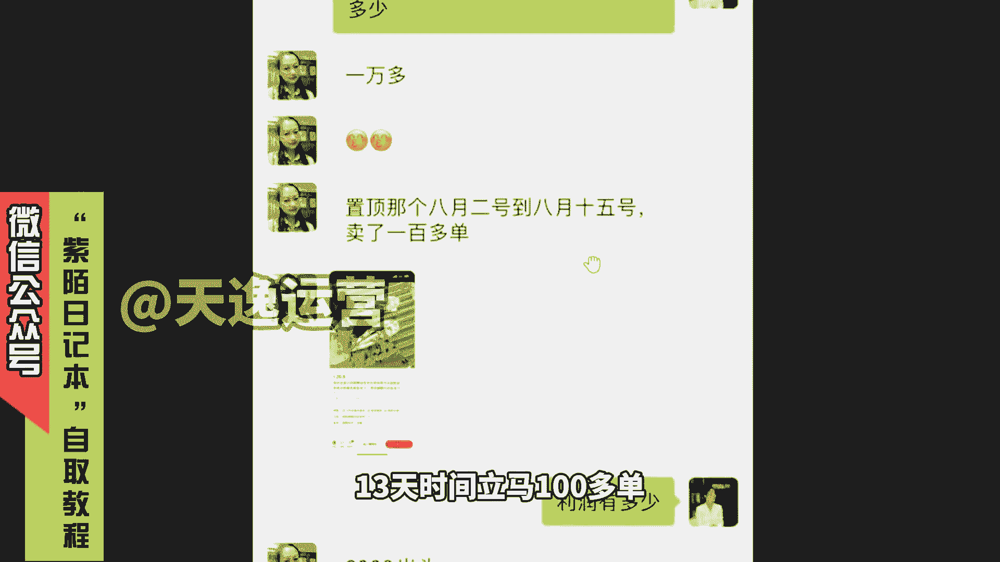

100多单那个订单这个脸啊，给大家看一下，26块九的一个价格是吧。

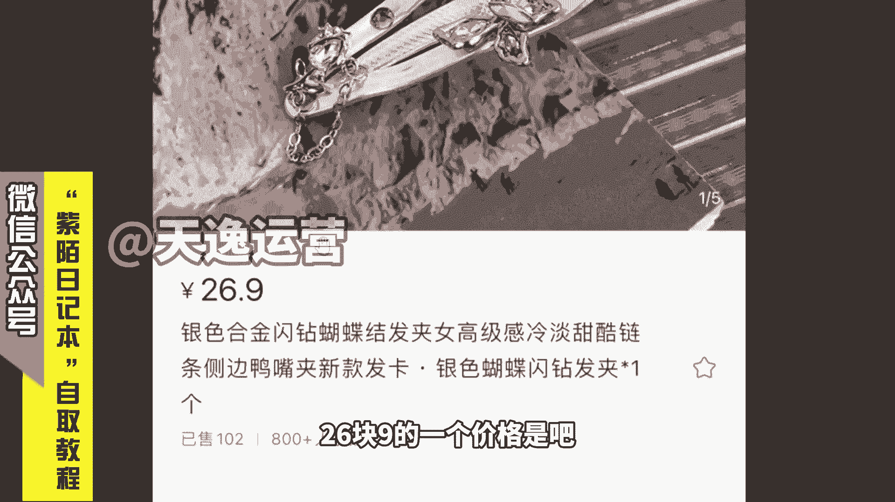

卖了102单，十几天的一个时间啊，那这个产品是怎么来的，然后包括这个产品拿货价多少钱，我也给你们看一下啊，像我们刚刚有同学说到说啊，老师这个货啊怎么办啊等等的，我这里呢先简单给大家说一下。

然后在后面我们讲带货的环节，我再详细说流程啊，首先第一个我们的货源问题，我推荐大家两个平台，一个是1688，一个是拼多多，但是呢我更建议后者，就是我更建议大家未来去找拼多多去合作，因为1688。

现在他的所有的产品呢是有点过时的，就他已经不更新了，拼多多里面本身是一个打价格战的平台，所以说它很多那个产品，已经接近这个拿货价格了啊，所以说到时候我们可以在拼多多干嘛，去找工厂店，找工厂店。

然后并不是说要你们在拼多多里面下单啊，我下单一个，然后联系那个小红书发货，不是，而是你找到工厂店之后去加那个商家的微信，然后跟商家去说啊，说我这个呃想跟您合作，我想做代发，然后我想卖你这边的货。

可不可以，一定是可以的啊，工厂店本身他们就是做代发的，然后给大家看一下啊，就是我们之后先确定好自己要做的一个类型，后面我详细说啊，现在我不讲不讲那么细，我先把大概的跟你们先讲一下，让大家心里有数。

然后那么我没有钱拿货怎么办，对不对，你不要去跟商家说啊，你说啊老板我没钱拿货，怎么怎么地，你不能这么抢，人家一听都不敢把货拿给你，你怎么说，你说因为我这边开店开的比较多啊，我是做矩阵的，我是做批量的。

所以说我们现金流啊没有那么多，先跟您签个协议吧啊签个什么协议，先财后富的协议，这个拼多多里面他都支持这个方式啊，这个叫先用后付，但是咱们签协议呢叫先踩后富，啥意思，就是我跟你签订好多长时间来结款。

比如说15天或20天对吧，那么我先把你的产品挂到我店里上去卖，我卖了一单，你这边给我发货，让你们的财务记好我的成本是多少钱，等15天到了20天，时间一到，我就把钱打给你，那这个时候你的客户也确认收货。

你也收到钱了，你就不会存在说我没钱去付货款的问题了，这个大家能不能听懂，这个都直接是在线上签电子合同，直接电子协议有法律保障的啊，谁都逃不掉的，那这样的话我们前期就不需要去投资钱啊。

这个对于新手来讲就比较友好了，对不对啊，然后像我们当时这个同学的话，他就找到左边那个商家，这里面卖的是六块六毛九，但他合作价格啊，私下沟通的价格是五块九包邮啊。

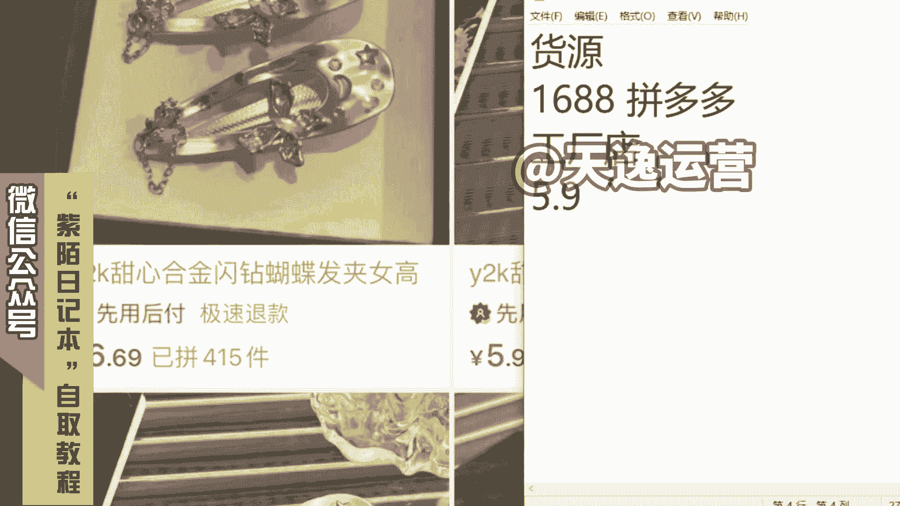

这个是包邮的啊，因为本身这个工厂价格很便宜，那你看它一个的价格是多少钱。

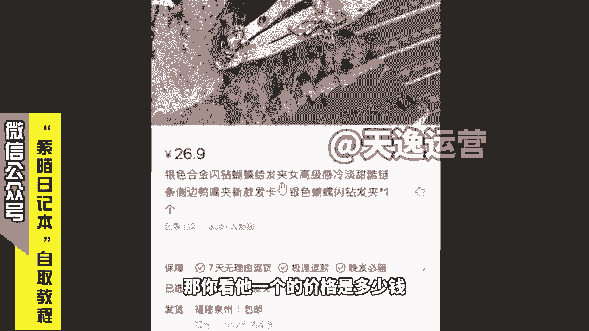

一个的利润多少钱，21块钱的利润啊，然后再乘以多少钱，再乘以这个呃，102个订单，相当于说他这个是2000以上的一个收益。

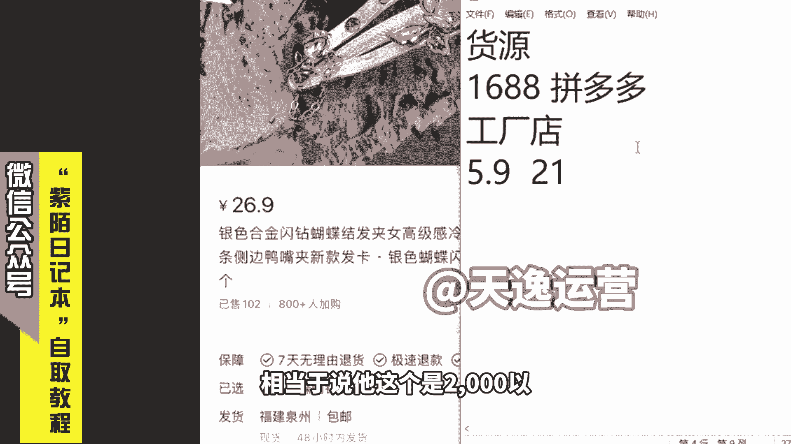

对不对，2000以上的收益啊，就光这一个产品的收益就还不错了。

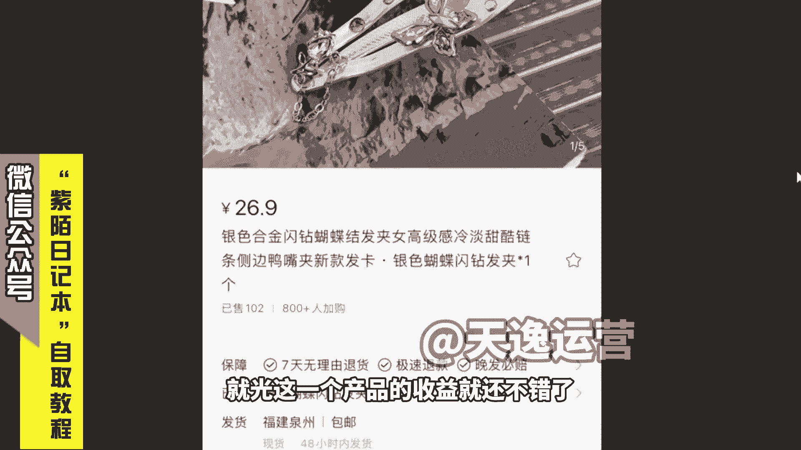

然后他当时第一个月的时候就挣了8000多块钱，就是做带货啊，他后面他因为他不止做这做这一个项目啊，之前也跟我讲，你看他以前是在图书馆里面做管理员，后来因为他帮呃帮着他女儿带孙女啊，然后呢他孙女经常生病。

然后她老请假就被辞退了，本身收入其实也不高，就2000多块钱一个月，他想着说干脆在家找点事情做啊。

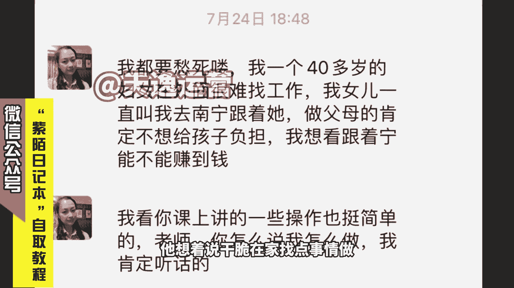

然后你看现在人家卖的啊，这不是现在啊，也之前的，你看这个发卡不同款式都在卖嘛，对不对，19块九八十九单啊，28块八，135单，24块五是吧，25单就这种几十单，几十单，其实它的一个利润加在一块也不低了。

然后他在第二个月的时候就已经上了1万4的。

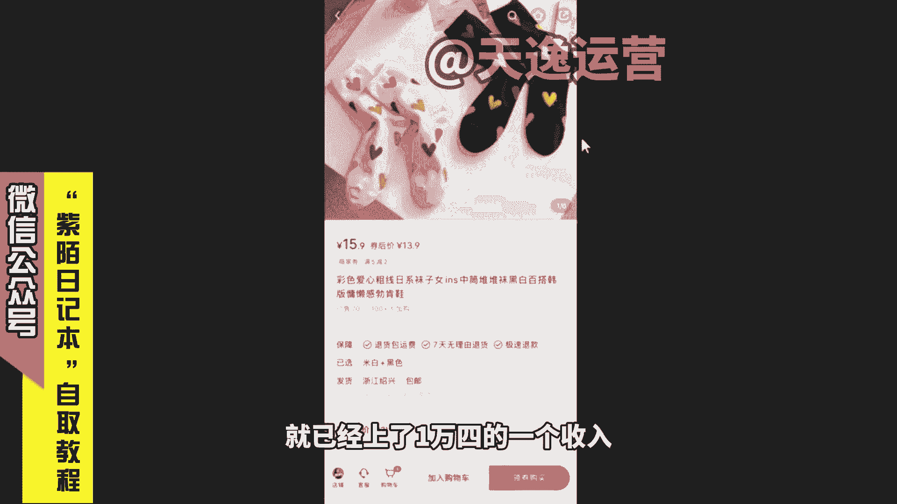

一个收入啊，现在还做了一号在卖袜子的啊，就这种，然后你们之后都是可以去走这个方向，因为开店铺我说实话他是最挣钱的这个玩法，然后现在我们也先讲这个带货啊，先讲完带货再讲商单变现。

因为商单呃我讲一下上单的优势啊，来钱快很简单，所以我们放在后面，说复杂一点的，我们先拿到前面来讲啊，属店带货就是开一个店铺，我们去卖货，这个对大家时间有要求啊，你最少一天拿两个小时出来做，有没有问题。

一天最少两个小时，没有固定说几点到几点啊，但是你中午比如说中午一小时，晚上一小时，那是必然的，肯定要的，啊没问题，那就行啊，呃我先讲一下，如果说我们做带货类的这个账号，因为带货类为什么我们要重点讲。

它是符合目前平台的一个叫做百万扶持计划的，你们可以看一下这里啊，我直接打开这个小红书官网给你们看，因为这个东西我光我嘴上讲没有用啊，我们要看平台的，你看这是小红书，千帆商城，就是他们的官方商城的后台。

然后在这个登录界面就直接写了买手时代以来，1000亿流量，助力买手和商家共同成长，就是平台是实打实真的给咱们推流量的，对不对，这个东西不能作假作假，人家不可能写在自己的这个官网首页啊，那罚款都得罚死啊。

所以说这个是实实在在真的给流量的，那么只要开了店铺啊，一定是能出单的，那么有句话叫七分选品，三分运营，就是说我们卖的这个产品的类型，他得是符合平台目前有的一个需求的，我上课以前有个同学问过我啊。

说老师我是宝妈，我能不能卖小孩的衣服啊，我不建议来，我给你们看一下，这个图我不细讲啊，这个图你们需要的公屏扣要子，然后助理老师后台拿那个数据统计一下，打了要字的，我们下了课自己对照那个网名。

去微信里面给大家去发一下这张图啊，打了要字的，我们下了课去给大家发一下呃，我教大家怎么看我这个列表啊，教你们怎么看这个思维导图，这是我自己写的，比如说像同行7600，那可以做，不算说特别大的竞争。

但如果这种你看T恤2万多个，是不是你说老师好多人卖T恤呀，我也卖，那就大错特错了，不是这个思维啊，而是卖T恤人太多了，我不趟这个浑水了，做的少的你去做啊，选择少的你去做，比如说睡衣可以，家居服可以。

对不对，然后呢啊像这种3C数码的，虽然说做的人多，但是你也可以做什么充电器呀，无线充啊，对不对，快充的那个数据线呢啊OK都可以啊，然后像这个项链的同行也比较多，然后爆款的这个概率又很低。

我们就没有必要了，在这里我自己写了三个啊，就是目前我们测流量特别爆的，一个是这个母婴用品，一个是百货用品和车载用品，给你们举几个例子给大家看一下啊，我拿几个产品举例给大家看一下呃，其实我们有句话叫做。

这个小孩的钱是最好挣的啊，其次是这个女性对吧，然后所以说我们其实就可以从这些角度啊，我们去考虑这些问题来给大家看一下，就这些啊，比如说像这个你看粘毛器，狗狗的这个东西成本多少钱，卖价36块九啊对吧。

你们看不清楚，可以横屏一下啊，因为我们这个图放大不呃，这个图放大不了啊，你们就可就得这个，稍微咱们这个啊斜一下看一下啊，然后这个36块九毛的一个价格对吧，我们真正他的一个成本价格才三块多钱，三块多钱。

所以说这个也是可以去变现的一个方式，然后包括这种手套啊，然后这个除毛器这个成本才一块钱啊，然后包括这边你看这个掏耳勺对吧，29块八成本多少钱，也三块钱，也是三块钱包邮啊，对这个是包邮就三块钱。

包邮的成本，三块九包邮的成本，23块九的一个杯，刷这个东西一块多钱的一个成本啊，因为像这种东西呢，它其实我们会觉得说好像快递很贵呀，我去菜鸟驿站寄个快递，12块钱啊，你要知道。

其实我们真正去合作了这个物流之后啊，很多小的不占面积不占体积的这个产品，他几乎无他几乎运费是跟我们直接省掉的，就五毛钱一块钱的这个运费都有啊，然后包括像这边，你看九块九的这样的一个盒子对吧。

包括这个剑麻的一个这个猫抓板，它那个价格49块九，成本十来块钱啊，成本十来块钱，还有像这个啊，像这种产品啊，有他想说老师，那我那边运费高，这个怎么去处理啊，我们之后去卖货的话，是不需要我们自己发货的啊。

就是我不建议大家把货囤到自己家里，然后你自己再发，这个是没有必要的，就相当于说我去卖别人的货对吧，我卖了他的产品，我今天把所有的产品的订单导出来之后啊，有这么20个单，那么他会有一个数据统计，每个订单。

他的收货地址等等，导出一个表格，直接甩给那个商家，让他安排发货就行了啊，发完货之后订单号发给你，你去填就行了啊，就是这样的，然后那么我建议大家去做的产品，除了我刚刚讲的这些就是类型之外啊。

就是我们得去考虑一个点，就是他的颜值高不高，我们不用管它这个东西有没有用，你就看他颜值高不高，因为像小红书里面卖的很多，像之前有个很火的叫LOY的一个那个呃摆件啊，那个玩偶是不是就那样的一个东西。

我说实话就韩国流行过来的啊，我觉得不是很好看，但是小红书里面很多人喜欢啊，然后还有各种带钻的呀，不灵不灵亮的呀，啊即使说它成本很低。

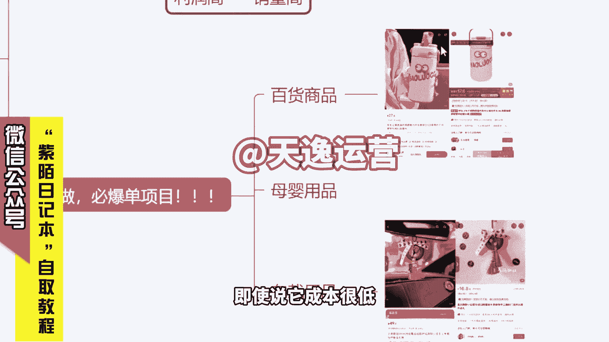

都是可以卖高价的，然后像这种水杯也是一样的，你看一下啊，就这样一个小眼睛的这样的一个保温杯。

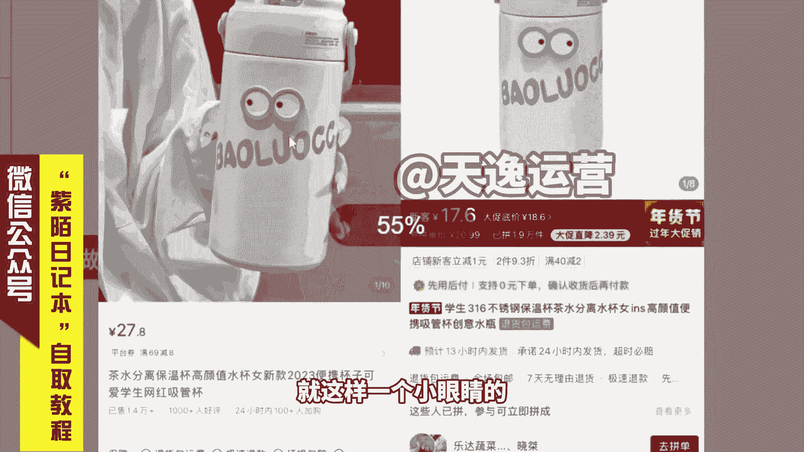

对不对，拼多多17块17万6啊，这边二十二十七块八的一个价格，包括在过年的时候卖的很好的，这样的一个车载挂件啊，拼多多里面的就16块八毛的一个价格，像我说卖49块八，所以说在小猪普遍普遍来讲。

它那个价格更高，另外包括像我们看到那种手机壳什么的啊，这个在淘宝啊，拼多多有这个两毛钱的啊，有两块多钱的是吧，有这个三块钱的小红书，都29块九，39块九，就这样的，就这种。

包括像我们其实很多时候在卖母婴产品的时候，发现很暴力一个东西啊，耐拼对吧，我这个成本我去拿货的时候，这个成本才18块钱，在小红书我甚至可以卖到160，180的一个价格啊。

这个就是我们挣的就是这个平台里面有收入，有收入，有这个高收入，或者说有消费力，有购买力的这群人的这个钱啊。

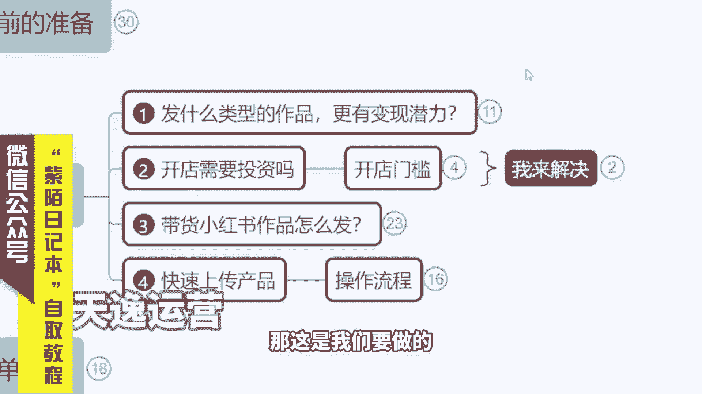