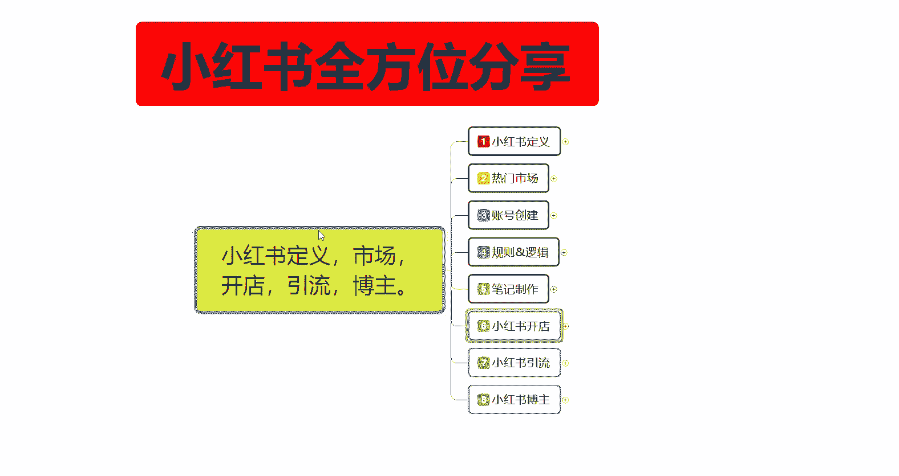
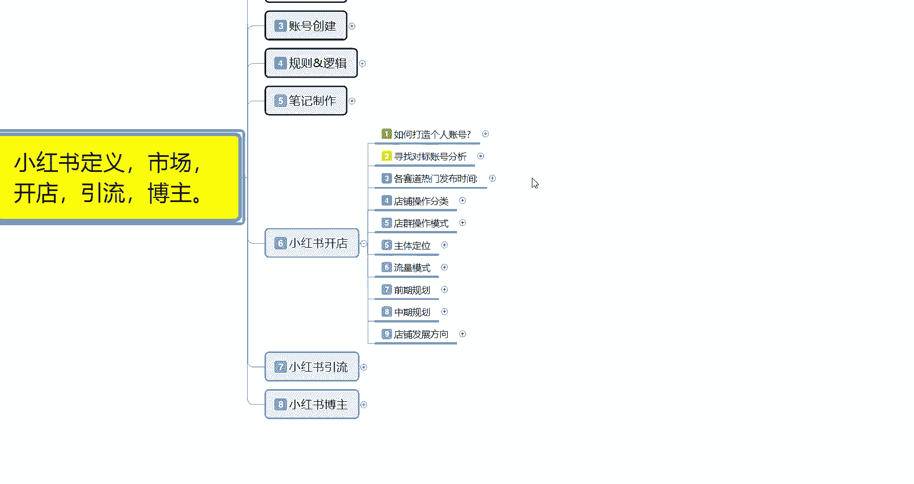
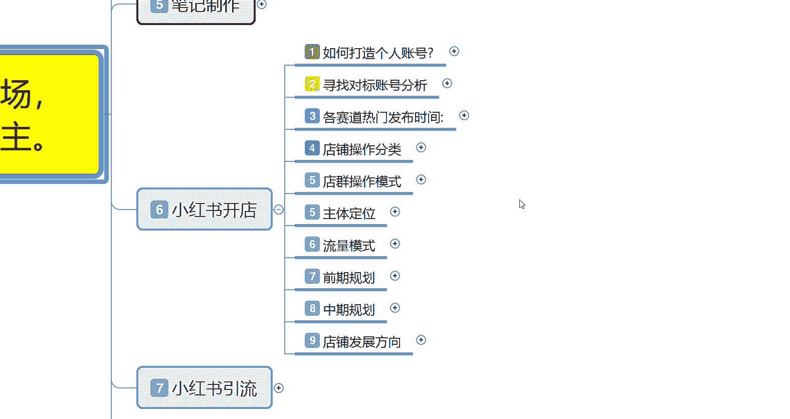
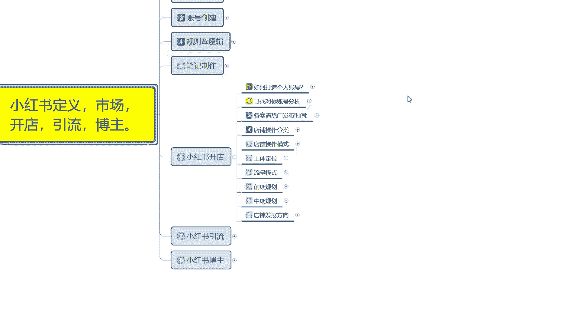
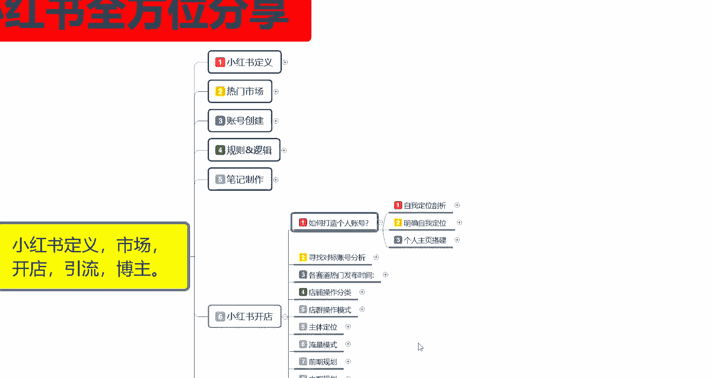
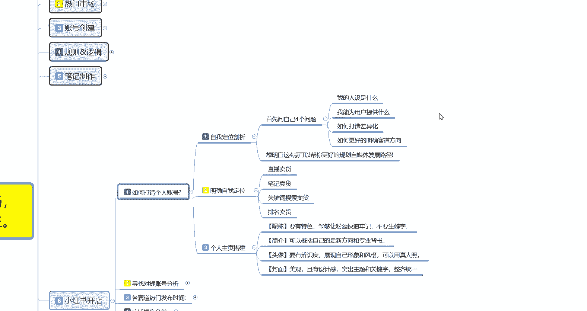

# 比刷剧还爽!!2024(全新)小红书运营网课，小红书运营大佬专为为学渣研制的小红书开店、小红书起号零基础保姆级教程，全程通俗易懂，纯干货无废话 - P20：19、小红书爆款店铺打造步骤（1） - 秋枫不入睡 - BV1AAtHebEvj

大家好，今天给大家分享的是小红书全方位整体分享的第六大课时。小红书开店啊。因为这一整套课程的话，前面五节已经讲完了。这节开始呢。给大家分享的就是我们小红书实操部分的一个整体内容。

首先呢是小红书的一个开店。

呃，废话不多说，我直接开出我们的个正常课程。小红书开店的话，这个说实话啊内容是比较多的。我给大家把它分了9个大点啊，9个大点里面的话，每个点位里面还有小点，需要我们自己个人的话，就是去好好研究一下。

了解一下啊。首先第一个点呢就是说如何打造自己的一个个人账号。因为你小红书开店的账号和其他的账号是不一样的。你账号的设置啊呃调整基本上都有有很大的区别，包括寻找对标账号赛赛道的一个热门发布时间。

店铺操作分类，店群操作的一个模式啊，主体的一个定位，然后流量模式前期规划总期规划，包括最后的一个店铺发展方向。我们都需要个人自己去好好了解一下。

我们现在看一下啊，如何打造自己的一个个人账号啊。

个人账号的话就是说你要明白三个点。第一个呢就是说我们自己的一个自我定位的一个剖析。第二个呢就是明确自我的一个定位。第三个呢是个人主义这主页的一个搭建啊。

做定位剖析是什么意思呢？首先你要问自己四个问题啊，你自己的人设是什么？我能为用户提供什么，如何打造差异化。然后的话如何更好的明确我自己要走的一个赛道方向，就是自己给自己先做个定位啊，通过自己的产品。

内容。去往后面操作的时候，你要去怎么做你的产品推广？对吧把自己的赛道明确方向，你要做低端、中端、高端三个层次阶段，你要选择他们的一个消费能力在什么阶段，对不对？那你因为我们你小红书开店的话。

你基本上都有自己的一个产品。你没有产品的话，那你就是。需要去那个一件代发平台自己去找这种的话，就是说一键代发的话，你在小红书上面做也可以做。就是白运工嘛，只是说赚的少一点。

然后你的个基础设施啊啊投入也少一点，就看自己怎么去明确自己的一个赛道方向嘛啊。想明白这四点的话，你就是说你自己后续的一个整体思路就基本上都有了，自己知道该怎么去做。只是说内部优化的话。

还需要去学习而已啊。第二个呢就是明确自己的一个自我定位。自我定位里面的话，就是说你是准备直播卖货，还是说笔记卖货，或者说是关键词搜索关键词搜索的一个卖货，或者说是你做关键词排名去卖货。这四种方式啊。

他们可以归纳为一体。但是你要选择一个主攻方向，什么意思呢？就是说这四个方式你都可以去操作。但是你要从里面选一个你自己认为自己能做好的一个主攻方向，你直播卖货，对吧？你自己有颜值有口才，对吧？

在小红上面你开个店以后的话，然后通过直播的方式，然后偶尔发一篇笔记吸引固定的一个粉丝量介绍自己的产品，在直播间里面直接卖就行了。这个是最简单的。但是他对个人素质和自己的一个口才要求是最高的。呃。

包括你的一个嗯直播间的一个设置啊，背景。你这个的话说实话你个人如果说以前在别的公司做过的啊，对这个有了解的可以。如果说你没有做过的，然后自己只有产品，那你在直播间卖货也可以，对吧？

介绍自己的产品还不会吗？那剩下的就看自己的口才呀，编辑能力，或者是账号的一个创建维护能力怎么样。第三个呢就是个人主页的一个搭建。个人主页里面的话就是名称、简介、头像、封面这几个点。呃，名称呢要有特色。

就是说能让粉丝快速的牢记你，就是你自己给自己取个别名。啊，别名的话，你的后续大账号也好，小账号也好，因为小账号你有时候的话要在评论区里面去进行评论，然后艾特的。因为你自己要知道自哪个是自己的号，对吧？

简介方面的话，就是可以概括自己的一个更新方向和自己的一个专业背景。什么意思呢？就是你自己是做什么产品的，做了多少年。对吧有什么历史文化传承啊。就是给自己包装一下。😡，基本上都在简介里面就给自己包装了。

除非你在直播间直播间的话，你就是口头自己给自己。啊，做一个完美的介绍。头像，然后呢就是说你的一个头像辨识度啊，尽量的话就不要用使用卡通头像了啊。小红书里面使通使用卡通头像，那是最笨的方式。啊。

你找明星照片，或者说找适合你个人的一个。呃，其他照片都比你用卡通头像要好。就是说最好的话就是说嗯怎么说呢？用证人照比较好一点。当然你需要有颜值，你颜值不好的话，你用证人照的话也没人看啊。

然后是封面封面的话，就是说你的一个背景图案设计，然后美观突出你的主题和那个关键字啊，整齐统一。就是说你的。页面设计里面，你们可以去小红书上面参考一下呃那些。呃，粉丝有个几万上十万那种账号。

他们的页面是怎么做的？然后你根据自己的一个需求量去设计一下自己的页面就可以了。就是个人主页搭建的话，就是你个人。个人面向小红用户能做到的一个最好的一个展示方式啊，你其他展示方式，你除了直播。

就是靠个人主页搭建来展示给用户你自己的一个形象，然后你自己的一个专业啊，能不能让用户认可，其实你的主页搭建的话就已经占比40%了。实在话，你的个人主页搭建就占比40%了。剩下的10%60%的话。

就是你自己的一个账号和你自己在评论区里面进行互动，和你笔记内容有关啊。互动占比说实话占20%，笔记内容占30%，其他的占10%。啊，但是个人主页搭建的话，基本上就占了40%。他能。

很多时候你个人主页搭建好以后的话，你不管是在抖音也好，或者说在小红书也好，你去看别人的那种大型网红，他对个人主页搭建的话都是非常有讲究的啊。这个呢就是如何打造个人的一个账号。好吧。

那这一节呢就给大家分享到这儿，下一节呢给大家呃分享一下我们寻找对标账号分析的一个内容。

