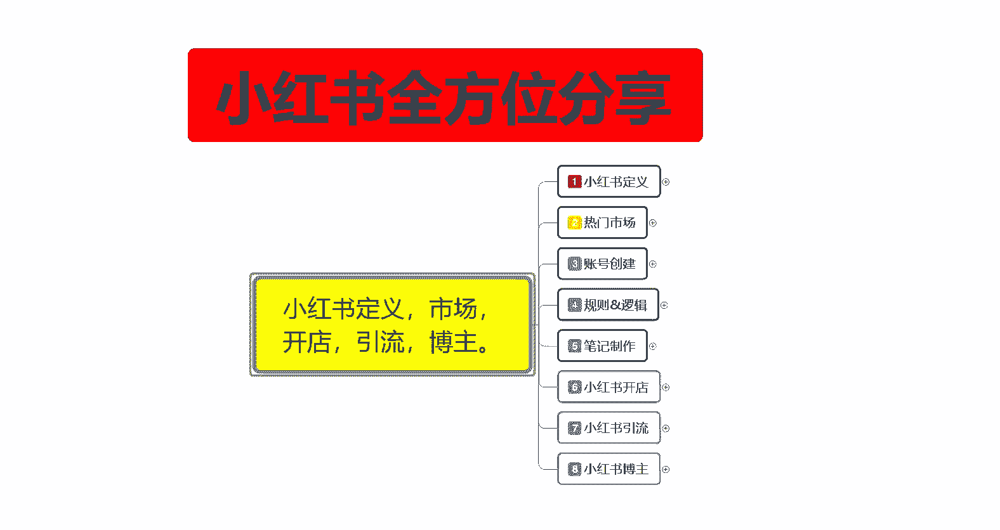
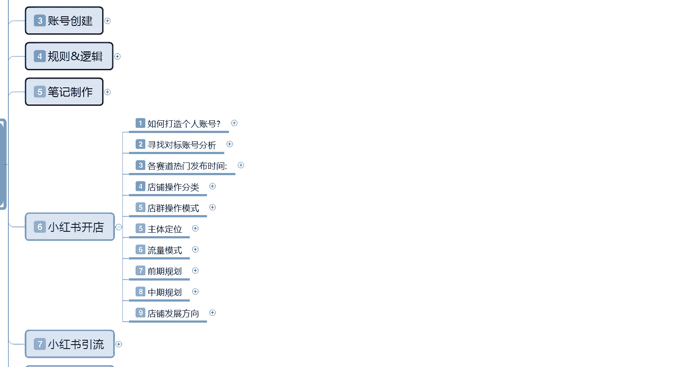
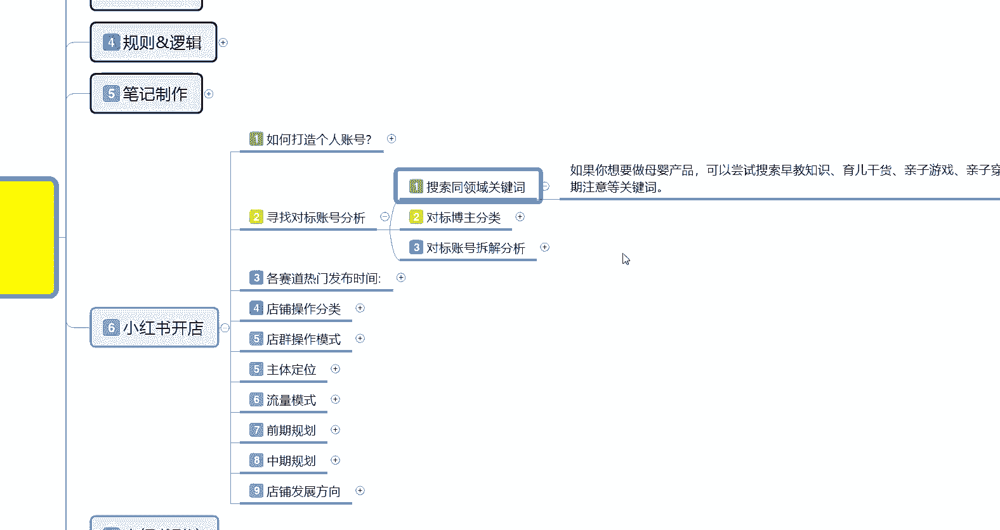
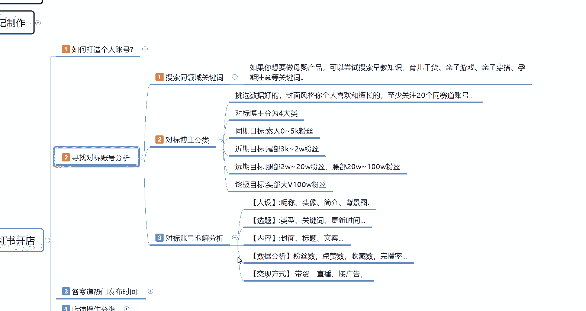
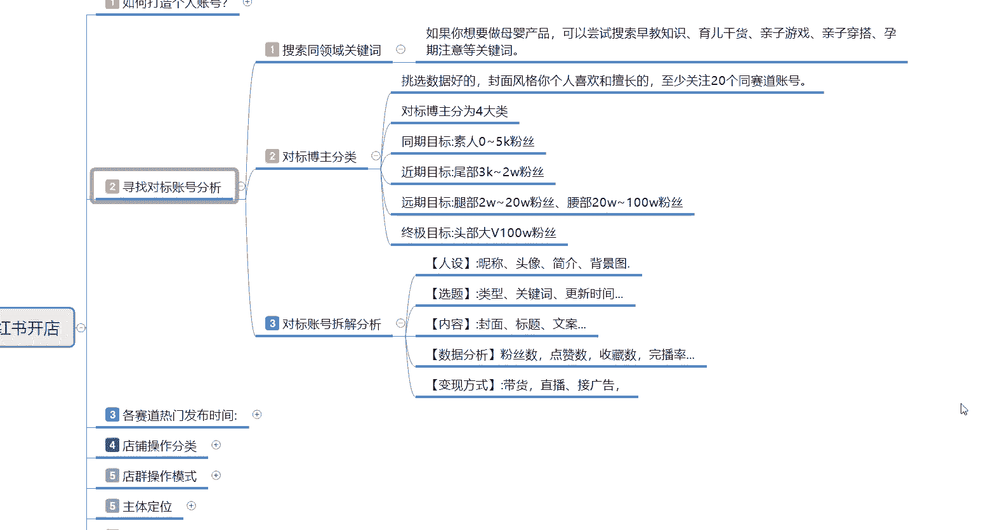

# 比刷剧还爽!!2024(全新)小红书运营网课，小红书运营大佬专为为学渣研制的小红书开店、小红书起号零基础保姆级教程，全程通俗易懂，纯干货无废话 - P21：20、小红书爆款店铺打造步骤（2） - 秋枫不入睡 - BV1AAtHebEvj

大家好，今天给大家分享的是小红书全方位分享的第六大课时，小红书开店的第二个内容啊。

这节课的话主要是给大家分享一下我们小红书寻找对标账号分析的。这个呢是做自己的一个呃账号定位，也可以用做。

内部定位也可以用啊。需照对标账号分析的话是分为三个点。第一个呢就是说搜索同领域的一个关键词，然后呢，对标我组分类。第三个呢是账号拆解分析。就说你不光要完善自己的用户，完善自己的账号，对吧？

你还要去分析别人是怎么做的。因为这样你去分析别人账号的时候，其实也是在变相的给自己在社区里面定位啊。把自己的定位做的更好，就是自己账号的一个定位圈中啊。首先呢是搜索同领域的一个关键词。

其实这几个点的话还是比较好理解的，只是说看我们自己怎么去。规划。搜索从领域的关键词。如果说你打个比方，就是说你要做母婴类的一个产品的话。

可以尝试搜索早教支持育儿干货、亲子游戏、亲子穿搭、孕期等注意的关键词，这些词汇都是可以用的，知道吧？只要是你的产品是往母婴这方面靠的话，都可以去做。你比方说你做服装的话，那你就是服装搭配，对吧？呃。

夏季穿什么服装，冬季穿什么服装，连衣裙连衣裙什么风格，对不对？等等，这些都是可以的。你就用关键词去搜。然后的话系统就会给你判定喜爱这一个类型的一个用户他就会把你分享到这个用户的一个社区里面。

就是系统自己给你判断的。然后的话根据你个人的一个喜爱，把你确定到哪一个呃社区范围，你自己卖什么产品往哪个社区选就行了。这个的话其实还是比较简单的，只是你们自己。呃，操作的时候。

很多人他不明白小红书他有这一个点啊。第二个呢就是对标博主分类。对标博主分类的话，可以把它分为四个大类啊，同期的一个目标啊，近期的目标、远期的目标和中期目标就是你自己想做到什做到什么样？小红书的话。

你觉得自己能做到什么样？根据你的自己的产品的话，自己去给自己定位。挑选数据好的啊，封面的话就是说呃你个人喜欢和擅长的，至少关注个20个同赛道的一个账号。什么意思呢？就是说你要关注20个跟自己一样的。

自己卖什么产品的？你比方说你卖呃母婴类产品的，那你就要关注20个母婴类的一个账号，然后的话去看他们的一个。账号信息，也就是第三点对标账号的一个分析。这个里面的话还有一个同期目标。

近期目标、远期目标和终极目标4个点。正常的话，我们都是同期目标选5到10个远期目标选7个左右，远期目标选个一个终极目标你暂时不要不要去定。因为他对你没有好处啊，就是说你只能选前面三个，同期目标的话。

你选个10个左右，就是0到5000粉丝的啊，相同内目的一个账号去看他们的一个账号设计。这种账号的话，你也不用过多的观察，瞅一瞅，看一看就行了。大概有个10个流行。

然后近期目标的话就是3000到2000粉丝的一个小红书账号。这里涨号的话就是我们主要针对的目标。因为你想我们创作小红书的话，你要么就是新从刚开始，对不对？那你选择目标的话，50到5000粉丝的话。

是给我们同期目标给自己增加权重的。近期目标3000到2万是我们要模仿他的，你要做的超过他发的内容比他好。那你看他的数据的时候，也可以从他这边往你这边引流的。远期目标的话。

说实话你2万到20万20万到100万粉丝。这种目标，你选一个偶尔去看一下人家发布的最新最热门的一个内容就行。为什么呢？找热门话题去发布笔记。啊，就拿他当目标啊，他是你的指路名灯，他最近更新了什么内容。

我要不要往这方面去靠啊，蹭点流量之类的。如果说你个人的一个粉丝数量突破到3000到2万的话，那你的终极目标你就是看这种大V往他们这边去靠。这个就是对标博主的一个分类，你自己分类好了以后自己去选啊。

同期目标什么意思呢？就是说你如果说你的粉丝已经超过5000了，对吧？那你近期目标就是你的同期目标啊，你相当于升了一些，你0到5000粉丝那种账号你就不用去管他了，对吧？那你如果说你的粉丝到达2万。

那你的近期目标的话，就是就是同期目标的话，就是2万到20万的一个粉丝。啊，你要往这个方面去想，这方面去靠，基本上对标博主分类的话呃，还是比较好操作的，只需要你自己拿小红书去呃。

花个两三天时间去做一下那个搜索，然后看看别人是怎么做的就行。然后对标账号的一个拆解分析是什么意思呢？你要分析你自己选择的同期目标。

和进期目标的账号进行拆分拆解。呃，同期目标的话，说实话这种的话你也可以不用去考虑。你要考虑的话是近期的一个目标，就是你要超过他的一个目标。分析他们的一个人设选题内容和数据分析。

就是这几个点我们做好以后的话，后续数据你才好做。不然的话你的一个后续数据的话不好做。人设里面的话就是升级头像简介，加我们的一个背景图。选题里面的话就是类型。

包括它的一个关键键词和他自己的一个小红书笔记更新时间，你们自己做一个那个。exel。啊，文档列表。把它那个更新时间列出来，基本上7个钻号的话，你每天花个。两个小时基本上就全部都能弄出来了。

很简单的一个步骤。你如果说熟悉以后的话，可能10分钟、20分钟，就是把目标列出来，基本上分析3到5天或者是7天左右，你就知道他的一个粉丝增长量和比例发放时间，然后对比自己的是有优势还是劣势。

然后进行修改就行。然后呢，就是看他的一个封面标题和文案，这个的话就模仿嘛，对吧？自己觉得自己做的不好就去模仿，自己做的比他好，你就没有必要模仿了啊。你不是什么东西都要去模仿的。

然后数据分析变形方式的话就是。刚刚跟大家说的那个做个excel表啊，自己去分析一下这种东西的话其实都还是比较好做的。就是说看你自己对对标账号啊，你想做到哪个层次，自己的话去把这些分析数据做好以后的话。

然后根据自己的实际情况再去更改就可以了。好吧，那这一节对寻找目标对标账号的一个分析呢就给大家分享到这。下节个课时的话，给大家分享一下各赛道的一个热门发布时间。就是你自己商品也好，笔记也好。

什么时间段发放啊，是最好的一个效果。那这节呢就分享到这里。

