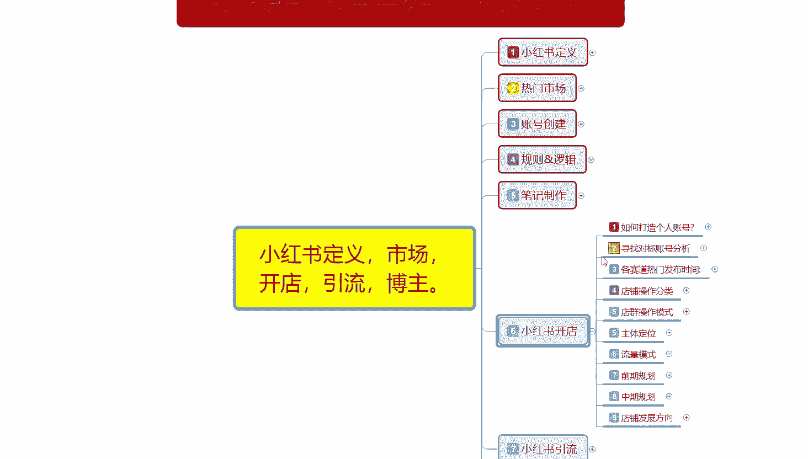
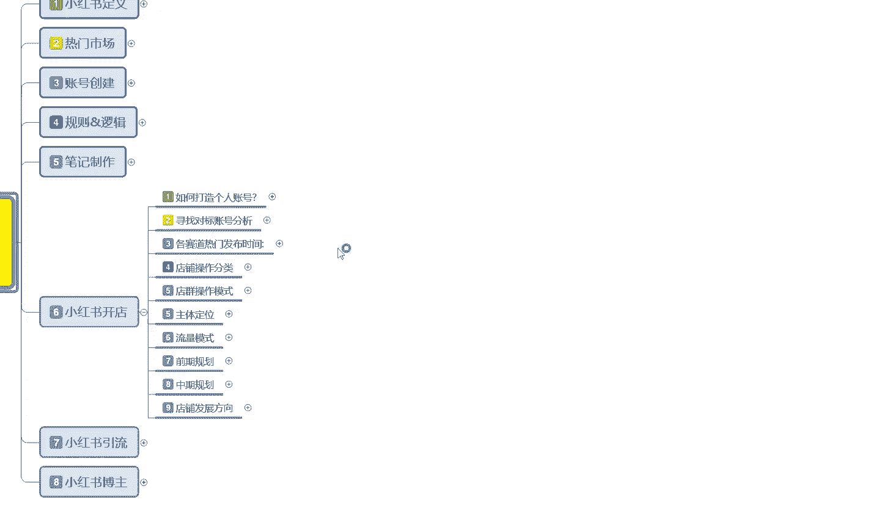
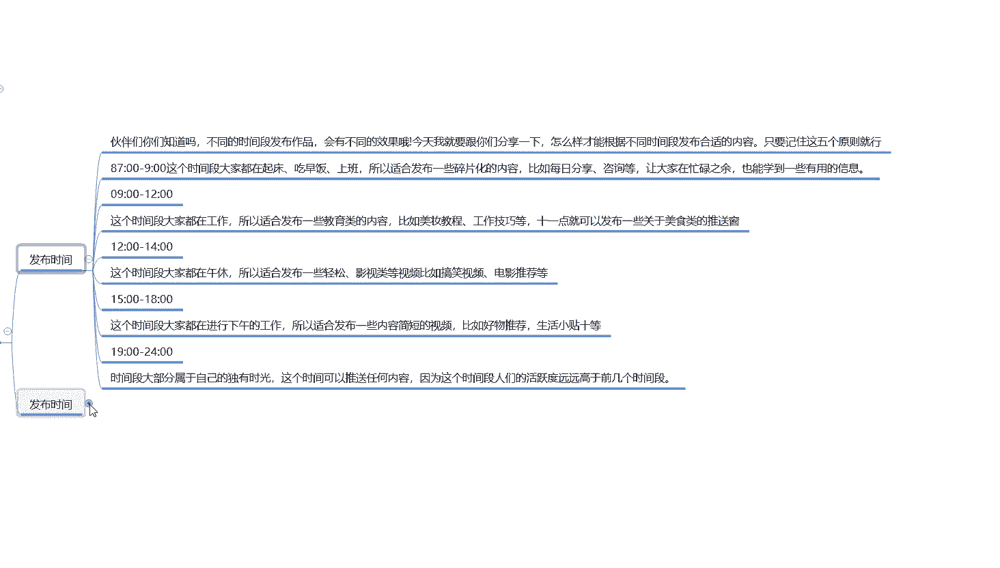
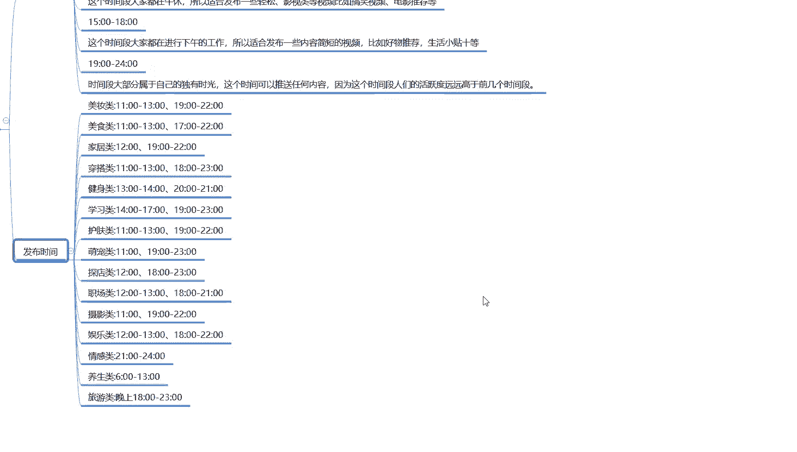
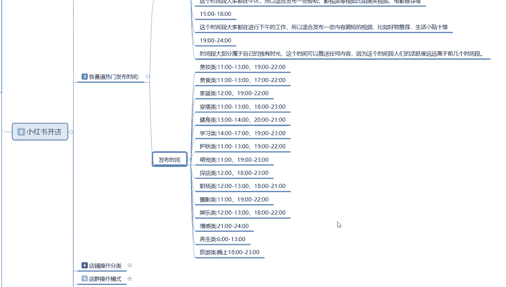
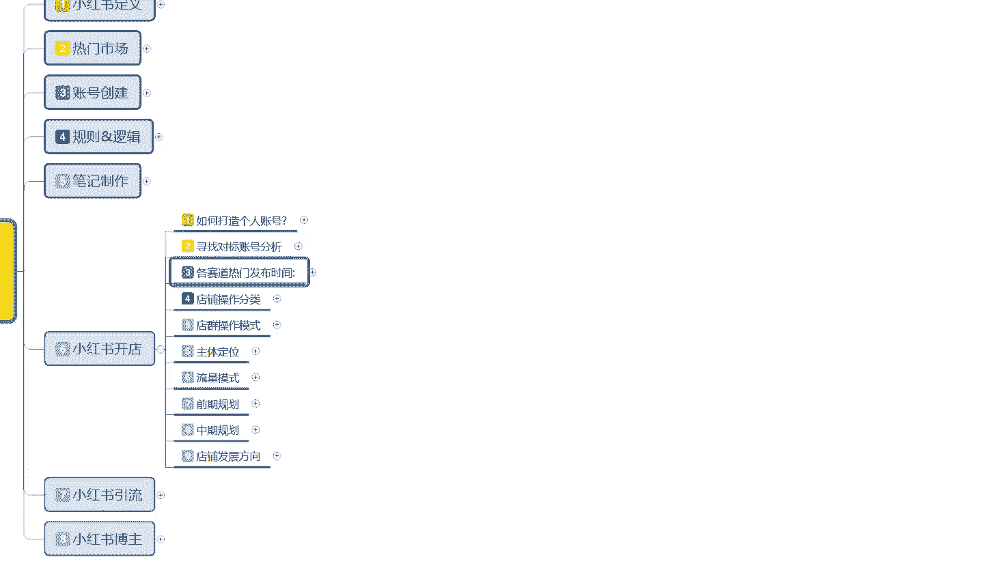

# 比刷剧还爽!!2024(全新)小红书运营网课，小红书运营大佬专为为学渣研制的小红书开店、小红书起号零基础保姆级教程，全程通俗易懂，纯干货无废话 - P22：21、小红书爆款店铺打造步骤（3） - 秋枫不入睡 - BV1AAtHebEvj

大家好，今天给大家分享的是小红书全方位分享的第六大课时，小红书开店的一个内容。

这节课的话给大家分享的是小红书开店的一个各赛道的一个热门发布时间。就说我们小红书，因为我给大家分享的小红书啊，我没有针对某一个类目去进行讲解。

所以说的话我把各赛道的一个热热门发布时间给大家把它列出来了啊，让大家了解一下。

首先第一个呢就是说这个发布时间是什么意思呢？就是让你们自己了解，自己去把控一下啊，我们。怎么说呢？你发商品也好，发其他的也好，基本上都是按照这种时间方式去走的。你如果说了解这个原则的话。

你就知道怎么去发。如果说你不了解原则的话，下面我会给大家分享一下那个每个类目的啊，就是你要做什么呃，什么时间段去发就可以了。按照这个方式走的话，基本上是没有什么太大问题的。

然第一个呢就是说嗯不同的发布时间段的话，发布作品会有不同的一个效果。主要呢就是跟你们分享一下，根据不同的时间，结合我们自身的一个产品进行发布以后获得的一个整体效果。第一个呢是早上的7点到9点。

这个时间段的话基本上都是刚起床的这个时时间，包括上班，所以的话。你不要在这个时间段去发布小红书的笔记。这个时间段发布小红书的笔记的话，说实在的你针对的就是一个。起早床的，但是说实话对于女性用户来说啊。

7到9点这个时间段基本上都还在床上睡懒觉啊，这个时间段的话，你无非就是工工作起来以后啊，男性工作起来以后，或者是女性工作起来以后去上班的路上，就是这个时间段，你发其他的作品是没有什么太大作用的。

他无非也就发一些日常啊之类的东西，这类东西对我们账号来说的话，基本上没有太大作用。我们如果说选择这个时间段去发送笔记的话，那你肯定是收不到效果的啊。

你如果说想笔记小红书笔记发出去以后获得一定额外效果的话，那你最好的时间段的话，就是10点以后。或者说是11点以后，这个时间段的话，效果是最好的。你11点以前发布的话，你只能发布一些碎片化的一个信息量。

然后的话通过早上有些人有些朋友或者说有些女性的一个用户，他会在早上呃出门起。因为工作的时间段啊，他会偶尔去看一下，因为这种的话没有太大的一个吸引力，而且他的人群不是特别精准。

你就算在这个时间段发了以后的话，你的笔记直接给你推广投送了以后，你可以抢占大概7到9点。这个时间段的散状用户，它不适合你去做笔记的啊。你做引流，你做网红或者说做店铺，你在这些时间段发的话。

基本上都不会有太好的一个效果。你如果说是个人账号，想随便玩玩的话，发点随便化的一些信息。这个时间段可以。那你如果说真想做大做强的话，那你这个时间段发笔记，那就是浪费啊，浪费小红书给你的一个基础曝光流量。

第二个呢就是9点到12点，这个时间的话基本都是在工作。你如果说这个时间段发的话，呃，比较适合发什么内容呢？就是教育类的。然后美妆教程工作技巧。就这个节点啊，因为在这个时间段去观看小红书找这些资料的。

基本上都是。上班摸鱼的啊，他们的一个资金需求呢就是说呃。怎么说呢？就是说他们的一个购物信息啊，或者对于新事物的一个学习的话，就是算白摸鱼。然后的话没事去学习一下，然后看能不能提升一下自己啊个人的外表啊。

内在的一个文化呀等等。所以说在这个时间段去发的话，你包括下午2点到5点之间也是比较适合教育类的啊。你就是发表一些有用的一个实在性的一个信息，或者说是搞笑内容的一个信息。啊，消磨时间，要不就学习。

要不就消磨时间。就这两种。如果说你要发产品卖货之类的话，这个时间段也不好弄。第三个呢就是中午两2点到12点，这个时间段啊就是12点到2点之间。这个时间段的话基本上都在午休了。

就是说所以适合发布一些轻松的，或者说是附带产品的，你就已经可以慢慢的去在这个时间段去发了。因为它属于一个浏览高峰期。呃，早上看小红书比较感兴趣的内容，中午或者感觉自己缺什么，他可能就会去买。

最高峰的时期的话，基本上都是下午5点开始，一直结束到晚上9点钟左右。下午3点到6点之间，这个时候是一样的啊啊比较发布一些简短的一个视频呢等等之类的。它和早上的这个9点到12点基本上是没什么太大的区别。

时间段的话就是说呃每个时间段他每发发送笔记过后获得的一个流量和曝光，虽然说是一样的，但是它持续引流的效果和对应的人群是不一样的。这个你们要把它弄清楚。晚上的7点到12点之前，说实话，小红书女性用户的话。

你基本上到12点你就没有什么太大的一个女性用户了。如果说你往12点后靠的话，基本上小红书正常的一个女性用户交流时间基本上在10点钟左右就已经开始慢慢的消散啊。10点以后的话，要不就是夜生活。

要不就是得睡觉觉。就以说7点到10点12点之间，你要根据自己的一个情况去判断自己能不能发送这个笔记。但是。正常的话，一个账号每天是两篇笔记。这两篇笔记获得的一个引流效果是最好的。

虽然说同样的一个技术曝光量，但是你针在某一个时间段针对的人群不一样，你获得的点击和评论啊也是不一样的。你比方说你在早上发的时候，那你获得的一个点击肯定不会太高。因为那个时候的话，早上都是刚起床，呃。

精历。虽然说很集中，但是他不会在集中在这个上面去专门搜索他所需要的一个内容。一般搜索他所需要的产品的话，就是在他课休息的时候，有时间完完整整的去了解。这个时候成交率也是最高的啊，包括点赞关注啊。

或者说有后续内容更新啊，做引流啊，基本上都是在这个时间段的。你如果说在那个9点到12点或者下午的3点到6点之间去操作这个的话，基本上很少有成交的。除非是公司需求啊，才有可能，不然的话基本上秒。

这个就是让大家了解一下，他不是。针对类目的，它是针对所有类目啊，针对所有人，你根据自己的产品去判断的。只是说每个时间段所需要的一个需求量不同。有可能的话你卖的产品比较冷门。

就需要碎片化的一个用户了解你的信息。那你也可以在早上或者说是在用户工作时间。

去进行发布。下面这一个呢就是我整理出来的呃比较适合小红书。热门时间段了解的就是每个。种类啊就是每一个类目我们发布。小红书作品的一个笔记，比较优异的一个时间段。美妆队的话就是11点到1点。

过了一点以后的话，基本都午睡了啊。第二个时间段的话就是晚上的7点到10点之间，美食类的话也是一样的。它有很多的话都是控制在这个时间段。但是因为你们的社区不同的话，所有搜索所的结果也是不一样的啊。

这里我就不一一给大家做介绍了。大家可以看一下。然后的话针对自己的一个类目，或者说针对自己想做的内容去判断你在什么时间段发送笔记是最好的。还有一个点啊，笔记发送的时候，你可以卡前5分钟或者是卡后5分钟。

什么意思呢？卡前5分钟，就是比方说你是做美妆类的。你要在11点到1点之间发，那你卡前5分钟就是10点55。去发笔记，然后的话有一定的曝光以后，点击率如果上来了，那你往后续的话，它会给你额外的曝光。

刚好你额外曝光的时间呢，又是在高峰期里面啊，点击率就会持续增加。如往后退5分钟是什么意思呢？就在11点它系统更新以后，你别有的数据，它已经更新了，人群是慢慢进来的，它不可能一次性曝光进来。懂意思吧？

他虽然说是在11点开始慢慢的集结，但是它正常曝光基本上都是开始5分钟以后，流量高峰期人群人气起来以后，你去抢占这个高峰期的流量获得的这个曝光。它的一个点击率也是非常可观的。但是需要你产品质量非常好。

不然的话，建议大家是提前5分钟去发啊。所有的类目都是一样的，就是要不提前5分钟，要不推迟5分钟去发。这样的话抢赞的时获得的一个曝光点击率会更高。这个就是各赛道的一个热门发布时间。同样的啊。

这个这个内容说实话，它不针对于小红书开店，也包括做引流也好，你做网红也好，它基本上都是这种。

那这一节课分享呢就给大家分享到这。下一节课的话给大家介绍一下啊呃小红书店铺操作分类。因为小红书店铺的话，它的分类形式其实是有好几种。

