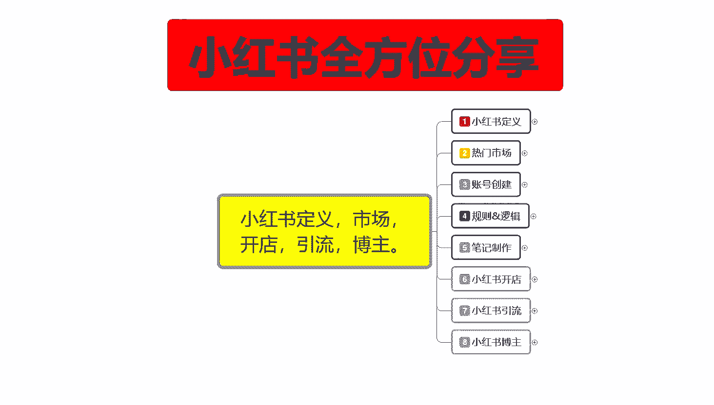
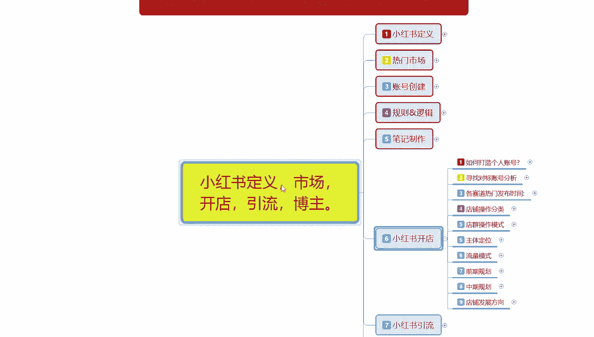
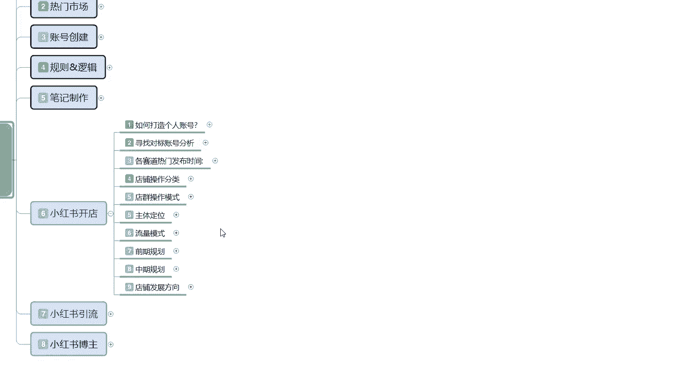
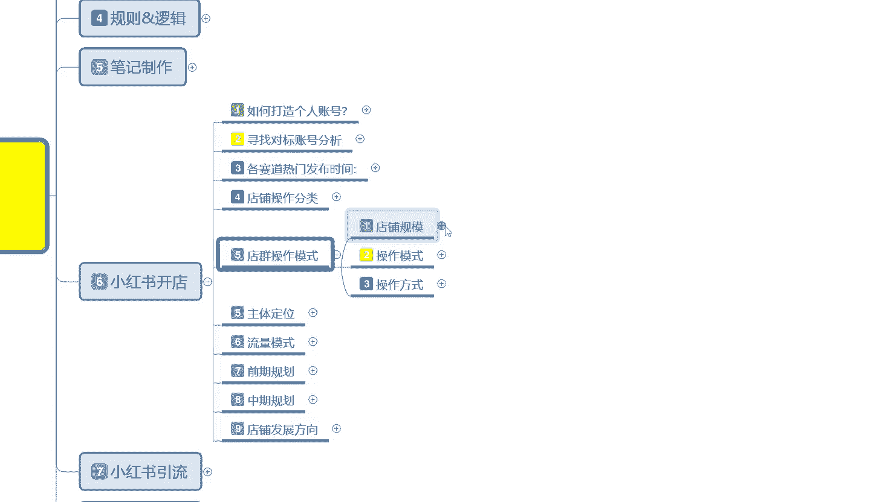
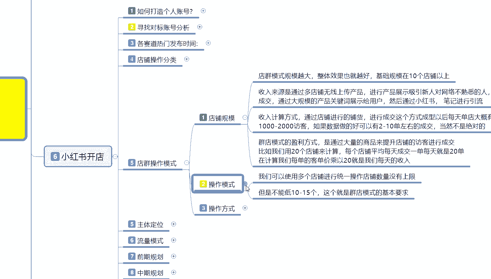
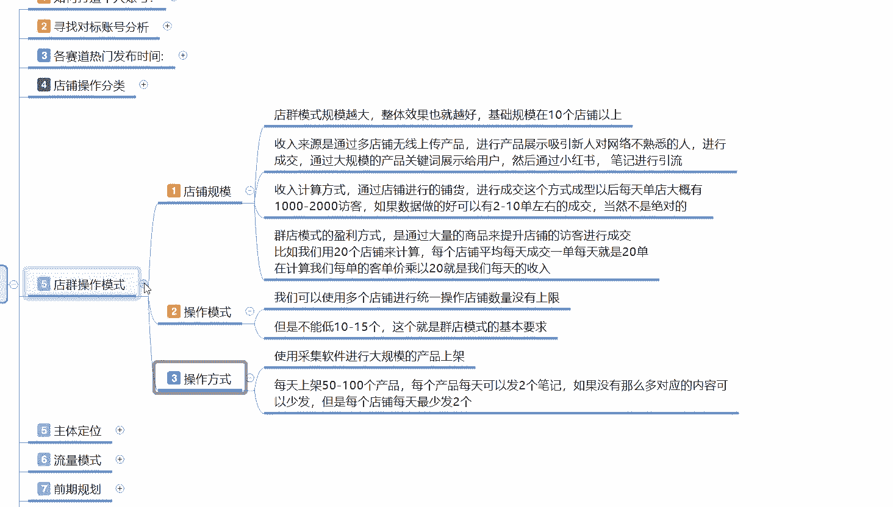

# 比刷剧还爽!!2024(全新)小红书运营网课，小红书运营大佬专为为学渣研制的小红书开店、小红书起号零基础保姆级教程，全程通俗易懂，纯干货无废话 - P24：23、小红书爆款店铺打造步骤（5） - 秋枫不入睡 - BV1AAtHebEvj

大家好，今天给大家分享的是小红书全方位分享的第六大课时。小红书开店的一个内容啊。

这节课的话主要是给大家分享一下我们小红书的一个电群操作模式。

就是小红书店铺啊，这个店群怎么去做？

店群操作模式说实话，他整个店铺的话操作还是非常简单的。

电群模式啊，它的规模越大，整体效果也越好。基础的话规模在10个点以上，你才能算电群，10个点以下的话，它不算电群啊，那就是打打打弄着玩，因为你基本上没什么太大的一个收入。

收入来源呢是通过多店无线上传产品，就是无线铺货啊。进行产品展示，新引新人对网络不熟悉的人啊，就是怎么说呢？你这种目标的话，你就只能欺负欺负小朋友或者欺负欺负那种年纪大的，通过这种电池模式铺货。

然后别人看见的某些新奇的东西的话，就会你去呃通过你的店铺进行购买。然后的话你通过自己的。供货方式啊去进行转化成交，赚取它里面的一个差价而已。啊。所以说你只能吸引那个新任和对网络不熟悉的人，要不联系他。

要不联系一下。收入计算方式呢也比较那个明显啊，就是通过店铺进行铺货，然后呢进行成交。这个方式成型以后的话，每天单单店的话，大概有1000到2000的一个访客。

就是你单个店铺每天大概有1000到2000个访客。你10个店铺的话，就是相当于接近2万的访客。如果数据好的话，可以有2到13两单到13左右的个成交。啊，但是有一点你要弄清楚啊。

这2到1单的成交不是你一个店铺的，是你所有店铺的。因为这2000个访客里面成交概率的话，可能是千分之1或者是2000分之1啊，成交概率非常低。因为你的店铺里面的话是没有什么基础数据的。

你也没办法把那么多产品全部做的有基础数据。所以说你只能欺负欺负新人啊，或者说欺负欺负老年人。店群的盈利方式的话，就是通过大量的一个商品啊来提升店铺的一个访客进行成交承担。

比如我们用20个店铺来计算一下啊，就是说每个店铺平均每天成交一单，每天就是20单。20单里面的话，你然后再算利润，一单利润，你就算10块钱或者是十五二十块钱。一天的话呃20个店铺也就二十来单，2十来单。

400来块钱，一个月下来1万多，这算好的。对不对？那你如果说运气不好，有一天成交个五单，十单，对吧？一天100块200块，一个月下来也就四五千块钱。这要看运气，而且要看你的店铺规模。

它整体操作模式也是非非常简单的啊，我们可以使用多个店铺进行统一操作。呃，店铺数量上面是没有上限的，但是我不能低于10到15个，这个就是电池模式的一个基本要求。嗯。

操作方式的话就是用采集软件进行大规模的一个产品上架架。你如果说觉得自己的产品不够的话，其实这个产品是非常好找的。拼多多、淘宝或者说京东这种产品你都能上，只要能找到一件代发的产品。

你包括什么母婴平台呀等等。你只要是你能发现的产品，你都可以把把它放到你的店铺里面去。然后每天上架50到100个产品就可以了。产品上传完以后的话，你是不是完了呢？不是你里面每个产品每天还可以发两个笔记的。

就是一个账号，每天两篇笔记。20个店铺的话，你就相当于是每天要发40篇笔记。通过这些笔记的话，吸引去吸引你的这个呃访客数量。如果没有那么多对应的内容的话，就说可以少发。但是每个店铺每天的话最少两。

一个店铺的话，你像这种情况下，一个店铺你做店群的话，每天最少是5篇左右的一个笔记。如果说你感觉你发不过来，那就是每个店铺每天两篇。因为你所有的一个权重的话，基本上都是0。这个意思大家明白。

因为你的账号的话都是新号，新号以后做电群，然后你直接是开始。卖产品，然后通过这种。铺货的方式吸引新的一个用户。所以说你对质量要求的话基本上是没有的。为什么说？店群操作的话基本上没有什么太大的一个投入。

它只有固定投入呢。就是因为你不需要去做那个产品的一个技术数据啊。你如果说开单店多店的话，都要有产品技术数据的，没有的话，卖不出去。但是你这种店群操作的话，就不需要有技术数据了。你本来就是碰运气去的。

对吧？所以说你每天上架，每个店每天上架50到100个产品啊，不能高于100，不能低于50。通过这种每天铺货的方式啊，提升底的一个店铺活跃度。然后呢。通过笔记吸引更多的一个访客。访客吸引过来以后的话。

他们成不成交，那就看天了啊，然后看你自己的产品能不能吸引到用户的一个目标。自己店铺里面的一个笔记发的。啊，流不流畅，固定时间是否做的好不好啊，这个就是电群操作模式。为什么之前说电群模式耗费时间比较长。

就是因为你每个店都要需要去操作啊，你自己一个人的话也就控制15到20个电，基本上就是极限了，再多的话你也控制不过来。所以说为什么说说电池模式的话，它不适合呃。信任去操作啊，这个你一般的话要有固定的资金。

就是自己的话。是没什么太大的问题。然后的话闲的无聊，在家里面不知道做什么的，可以去做一下电讯模式。然后的话资金方面还是比较充裕的啊，然后给自己的话找一些网络知识啊之类的学习方式啊。

你可以做一下这个小红书电讯，其他的话你。正常的啊，你如果说想接着赚钱或者是做其他的，你在小红上面做店群的话，我不建议大家去做啊。能赚只能赚，但是它的节奏太慢，还有前期需要的一个固定投入，说实话嗯。

也不少。好吧，那这节呢就给大家分享到这。因为说实话电群模式的话，它是一个方式。但是整体来说的话呃，以前有很多人玩，现在的话越来越少。那这节呢就给大家分享到这儿。

