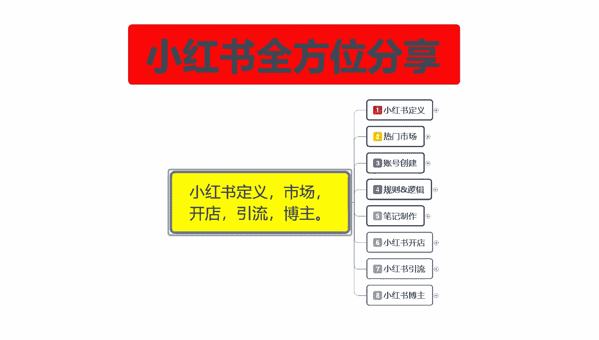
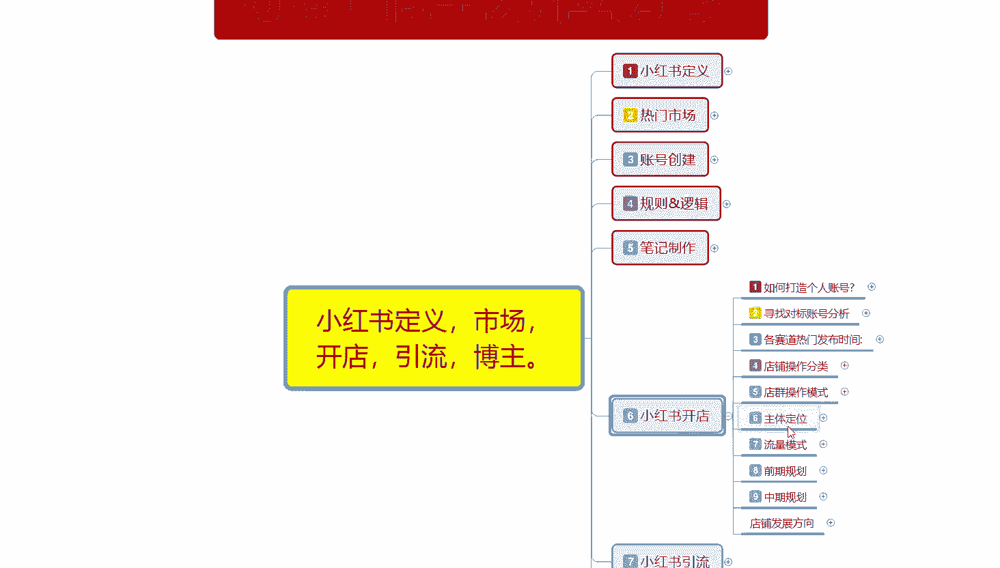
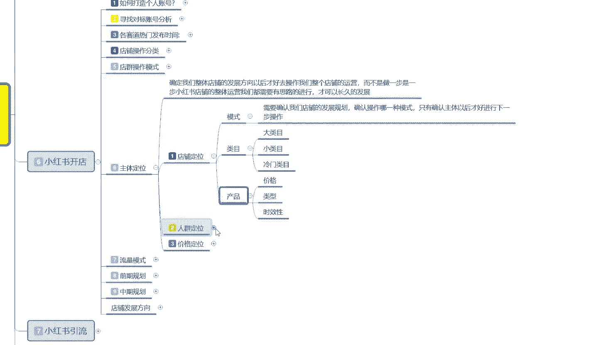
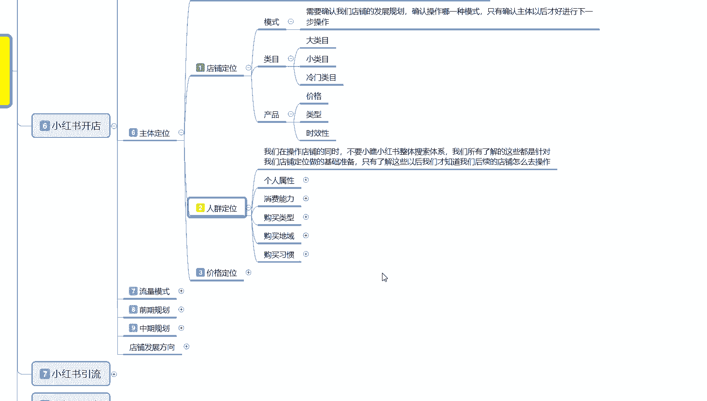
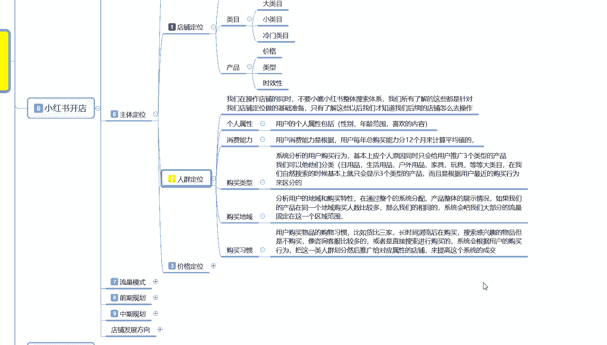
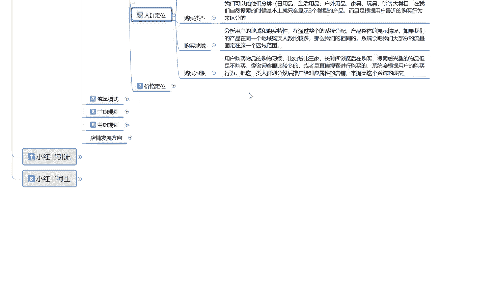
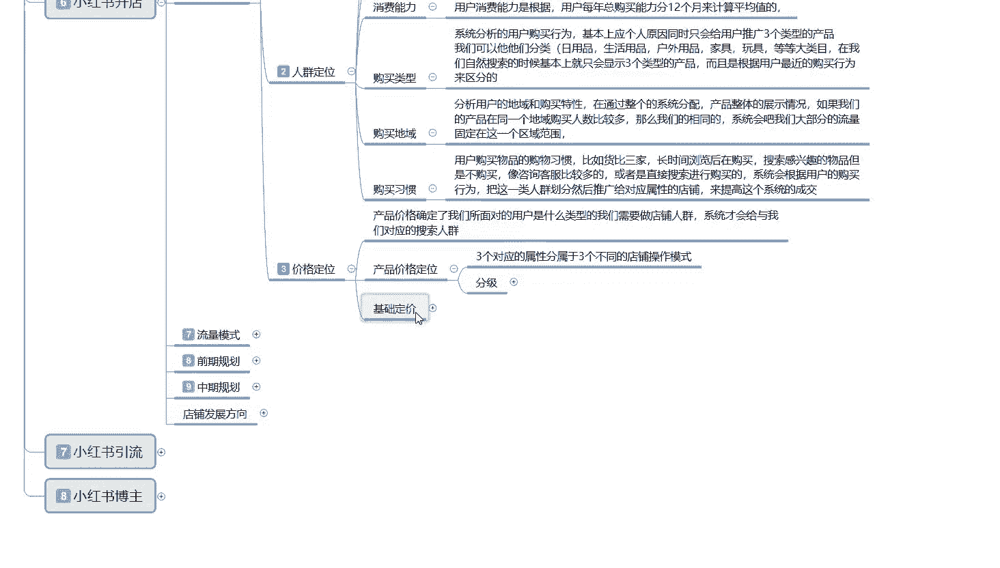
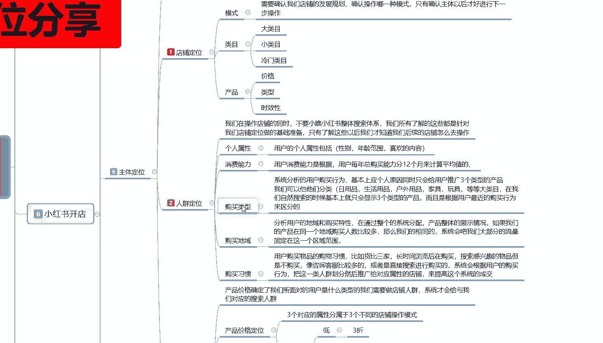

# 比刷剧还爽!!2024(全新)小红书运营网课，小红书运营大佬专为为学渣研制的小红书开店、小红书起号零基础保姆级教程，全程通俗易懂，纯干货无废话 - P25：24、小红书爆款店铺打造步骤（6） - 秋枫不入睡 - BV1AAtHebEvj

大家好，今天给大家分享的是小红书全方位分享的第六大课程，小红书开店的一个内容。

这节课的话是给大家分享一下我们的一个小红书开店的一个主体定位啊。

主体定位是什么意思呢？就是确定我们整个店铺的一个发展方向，确定好发展方向以后再去操作我们整个店铺的一个运营，而不是说。呃，做一步是一步。因为你小红书店铺整体运营，我们都需要有思路的一个进行。

如果说如果说你走一步做一步的话，说实话那你是闹着玩，还不如不做啊。你只要有你要有思路了，你才能去做小红书的一个店。这样的话才能长久的一个发展，知道自己下一步要做什么，而不是盲目的呃自己去摸索去探索。

主体定位是什么意思呢？主体定位的话就是说确定我们小红书开店的整体流程。呃，第一个呢是店铺定位，第二个呢是人群定位。第三个呢是价格定位。这个就是我们小红书，你在呃社区里面自己给自己定位以后的话。

知道自己要去怎么做。首先是店铺定位，店铺定位里面的话就是模式类目产品模式的话是什么呢？啊。电群单电多电，你要确认模式。确认模式以后的话，然后确认内幕，大类目小类目，或者说是冷门类幕。根据自己的产品去选。

你有产品的话，你就好选。你没产品的话，那你自己要去找对吧？那你是不是得先确定你自己到底要做什么？对吧呃模式那你一般的话，如果说你是新手，你没有产品的话，那你基本上都是做单店模式。单店模式的话。

那你这个里面就要大类目，小类目冷门类目去做大类目你需要找到好产品，什么意思呢？因为它竞争比较激烈，小类目你要找。那种呃需求量比较大的，但是在同一在同一平台推广你有优势的。或者说是你直接去找冷门这。

你找完这类目以后呢，你就要去判断产品的价格、类型和时效性。价格是什么意思呢？产品定价在多少范围，小红书大概卖多少？你的产品是否能够在小红书上面有市场。第二个是类型，类型的话就是种类啊。

种类的话和你内幕其实是差不多的。判断完成以后的话，就要看产品的时效性。什么意思呢？小红书上面你如果说开单店或者多店的话，呃，你单店模式，那你的时效性一定要长，你不能有季节性的一个产品。

你比方说那个夏季服装，冬季服装对吧？这种季节性产品的话，你开的就是多店模式。一个店铺里面你最多做两款产品。因为过了季节以后，你这个店铺里面的产品就卖不出去了。你不可能去冬天卖夏天的装备。

夏天卖冬天的一个服装，对吧？所以说时效性一定最少要选择6个月以上的。啊，花几个时间养号，发笔记内容，花几个月时间直接卖货。这个就是店铺定位啊，我说是很简单，但是你们操作起来的话可能就会稍微麻烦一点。

因为你有些时候的话有困选择困难的出来以后，在这个地方就会卡死。

第二个是人群定位。人群定位的话，其实和之前给大家说的那个小红书账号的一个人群定位是一样的，只是说。

这个人群定位是你我们自己想在小红书上面去卖产品，然后确定的一个人群定位。过多的一个范围呃，内容的话，我就不多说了。因为之前的一个课程上面我也就是这一期课程里面我已经给大家讲过了啊。

这里面的话我只是给大家列了几个特性和特点。第一个呢是个人属性，第二个是消费能力。第三个是购买类型，购买地遇和购买习惯。啊，你们如果说呃店铺里面的人群定位的话，按照我这个打出来的一个结构的话。

你们基本上自己都能看懂啊，我过多的就不讲解了。个人属性的话就是说啊包括性别年龄范围和喜欢的一个内容。消费能力的话就是小红书账号用户，他购买产品以后，他有一个消费能力的一个行为习惯，这个都是系统的。

你没办法去查啊它是按照12个月来计算平均值的。然后是购买类型，购买地域和购买习惯，就是你前期做账号的时候，自己做基础数据，可以用到这个人群定位。如果说你自己不想做基础数据，呃，因为没这么多资源。

然后你只想把那个基础的一个数据拉一下，人群不拉也可以。就说这个人群定位你做不做都行啊，做了以后的话，你店铺起来就快一点。你不做的话就没那么快。你就只能说是资源没有那么广泛啊。很多朋友去做呃电商运营啊。

或者说其他东西的话，它就是资源不够广泛的一个问题，导致店铺很多时候做不起来。但是小红书这个人群定位的话，说实话你做也可以不做也行啊。你可以后期后期以后的话，有技术数据以后，后期以后慢慢去调都是行的。

就是没有什么太明确的一个硬性规定啊。😡。

第三个呢就是价格定位。

小红书的一个价格定位是什么意思呢？产品的价格定位啊确定了我们所面对用户的一个类型是什么？就是人群定位里面它有一个消费能力，消费能里面有一个价格定位。价格定位的话，它是小红书系统默认的一个呃。

人人群分类选项里面的一个内容啊，就是说用户是什么类型的？我们店铺就需要做什么样的人群。人群做完以后，系统才会给我们对应的一个人群做搜索。啊。

就是喜欢同类型的一个人群用户才会去选择你同等价位的一个笔记或者说商品去进行观看。这个里面的话，产品价格定位是分三个级别的。呃，三个对应的属性分为三个不同的一个店铺操作模式。

分级的话就是低端中端和高端三折5折7折。这个是你店铺定价结束以后，你给用户的一个折扣回馈率啊，三折以下属于低端产品，中端产品的话，就是四折5折6折。高端产品是7折以上789或者是9点几十0折不算。

十折的话，说实话，你现在做十0折产品就是不打折的产品，你去什么地方卖你都卖不出去的啊。折扣价有时候的话只是给用户让他心里面高兴一点而已。那也是一种营销手段。技术定价啊。

就是说你在小红书上面卖的话要实在一点。你不能说是心黑心黑的话，你在小红书上面你很多时候没办法去做。因为小红书你做的话，如果说你的产品类目竞争力不大，你可以稍微多赚一点。但是竞争力大的话，差不多就行啊。

产品价格设置的话，一般在产品数场价值的1到3倍左右。呃，产品价格需要我们产品基础，就是你计算你自己前期定价的话，就是基础价格加运费加利润基础价格。你比方说你的产品单件卖50块钱，运费10块。

利润50就是一倍左右的一个利润就是110110的话，你然后按折扣算。懂意思吧，按折扣算，折扣打下来以后的话。你比方说打八折，那你的产品价格就是88100，对吧？那你从中获利的话。

你可能就是一一件产品赚二十几块钱。啊，通过这种方式你去记出来。所以说你的产品出产品的话就是卖出的价格一般的话就是出厂的1到3倍。你的折扣越低，那你的出厂价值的倍数也就越高。但是说实话。

赚的钱基本上都是差不多的啊，只是这个低中高三个阶段，你选择对应小红书，它整体的一个消费能力用户啊，就靠你自己怎么选，就是些低中高三个阶段。你比方说两倍的那你就只能做中端的那你三倍的那你就只能做低端的。

因为你的折扣价格打的太明显了。懂意思吧？就是喜欢贪便宜的人才会去买低端啊，经济条件差不多的才会去买终端，经济条件好的才会去买高端高端的回头客度啊。通过这种营销方式的话，提升我们整个账号的一个权重等。

然后就是商品价格越低，利润越高，这后续的话就基本上就已经给大家打出来。你们大家自己看一下就行啊，就是技术定价的话，基本上都是按照这种方式去做。你在小红书上面才能持久。如果说你随便乱玩。

你在小红书上面1件20的产品，你想卖200出远。说实话，你卖不动的啊，因为小红书的用户的话，他没那么笨。啊，不要欺负女性同胞，他没那么笨的啊，有些时候的话不要做的太过做太过以后的话。

因为小红书它本来就是一个。以宣传为主啊，然后的话进行分享。进行分享的一个平台啊。如果说你的店铺产品质量不错，然后价格合适啊，用户会越来越多。如果说你的产品价格。和你的产品不匹配，那你的用户会越来越少啊。

就算你掌握了方式，你也只能偶尔赚一点钱。而且还不是大头啊，得不偿失。😡。

这个就是小红书开店的一个主体定位。

那这节呢就给大家分享到这儿。