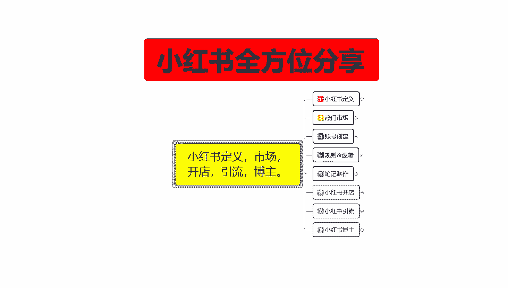
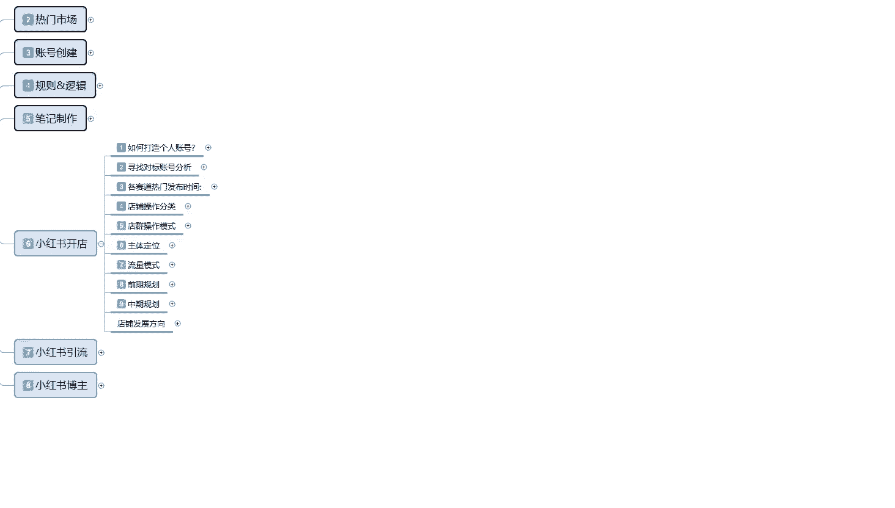
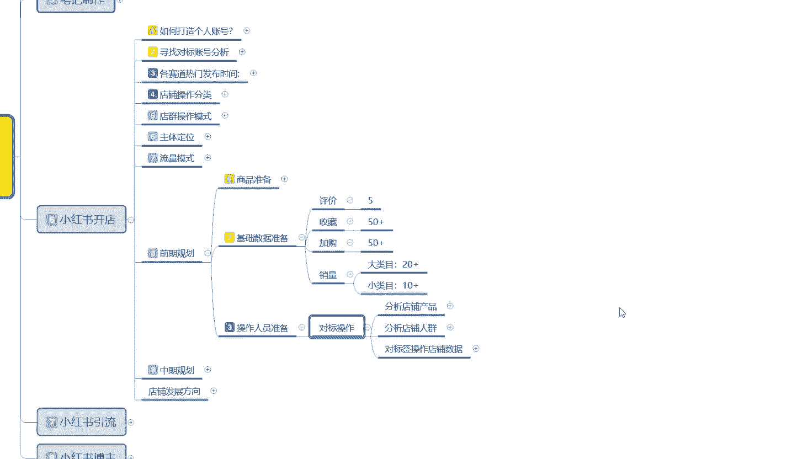
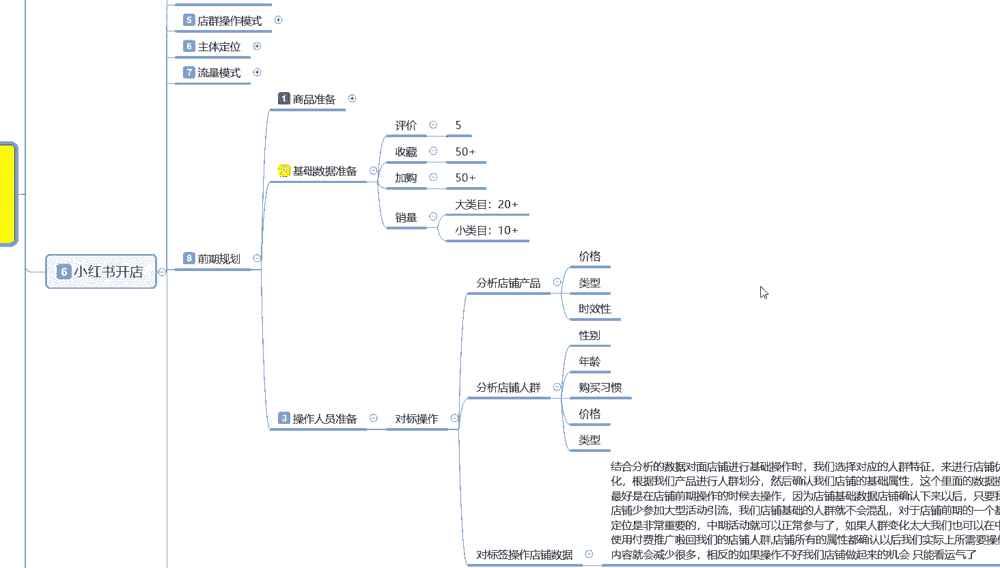
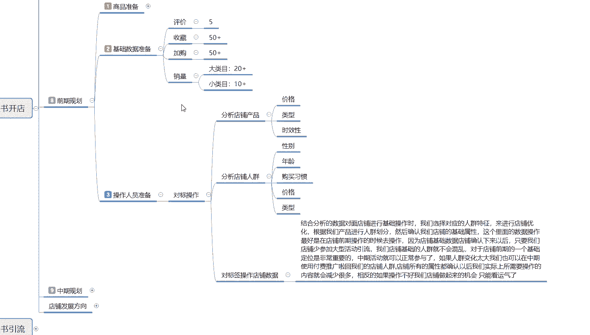
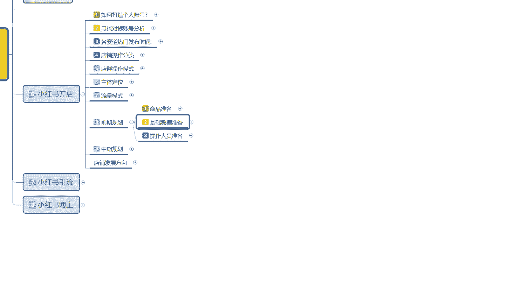

# 比刷剧还爽!!2024(全新)小红书运营网课，小红书运营大佬专为为学渣研制的小红书开店、小红书起号零基础保姆级教程，全程通俗易懂，纯干货无废话 - P28：27、小红书爆款店铺打造步骤（9） - 秋枫不入睡 - BV1AAtHebEvj

大家好，今天给大家分享的是小红书全方位分享的第六大课时。小红书开店的一个内容。

这节课的话还是接着上一节课的一个内容进行分享。呃，前期规划的第二点内容数据准备啊，这个基础数据准备的话就是主产品的一个数据准备啊。你副产品和那个不量的一个产品的话，其实前期不怎么去操作的。

半个月的左右有一个一单到两单，基本上就可以了。你其他的话基本上都是在主产品上面去把先把基础数据做起来。基础数据做起来以后，你再去做宣传的话，产品才能卖的出去。不然的话你没有基础数据的产品。

你直接去做宣传还是卖不出去的啊。

概率太小，没必要啊。那基础数据准备的话，这个里面的话就是说呃你的主产品上架以后，在高峰期上架以后开始操作是什么时间段的？是上架过后半小时到1小时以后，你开始做自我推广。

这个时间段就是你的系统已经把你的产品录入了。第一天录入的是你的副产品开始给你定位排名。第二天你产品上架以后的话，大概过半个小时，系统完全录入以后就是已经有基础排名了。你店铺排名有了。现在是商品基础排名。

商品基础排名有了以后的话，大概过一个小时，你就可以开始操作了，就是排名已经稳定下来以后可以开始技术操作。基础操作的话，那你在7天左右的一个时间段里面，你要把你的这个主产品的一个基础数量做起来。

这里面基础数量包括什么呢？评价、收藏、加购和销量。评价7天以内，你的产品至少有5个左右的一个评价。收藏加购基本上就是在50个往上走，越多越好。啊，这个没有上限，但是不能低于50。这个数据的话。

你就找帮朋友帮你学看看点点，基本上就都有了。然后评价的话，你自己呃找几个亲戚朋友，你前期的话用你做享幅宣传的，基本上都是这样的。你要不在朋友圈发，要不就在那个。呃，微博啊等等地方自己去做宣传。

这种的话其实非常好做的，7天时间时间也够啊，自己去弄也行。但是的话地域的话不要太集中，有外面的地域就是和你本地呃，不在你本地的，你去做宣传去购买的话，效果会好一点。在本地的话也没太大关系。

我们前面的话操作它只是要它的一个基础数量。就说评价的话，7天以内有5个的一个数据反馈评价，基本上第一天一单，第二天，然后三天收到货，第三天基本上就有一个评价。然后第二天两单之类的。

正常的一个节奏做下来的话，这个7天时间你基本上产品的基础数据有了以后都好做。然后销量的话就是说你如果说是大类目的话，你整体销量最少要卖20单左右。如果说你是小类目的话，就是4单左右。

冷门类目那个就没办法计算了啊。因为冷门类目的话，它有的很多都是小件的啊，有时候类似于批发之类的东西。而且那个的话，你在小红书上面前期做的话，那个没办法按数量去。

就是没办法按销量去进行单独的一个额外计算啊。但是你我们正常操作的话，大类目20个，就是你的销量必须要有20个以上。你小类目的就是那种。稍微偏冷门的就基本上也要到十几个啊，不能低于这个基础数量。

低于这个基础数量以后的话，你后续的一个整体操作话基本上就不好弄了。这个呢是基础数据的一个准备，7天时间你基本上都能做完，而且是非常容易的。第三个呢是操作人员的一个准备。这个的话就是。

匹配的啊匹配技术数据准备的有也可以，没有也行。就是说你如果说呃很多时候的话不了解这个小红书的一个技术数据，你没有操作人员，他没办法去给你操作对标的一个标签。就是没办法先把标签设定好，那你可以不做这个。

如果说你有这个资源的话，那你提前的话就要先准备操作操作人员啊这个对标标签啊，给做出来对标标签里面的话是什么呃，分析店铺的一个产品，然后分析店铺的人群，就是你自己的产品，自己产品的价格类型时效性。

然后用你的朋友或者说是你自己想要操作自己店铺技术数据的这帮人先去看同类型的一个价格类型和时效性的一个产品。然后的话分析你产品的性别年龄和购买习惯。就是你账号创建支出。他这个手机号绑定之类的。

基本上都有你的性别年龄、购买习惯、价格行为。就说如果说你是新号的话啊。

这块你就不需要去管它，那你直接去管价格类型和时效性。如果说你不是新号，就说有有些朋友他也看到小红书啊之类的这种账号是最好的那他里面的性别、年龄、购买习惯、价格类型的话，符合你的需求。

你直接让他来帮你就行了。对标的。标签操作店铺的一个整体数据。说实话啊，如何分析数据，对店铺进行技术操作的话，就是你前期的一个整体技术定位。我们选择对应的人群特征来进行店铺的一个优化。

根据我们产品进行人群划分系统，它也是通过这种的话，会给你推应相关的一个人员。就是说你做了这个对标操作的人群，那后续他给你的对标人员就越精准，也就是购买你产品的概率也就越大啊。你如果说不操作这个的话。

你只是有基础数据，然后的话随便找到人去帮你做的话，你只能做这个。做这个以后的话，那你的一个账号基础设定就必须得完善。包括你后续的那个笔记，还有你账号整体的一个设置，包括你后续的宣传之类的。

你就需要去做这个。如果说你前期做了这个，那你后续的话就。呃，对标账号的一个数据量的话就可以减少。如果说你没有做的话，对标数据账号量的话就得翻倍啊，就是两两个选项，你必须得去操作一个。

不然的话你整体数据起不来。

这个呢就是小红书店铺的一个前期规划，把前期规划基本上做完以后的话，就是商品准备，你已经布置好了。技术数据准备做完了，操作人员准备好了。7天以后的话，基本上数据全部做完以后的话。

你就可以直接开始开始去制作你的笔记，就看你的笔记怎么去报去怎么编辑，编辑完成以后的话，你后续的一些操作，呃，算起来的话，基本上就都比较容易了。除非你碰到瓶颈。碰碰到瓶颈以后的话。

基本上就到达了一个中期规划，中期规划就要看你自己的店铺怎么去运营啊。那这一节课呢就给大家分享是下一节课呢给大家讲解一下中期规划。我们店铺到碰到瓶颈以后应该怎么去操作。

