# 比刷剧还爽!!2024(全新)小红书运营网课，小红书运营大佬专为为学渣研制的小红书开店、小红书起号零基础保姆级教程，全程通俗易懂，纯干货无废话 - P29：28、小红书爆款店铺打造步骤（10） - 秋枫不入睡 - BV1AAtHebEvj

大家好，今天给大家分享的是小红书全方位分享的第六大课时，小红书开店的一个内容。

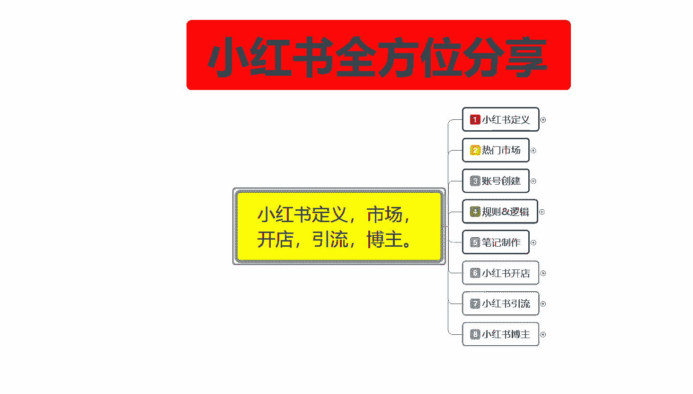

这节课的话是给大家分享一下我们的一个小红书中期开店。

就是整体的一个中期规划。小红书中期规划的话，说实话你就是基本上已经开始碰到瓶颈了。你前期规划已经做完了以后的话，就是开始做笔记。笔记的话，然后开始做数据。数据做完以后的话，你基本上就开始慢慢的进流量。

然后每天发笔记就行。然后在这个里面的话，你除非碰到瓶颈。碰到瓶颈没办法进行提升，或者店铺一直在原地踏步以后的话，你就需要去做自己的中期规划。

中期规划这个里面的话就是开始计算我们小红书店铺里面的一个商品排名了。这个里面的话有一个综合排名分类价格排名销量排名关键词排名会有个性化搜索和动态PK你进来PK啊。因为这个六大点的话。

说实话对于中期规划的朋友来说的话，你了解过的，你基本上就。稍微懂一点，如果说你不了解的话，那。这部分内容的话，我。因为内容太长了，我也没办法。完全的给大家进行分享。所以说很多东西我都是打出来的。

你们看一下就可以。好吧，主要是让想让大家了解一下。因为你呃小红书开店，如果说你是新手玩家的话，说实话中期规划的话，有时候它不是自己能够解决的啊。因为你不了解的话，你没办法去自己学习，自己了解。

除非说是你自己对这个东西很有研究啊。那你我打出来的那你就能看懂。如果说你自己没有研究的话，你自己想去研究的话，这不是短时间之列啊。

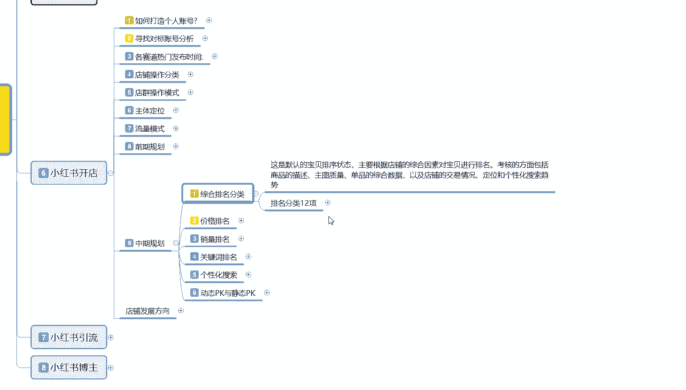

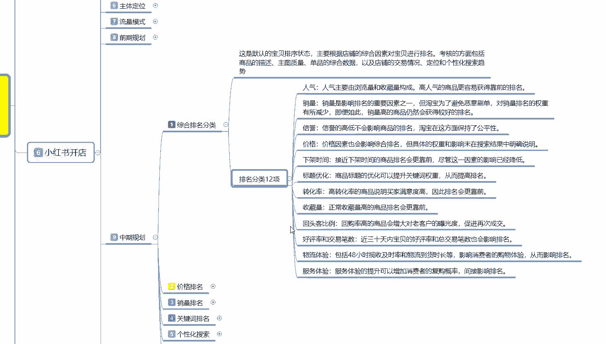

自己能够了解的一个内容板块。因为它的一个。属性词特别多啊，它和前期规划的话不一样。前期规划只要技术数据和笔记做的好，基本上都没什么太大的问题。

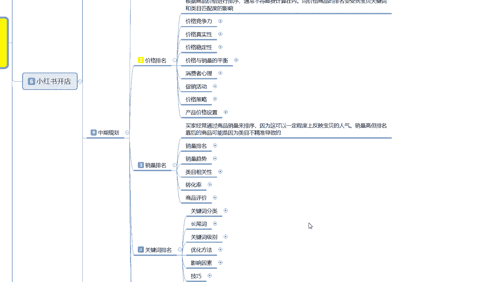

但是中期规划的话你。就确实需要自己好好研究一下，然后指有指导的话更好。没有指导的话，那你研究的话，最少也要半年到一年的时间，你才能了解这个电商运营的一个系统整体规划。这个里面的一些名词啊，驻词啊。

怎么做排名啊等等这些资料。有人教的话，可能就会稍微快一点啊。我们先了解一下综合排名分类。呃，综合排名分类的话，这个就是默认的一个跑宝贝排名的一个状态。

主要的话就是根据店铺的一个综合因素对跑对你的账号里面商店。产品进行排名，它这个每一个数据量啊就是。账号是一个排名。店铺是一个排名，产品又是一个排名，他们综合起来才是你的店铺权权重。你比方说有账号排名。

没有店铺排名，没有商品排名，那你只有账号权重，你的笔一发出去的时候可能会获得。一部分的那个展现展示就是基术曝光值会高一点。如果说你有那个店铺排名，那就是用户搜索的时候，你的排名可能会靠前一点。

如果说你是商品排名，商品排名的话，那就是在呃小红书商品里面有一定的定位权重，在那个里面的话，就会有展示机会啊，它的。本字基本上都是差不多，但是它所展示的位置和效果是不一样的。呃，排综合排名分类的话。

它这个里面的整体排名分类是12项，人气销量、信誉价格、下架时间、标题优化转化率。收藏率回头客的一个比率，然后就是好评率和交易笔数。最后呢是物流和服务体验。这个是综合评论。但是这个里面的话呃。

我给大家列出来了，它是整体排名对小红书对于你账号、店铺和商品直接有影响和关联的啊，基本上都在这。

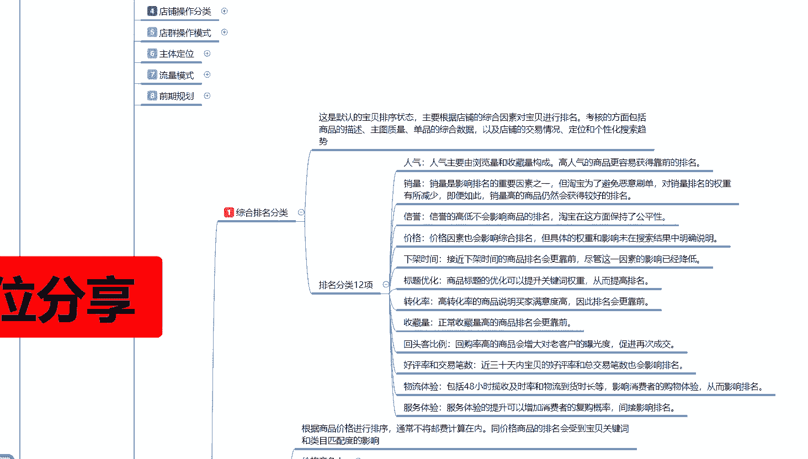

往下面看到就是说价格排名，价格里面的话，排名它又分为很多的一个小项内目。就是说每一个小项你做到位了，它就会加分。你做不到位的话，那就是平平平平淡淡基本上就是不加分。如果说你做不好，那可能还会减分。

这个里面价格排名的话，你包括价格竞争力，价格真实性，价格的一个稳定。价格与销量之间的一个平衡。然后消费者心理促销活动、价格策略和产品册子，这些都是你中期所需要了解的一个整体价格排名册子。

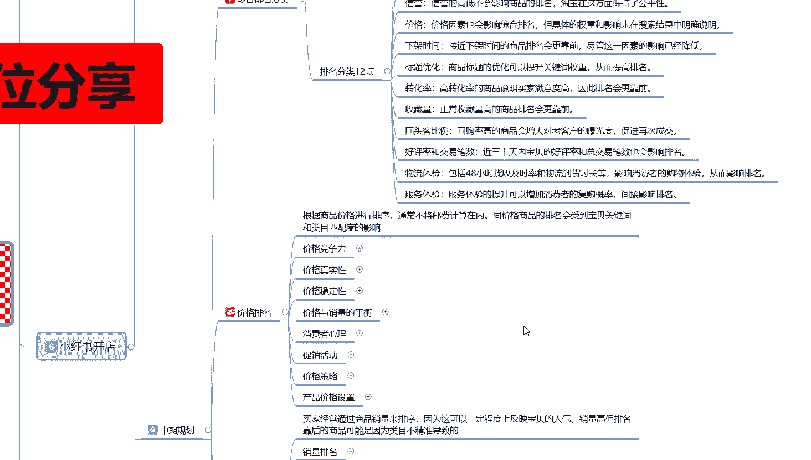

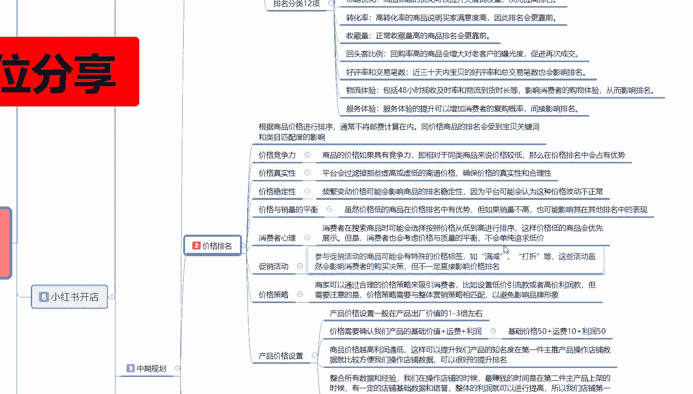

内容是很多，但是说实在的啊，你了解一下，你就有对于网络运营了解的更深入一点啊。过多的内容呢我就不讲解。你们如果说啊正在这个阶段的去了解一下我这内容的话，我基本上都给你们打出来了。但是怎么理解的话。

就看你们自己好吧。

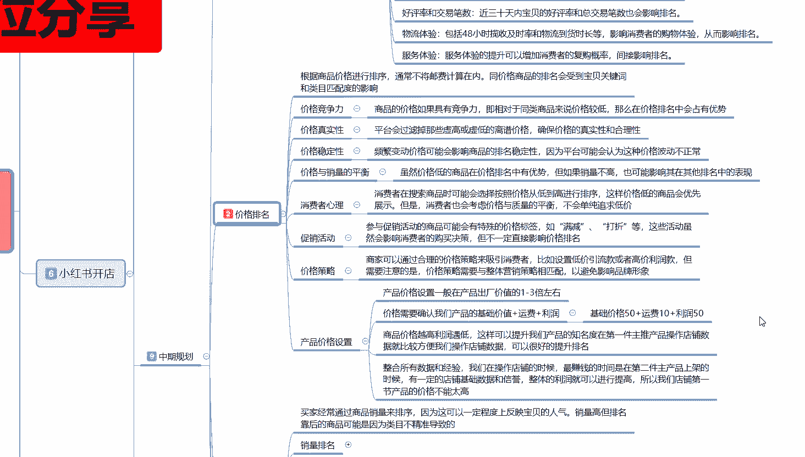

然后价格排名之后呢，是销量排名，他们综合的他们没有那个先先后顺序的，基本上都是一样的。就是说你不管是价格排名也好，销量排名也好，关键词排名也好，没有先后顺序啊。

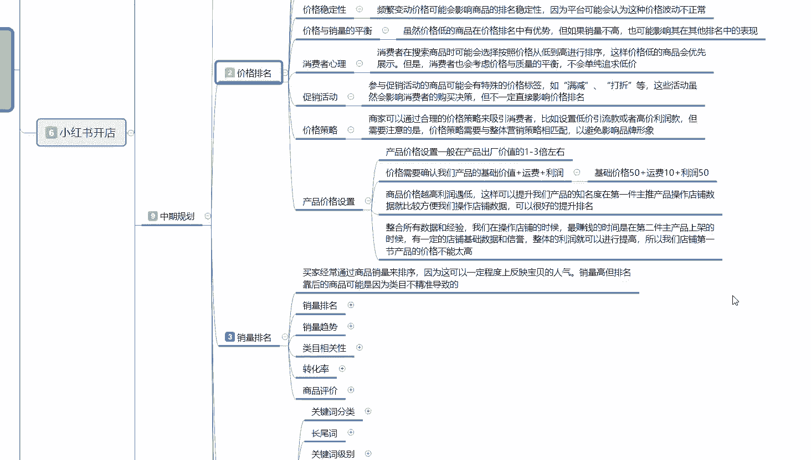

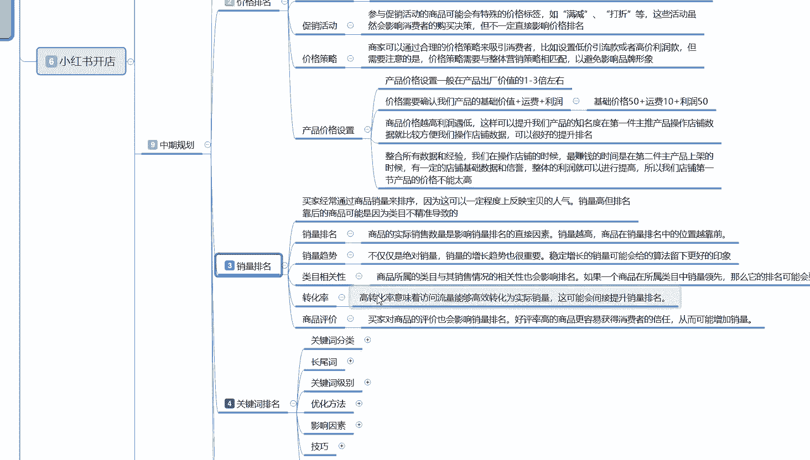

都是综合性的。然后的话关键词排名可能会靠前一点，然后先关键词，然后是销量，最后是价格，但是他们都是单独计算的，只是说关键词带来的属性争议更大啊，销量排名和价格排名的话呃带来的属性的话就偏小。

但是销量排名。偏大是偏大，但是它不好做啊，价格排名的话就稍微好做一点，最难做的话就是销量排名。

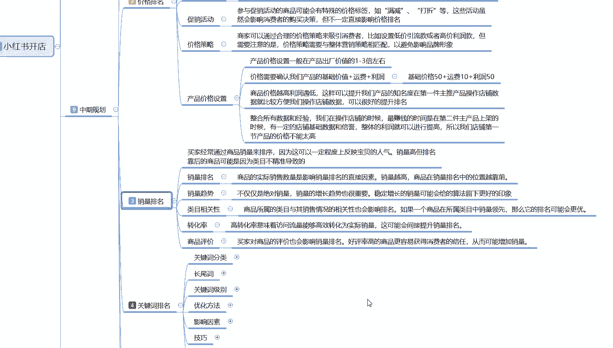

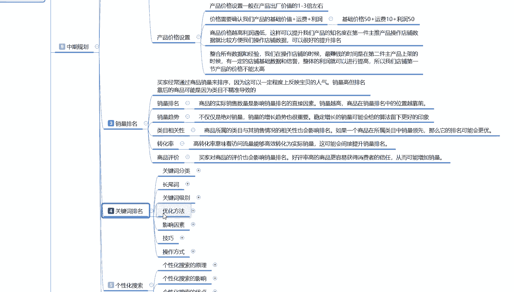

这个里面的关键词排名啊，你关键词排名的话分关键词你也要分类。然后的话是长尾词关键词优化方法，影响因素、技巧和操作方式。这里呢我都是给它列出来了啊，你们如果说想了解的话。

想深入了解我其实有单独的课程专门讲过这个里面的内容。因为它的内容太多，我在这呢这因为这个是整个大课时，我就不给大家做叙述了。有的小课时的话，我分享里面的话，其实都有这里面的一些技巧。

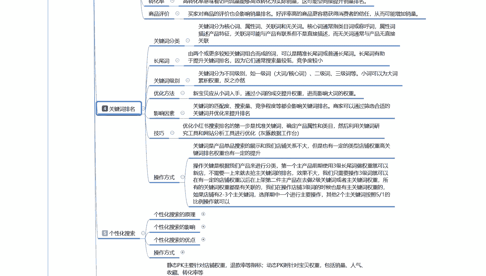

你们想了解的话，就去自己去搜一下，基本上都能搜到啊。

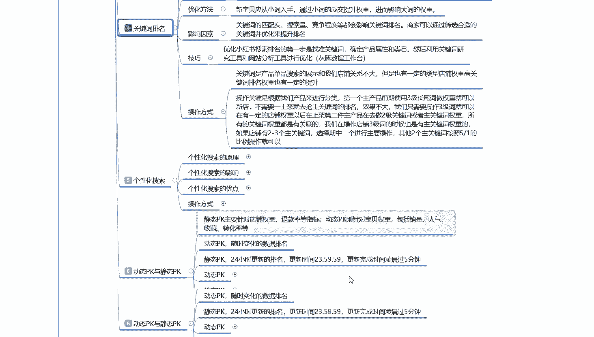

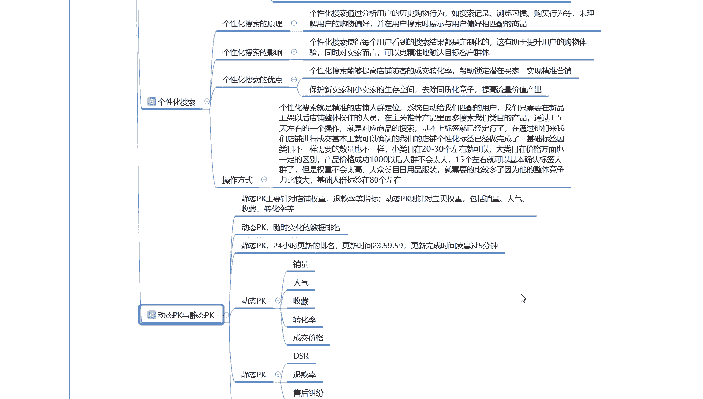

个性化搜索和那个动态PK和静态PK的话，这两个的话你们暂时不需要去了解。因为它的话呃涉及到对同行店铺的一个竞争争抢啊，属于中期里面的境界或者产品。你如果说前面几个点你不了解的话，你后面两个点。

你根本就看都看不懂啊。你只有了解前面几个点了以后的话，你才知道什么是动态PK和静态PK，还有个性化搜索。

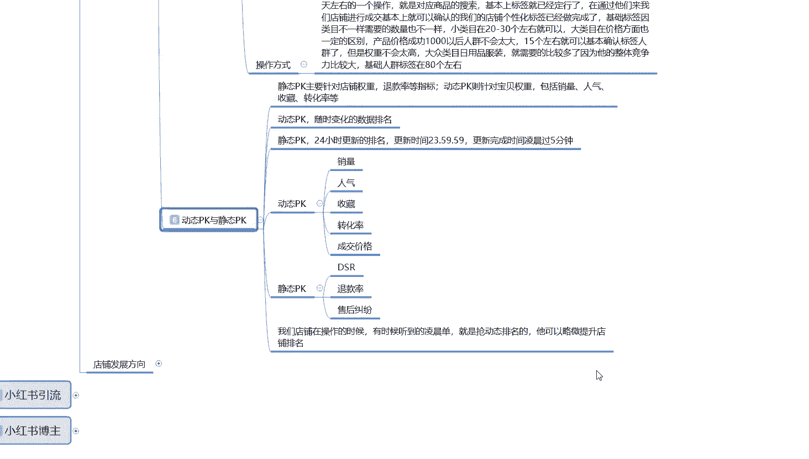

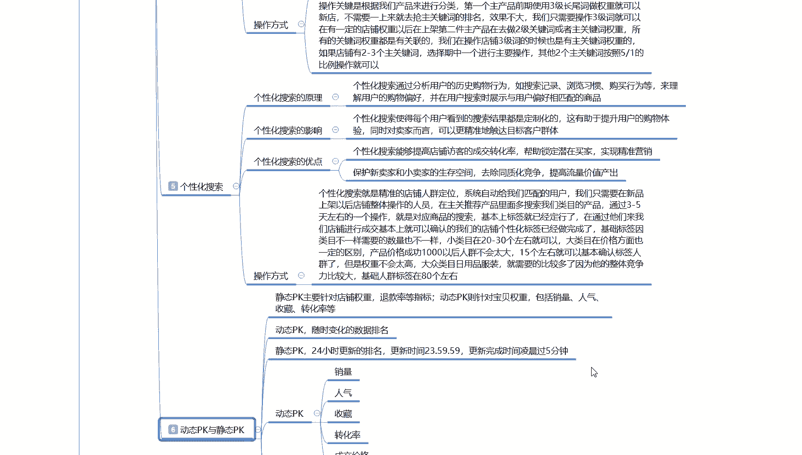

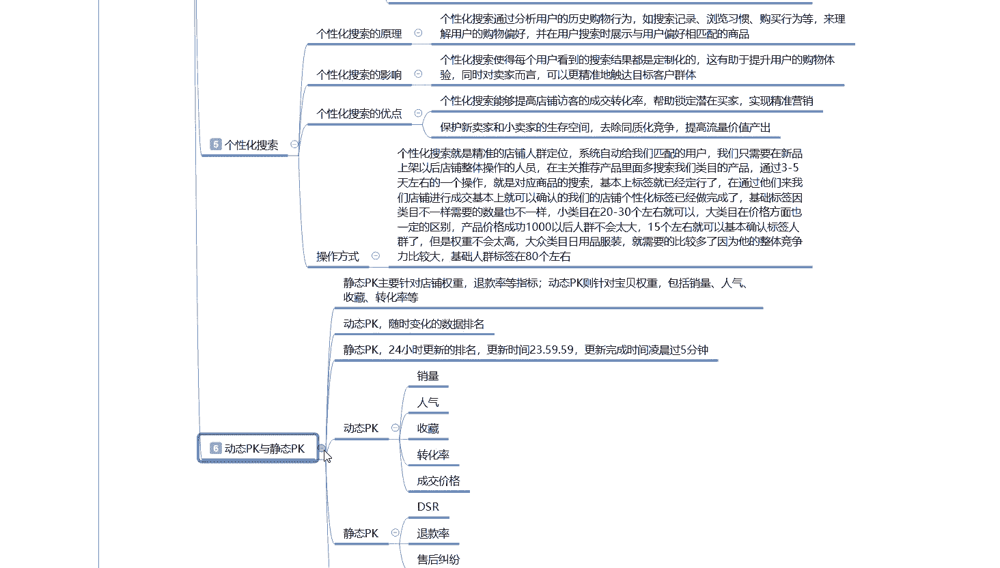

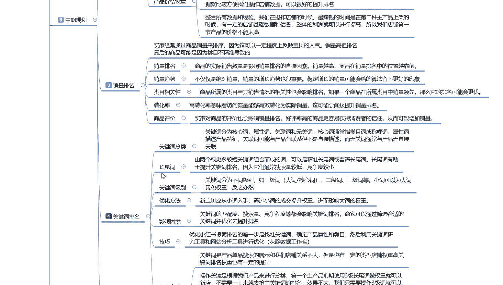

那这一节分享呢主要是让大家了解一下我们在这个。

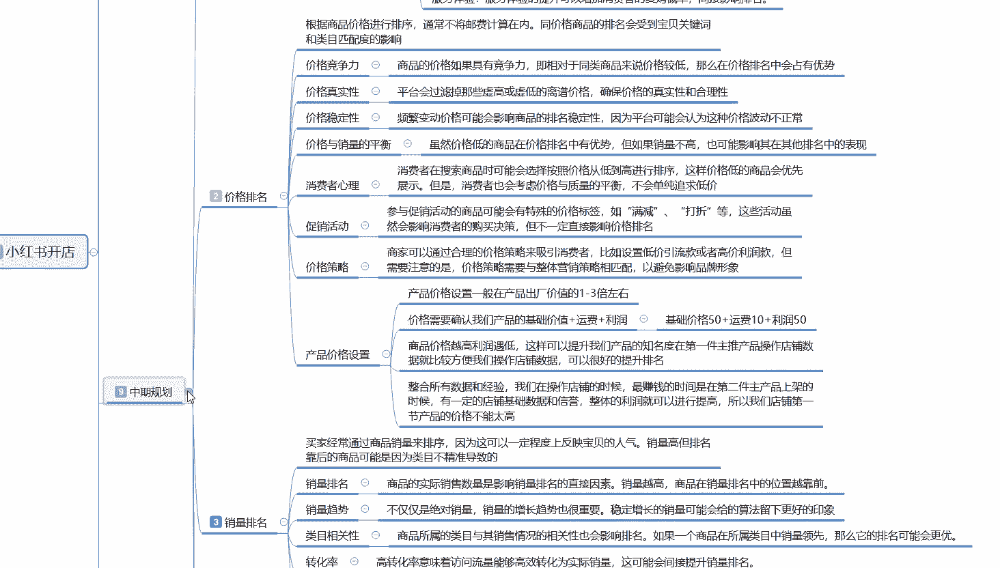

操作小红书店铺中期的时候，我们所需要注重的几个重点。第一个呢我们先了解呃整个综合排名分类有哪些内容，能做的先做了，然后呢去优化我们的一个价格排名，销量排名和关键词排名。优化这三个点以后做完。

然后再去做个性化搜索。个性化搜索做完再去做动态PK与心态PK。这一整套做下来的话，你基本上中期规划啊就是你产品的上线。什么意思呢？就是说你把中期规划做完以后的话，你包括后续你再去操作其他的啊。

基本上就都有思路了。最后一堂课的话就是小红书开店里面最后一堂课啊，店铺的一个发展方向。呃，这个内容的话其实。你们目前涉计不到，它整体的话就是你店铺改变形式。什么意思呢？

你中期规划的所有属性基本上做完以后的话，你到最后的一个店铺发展方向只有两步。第一个是开新店，就是多店模式。坐电模式的话，你就可以去准备开第二个店了。就是第一个组产品已经做报以后，你准备去开第二个点了。

如果说你是单店模式的话，那你就加大推广力度，开始做付费了。因为你把中期规划做完以后的话，你的店铺基本上都已经到达第五层级，接近第六层级了，或者说是在第四层级往第五层级走，那就是你的中期规划没做完。

中期规划做完以后的话，你的店铺数据上升以后的话，你基本上都可以从第五往第六迈步。第六层级卖步以后的话，你就只能加大投入力度啊。网10万粉丝。10万的一个小业业数量往上走，不然的话。

你基本上都缩在呃中期规划这个范围之内。所是说店铺发展方向就是一个加大力度，然后一个开心店。加大力度里面的话，你就是呃做数据分析，数据掌控店铺的一个分析，店铺的一个优化数据维护。然后呢是平颈突破。

平颈突破的话就需要开始做付费了。这个时间呢你就要开始做付费了。小红书的付费的话，你就要开始呃抢占市场。就说你在这一板块里面的话，整体数据已经是非常优秀。非常优秀的话，那里面还有很多的一个同行。同行的话。

你前期已经开始做静态与动态PK。这个时候的话你就是要加大的加大对动态PK和静态PK的一个。影响力。然后的话再通过给自己买保险，什么意思呢？就是开始在小红书上面充值做呃付费推广。通过这种方式的话。

来确定自己整个店铺的一个规划和发展。这个呢就是小红书开店啊。整体的话就是啊自己怎么做账好，怎么找对标，包括。技巧也给大家分享了。后续的话就是呃小红书的一个引流和博主。小红书引流和博主的话。

其实和开店差距不大啊。它的一个内容的话也比较偏少。只有前期和B1两相结合，就是小红书引流和博主。

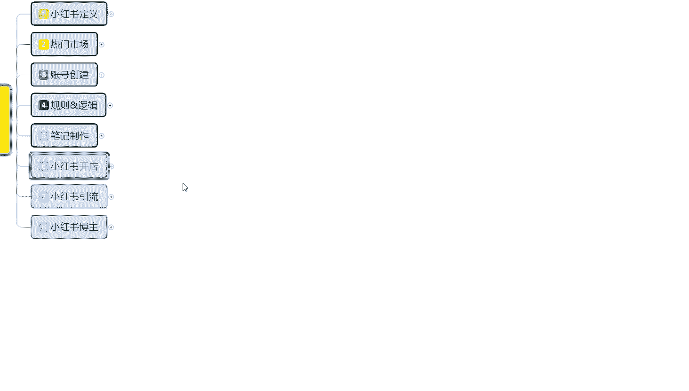

好吧，那这一节呢就给大家分享到这儿，下一节开始呢开始给大家讲解一下小红书怎么去做引流。

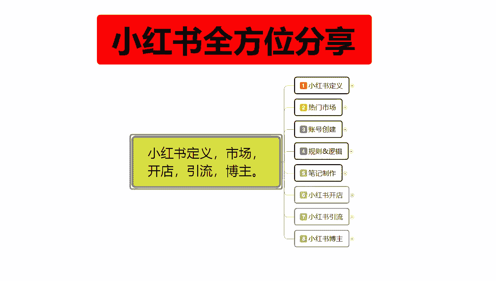