# 比刷剧还爽!!2024(全新)小红书运营网课，小红书运营大佬专为为学渣研制的小红书开店、小红书起号零基础保姆级教程，全程通俗易懂，纯干货无废话 - P30：29、小红书账号引流方式（1） - 秋枫不入睡 - BV1AAtHebEvj

大家好，今天给大家分享的是小红书全方位分享的第七大课程，小红书引流的一个内容。就说这一期的话就是。呃，怎么说呢？主要是教大家啊怎么把自己的一个小红书引流账号给操作明白。当然了，这个是主账号。

不包含我们的一个小号做评价引流的。因为小号的一个评价引流的话，说实话不在这个小红书引流配套课程里面。那个的话你要需要去做举证，有资源的需求做举证。如果说你没有资源的话，你。随便找两三个手机。

多建两三个的小红书号啊，自己艾特以后的话去评论区做评价就可以啊。这个的话不在我们的一个小红书引流主题课程里面啊，因为主题课的话，我这边只给大家讲。大家需要了解的一个主账号的一个设置。

这套课程的话就是分为6个节，6个小节的一个课时。第一个呢是账号设置，第二个是对标账号分析，第三个呢是笔不笔记的一个发布时间。第四个是思域引流。第五个呢是。在小红书上面怎么用这种引流模式去变现啊。

第六个的话就是通过小红书变现。五和6的话其实是一体的，只是看你自己怎么去利用。我们先来了解一下这个账号的一个色字。小红书上号设置啊，我这边的话是给大家截了两个图，但是我们可以暂时不看。

我们先看一下这个简介简介的话基本上。和。小红书开店是差不多的，但是它的一个称离和测置方式的话，我们要稍微啊变更一下。因为它有些设置的话是小红书开店，它不涉及到的一个东西。谁是春泥要有特色。

能够让粉熟州的话，快速牢记，不要生僻字。第二个呢就是简姐可以概括自己的一个更新方向和专业的一个背景，也就是背书啊。头像要有识别度，展现自己的形象和风格，可以用自身照。

这个的话基本上和那个小红书开店是一样的。然后封面美观且有设计感，然后突出主题和关键字，整齐统一就可以了。这个的话基本上都是一样的。但是后面的这个内容你们大家可能的话不是比较熟悉。

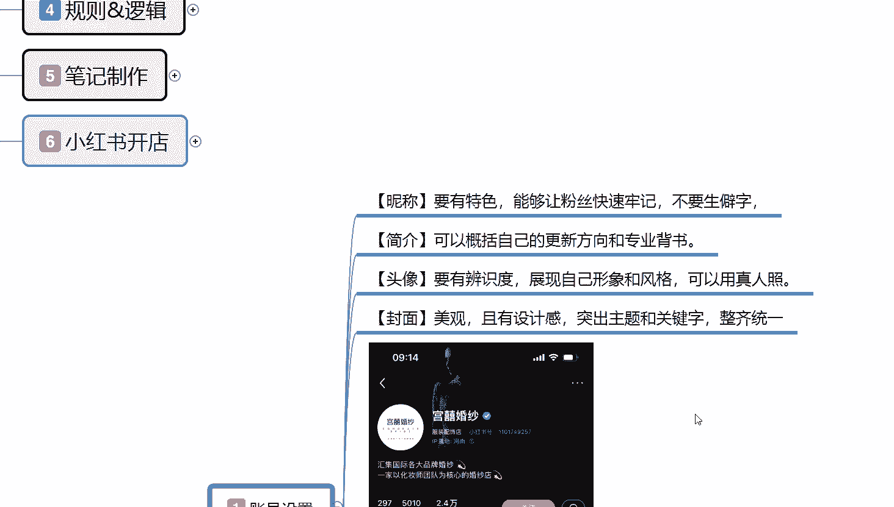

这个呢是我在小红书上面直接做的搜索。因为的话我自己测试过的，但是呢没怎么用啊。如果说你在小红书上面要去做引流，那你的一个封面结构的话，必须要像这样。

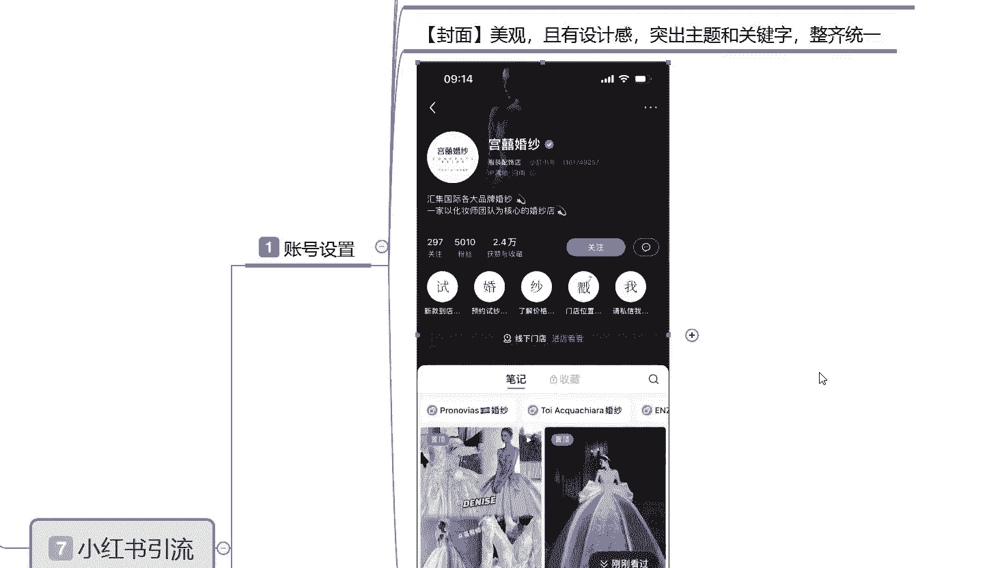

这个呢你们可以自己去搜啊，基本上都能搜到的。什么意思呢？你不管是做任何方面，任何渠道的一个引流，你包括我们那个小红书开店也能用到，但是它的一个整体效果的话，肯定是没有做引流的一个效果强的。

首先第一个点是名称。对吧名称下后的话是店铺自己所属产品的一个介绍。这个小红书号我们就不用去管它了。IP所属地的话属于荷兰。当然这个是别人的，不是我的啊，然后的话介绍自己的一个文化流程啊。

汇集国际各大品牌的一个婚纱。然后的话是以宜家化妆师维团队核心的一个婚纱店。当然这是别人店铺，只是说拿他的店铺做个介绍给你们，大家看一看这里面的话，这上面其实就是我们刚刚所说的村理简介头像和封面。

它不是重点，重点的话是在这。

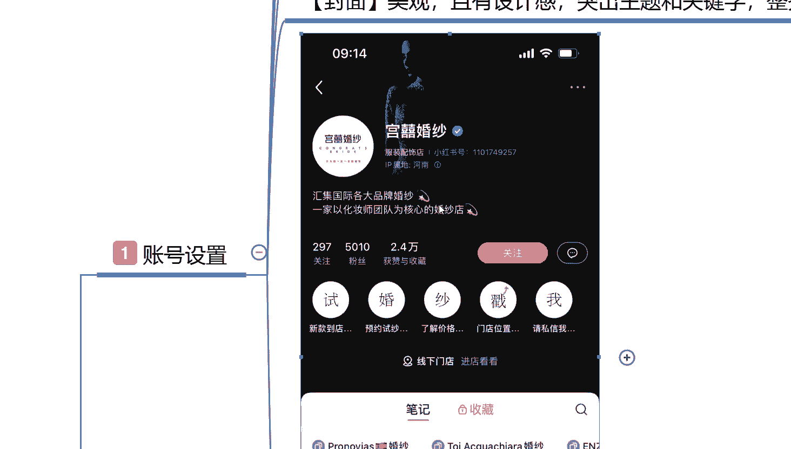

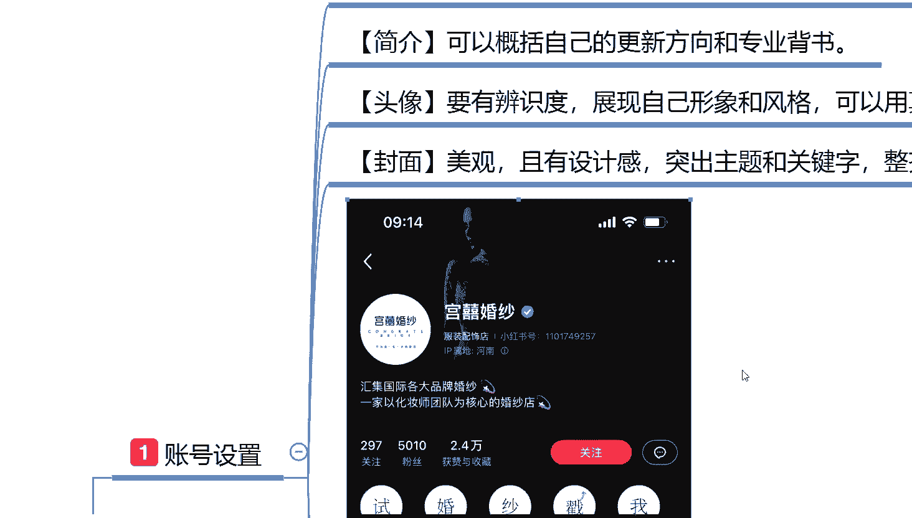

重点是这五个字，看见没有？四婚纱错误这5个字，这里面的话点进去，它这里面下面再看新款到店啊，预约四婚纱了解价格，门店位置，然后私信我，这就是他自己所设计的一个引流方式。呃，设计的话说实话不算太隐秘。

而且是非常正常的。基本上如果说你想了解这一部分内容的话，你点进去它都有教你怎么去把流量引流到其他地方去的一个方式啊，就看你们自己怎么去设计。

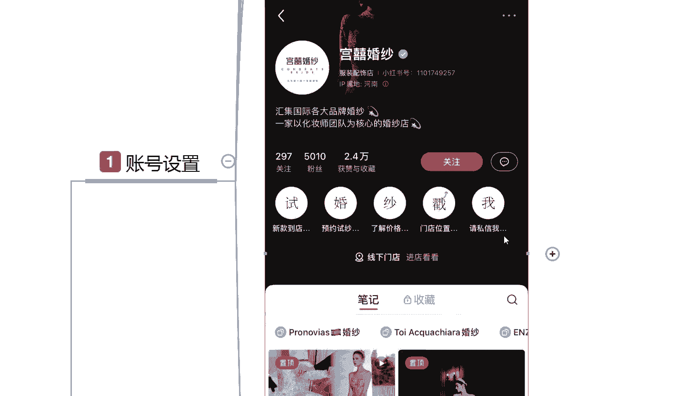

呃，这个的话设置方式的话也是比较简单的。后面我再跟大家进行讲解。大家只要是看一下它这种方式，你去做引流的话，你的笔记发出去以后，如果说别人点进你的这个笔记进行观看，你有这方面兴趣想了解。

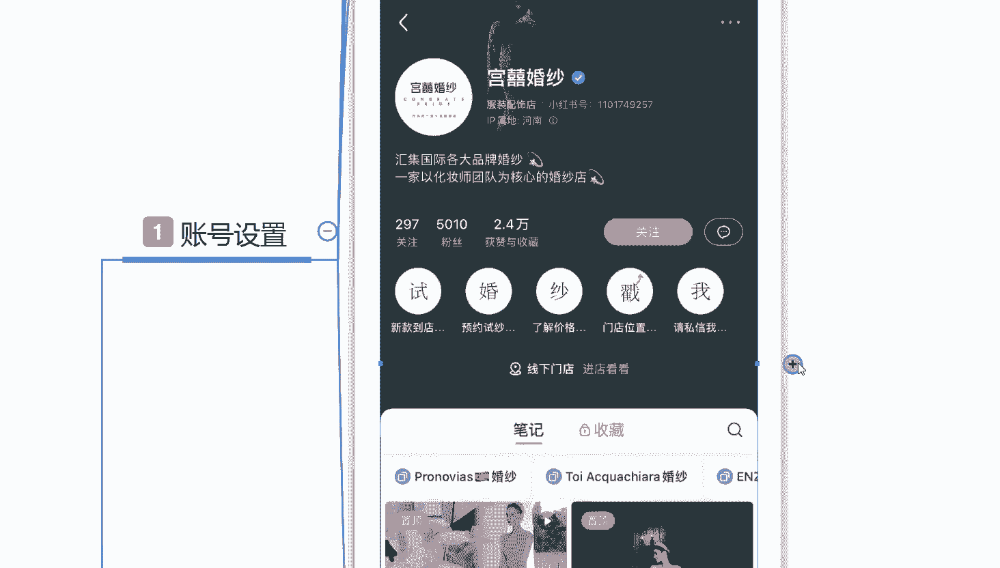

基本上都会去看。就说我们本来做小红书，你做引流的，你就在这个方面的话就已经领先了别人很大一个部分啊。而且这种的话它那个不上违规，上插边啊，你不要太过分，然后的话直接拿私信啊、微信之类的东西啊。

在聊天里面去涉及到的话，基本上没有太大的问题，让别人想方设法的啊来添加你。那基本上如果说对这种东西都是非常感兴趣的，你自己分享的内容啊，我这只是拿了一个示范，自己分享的内容感兴趣，基本上都会去找你。

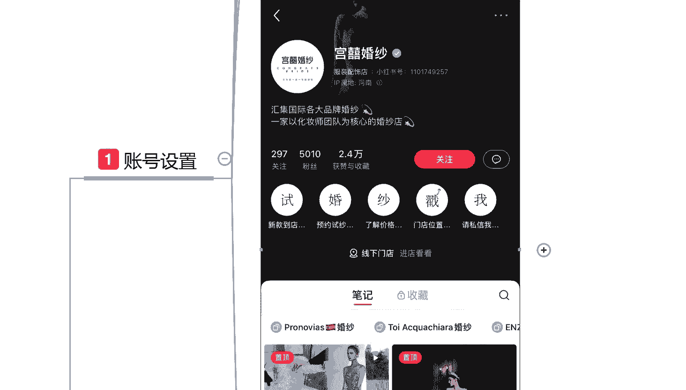

后面这几个呢其实也是一样的啊。

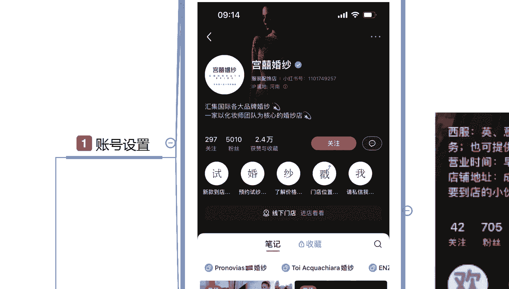

呃，西服。就是说因为我是在这个小红书上面查找资料的时候，看到这一部分的话啊，觉得它的一个设计感官还可以。然后的话下面这些你不管怎么去操作，因为你们大家可以观看一下啊。

它的一个整体粉丝数量或赞或者说是关注的话，其实比较一般。但是他们账号没有被禁封，能搜索的到，那么就代表这个方式是可以操作的。

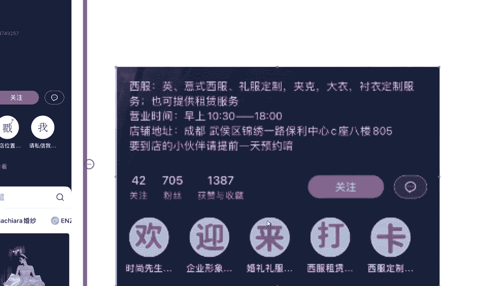

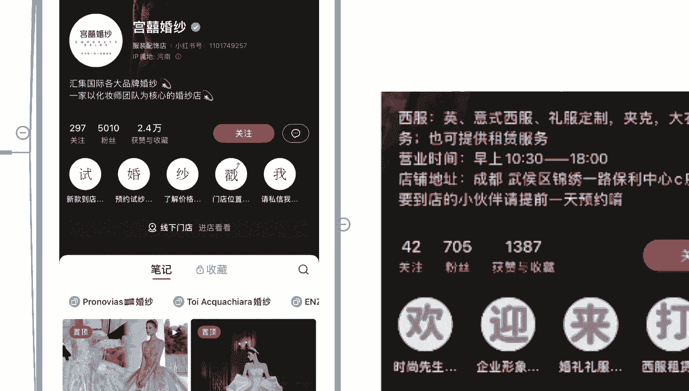

下面这个也是一样的啊，欢迎来打卡啊。时尚先生企业形象婚礼服饰。这个的话就是变相的对自己的一个账号进行了二次宣传。包括下面这张截图也是一样的，咨询请关注私信啊，就说。

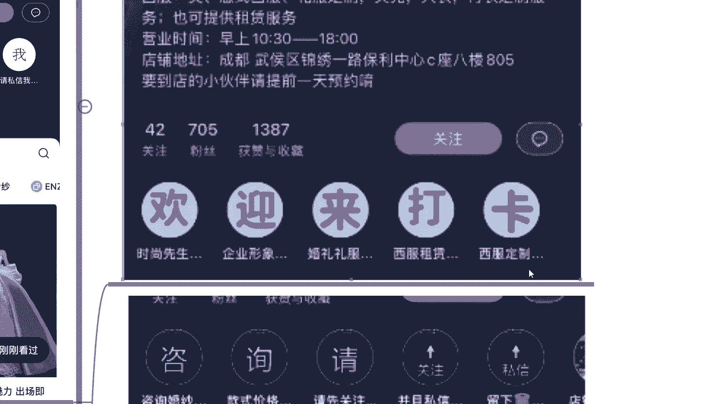

让用户主动私信联系你，你然后再通过其他的方式去添加他的一个私信去自己聊，让他主动提供联系方式。懂意思吧？也是一种。

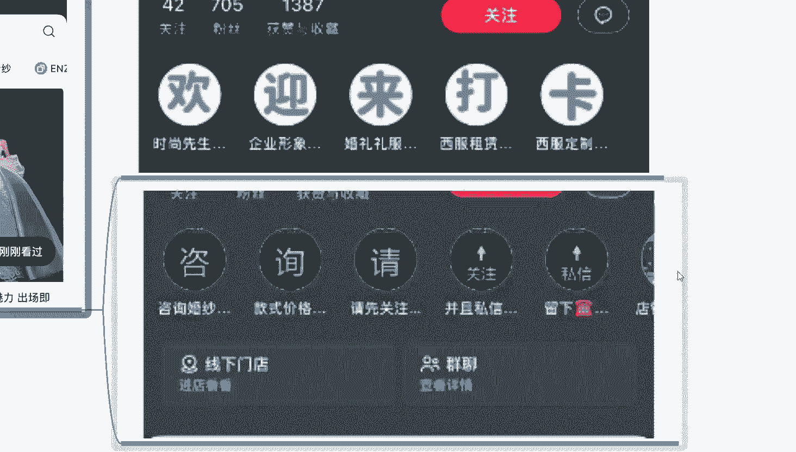

小红书怎么说呢？引流的一个方法，就说按照这种方法去做的话，我们的一个账号设置你基本上就已经完成了。就是前期整体账号设置，包括里面的呃名称。

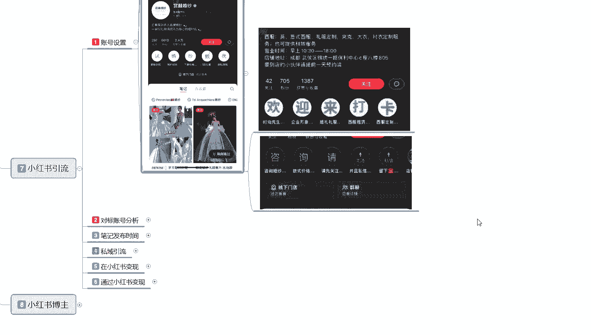

简介对吧？然后头像最后的话就是你的封面的一个背景设计。背景设计以后的话，你再带上自己的一个企业文化的一个介绍。最后呢是。个人联系方式最重要的一个点。

因为你做本来就是小红书做引流的那你是个人联系方式的话就是最重要的啊。这个设置的话其实也是比较简单的。你们如果有兴趣的话，可以去了解一下，一搜就能搜到。

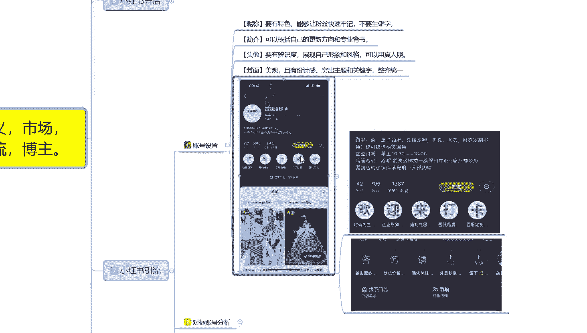

那这节课呢就给大家分享到这儿，主要是让大家了解一下啊，你小红书里做引流啊，怎么去做，在什么地方去做私信引流了解的。这个是我们个人的一个封面色。

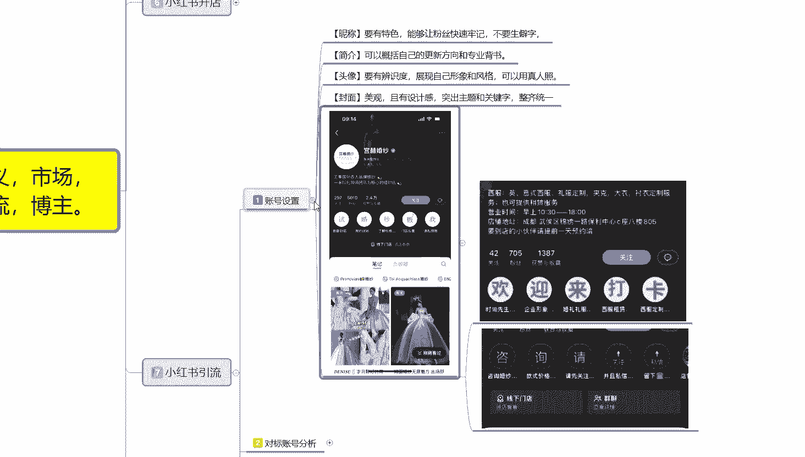

后面的话还有一个对标账号分析。对标账号分析的话，其实和那个小红书开店差不多。但是整体来说的话呃，下节课再给大家详细的讲解一下。因为你的一个对标账号分析的话和那个淘宝店的一个对标账号分析虽然说是差不多。

但是也有一定的区别。

