# 比刷剧还爽!!2024(全新)小红书运营网课，小红书运营大佬专为为学渣研制的小红书开店、小红书起号零基础保姆级教程，全程通俗易懂，纯干货无废话 - P31：30、小红书账号引流方式（2） - 秋枫不入睡 - BV1AAtHebEvj

大家好，今天给大家分享的是小红书全方位分享的第七大课时，小红书引流的一个内容。这节课的话还是接着我们账号设置往后面讲。

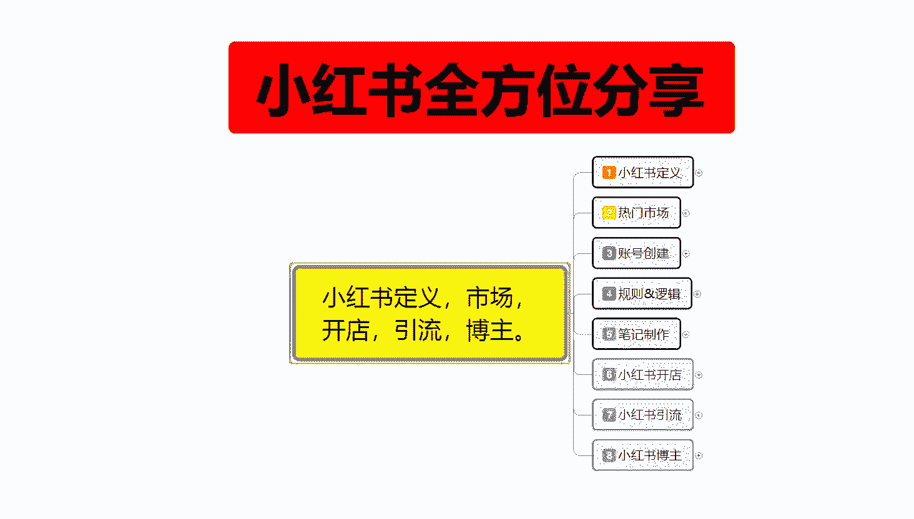

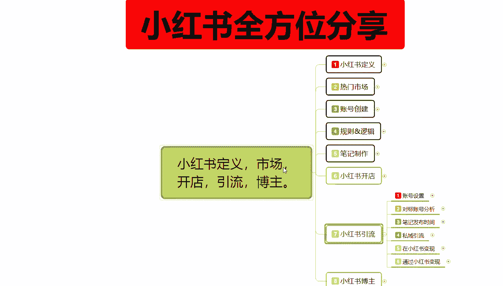

呃。重复的内容我就不过多的跟大家进行分享了。因为小红书开店里面说过的，我就不再过多的一个讲解。比方说这个对标账号分析，包括笔记的一个时间发布啊，这两个的话在小红书的那个店铺操作里面是一样的。

也给大家分享过。这里面我们不一样的就是思域引流。还有我们的一个小红书变现方式。我们先讲解一下这个水域引流。私域引流的话呃，在账号设组完成以后的话，这个里面还有个。更加细致化的一个私域引流方案。

这里面的话就是包括私信简介留言信息，然后的话是超级行聊。啊，最后呢是小号引流，这里面的话包括它的一个风险和。

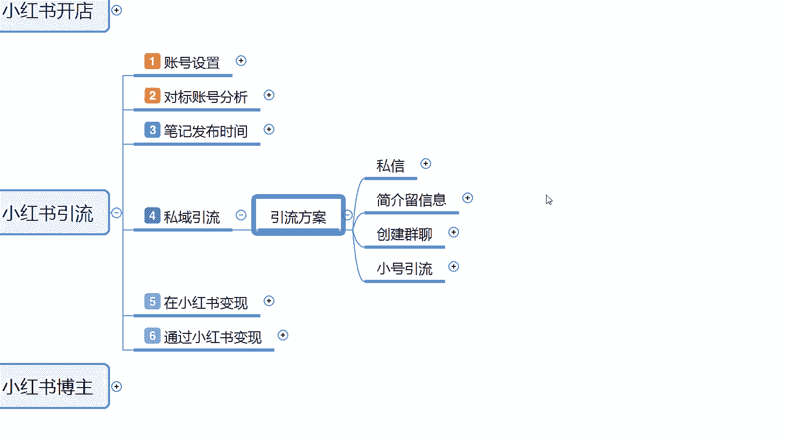

操作方式。

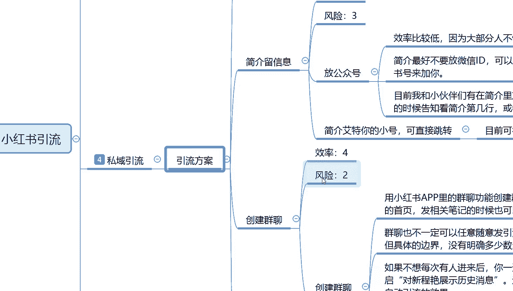

我们先来了解一下这里面的。一个人私信好吧。

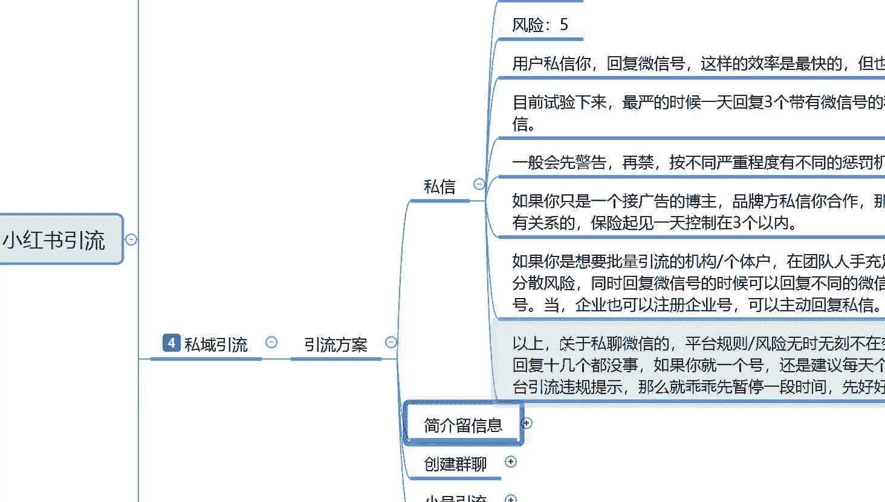

私信什么意思呢？😡，效率是最好的。就是说你如果说小红上面你要去做引流，私信，直接私信啊，对你关注啊，或者说是想了解这一部分产品的用户，你直接去主动私聊他，或者他来私聊你这种方式式是最快的。

但是他也是最危险。私信用户私信你回复微信号，这样的效率最快。但是呢风险也是最乖最高的。目前就的话就是我们测试下来以后的话，最严的时候一天回复三个带有微信的一个私信号。就会收到小红书的一个警告。

一般的话会先警告再进。按不同的一个严重程度的话，有一种不同的处罚机制啊，去看小红书系统怎么给你判定。如果你只是一个接广告的博主的话，就说品牌方私信你合作，那么你可以直接回复微信号，这个没什么关系啊。

但保险企业的话，就是说你一天做引流之类的话，一天的话啊，回复三个就可以了。你做博主的话，其实还好。但是你如果说是个人引流的话。就是控制在3个以内，基本上的话问题不大。如果说超过这三个的话呃，就不行了。

那你都按照这个私信的引流方式的话，你要很多组账号啊，不是不是小号了，这个就是要很多组账号了。因为你一天的话只能私信3个人。对吧它的一个引流效果，虽然说直接交流的风险啊很高，但是它。

对用户的一个感官态度的话是最好的啊，就是效率是最好的。如果说你要想批量的。引流的话就是说机构或者说是我们个人在团队人数充足的情况下啊，就是说这种方式的话，你只能做去做举证。如果说你不做矩阵的话。

你的号封不过来。😡，懂意思吧？但是你举证的话，一个投入呃，像这种私信方式你去做的话，一个号最多活个半个月到一个月。相同的内容你发送以后的话，到活的时间的话也就是3个月左右。3个月的话，90天。

一天三个也就200多个200多号人。啊，但是你这个投入的话可能会。精力投入的精力可能会大一点啊，个人投入的话是没什么资金投入的。就是你建号三号，然后起号的话可能会麻烦一点。

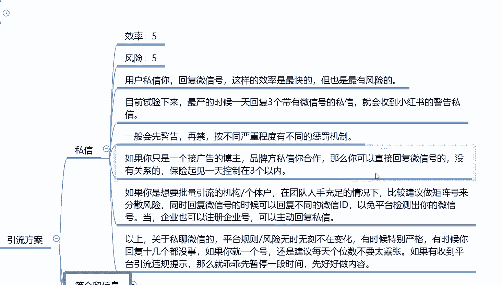

就说上面的话啊关于微信的一个私信平台风险，无风险时刻，就是说他无时无刻不在变化啊，有时候特别严，有时候的话你回复十几个都没问题。如果你就一个号的话，还是。建议每天就三个以类，不要太嚣张了啊。

如果说你觉得你账号多，然后能弄过来的话，就是呃有有收到平台违规提示的话，那么就乖乖点一段时间，没有收到的话，那你就随便加吧。啊，反正你这个号的话，你就是做一段时间想让他死掉，然后再换号再做。

那就没什么关系了啊。看个人对自己这个小红书账号舍不舍得。

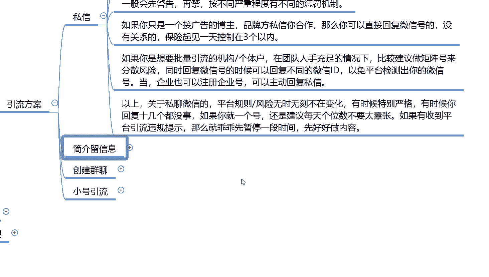

第二个就是简介留言。简介留言的话就是刚刚给大家看到那个呃效标风险3，比如说放公众号效率比较低，因为大部分的话不懂谐音。目前简辑最好的话就是不要放微信的一个，直接放微信的ID啊。

可以把你的小红书号改成ID。然后的话一些品牌。品牌商的话就是说直接会粘贴你的小红书号来加你。他们如果说懂的话，基本上都懂这些方式。因为如果说你需要你帮他去做广告啊，做推广啊，这种的话。

别人都会主动想方设法联系你。从你自己个人的一个页面设计里面的，基本上都能联系到你的。然后就是简介里面艾特你的小号可以直接跳转。目前的话基本上是没什么风险的。什么意思呢？就是在简简介里面。

然后别人有人聊天，你那个不是有笔记嘛？笔记里面你@特你的小号，然后的话让别人去直接联系你的小号，你然后再用小号的话去加这种的话就是多了一个步骤。但是它基本上的话风险就比较低了啊，效率稍微慢一点。

因为你要多走一个渠道。

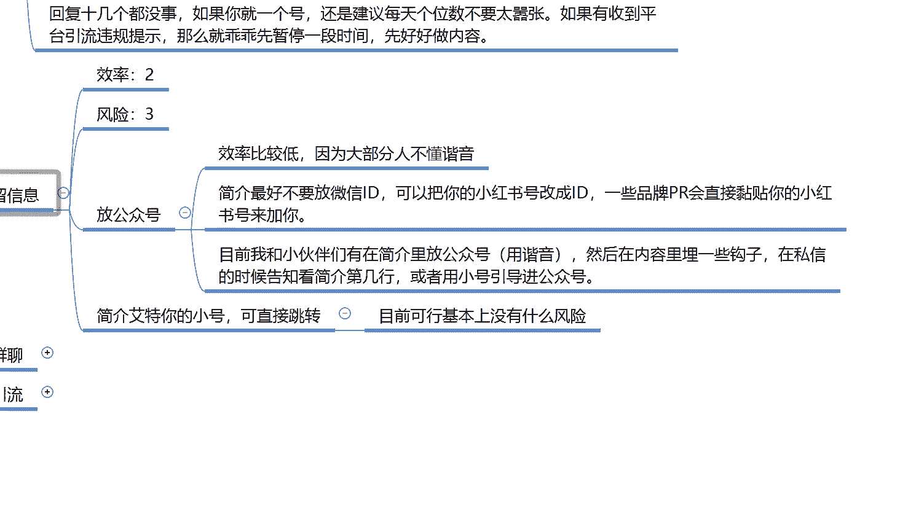

后面的一个创建群聊啊，效率是4，风险是2，但是稍微麻烦一点嗯。

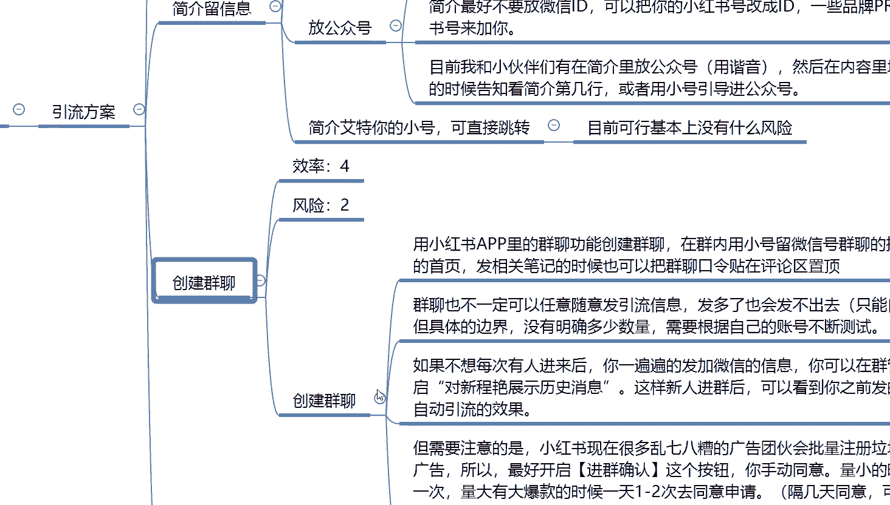

用小红输入APAPP里面的一个群聊功能，就是如果说有人对这个方面感兴趣，那你就在那个呃账号设置里面有一个群聊设置。你把账号创建一个群聊系统，一对一的，你把对应感兴趣的用户拉进去以后，再把你的小号拉进去。

用你的小号去发送微信，然后自己的主账号的话是不说任何话的，然后的话再屏蔽掉，然后再退出去就行，剩下的就交给小号和那个用户进行沟通。然后用户进行沟通以后的话，你们再去聊关于他感兴趣的内容啊。

你自己在么做引导的话，那我就是吧？因为不知道你是做什么产品的，我就没办法做那个详细的一个介绍。基本上的话嗯。就按照这种步骤去做的话，创新群聊群聊的话，它的效率还是非常高的啊。因为呃说实话少了一个步骤啊。

你直接把别人别人私信你以后，你直接把他拉群聊。群聊里面有小号去弄，你就节约了一个步骤，而且它的一个风险基本上是非常小的封号也是封小号跟你的主账号没什么关系的啊。

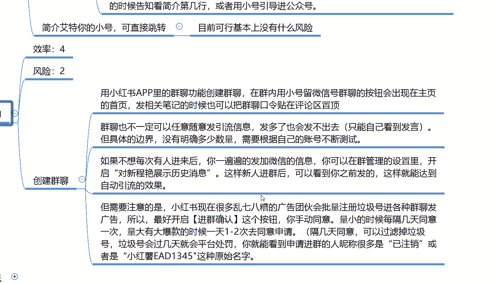

然后小号也牛啊，建一个小号发布一条视频，带有微信的1个ID。然后呢，大会在评评论区里面挨一条小号，指路用户去小号找这种的话，就是说效率说实在的啊比较一般。

风险。没有，因为他主要封号的话，也是封你的小号，不会去涉及到你的大号。你大号在里面的话，多艾特几个人多艾特几个小号，然后把小号的一些标签设置啊直接引流往你的呃流量渠道里面跑就行了。方法我就第四个点啊。

给大家说一下就可以。大家主要是了解一下。那这一节课呢就到这里呃，主要的话就是给大家介绍一下我们这个。

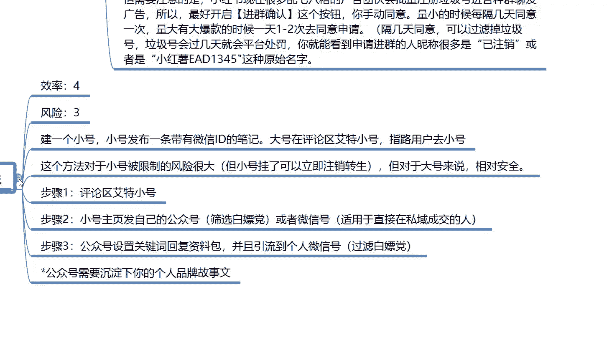

怎么说呢？😡。

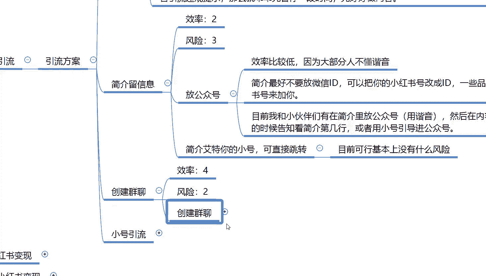

引流方案里面啊。你个人。创建群聊去做引流的时候啊。自己通过自己的产品综合性评判一下，你觉得哪个方面你又去做哪个。因为有时候的话呃引流方案这四个目前是使用的最多的。你就说私信的话快是快啊。

但是你的更新换代的一个矩证小账号的话会死的比较快。你用留言简介的话，虽然说安全是安全，但是它的效率的话会多一个步骤。呃，这里面的话会塞塞掉一部分的用户。你可能的话本来是引流100个。

你到最后可能只能引流60个到70个啊，就是有百分之接近30%的一个流失率。群聊和小号的话，群聊稍微好一点。群聊的话就是说流失率没有那么大，但是也有流失率。私信的话是没有任何流失率的。

但是其他方式的话会安全一点。私信的话就是。高风险高回报，但是账号封禁比较快，你要有资源的话，可以没资源的话，做不了。这个就是小红书做引流的啊，其他的方式的话基本上都是差不多的。

就说我们把账号设置完以后的话，你按照那个笔记制作的那种制作笔记，然后的话去发，基本上的话按照这种思域引流的方式都没什么太大问题，都是可以做引流的，就看你自己的那个账号权中呃。

自己是想做长期的还是短期的对吧。然后小红书变现和通过小红数变现这个的话，说实话你做引流的话，无非就是引流到别的地方。这个里面的话，你接广告啊，小红书变现说实话是属于博组类的一个内容。

我只是把它提前拉上来了，让你们了解一下啊。那下节课的话就再给大家分享这个内容。

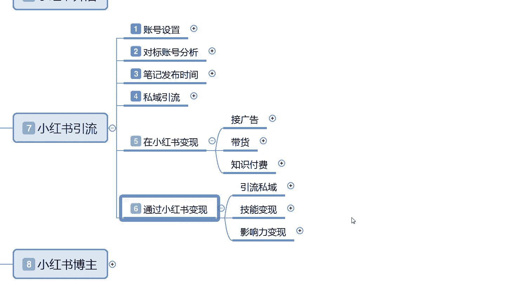