# 比刷剧还爽!!2024(全新)小红书运营网课，小红书运营大佬专为为学渣研制的小红书开店、小红书起号零基础保姆级教程，全程通俗易懂，纯干货无废话 - P32：31、小红书账号引流方式（3） - 秋枫不入睡 - BV1AAtHebEvj

大家好，今天给大家分享的是小红书全方位分享的第七大课时，小红书引流的一个内容。

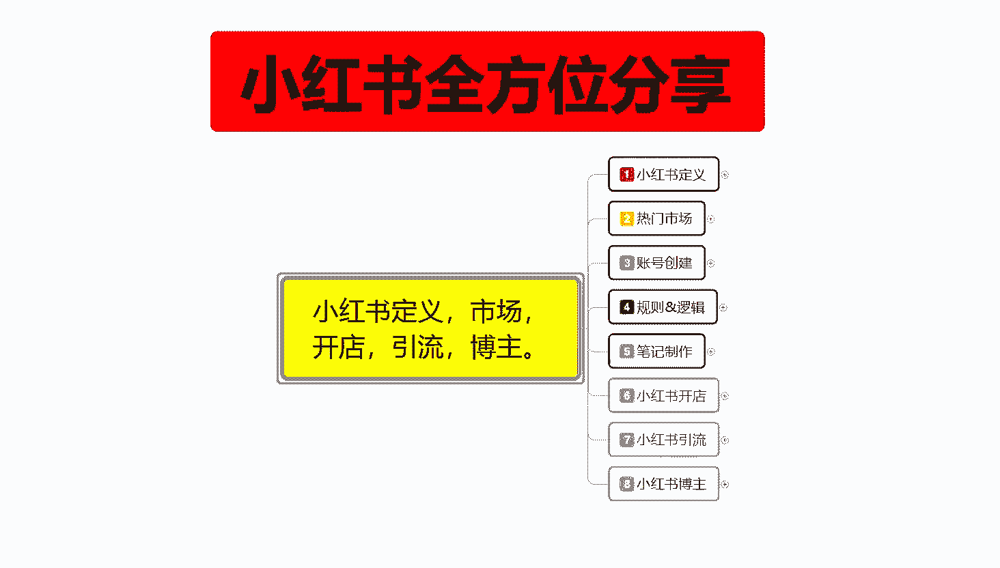

呃，这节课的话给大家分享一下小红书的一个变形方式啊。你不管是说引流做博组，基本上都是靠这个变形方式去操作的。

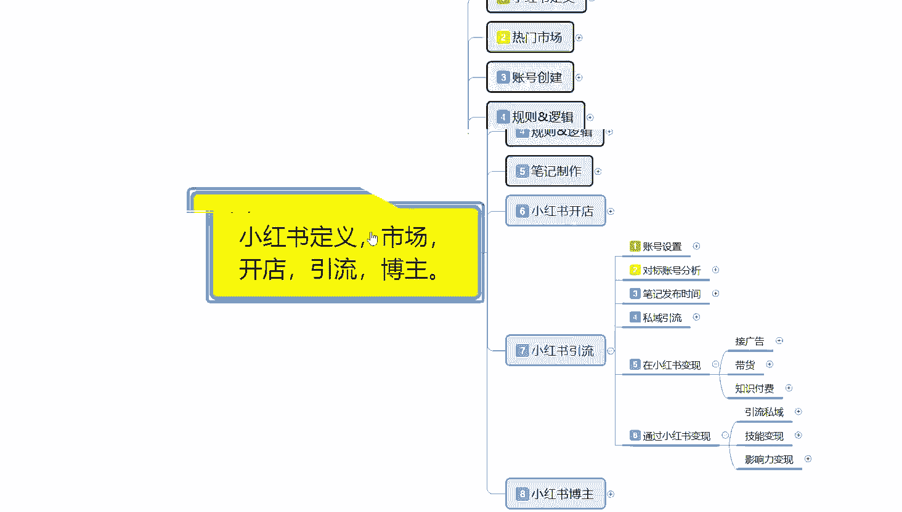

小红书变现方式其实很简单，在小红书变现的话，你就是无费接广告带货，然后呢自是付费。第二个呢就是通过小红书变现，都通过小红变现的话，你说实话就是思域引流引流，把用户引流到思域，然后自己去做做沟通。

做成交之类的。然后的话就是技能变现和影响力变现。

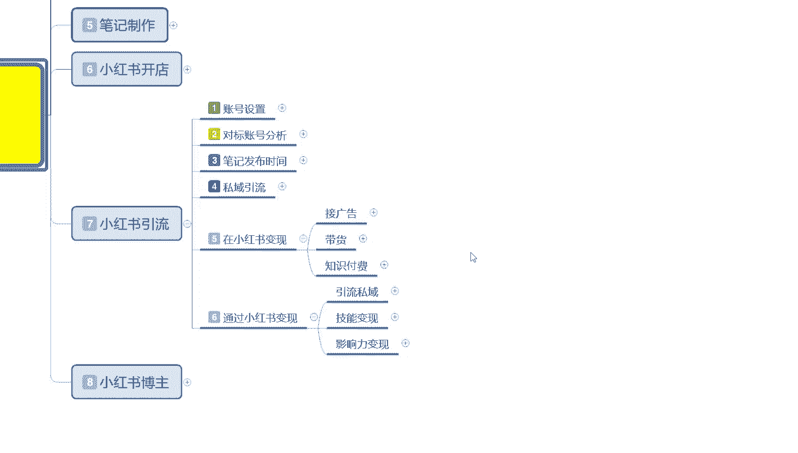

首先是接广告。

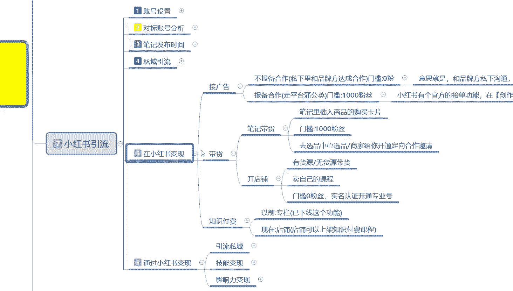

啊，这广告这里面的话有一个不报备合作，就是私下里面你自己去和品牌商去做沟通。然后的话呃。达成合作门槛的话就基本上没有。就是你自己做了以后的话，别人给你多少报酬，你就拿多少报酬就行了。

就相当于是一个打工的。嗯，意思就是说你和品牌方私下去沟通，私下达成合作私下完成转账授钱这种事情。然后的话你只是帮他在那个小红书上面做一下推广。这种的话说实话效益。工资不高啊，就是纯打工的，工资不高。

只是说你自己有办法的话，你去跟别人聊的话，工资可能就会高一点。第二个呢就是报备合作走平台的一个公益。然后的话门槛是1000粉丝，但是嗯这种粉丝的话，你说实话就是拿笔记，然后去做推广别人的一个东西。

他的需求量，就是你在小红书上面你有1000粉丝了，你就能接。但是你能不能接到就另外一回事了。而且还看你的人群符不符合别人的一个需求。然后他这个里面的话就是拉提成，按按提成，按进入的一个访客去聊的。

你基本上1000粉丝你去做这个的话，很难拿到项目。你粉丝如果说多一点的话，项目就会好一点。一千0粉丝你去做的话，一个月弄个几千块钱可能稍微简单一点。但是你想弄多的基本上就弄不到了啊。

就是说小红书有个官方的一个接单功能，在那个创作中心里面啊，内陆合作那边接单。粉丝门槛啊最低粉丝门槛是以0，但是具体的话，你还看自己怎么去操作。

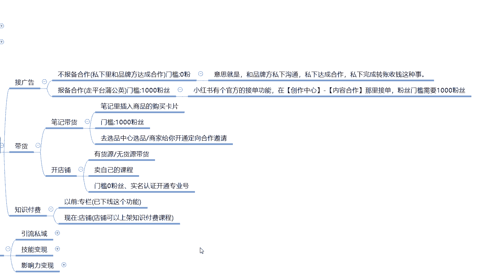

第二个呢是带货，带货的话，这个里面就是笔记带货和开店。开店的话就是无货源的一个自己开店，就是一键代发，然后自己去卖，或者说自己卖课程。嗯，比方说什么钢琴课啊、美工课啊、PS呀等等之类的。你不行的话。

你再教别人怎么化妆之类的都能卖。你把它录成视频以后直接在小红上面去发虚拟虚拟产品，然后的话虚拟课程，别人购买以后的话，你把视频发给别人，然后做成交就行。就是说这种的话是没有粉丝门槛的啊。

你就看你自己的推广做的怎么样。上面的笔记带货的话，就是笔记里面插入商品的一个购买卡片。或者说是在商品里面直接去呃通过发通过自己的话术啊、文字啊之类的描述你想宣传的一个广告类。门槛也是1000粉丝啊。

去选品中心选品，然后的话商家给你开通定向合作。这个里面的话，商家你能给商家引多少流量？然后看流量的一个点击率和转化率获得那个。呃，至金。第三个就是付费知识啊，付费知识以前的话小红书是有个专栏的。

但是现在的话基本上就没有了。现在基本上都是店铺店铺的话就是说上家那个付费知识的一个课程，就是开店铺里面啊，自己无货源，无会员开店，无会员开店以后的话，自己卖课程。啊，就这三个方式。这个就是在小红书啊。

通过小红书这种流量渠道的话去变现。第二个呢就是呃通过小红书变现做思域引流。

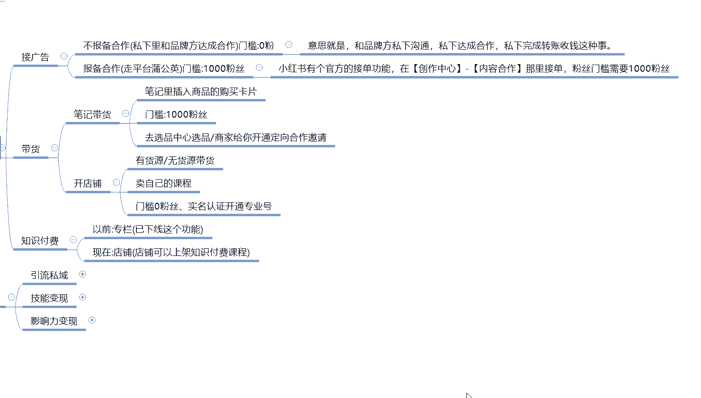

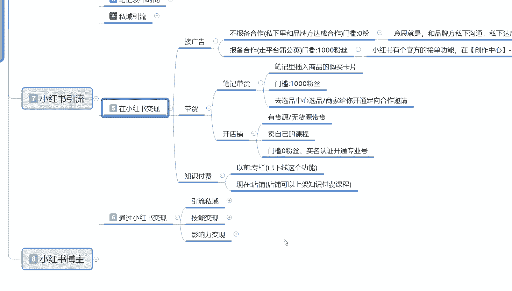

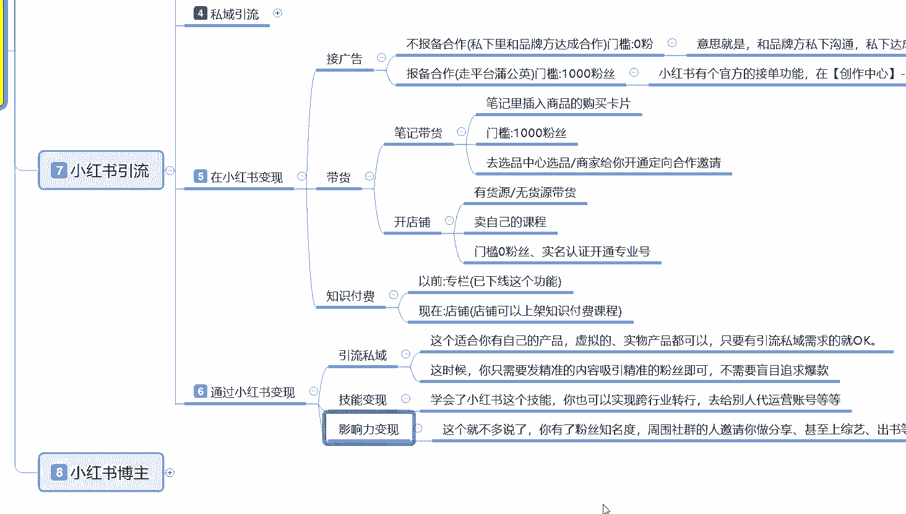

什么意思呢？就是说这个的话适合你自己的产品，然后的话或者说自己这边有公司想做那个小红书私域引流，然后的话不知道有什么渠道，就按照我教大家的这种课程方式，你先把账号设置，账号设置好以后的话，直接去发笔记。

笔记好了以后的话，然后通过那个呃私域引流的方式，私信啊，对吧？短信啊小号艾特人哪群聊啊，这几个方式，然后的话直接把流量引到自己的一个群里面去就行了。引到群里面以后的话。

你就按照自己的一个操作思路或者操作模式，然后再去和用户去聊。这个就是引流，把流量的话引到别的地方去。做成交转化通过这种方式你去做转化的话，就是避开了小红书官方的一个交易平台。就是通过小红书方式的编现。

第二个就是技能编现啊，技能编更啊就相当于是你在小红书上面嗯。怎么说呢？你自己有一技之长，你比方说你会些什么东西啊，然后的话通过这种词语引流的方式啊，自己收学员数学徒啊，或者说是呃教别人怎么做呀。

私教老师啊，教英语啊等等，这些都是可以的啊，你也可以实现跨行业的一个转行，就相当于是你在小红书上面给自己打广告，然后把自己推出去，然后有人来找你想学习你这一部分技能，你教别人怎么做收学费就行了。啊。

当然了，你要学我这个课程，学会了去给别人做代运营也是一样的。但是就看你自己能学多少东西了啊。最后一个是影响力变现。影响力变现的话，这个是博主的啊，这个就不多说了。这个因为它是博主的一个内容。呃。

你网络博主，你自己的一个账号有个几万粉丝以后的话，你都不用自己去宣传，别人都会来找你的，让你帮他推广告啊，推藏品啊之类的，对吧？有名气以后什么都好做，没名气一些，你只能自己默默默闻的再来爬。

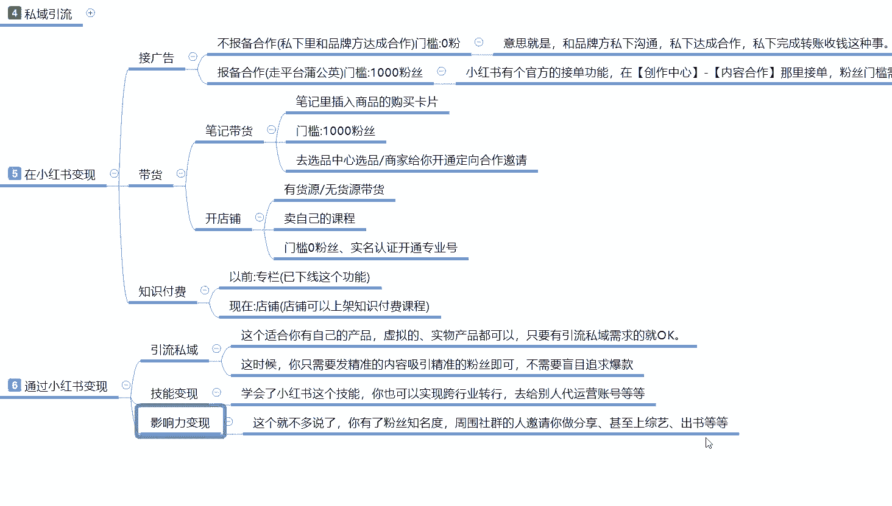

这个的话基本上说你不管做小红书也好，做抖音也好，基本上都是这样。

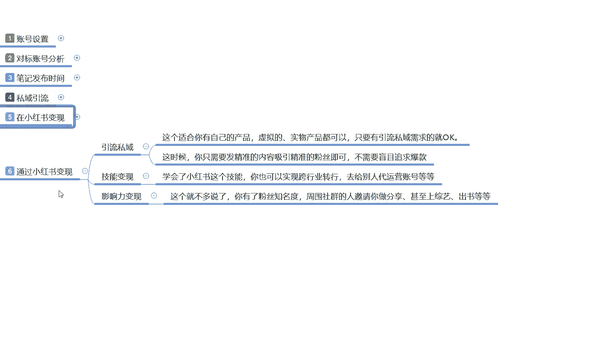

那这一节课呢就给大家分享到这儿啊，下一节课开始呢讲解最后一个大点的内容，小红书的一个博组。

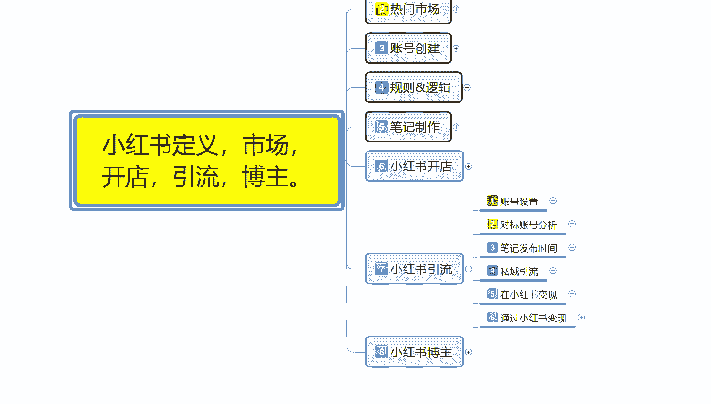