# 比刷剧还爽!!2024(全新)小红书运营网课，小红书运营大佬专为为学渣研制的小红书开店、小红书起号零基础保姆级教程，全程通俗易懂，纯干货无废话 - P33：32、小红书账号引流方式（4） - 秋枫不入睡 - BV1AAtHebEvj

大家好，今天给大家分享的是小红书全方位整体分享的最后一节课啊，小红书博主。呃，重复的内容之前给大家讲过的，我就不过多的一个重复了。所以说这节课学的内容的话看式很大，其实不怎么大的啊。

做分析账号规划，你用小红书的引流那个方式的话去做也可以。但是这个里面的话有一个点就是个人信息的一个组织搭配啊。

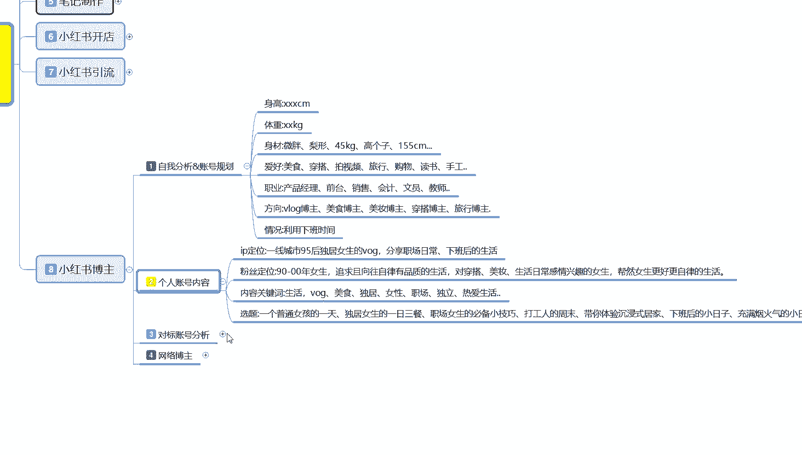

身高、体重、身材爱好、职业方向利用情况，这是个人自己给做给自己看的，就是你个人的信息能不能满足做博主这一个需求。如果说你不满足的话，有些东西你就把它屏蔽掉。如果说你满足啊，你就把你留下来啊。

放在你自己的背景简介里面去介绍自己，对吧？你就相当于交朋友谈朋友，你先给别人说一下自己的一个个人情况，然后的话吸引同类型的一个人群，如果说你是做什么美妆博主啊，或者是呃化妆博主啊。

或者说是美食博主啊等等这些东西的话，就是完美的介绍一下自己。当然要包括个人的一个情况，因为越真实你获得的认可也就越高。

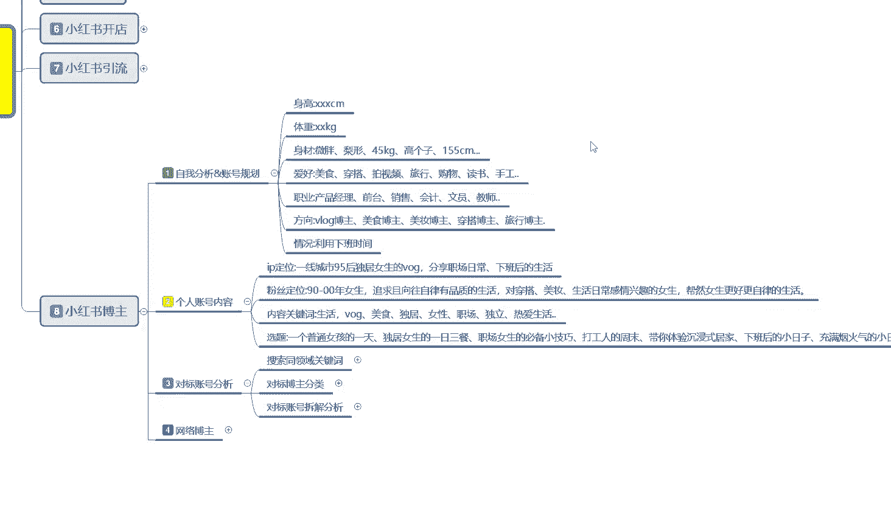

其他的话同时呢也是给自己做一个定位。然后个人账号的内容的话，这个里面就是IP定位。然后的话粉丝定位内容关键词，然后选题就是你自己网准备做网络博主。那你要选择一个题目和宣传片啊。一个社区里面选一个类目。

选一个类目做完以后，你再往其他地方去扩可以。但是你不能选一个社区以后，所有的类目你都想去参加啊。那样的方式的话是做不起来的。所以说个人账号的一个内容的话，你要首先确定自己给自己设一个人设。什么叫人设呢？

比方说你是一线城市，90后或者95后的一个独居女女性啊，每日的一个生活分享啊，或者职场日常下班或者生活等等都是可以的。就是说你在小公上面，你无所拘禁，想发什么发什么啊，对你个人呢是没有什么需求的。

但是你要根据自己的个人情况，去了解自己的1个IP定位，就是自己去怎么设设定以后的话，然后每天分享的是什么内容。确定好以后的话。确定你自己的粉丝定位。对吧你自己是什么状态？那么其他的朋友是什么状态。

那你就要设定他们自己的一个粉丝定位。意思就是你要把自己啊打造成他们同类型的人群，然后你是领头羊，他们都是跟着你走的。通过这种网络模式的话，你去给他们介绍吃喝玩乐就非常方便。

然后给他们介绍其他的东西也非常方便啊，就看你自己的人设怎么去摆。这个就是小红书的一个博主。内容确定以后的话就是选择内容的一个关键词。因为人群里是选了，对吧？粉丝定位你选了粉丝定位里面它还有什么呀？

美食独居、女性、职场、独立、热爱生活等各个方面的一个小话题。什么意思呢？小话题里面你选择2到3个去做日常分享就行，多了一后你忙不过来啊。然后再进一步的去吸引他们的一个注意力。吸引过后的话。

你就相当于是领头羊领头羊的话，那你在下面如果说你有凝聚力的话，你后续你是想去做店也好，去推广产品也好，接广告也好，或者说介绍周边的美食，什么地方好玩，什么地方聚会，然后的话对吧？基本上都可以做了啊。

多的我就不说，你明白的话就明白，不明白的话，有些东西你讲太明白了也不好，是吧？选题就是你自己给自己的一个嗯。发表内容进行一个选题啊，当然你去推广什么书籍啊之类的都是可以的。

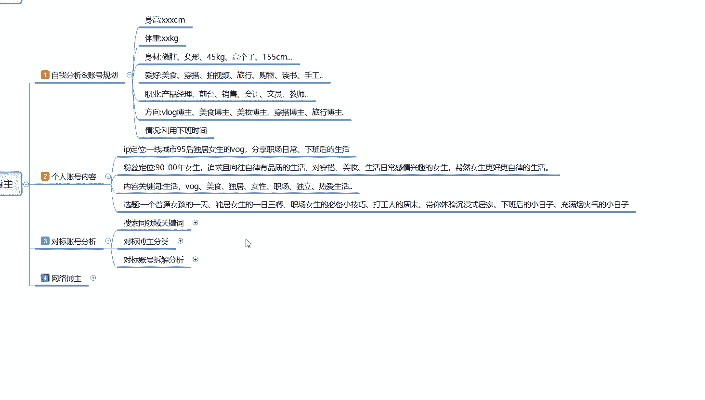

第3个对标账号分析和之前的那个小红书店铺是一样的啊。

这个是一样的，因为你的所有对标账号分析的话，在小红书里面，它的模式是没有变化的。呃，你们不了解的话，可以往前面的课程去看一看。

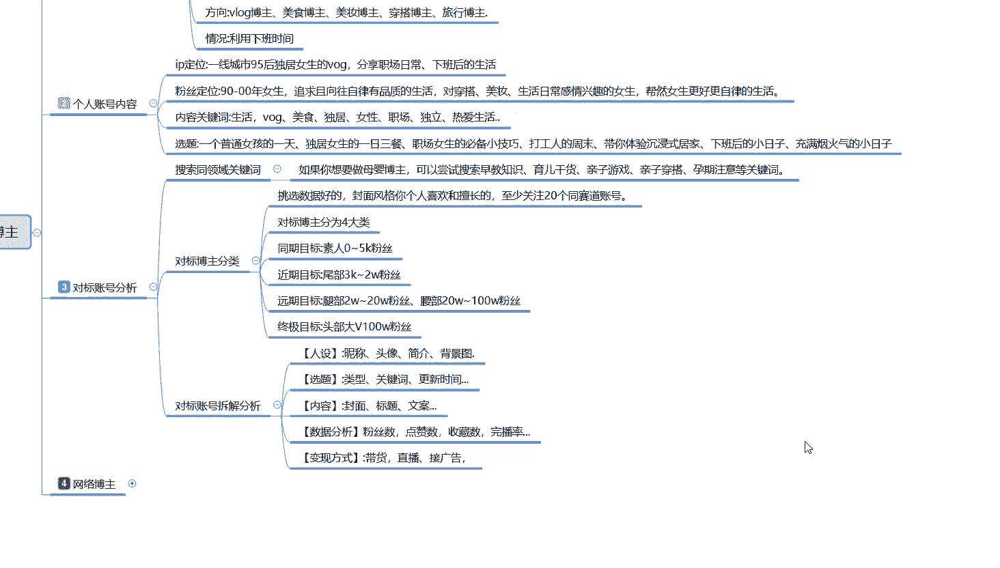

在这个店铺操作里面。

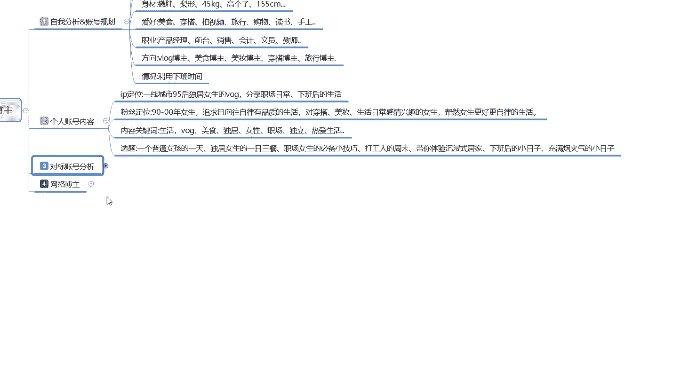

讲过的我就不讲了，最后呢就是网络播。

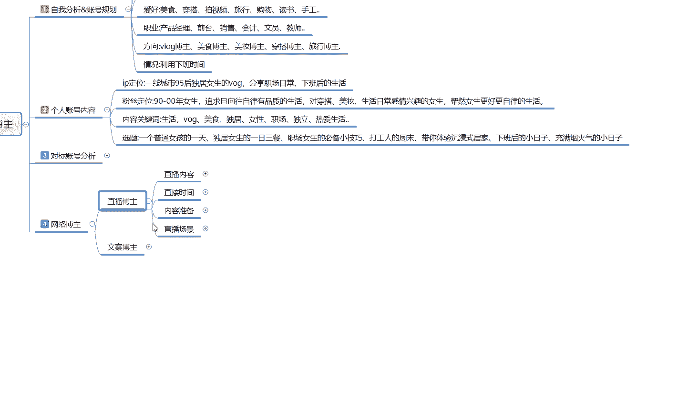

这个里面的话就是网络博主，你本来就已经准备在小红上面去做网络博主了。那你得选择自己的一个呃。博主播放的一个方式，什么意思呢？你要做直播还是说文，对吧？你做直播博主。

那直播博主里面的内容就涉及到了这四个点。

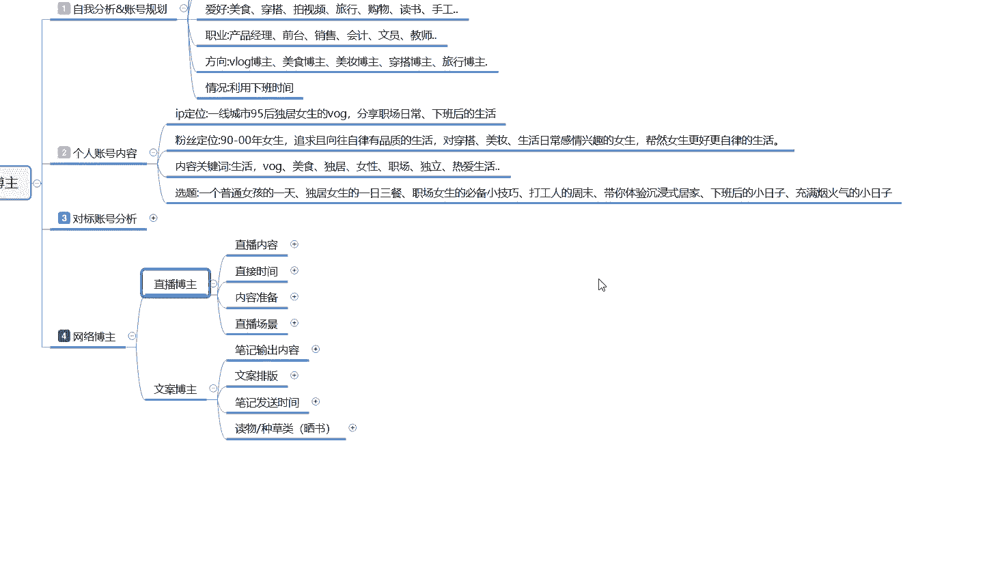

直播内容直播时间。

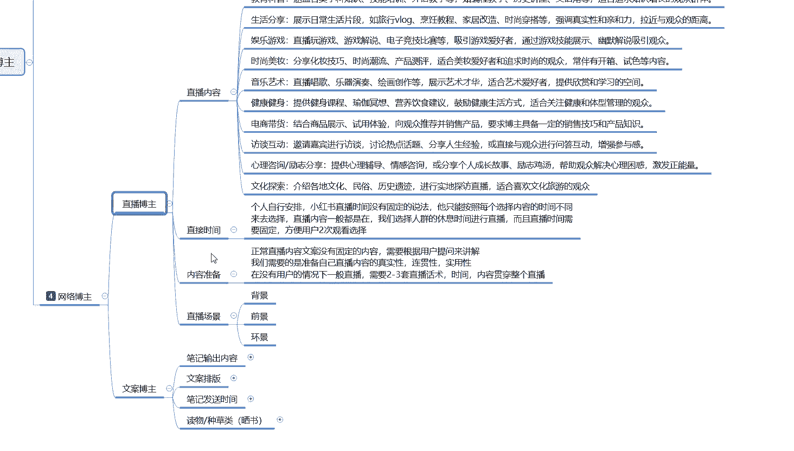

内容准备啊，自播场景。直播内容我就不去给你们一一进行讲解了。这个里面的话涉及了各行各业，什么内容都可以去选。你自己只要设定自己的目标以后的话，你基本上都能找到自己的一个呃输出环境。你比方说教育科普啊。

生活类的一个分享啊，时尚穿搭呀、访谈啊、电商啊、心理咨询员文化，基本上都可以的。你只要做博主，你就不限制这种的话本来就是放大你自己所擅长的范围，然后去吸引对应的一个人群的啊，博主就是这么简单和直接。

对吧？我讲我自己熟悉的一个专业领域，然后吸引你们不懂的人，或者说是你们懂，但是不了解的人，我们来一起进行交流，我教你们怎么去做啊，提高你自己的生活品质，通过这种方式啊，你才叫网络博主。不然的话。

你那个就叫引流啊。

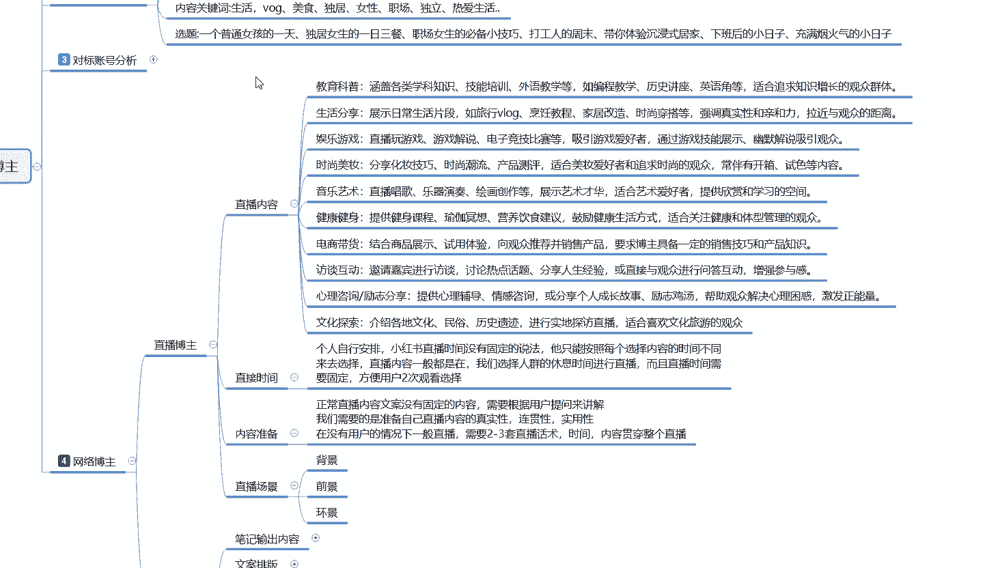

然后的话就是直播时间。啊，个人自行安排，就是说小红书的话，直播时间是没有固定的，基本上的话就是。嗯，自己想几点就几点，但是你需要有个固定时间，什么意思呢？就是说一天24小时。

24小时你随时都可以进行直播。但是你想做一个完美的一个主播的话，那你就把每天直播的时候当做工作时间去进行直播，而不是说你早上直播了一下，下午做直播了一下，明天不直播，后天不直播，第三天再来啊。

这种肯定是不行的。你需要有一个固定的直播时间。啊，多长时间问聊多久，那就是我看个人的一个。就是看我们自己个人想怎么去转化了。然后呢，就是内容准备。正常的话，就是说你前期直播间你做直播博主的话。

你的内容准备要做好最少2小时三个内容。去做分享，不然的话，你直播间前期是没有人的啊，你没有那么大的影响力和吸引力。你只有粉丝数，粉丝数起来了以后，你再去做直播也可以，呃，效果会比较好，就没有那么尴尬。

就不需要准备这么多内容。如果说你上来就直接想去做网络博主，然后想通过直播的方式宣传自己的话，那你就需要2到3出3套的一个直播话术。然后的话直播时间大概就是1到2个小时左右。然后才能慢慢活起来。

不然的话你的第一个时间不够。第二个的话重复的内容或者说是直播间里面没有人，你没有去进行互动啊，沟通之类的，别人进都不会进来啊，看到你都不会进来。

然后就最后呢就是直播场景的一个背景前景和环境的一个呃三位一体环境的一个选择就是。背景放什么，全景放什么，环景放什么。这个直播场景的话，就看你们个人的一个条件，自己去进行设置就可以了。这就是你直播博主啊。

我们所需要调整的一个方向。

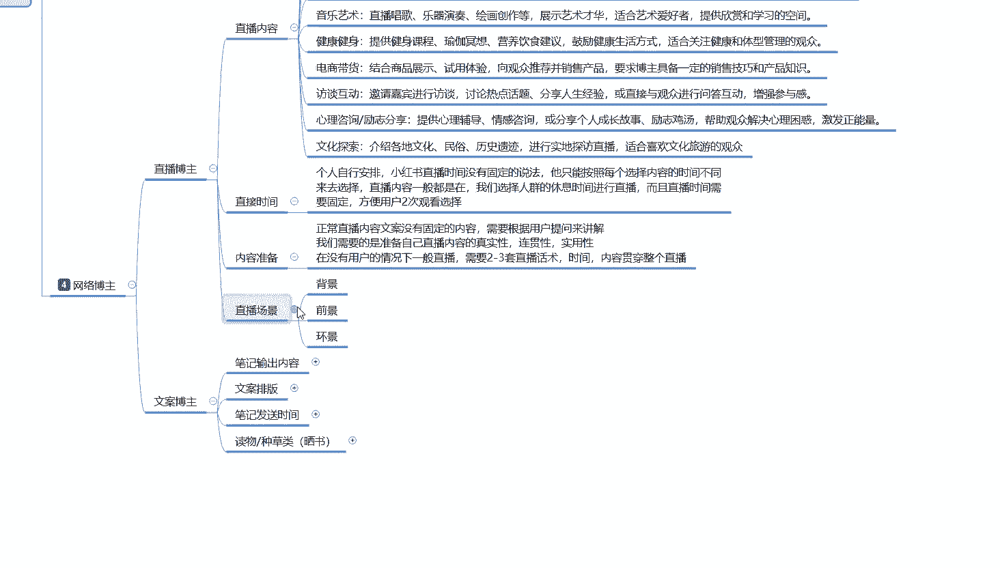

最后呢就是文案博主啊，文案博主的话，这个里面说实在的啊。比直播博主。怎么说呢？比直播博主的话要简单的多。因为直播博主的话，你要个人的一个个人本身在某一个方面需要有很好的一个素质。但是你文案博主的话。

说实话你对某些东西不熟，你可以直接去查资料。只播资料查完以后的话，你以那个文字的形式把它做成那个文案笔记进行发放就可以了。这个里面主要注意的就是一个笔记输出内容，然后的一个文模案拍版啊。

内容输出的话就是选择5分之4的一个实题输出，留5分之1的一个猜测内容。就说你有时候的话，你把那个答案的话，不能全部写在你的那个呃笔记里面，留5分之1的一个猜测内容的话，就是用小号进行引导评论啊。

把你的账号活跃度做起来，做活跃以后的话，观看的人才会多。文案排版的话就是呃主板图片的话选择3到5张，就是你的笔记选3到5张图片进行排版。嗯，猜测内容在第一位吸引用户。

然后的话第二位的一个内容就是解说第一位的内容进行宣传。因为你第一类的内容的话，就是笔记核心里面的一个笔记封面和笔记的一个关键词。他们俩是最重要的。通过这样的方式去吸引用户，然后在第二个版页进行解答。

第三个版页，第四个板页进行延伸。第五个版页留下下一堂课，也就是下一个笔记的一个主体内容。通过这种方式无限进行循环啊。吸引更多的用户来关注你，了解你下一步更新的一个动态。有时候的话。

用户可能还会去评论区里面催你更新。就是。类似于做长版小说，然后你自己去做推广，做了解啊。就看你自己怎么去拍吧。笔记发布时间的话也是一样的啊，这个的话就跟那个商品笔记一样的，看你自己选的内容自己去发。

最后一点呢就是读物种草类的。这个的话就是怎么说呢？

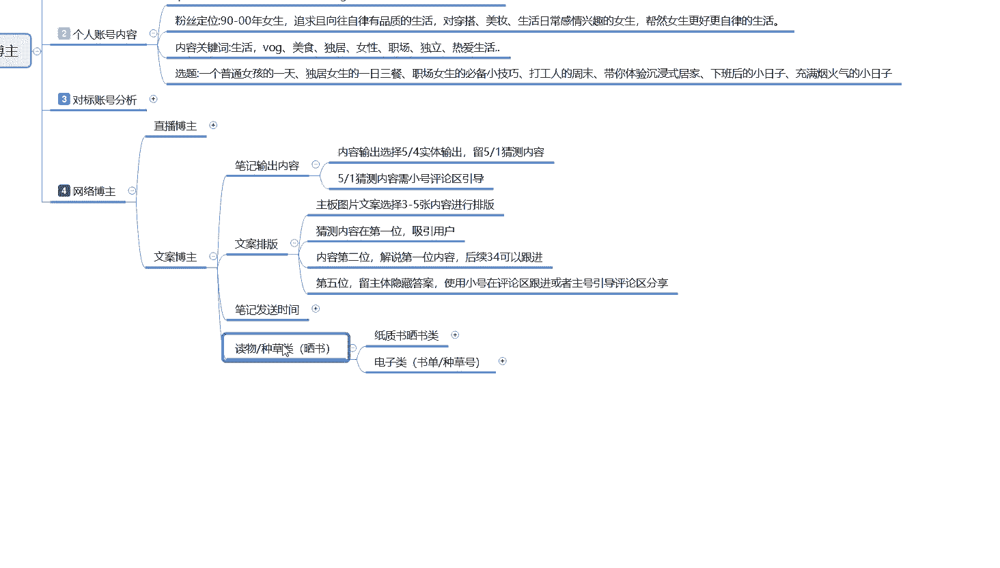

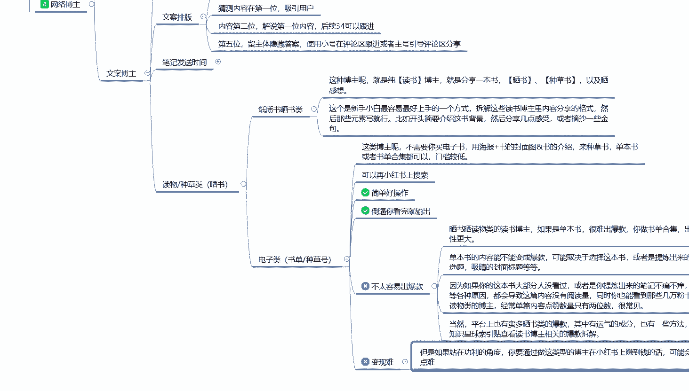

给大介绍你就是。做网络博主啊，你不管是做其他类型的网络博主，或者说呃食品美食啊，基本上都一样。这里的话我只是给大家举了一个简单的例子。你比方说做那个毒物种草类的一个赛酥博主啊。

只是赛书类这种博主呢就是纯的一个读书博主，就是分享一本书赛书种草以及赛书的一个感想啊，这个就是博主。也是最简单，在小红上面。起好最简单的一种方式，但是它的变现难度非常大啊。

因为你自己本身就没有什么呃过硬的一个技术。这个的话就比较适合新手小白去操作了啊。你们大家看一下了解一下。如果说你想往这个方面发展的话，可以去呃深入的研究一下。过多的我就播给大家进行。详细的一个讲解。

你们大概了解一下就行。好吧。那这一整期的课程呢就给大家分享到这儿。呃，主要的话就是让大家更加的了解小红书啊，做小红书的时候少走弯路，我们下期的话再见。

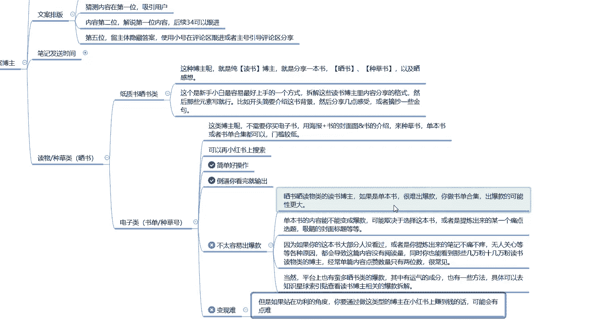

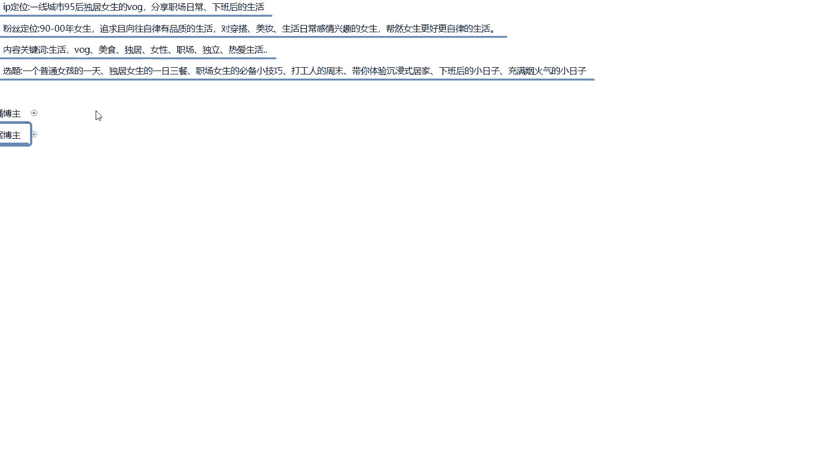

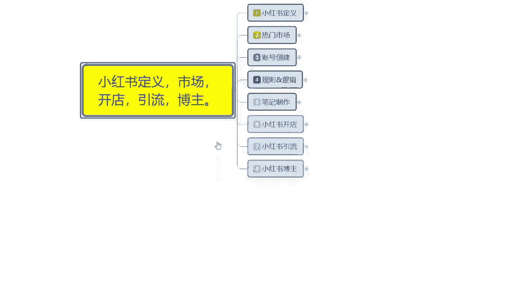

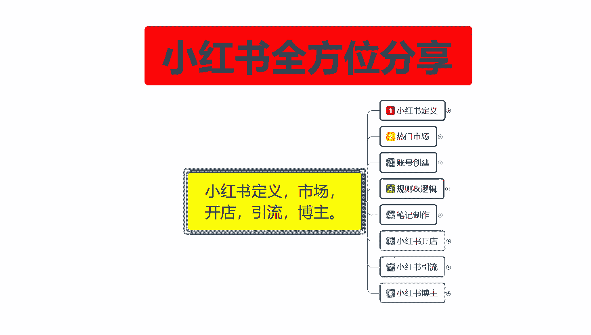