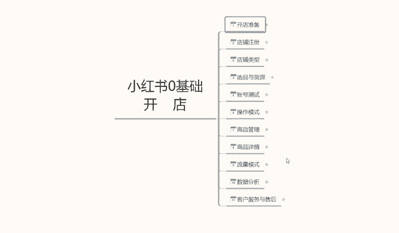
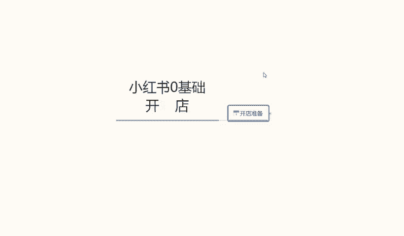
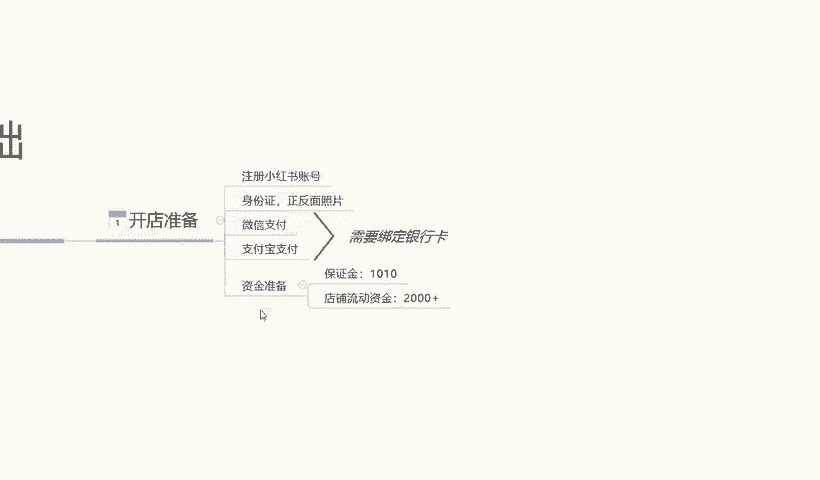
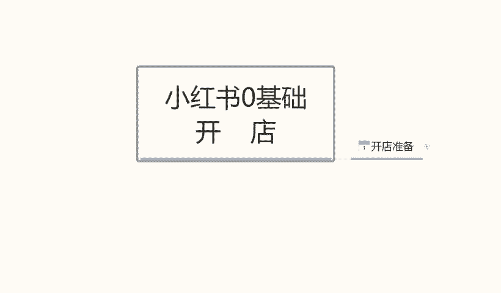

# 比刷剧还爽!!2024(全新)小红书运营网课，小红书运营大佬专为为学渣研制的小红书开店、小红书起号零基础保姆级教程，全程通俗易懂，纯干货无废话 - P34：33、小红书0基础开店-开店前的准备 - 秋枫不入睡 - BV1AAtHebEvj

你好，今天给大家分享一个小红书，零基础开店的全套一个课程内容。这个课程内容呢包括十一节的。内容准备。首先呢我们从开店准备开始，一直呢到我们最后的一个客服服务与售后啊。

整个店铺呢它是讲解我们小红书零基础开店的一个整体操作。啊，当我们学会这个模式以后的话，我们前期小红书开店的话，所有的基础准备就基本上全部都做完了。那么开始我们今天的第一节课啊，小红书的开店准备。

开店准备的话，小红书这边开店准备其实是比较容易的。首先我们只需要注册一个小红书的一个账号，然后呢准备身份证的一个正反面照片就可以。同时呢我们这里呢需要注意一个点呢。

就是我们需要拥有微信支付和支付宝支付啊。同时这两张呃支付方式的话，需要绑定银行卡。这两个支付方式的话，第一个呢是小红书到时候客户进行付款啊，我们进行收款的一个记录，同时绑定这些东西以后的话。

小红书它店铺的话，它也会有一个账号的权重会提升我们整个店铺的一个权重。如果说不做这几个东西的话，我们的一个系统的话，它是不完整的。也就是我们小红书的话，它是没办法正常运行的。

我们收到的一个流量和数据的话，基本上都会比较小啊，就是操作起来的话会很麻烦。最后一个呢就是说小红书的一个准备资金，保证金呢准备1001次，因为是1000块钱的保证金加7块多的一个手续费。

它这个里面的话和其他的一些平台的话可能会有一点区别。其他平台的话，我们只需要交保证金就可以啊，它是不需要收续手续费的。但是小红书这一块的话。它和其他的话可能会商业基础比较严重一点。它的那一个保证金的话。

还需要收取手续费，包括我们后续的一些那个产品卖出去以后啊，不管是我们怎么操作的，它都是要收手续费的。所以说这个的话我们大家一定要注意啊。所以说小红书的话，它的整体的一个。流量和大众效果的话还是不错的。

但是说呃在。资金成交这一块，包括我们这个店铺成交也好，或者说是其他的。只要是有资金流动的话，它的这个。是。税率吧，我们姑且这么认为吧，就是税收比例比较高啊，所以说大家一定要注意一点。然后呢。

店铺的一个流动资金准备的话呃，至少要被2000块钱以上。为什么呢？因为我们前期去操作店铺的话，它这个小红书没有任何数据的话，我们是没办法起店的。就说我们店铺起来以后的话，我们只交了保证金的话。

我们这个店铺也不好做。所以说这2000块钱的话是我们的一个产品的一个活动资金，包括我们前期操作数据啊啊，怎么去操作啊，都需要用到的一个店铺的一个流动资金。因为没有这个流动资金，我们去操作整个店铺的话。

它是。基本上是操作不起来啊，因为小红书跟其他的话不一样。这个呢就是我们开店所需要准备的一些数据啊，准备这几样东西以后的话，我们这个店铺开店准备就基本上已经完全完成了。就是说整个店铺我们就可以开始运行了。

后期的一些操作的话，我们再给大家讲解。其实的话，小红书整体的话，开店准备的一些东西都是比较简单的，主要就是说我们手机一部啊，身份证的一个正反面照片。当然必须要是本人的啊。

微信支付宝这个的话基本上现在基本上都有啊，但是呢他需要绑定银行卡，不要拿新注册的微信和支付宝去使用。这样的话它的一个。怎么说呢？就是说我们收款过多的话，呃，会导致这种账号容易被封，知道吧？

就是说到时候再去更换微信或者支付宝的话，不比较麻烦。所以说微信支付宝的话，一定要使用最少使用3年以上吧。大家一定要注意了，同时要绑定银行卡。这个银行卡的话，你不绑定银行卡的话，后续。

微信和支付宝的信息它是不关众的啊。那么这节课的内容呢就到这里，下节课呢给大家讲解一下我们的第二课时小红书的一个店铺注册啊，我们怎么去注册小红书的一个店铺，包括我们的一个操作步骤。

