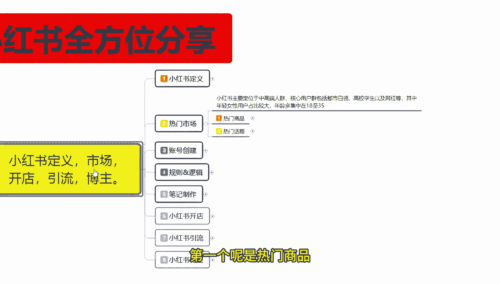
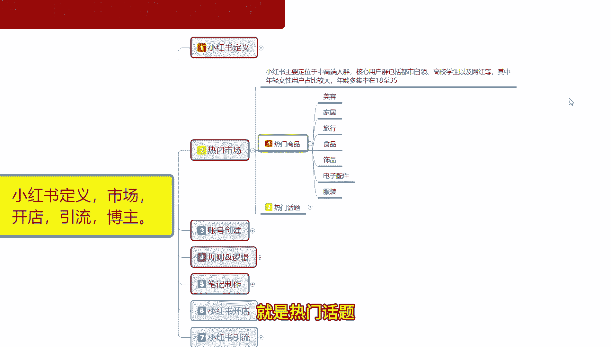
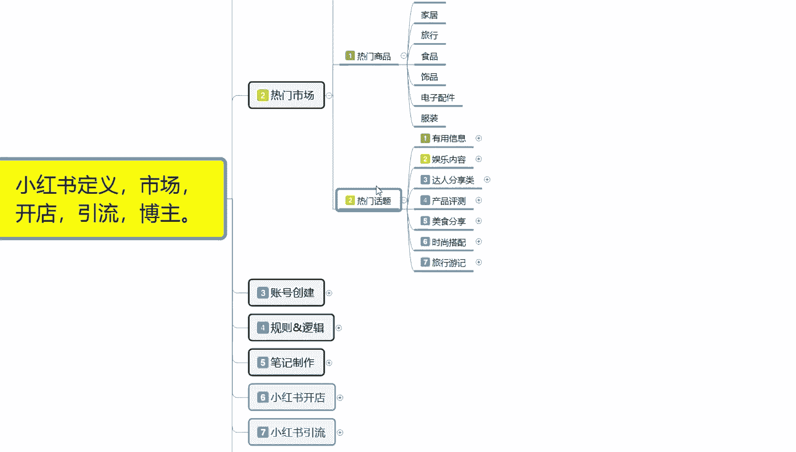
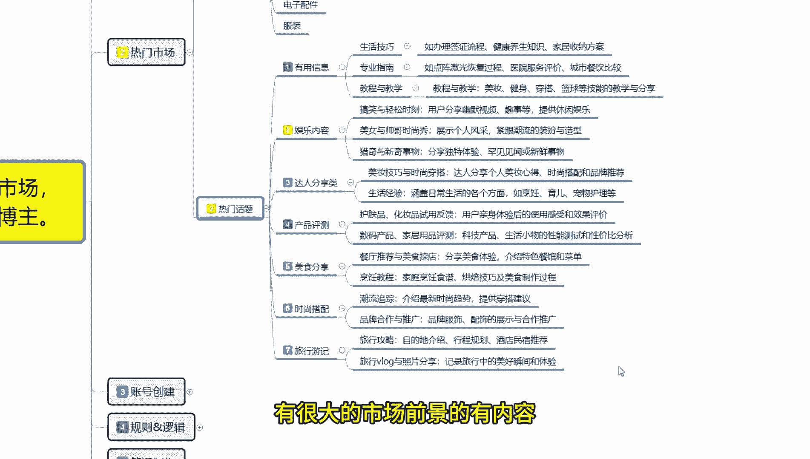
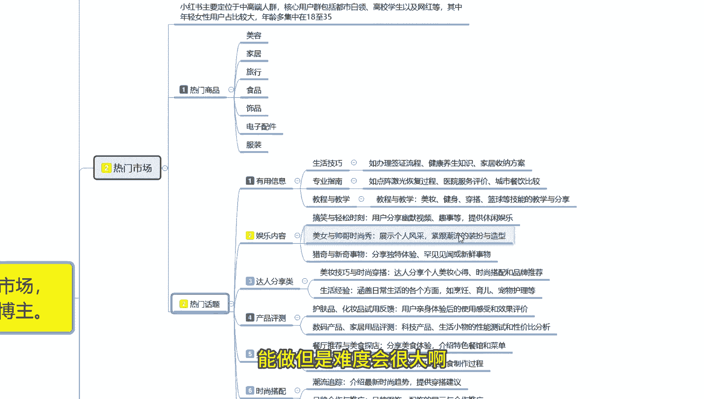
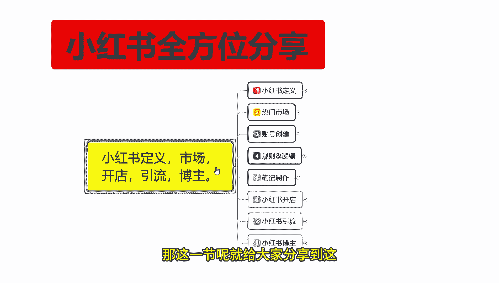
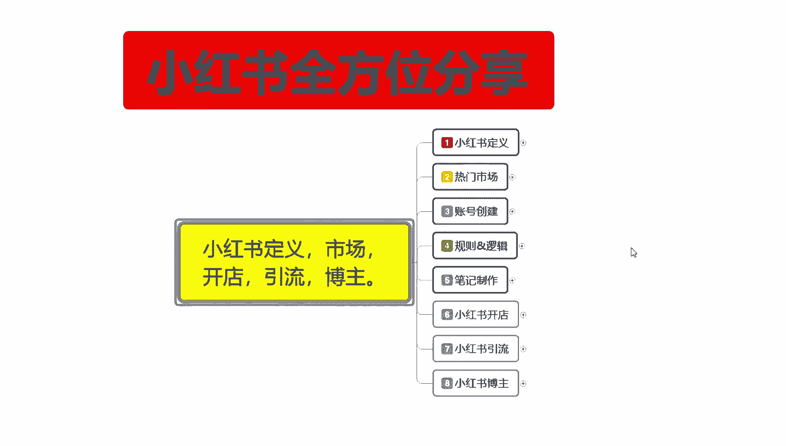
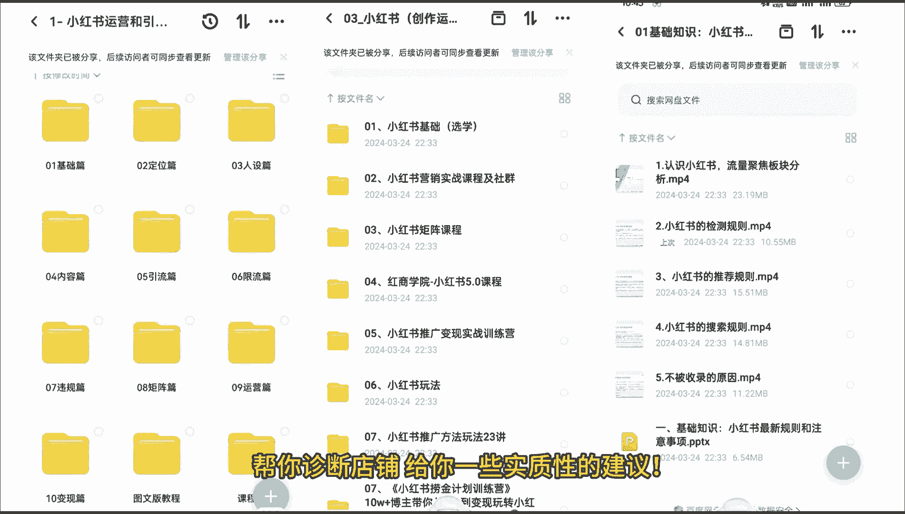

# 比刷剧还爽!!2024(全新)小红书运营网课，小红书运营大佬专为为学渣研制的小红书开店、小红书起号零基础保姆级教程，全程通俗易懂，纯干货无废话 - P3：2、小红书起号前必做热门市场分析 - 秋枫不入睡 - BV1AAtHebEvj

大家好，今天给大家分享的是小红书全国方位的一个整体分享。第二大课是认门市场。嗯，小红书的热门市场的话其实是非常好定义的啊，我们可以把它分为两个点来进行分享。第一个呢是热门商品，第二个呢是热门话题。

热门商品的话就是说我们做开店呃就比较方便。如果说你要想去了解热门话题的话，就是说做引流做博主啊，可能会方便一点。小红书主要定位的话就是说整体人群定位是中高端人群。

核心用户包括呃城市里面的一个都丝白领、高校学生以及网红等。其中年轻女性用户占比的话是最大的年龄的话，基本上基本上都是集中在18岁到35岁之间，再往下往下扩，你基本上能扩到14岁，15岁。啊，往上扩。

你能扩到40多岁。但是这两部分的一个用户群体的话，他们一个消费能力和一个的社会对社会的了解的话不是那么熟悉。对你对我们啊你在小红书上面想去做点引流博主的话，其实没有太大的一个帮助。

整体我们选定的一个年龄的话，基本上都是18到35，再往前面走的话，你最多只能控制到16再往后走的话，你最多只能控制到40，这就是热门市场，小红书的一个年龄税用范围。

再往前的话或往后就基本上没有什么嗯沟通的意义，知道吧？

我们先了解一下小红书目前的一个热门商品啊，热门商品里面的话基本上就是一个美容，一个家居，然后呢是旅游食品饰品往后走呢，就是电子配件和服饰。服饰你在其他地方的话，可能会了解到它是一个最大的市场。

但是小在小红书上面的话，它反而不是最大的市场。小红书上面最大的市场是什么呢？美容。第二个是什么呢？视频。往后是家居，然后是食品，再是旅行。之后的是电子配件。其次才是服装类的啊，因为它的一个市场。

它是偏女性化的，女性化，你买服装之类的话，它反而没那么热门。但是在美容方面，因为它小红书整体去做笔记分享，或者说是做内容分享的时候，很多都是。呃，化妆的一些技巧啊，哪个美容产品比较好用啊。

哪个美容产品的话使用又便宜，保持时间又长等等这些系列的分享。然后就是呃什么。指甲油啊，假指甲睫毛。美容。美容刚刚已经讲过了，然后的话它就是女性普遍使用比较频繁的物品。在小红书上面的话。

它的一个热门商品市场的话还比较高。我这里呢是给大家列了7个大点，但是7个大点往外是还有没有产品能有，但是它的热门程度的话就没有这么高了。这7个大点的话，可能会占比百小红书市场80%以上的一个内容。

你其他的一个些产品的话，可能只有15%到20%左右的一个内容。越偏冷门的是产品，你在小红书上面反而越不好卖。因为你第一没什么名气，第二，使用人数不多。啊，这个就是目前小红书上面的一个整体热门商品。

第二个呢就是热门话题。热门话题是什么呢？

呃，你做引流也好，做博主也好，我们要找一个话题进行切入，或者说你有产品啊，那你就是通过你的产品去小红书上面进行宣传。啊，把这帮用户呢集中拉到你自己所创建的小群，或者说是单独交流。

或者说给他营造一种氛围去进行交流，让用户了解你的产品进行分享。这里面的话就包括有用的信息娱内容内容、达人分享类产品测评、美食分享、时尚搭配。旅行邮寄第七个大点。

这7个点的话其实是比较好进行分类的啊。首先呢是生活技巧，专业指南教程与教学。后续后面的内容我就不会去给你们一一的进行讲解，你们自己了解，做某一定某一特定内容的话，它的一个属性点还是非常高的。

你包括娱乐内容也好，达人分享的也好，产品测评类也好，美食分享，时尚搭配旅行游记。这目前是小红书上面最熟悉的7个大元素。啊，有用的信息有用的信息是什么呢？生活的技巧、专业指南、教程与教学这三个大点。

这三个大点还可以扩展成无数的小类目去进行分享。你所了解的内容的话，基本上只要是有用的，没有用的信息肯定是不行的。只要是有用的信息，它都会有人搜索，有市场进行分享。只要说你前期把账号做好以后。

你选择的任个门话题，基本上都是有市场的。然后娱乐内容搞晓与轻松的一个时刻啊。美女帅哥的一个时尚秀，就是穿搭之类的，基本上都有。比如说小红书热门话题的话，偏向于女性用户一点。

但是它整体热门市场的范围是非常大的。小红书上面购物用户群体的话可能只有20%到30%，百其他80%基本上都是引流博主啊，他们所选择的内容就是这7点。7点之后还有没有呢？有。

但是它整体的话就没有那么热门啊，我这个。这一课呢给大家分享的是热门，就是小红书上面比较火的啊，有很大的市场前景的有。

内容。所以说小红书，你如果说真的是想去把小红书做好，那你了解热门商品以后的话，对自己的产品进行分析，看在属不属于热门范围以类。热门范围以内，你在小红书上面做可能会非常简单。如果说你不属于热门范围以类。

能不能做吗？能做，但是难度会很大啊，这个呢就是热门市场。

那这一节呢就给大家分享到这。下一节呢给大家分享一下账号创建。就是说小红书上面我们了解它的定义市场以后的话，整体账号创建。你如果说账号创建第一步走不好，那你后续想把呃属性改过来的话，难度就有点偏大。

那今天的课先到这了，大家可以给个三连支持一下哦。另外给大家准备了视频资料大礼包，从零基础入门到高阶运营技巧都有包含，学完自己独立运营账号是没什么问题的。当然，如果有小伙伴想要诊断优化账号。

也可以在评论区留言找我，帮你诊断店铺，给你一些实质性的建议。

