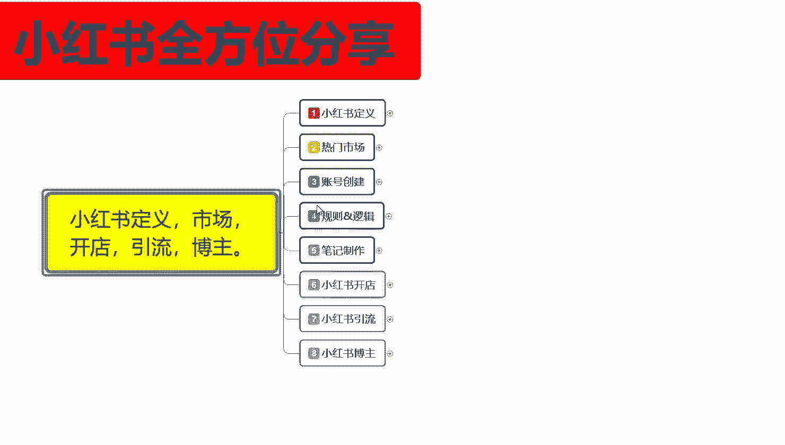
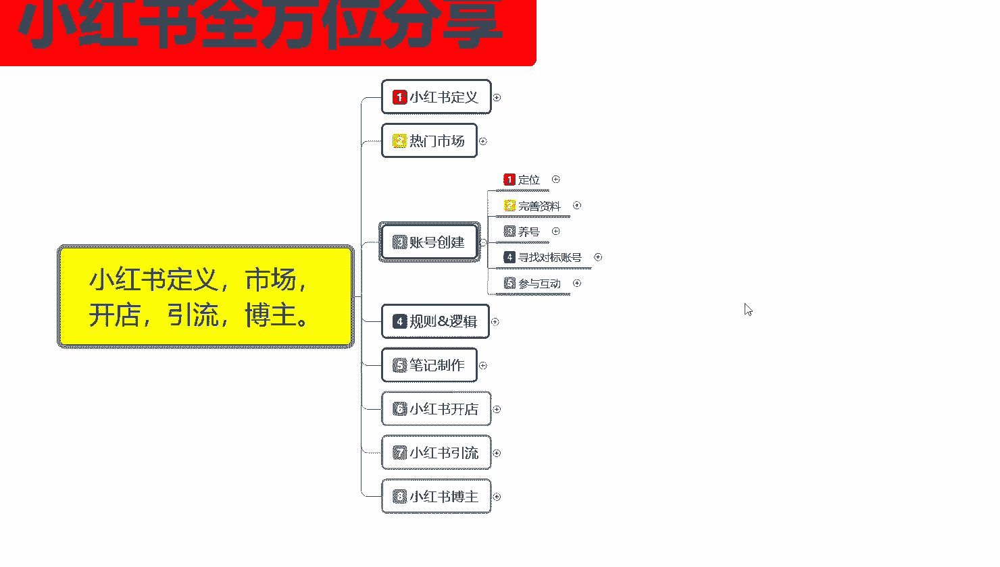
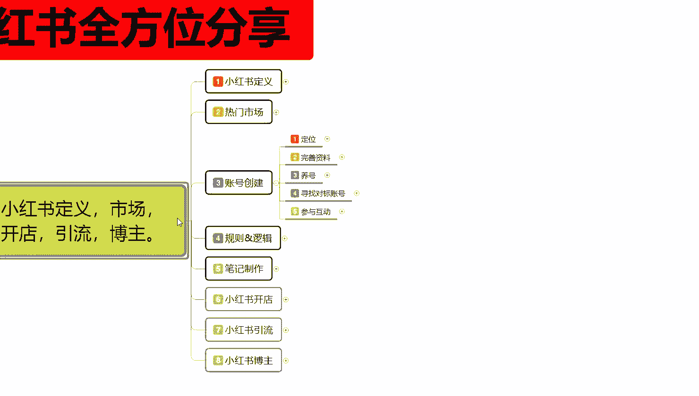
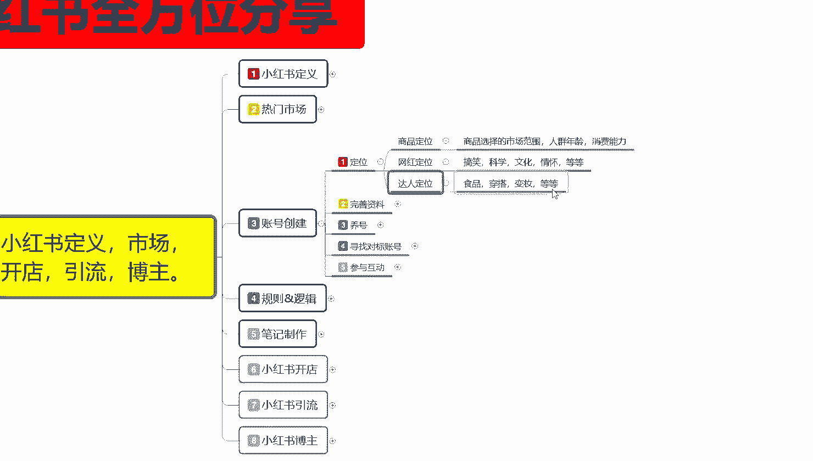
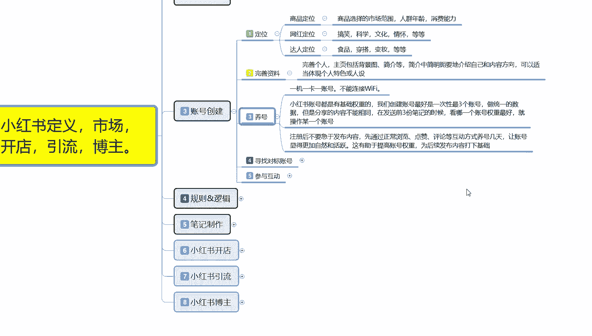
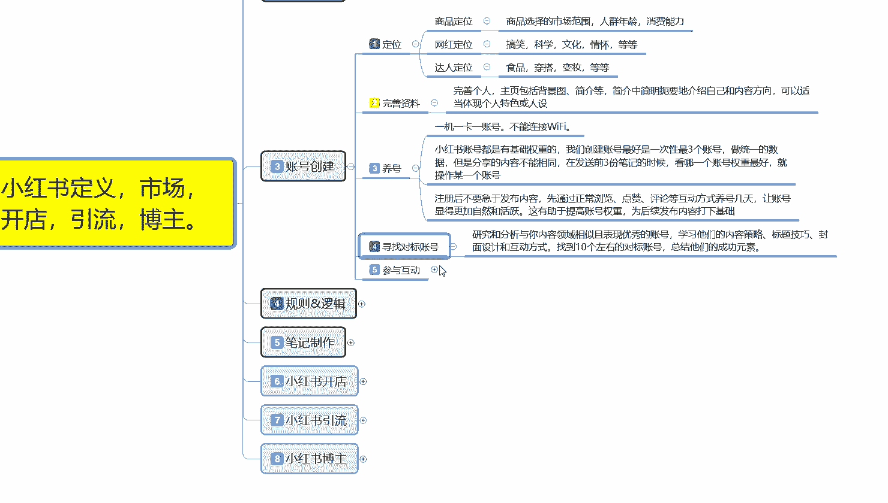
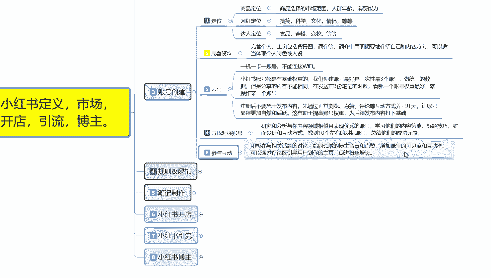
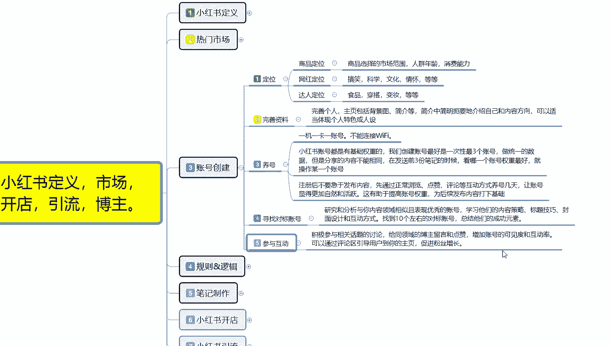

# 比刷剧还爽!!2024(全新)小红书运营网课，小红书运营大佬专为为学渣研制的小红书开店、小红书起号零基础保姆级教程，全程通俗易懂，纯干货无废话 - P4：3、小红书账号创建及注意事项 - 秋枫不入睡 - BV1AAtHebEvj

大家好，今天给大家分享的是小红书全方位分享第三大课时账号创建的一个内容。呃，账号创建呢，它包括了我们整体账号的一个后期规划。所以说账号创建在前期的话是非常重要的。

如果说你到中后期想去调整账号的一个属性的话，你那个时候调整的话就已经有点来不及了，会导致你整体权重的话比较偏低。你后续账号你去做开店做引流做博组的话，你的账号权重就上不去，就是起来的非常慢。

对于之后的话，基本上没什么影响，你起来之后就没什么影响了。但是对你前期来说的话，影响是非常大的。

我们了解一下状号创券都有什么内容。

呃，账号创建这边的话是给大家分了5个点，但是这5个点说实话了解一下啊不大。但是如果说你想往细致的了解内容是非常多的。

首先呢第一个是定位。

定位是什么意思呢？商品定位网回定位达完人定位。第三个点，你在小红书上面明确了你后续所要操作的范围。啊，商品定位网红定位和达人定位，他们所属性操作模式和你账号创建方式都是不一样的。大部方向是一样。

但是他所选择的内容不一样。如果说你选错了，你比方你要去做商品，但是你整体的账号创建方式是往网红达人方面去靠的话。你后去小红书前期的时候给你的人群，他其实是网红的，他购买商品的人数就非常少。啊。

导致你的整体转化率和展示曝光量。点击量上不来，那你后续的一个提升就非常缓慢。商品定位商品选择的话就是说选择你的一个市场范围，人群年龄消费能力。网红定位里面的话就是搞笑科学文化情怀等等。你选择一个方向。

你自己去做就行。达人定位就是食品穿搭便装等等嗯。第三个是什么意思呢？😡，你做网红达人，无非就是做引牛。你做网红定位也无非是做引流，这两个的话，引流和博主，他们两个是可以分开也可以集合。

他们两个的区别不大。但是商品定位的区别选择的话就比较大。因为商品的话，这个里面有市场范围人群年龄，你所选择所卖的一个产品啊，前期的一个兴趣爱好选择不好的话，那你后续的话就没办法去操作了。

所以说你要先明白，你自己在小红上面你到底是要做商品，做网红。还是说达人。三个点，你如果说想选择多个也可以，但是你操作起来就比较慢。我们一般如果说你去小红书上面，你做定位，前期去做操作的话。

基本上只选一个。把目标明确以后，把账号拉起来以后，你再扩展第二个，第三个都可以。你比方说你先做商品定位，商品定位，你把你的账号权重拉起来以后的话，你然后再发笔记去做网红进行分享也可以，对吧？你再发内容。

做达人分享也可以。然后你做发笔记，做引流宣传也可以。你也可以先做网红，先把账号权都拉起来，然后通过网红带来的效应去做商品也行。啊，做达人也行，就是说通过这个方式，你只能先选一个选完定位以后。

把账号权重做起来了，你再去做第二个第三个才可以。你不能一上来，你就说我又要当网红，又要做达人，我也要做商品。不现实啊，你也做不到系统，他也不会去那么给你分配。因为你第一个你没有资金来源。

第二个你没有明细，第三个你没有权重。小红书他是通过系统来进行匹配的，系统不认可你。啊，人认可你也没有什么太大的一个作用，好吧。

第二个呢是完善资料。完善资料的话，这个里面的话就包括呃主页里面就是包括背景简介，简介中简明扼要介绍自己的一个。整体就是介绍自己是做什么的，然后的话介绍自己所推广宣传的内容和方向。

可以适当的体现个人的一个特色。或者说是你把你的一个背景啊、图片啊、心情啊，基本上都可以靠背景、图片、文字都可以展示出来。资料完善的话，你如果说小红书上面说实话，你去看那些大主播大网红的一个资料完善。

它是非常全面的。啊。可以去参考别人的账号。了解一下，基本上就都知道了。第三个呢是养号。什么叫养号呢？小红书上面啊这里提醒大家一点，首先第一个点最重要的啊，小红书你去做账号，首先是一机一卡一账号。

不能连接wifi。你如果说我们做小红书，你基本上的话都有举证，什么意思呢？就是说你小红书上面你想做打。你基本上都有3到4个小红账号才可以。一个两个，你做网红，做电商，做达人。

你需要非常浓厚的一个累积才能做起来。如果说你没有小号，有小号的话，你就会跳过这一环节做很多事情。因为你的评论区里面的一个活跃度都是靠小号去引导互动的。你没有小号的话，你做不到。

所以说这里面的话强制规定大家是一机一卡一张号，不能连wifi。因为你连完wifi以后，你在同一wifi下使用3到4个。小红书，然后小红书在同一笔记里面进行分享。

同一视频下面进行分享或同一商品下面进行分享，都属于违规。啊，都属于自产自销。小红书系统它检测出来以后就会给你降权。所以说一G一卡一账号不能连wifi是最重要的一个点。

第二个呢就是小红书账号都是有技术权重的啊，我们创建账号最好就是一次性创建三个账号，做统一的数据，但是分享内容不能相同。在发送前三份笔记的时候，看哪个账号权中最好就可以操作某一个账号。什么意思呢？

小红书你什么都不做，你把小红书账号拿出来以后做一个日常的分享，你就能测试这三个账号能不能使用。日常分享的话，它的那个内容分享出去以后，大概有50个小眼睛，这个账号就没问题。低于50个那个这个账号的话。

你就直接把它注销，然后重新换一个再重新创建账号，再重新去测试就可以了。三个账号里面选一个去用就行啊。还是前面的一级一卡一账号，不能连wifi，这是最主要的一个点。就是你发的一个图片、封面图片等等内容。

只要是发出去，它基本上都有50个左右的一个小眼睛就可以操作。没有这个数量的话，你就不用去操作一个账号了，这账号有问题啊。然后呢，注册后不要急急于发布内容啊，先通过正常的一个浏览、点赞、评论、互动等方式。

先养号几天。让账号显得更加自然活跃以后的话再去操作。这个的话就是有助于提高账号的一个权重。哦，为后续发布内容打印基础。你小红书账号创建完成以后，你先去做测试，测试完这个账号没问题。

然后的话就不要去发内容了，内容全部停下来，然后先通过正常的浏览点赞、评论这个方式去养号，养个几天基本上就没什么太大问题了。

养号里面往后面走呢，就是寻找对标账号进行养号啊，你不能说是盲目的什么都看，那肯定是不行的。研究和分析你内容领域相关，且表现性。优秀的账号。去浏览他们的一个内容。

学习他们的内容策略、标题、技巧、封面、图片设计和互动方式。找10个左右，基本上的话你前期对小红树不了解，找10个左右就够够了。你如果说你比较了解小红书有一定的基础的话，你基本上要找20个左右。啊。

对标账号总结他们的一个成功元素，就是了解别人去怎么编辑账号内容。编辑它的一个完善资料，对吧？编辑它的一个商品，它所占的热门市场有多少流量？当然这个里面还有一个点，就是你选账号的时候，他所面对的人群。

不一样啊，就说每一个阶段你前期刚建的创创建的账号的话，基本上就是0到200000到5000左右的一个范围。再往上走的话就是。5000到2万。再往后走的话，就是2万到5万到10万之类的。你前期我们做的话。

基本上就是控制在1万以内去看这种账号。再高的话，你去看那种账号是没有作用的，反而会影响你的一个权重。

第五个呢是参与互动。参与互动是什么意思呢？我们观看这些账号的时候，你要去评论区进行评论。你要先把自己的账号信息设置好，去评论区进行评论。月薪的笔记就是他刚发布的内容，你进去里面进行评论，进行回复。

对这个产品了解，让同类型的人对你有一个第一步印象。啊，先打一个标签上去。做一些引导。你后续发布笔记的话，别人看见你的笔记也就会同样的进来浏览啊，看看你分享的是什么内容。

这个的话也相当于是截取了你之前所观看的其他人账号的一部分流量。但是截取量的话可能会比较少，可能不到千分之5。量很少，但是你观看20个账号，每个账号千分之5，你合计起来。这些账号属性的话。

你也能截取个1%到2%的整体流量。这1%到2%的整体流量截许，你只要截取的好，你自己发布的信息没没错的话。就是内容实质性比较好的话，基本上不会有什么太大问题。想把这个笔记推起来的话也比较容易。

然后用几个小号去做一下跟进评论啊，你这个笔记就非常容易抱起来。也算是一个小技巧交给大家啊，这个呢就是创号创建账号创建。

那这节呢就给大家分享到这，下一节呢给大家讲解一下那个小红书整体的一个规则和逻辑。

