# 比刷剧还爽!!2024(全新)小红书运营网课，小红书运营大佬专为为学渣研制的小红书开店、小红书起号零基础保姆级教程，全程通俗易懂，纯干货无废话 - P5：4、小红书平台规则逻辑（1） - 秋枫不入睡 - BV1AAtHebEvj

大家好，今天给大家分享的是小红书全方位的一个整体分享。这节课的话是第四大节课，给大家分享的是一个规则和逻辑。

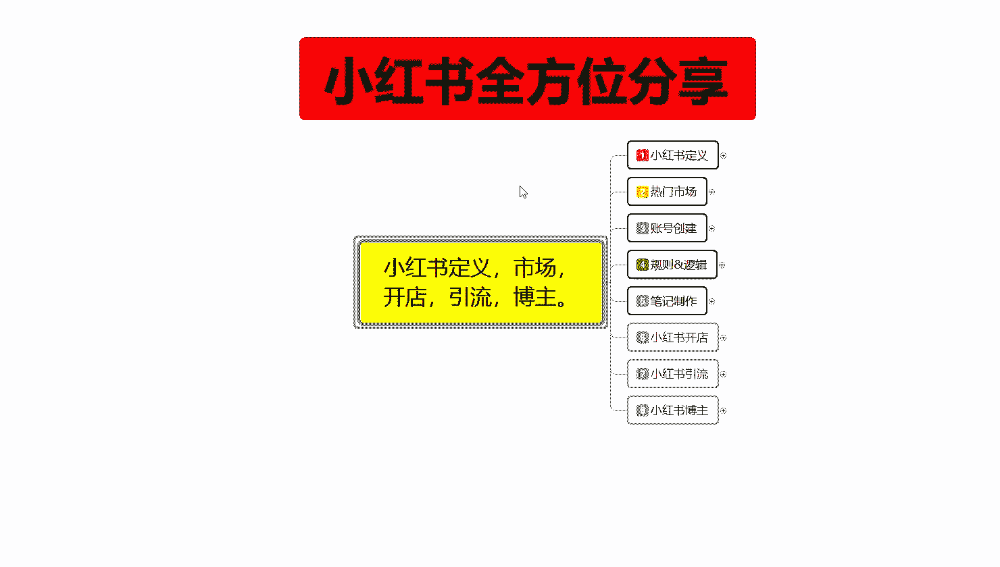

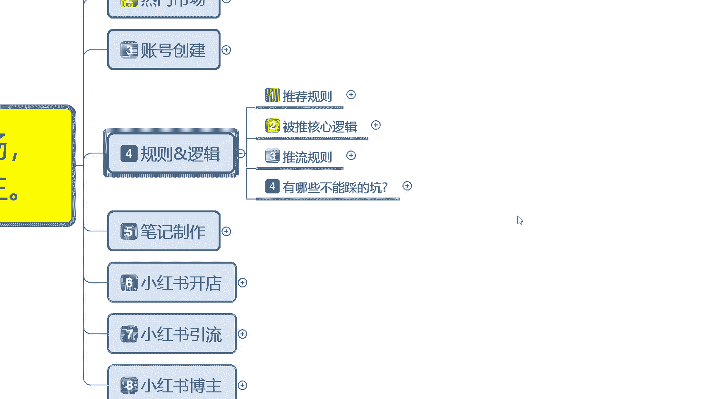

小红书的规则和逻辑啊，这里面的话我是给大家把它分了4个点。呃，第一个是推荐的一个规则，就是小红书给我们额外增加更多的一个曝光属性的。第二个呢是背推的一个核心逻辑，它其实是差不多的。

就是说你要做到什么样的一个程度。然后呢，小红书才会给你更多的一个呃流量窗口。第三个呢是推流规则。第四个呢是小红书上面有哪些坑不能去碰啊，我们先了解一下推荐的一个规则。

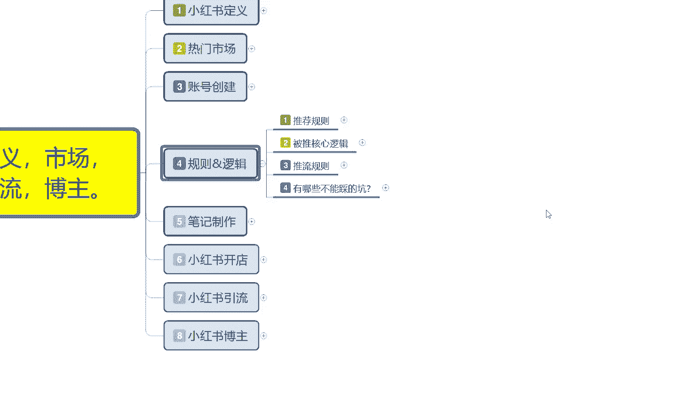

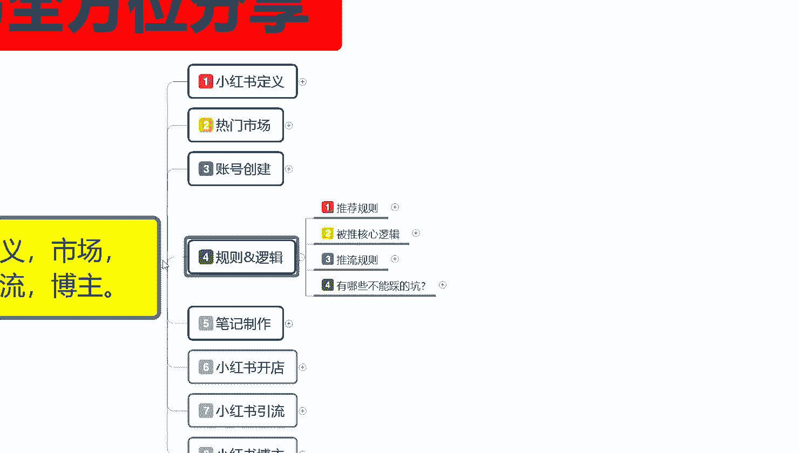

推荐规则这里面的话其实是比较简单的，它分为用户行为自自序商品，然后呢是一个通音。

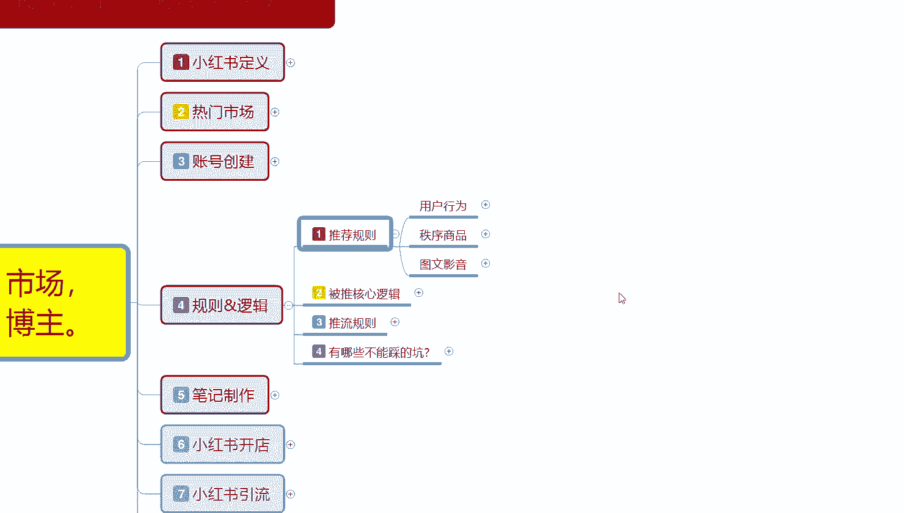

图文的一个影响。

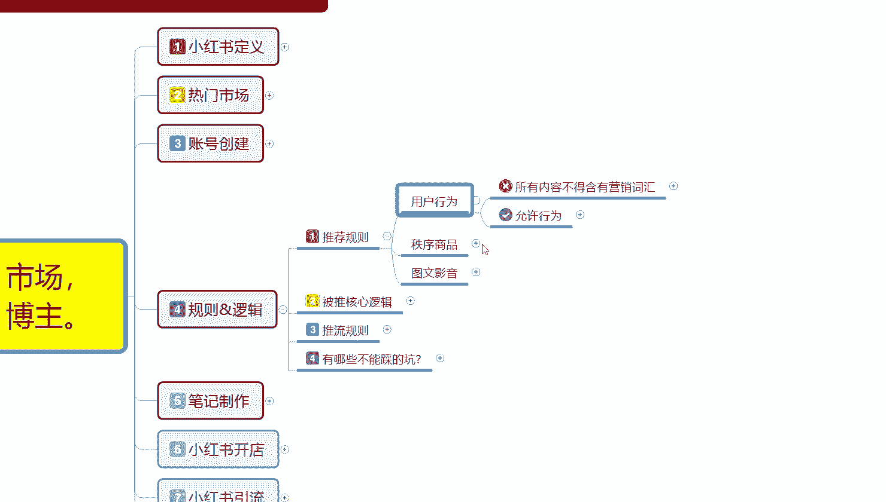

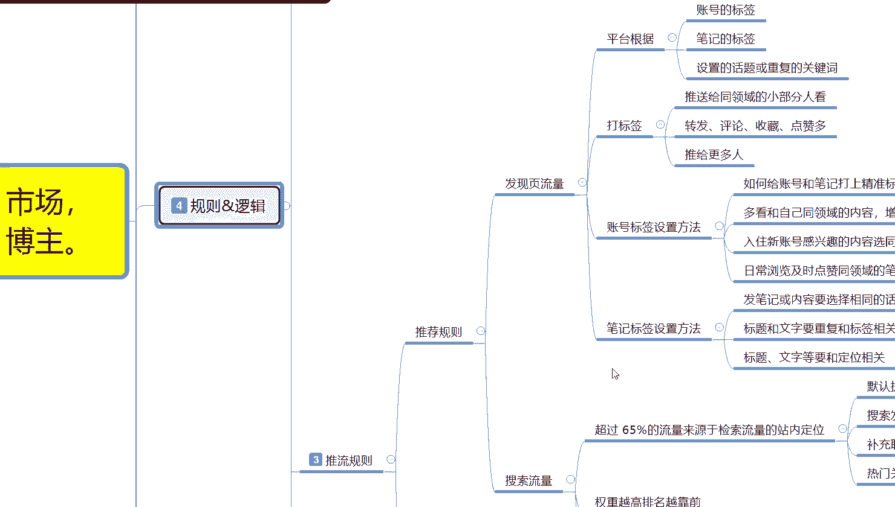

推荐规则啊，用户行为不允许的所有内容不得含有营销词汇。这里面的话就是包括微信、二维码、代购、水印、某某店铺。如果说你有这些词汇的话，小红书系小红书系统是不会给你进行推荐行为的。

也就是说你的呃作品发出去以后是被屏蔽的，没有任何作用。如果说你发的多了以后的话，还涉嫌违规。第二个呢是允许询问，什么是允许的呢？个人允许邮箱存在。也就是说我们在设计账号创建的时候。

你呃虽然说现在邮箱邮箱用的比较少，但是的话它也不如。思维是一个引流的方式。就是说你用邮箱的话，其实还是可以收到短信。啊，信件的，但是它的一个节奏的话就会比较慢。它一般的话都是适用于引流。

可以在你的那个账号下面啊，留下你自己的邮箱，它是可以的。然后呢，微博用谐音啊，千万不要直接把你的微博账号输上去。然后后面的话就是用话术引导微信。这种的话就说用用户行为它是可以的。但是说你不能直接的去呃。

怎么说呢？微信号二维码这种的话，你直接去在你的账号上面留下沟通方式，联系方式的话，肯定是不允许的啊。用话术引导微信是什么意思呢？你自己想办法去编，然后把自己的微信号的话，把它用那个。呃。

数字啊、图标啊、表情啊之类的，把它隔开，然后去使用，而且也不能发多。基本上的话你一天最多是5个。但是建建议的话就是说三个以内啊，推微信推自己的可以承受账号的话不会出现什么风险，再多的话就不行了。

每天的话基本上就也就三个名额左右。第二个呢是商品的一个自序，就是说不能轻易给人称医疗或建议的一个投资。你比方说保健品之类的，医疗用品啊，啊，我教你怎么去弄啊，这个病怎么治啊等等啊。

这个美容用哪个护护肤品好啊，啊，用了以后什么效果啊，这种都不行。然后呢，就是最多登录三个账号，这三个账号的话其实。用电脑登最多的话，其实只能登三个账号。手机的话一个一个坑。一个萝卜，一个坑啊。

如果说你那个手机连wifi的话，尽量也不要去连啊。然后是图文咦音这里面的话就是说不得诱导用户。然后的话比比如关注领奖，就是你不能在小红上面去做虚假宣传啊，有些东西的话它是不允许的。

你如果说呃你想获得官方的一个流量扶词，就是你的笔记发出去的话，这些东西你有的能碰有的，你是碰的不碰不得的。然后内容原创作为最佳是什么意思呢？你去可以去复制别人的，复制过来以后也有展示曝光。

但是它的一个展示曝光量的话，你可能。只有原创的15%到10%好一点的可能会达到20%。但基本上的话不会再超过20%的一个数据量。比方说别人有2万的小眼金，到你这儿的话，最多也就是4000。

最多啊就说你把它完全复制下来。然后的话你本来是。简单点说，就是你主账号自己的作品，主账号发了有2万的一个相已经点击数量，然后你拿自己的子账号，或者应该说是拿自己的小号，然后去发同样的内容。最多的话。

也就是获取4000的一个曝光流量啊，最多就是第二次发布推文的时候，它的一个流量曝光的话肯定是没有那么强的。

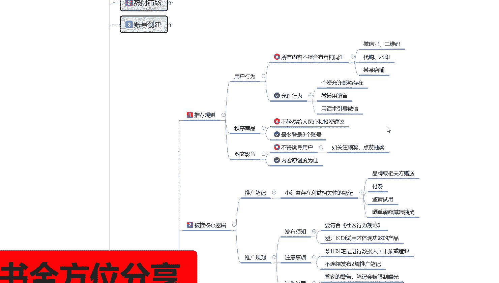

第二个呢是被推的一个核心逻辑。被推的核心逻辑什么意思呢？就是说这里面的话可以分为两个点。第一个呢是推广笔记。第二个呢是推广规则。推广笔记的话就是说小红书存在利益相关的一个相关性笔记。

比方说品牌或相关方赠送的，然后呢是付费机型私用呃晒单抽奖这种。第四个点啊。就是小红书额外给你的一个推荐流量。但是这四个点我们前期去做的话，基本上。怎么说呢？你不是品牌方的话。

你就做不到第一点品牌或者相关方赠送的一个流量扶持。第二个呢是付费付费的话，你前期小红书你直接上来就做付费付费的话，你说实话没用啊，浪费钱机醒试用和晒单抽奖的话，这个是小红书的。间接性活动。

他有时候的话你完成任务以后，他会给你一个流量扶持。你能做的话就做，不能做的话也无所谓啊。他只是说给你额外的一个展示曝光量。你比方说你一篇笔记发出去的话。

可能前期的话给你1000到2000的一个技术曝光量，就是有接近2000个用户看到你的一个相关作品，但是点击量的话，它大概是150到200个左右的一个点击量。如果说你做了这些东西的话。

就是基仅私用塞单抽奖之类的话，可能会给你增到2500到3000啊，有一部分的提升前期比较好用，后期的话基本上有用，但是作用就没那么大了。第二个呢就是推广须资。退货须知这里面的话是发布注意，然后违规处罚。

这个的话就是说要符合社区的一个行为规范，就是你不能跨。跨行业的去发布那种笔记行为。你比方说你本来是做女装的啊，你没事了，然后想去发个化妆品的这种的话就是不不被允许的啊。简单的说就是说你已经跨区域了啊。

你不在女装女装这一个社区范围以内，小红书它你发的这种笔记，你发出去以后的话，它的一个呃读取啊和。辨识会导致你的笔记发数据获取不了相应的一个技术曝光量。你比方说2000的一个基础曝光量。

你本来是做女装的对吧？你发了一个化妆品，那你到后续的话，你的化化妆品获得的基础曝光量的话可能只有200到300。啊，减少了80%到90%，好一点的话就500左右。但是你这么操作了以后的话，你的这个账号。

后续呃，你发第二篇美妆的，第三篇美妆的，它的流量也是在这个技术数据量里面。就说你相当于把自己砍了一刀，那当于2000的技术曝光，现在最多有1000。然后呢，避开长期试用体验才能体现功效的一个产品。

什么意思呢？就是说。小红上面你要去做，你不能去卖那种。类似于保健品呃，1个疗程一个效果啊，5个疗程一个效果啊，两周一个效果啊之类的这种东西你不要去做宣传，做宣传也没用。你直接跟你拿到线下，你去做引流。

可以做这种宣传没关系。但是在小红书上面的话是很能反感这种。宣传那容的你做了以后也没什么效果。😡，然后注意事项和违规处罚的话，这里面的话就是说禁止对笔记进行人工数据的一个干预。这个就是你自己刷数据。

刷那个呃刷评论，刷点击刷收藏，这肯定是不允许的啊。但是小红书这方面的话，说实话查的话呃也不是太严。目前。第二个就是不连续发布两篇推广笔记。就说你笔记发的话，第一篇发了以后，第二篇你隔着个两三分钟。

三五分钟去发的话，第二篇没有数据的。你的笔记最少要隔3个小时以上。就两篇笔记，早上发一篇，中午发一篇或者中午发一篇，晚上发一篇都可以，最少要隔个两三个小时再去发。不然的话它的一个笔记数据量的话。

会占用你第一篇笔记的一个流量技术曝光量。两篇笔记你连续发的话，你技术曝光是2000。第一篇的话可能是1500，第二篇的话可能就只有500。如果说你隔个了3个小时以后的话。

你的技术曝光量可能就又是2000或者是1500，但是它不会到达500的一个技术属性量。第一篇比最高，第二篇的话会降低接近30%左右。后面呢是违规处罚，违规处罚的话。

这里面的话就是一个管家警告笔就会被限制流量曝光。然后呢，就是每月占比超过20%的一个呃触罚类惩罚。就是你同样的事情做多了以后，已经被管家警告了以后，你再接着做。如果说超过比例20%。

你的账号基本上就没用了啊。那这几个违规处罚就可以。这个呢就是被退这一个核心逻辑。

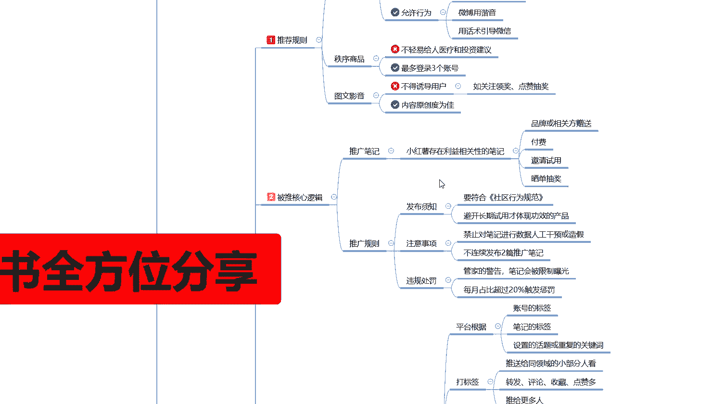

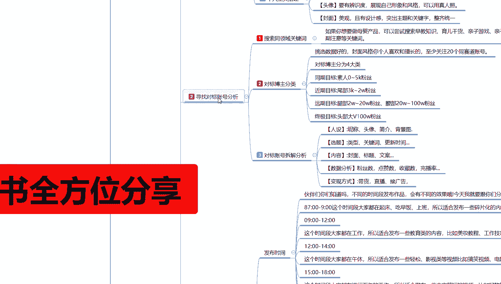

时间的原因啊，后面还有两个点，第一个推荐规则和有些哪些坑不能踩啊，我放在下一节呢给大家进行继续分享。那这一节分享呢就给大家分享到这里。整体来说的话，你了解规则和逻辑的话，其实有些东西你不去碰它的话。

是没什么问题的啊。你后续了解清楚了以后的话，你再去碰它，你自己懂得怎么规避的话，其实也还好。

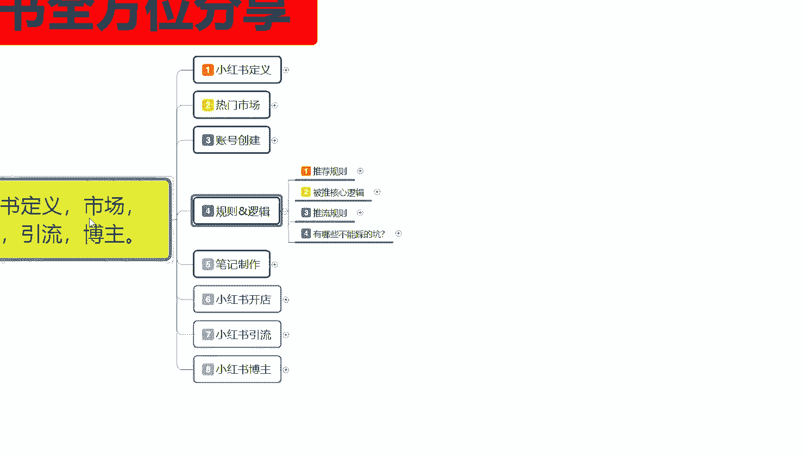

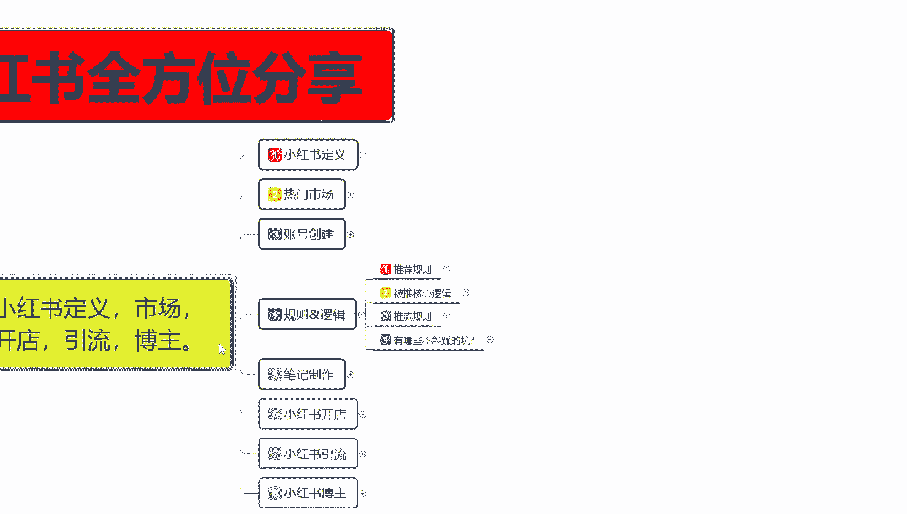

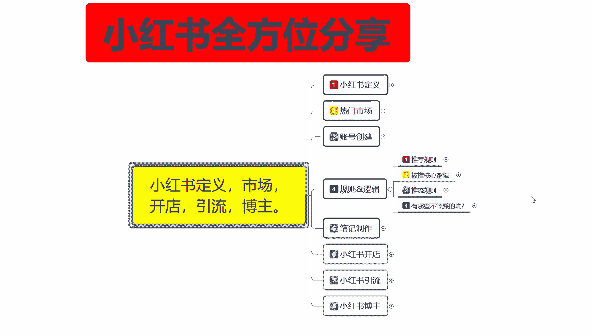

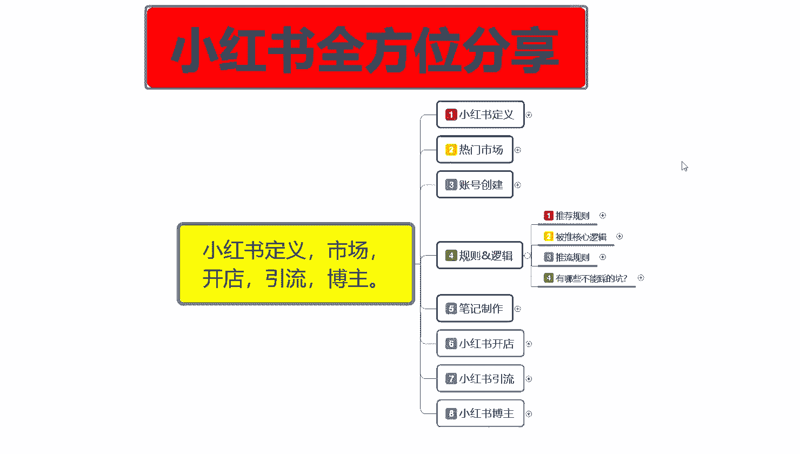