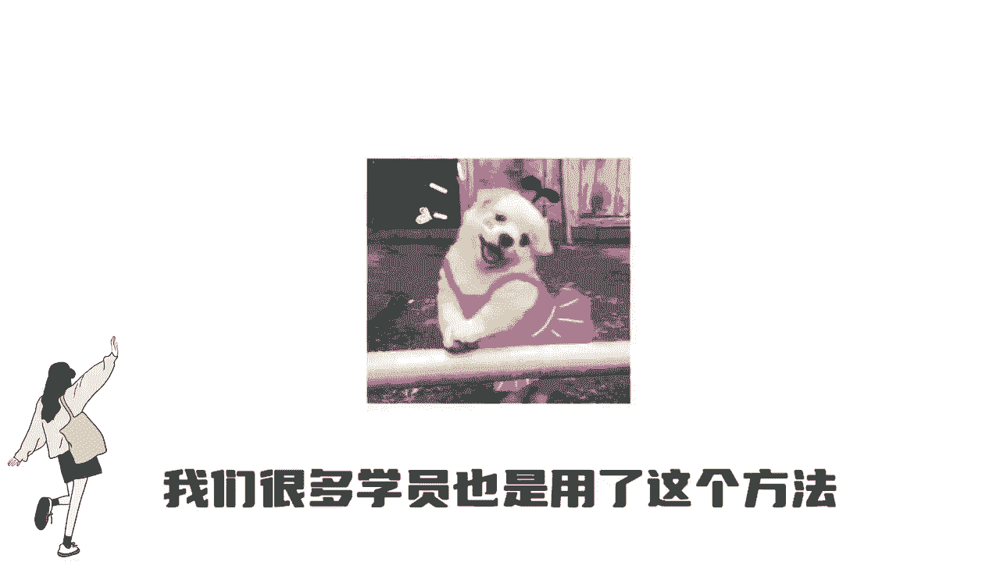
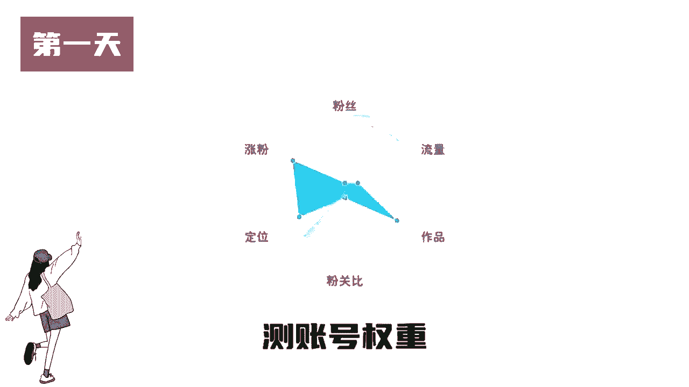
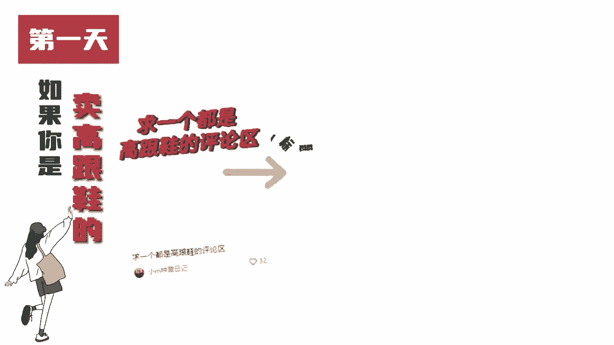
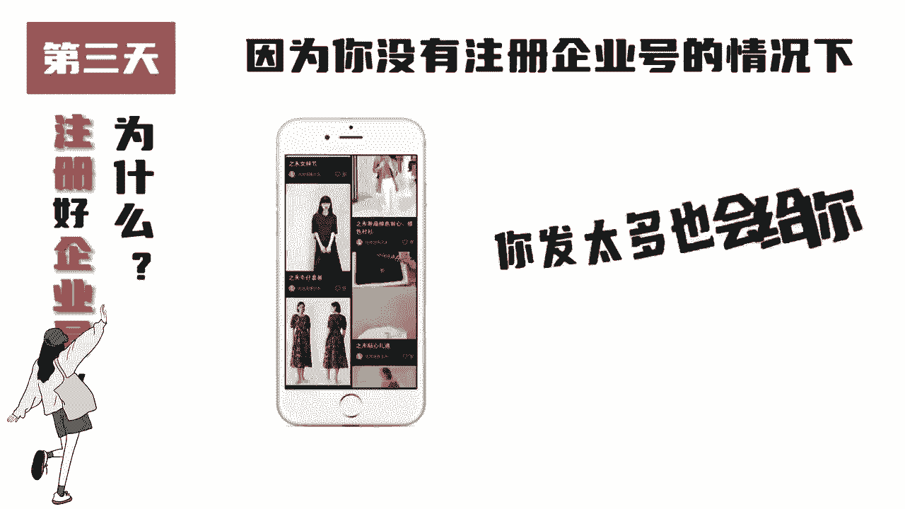
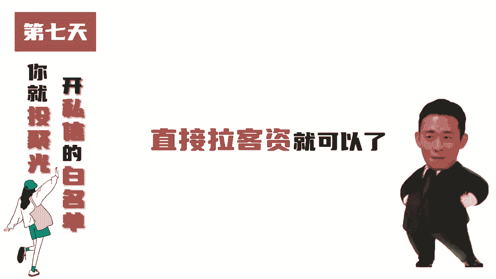

# 比刷剧还爽!!2024(全新)小红书运营网课，小红书运营大佬专为为学渣研制的小红书开店、小红书起号零基础保姆级教程，全程通俗易懂，纯干货无废话 - P5：小红书7天起号 - 一叽圈圈鱼 - BV1DCape9Epx

强术七天暴力起号的方法，按照这个操作一定能快速起号，我们很多学员也是用了这个方法。

很多都拿到了，结果7号第一天一定要发互动性比较强的内容，测账号权重。

比你是做好物分享的标题，就写一个人一个强推的好东西，如果你是卖高跟鞋的标题。

就写想要一个全是高跟鞋的评论区，像这种笔记标题互动性就很强，可以测试账号的权重。

第二天一定要发你这个领域的攻略清单，避坑指南做可以触达你产品的笔记流量内容。

比如装修避坑指南，旅游攻略，不然你直接发你的产品会给你违规限流，直接给你判刑消耗。

第三天注册好企业号，为什么，因为你没有注册企业号的情况下，你发太多也会给你判情消耗。

第四天继续发攻略笔记，一个账号发两到三条就可以了，第五天选择三篇数据比较好的笔记，每条投100就可以了，第六天当你的流量好了，你就可以打造你的人设。

发营销内容，第七天你就投聚光还私信的白名单，直接拉克孜就可以了。

除了这个暴力七天强，我还有更快且凹的技巧。