# 比刷剧还爽!!2024(全新)小红书运营网课，小红书运营大佬专为为学渣研制的小红书开店、小红书起号零基础保姆级教程，全程通俗易懂，纯干货无废话 - P6：5、小红书平台规则逻辑（2） - 秋枫不入睡 - BV1AAtHebEvj

大家好，今天给大家分享的是小红书全方位分享的第四大课啊，规则逻辑的第二部分内容。二节课呢是给大家讲了一个推荐规则和一个被推的核心逻辑。这节的话是推荐推牛的一个规则啊。

就是小红书怎么给你获得更多的一个流量曝光。

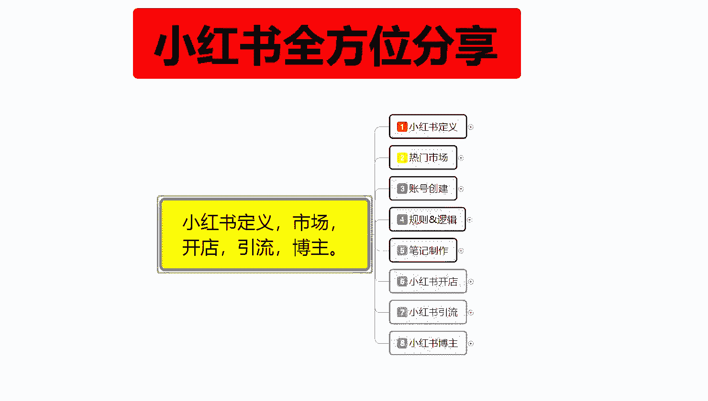

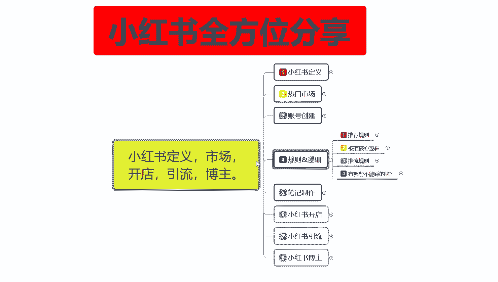

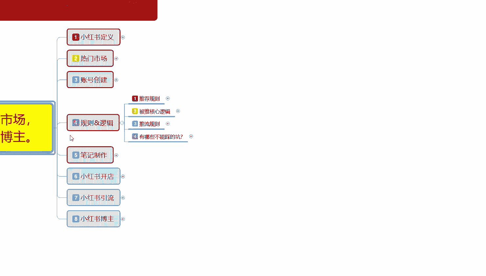

推流规则里面的话，其实就是一个推荐规则和被推核心逻辑。我们其实把它只是整整体啊属性分开了，让大家了解一下啊。第一个呢是发现流量，第二个呢是搜索流量。我后面呢是打开率互动率和搜索索结果。这个是一个整体的。

你如果说要把那个流量。

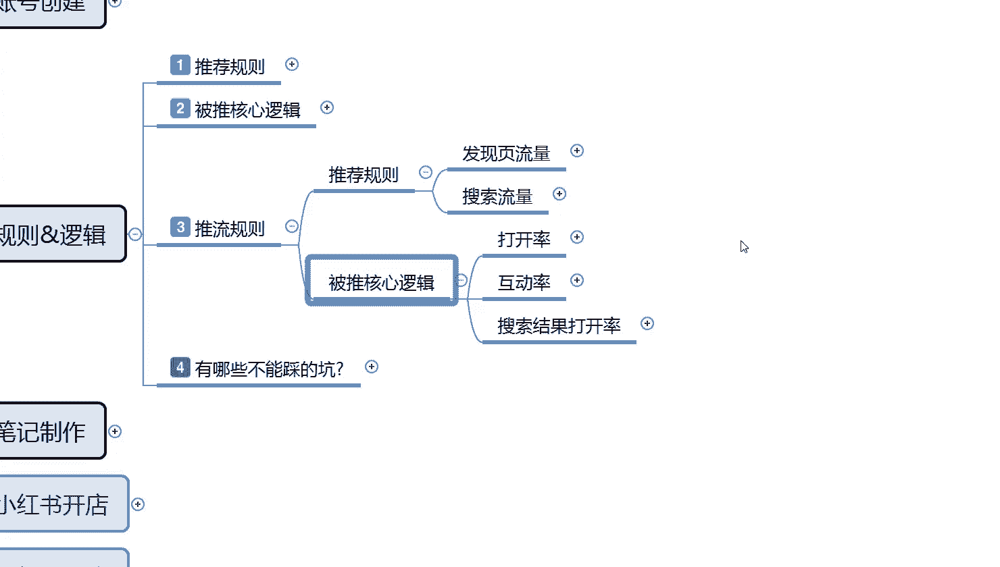

持续放大的话，那你这些属性的话，你都要需要去了解。首先呢是发现流量。

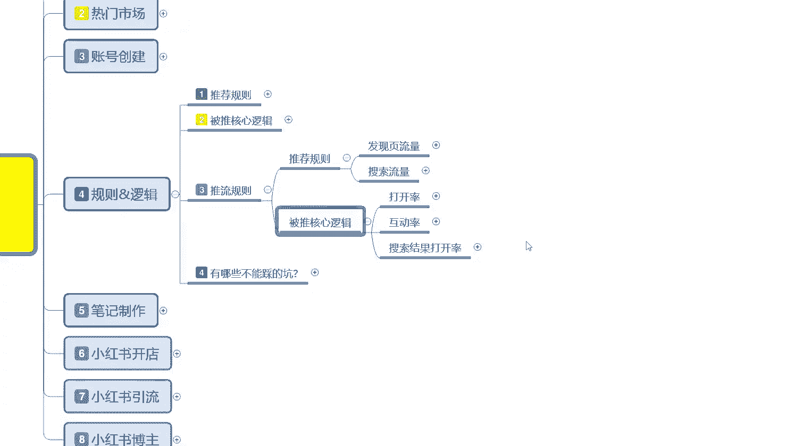

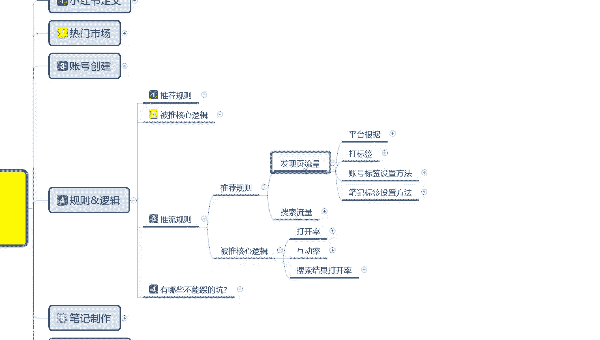

发现流量里面啊发现页的一个整体流量的话，它是平台根据账号标签笔记标签，然后设置的一个话题和重复关键词进行排序的。第二个呢是打标签推送给同领域的小部分人观看。然后呢，他观看以后的话。

里面的一个转发评论收藏点赞越多，推荐的人呢也就越多啊，第三个呢是账号标签设置方式，就是说如何给自己的账号和笔记达上基准标签，让平台进行推广。其实这个也是比较好了解的。首先呢就是说多看和自己同领域的内容。

然后增加用户标签。入驻入驻的新账号啊，感兴趣的内容选项，同领域的一个这个就是说你我们推荐流量的时候，就是前期呃上前面几节课给大家讲解那个账号创建的时候。

这里面的话有一些那个标签内容属性就是做这个推荐流量的。如果说你不做这个。账号创建里面的那个同行的数据去观摩的话，那你就不会有这些东西。你比方说打标签账号标签设置方法，笔记标签设置方法。

这三个点你都不会有。那也就是说平台给你的账号基础权重曝光量的话也就在500左右。你做了这个属性你把这些属性做完以后的话，基本上曝光量应该都是在1000到2000左右。

然后你后续的一个笔记点击率超过11%亿以后，就是给你1000到2000曝光以后，你大概有200到300个小眼睛以后的话，你就会进入下一层级。它这个小红书基础曝光流量，它里面还是有成绩划分的啊。

这个你们一定要弄清楚啊。所以说你一定要把这几个内容把它了解清楚啊，你不能说是觉得账号创建，把账号创建放在那儿，然后其他的不做就可以了。它这个里面包含的内容是很多的。你账号前期创建啊。

你包括你的一个社区规划，社区规划是什么意思呢？把你放到同类型的一个人群里面去啊，上节课给大家讲的那个被推核心逻辑里面。

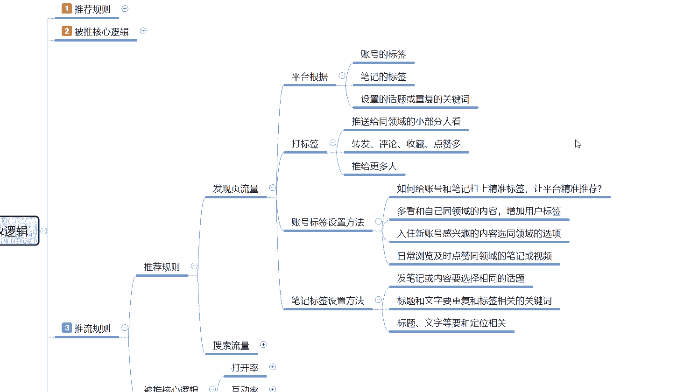

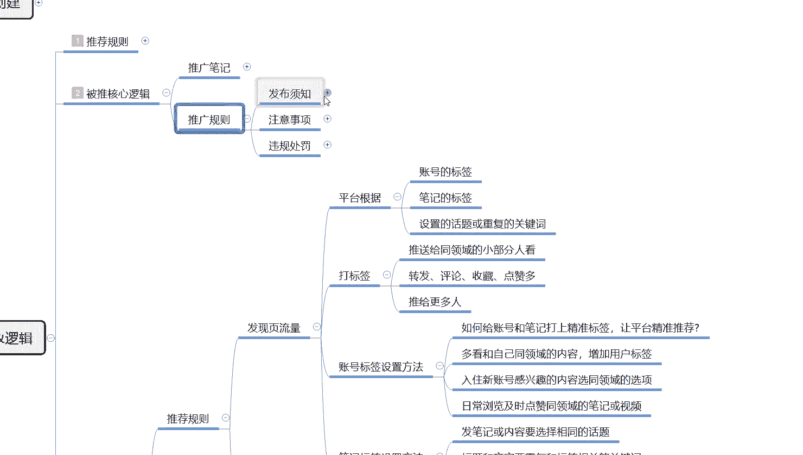

有一个社区社区的一个行为规范，就这个意思，你不能跨社区的去操作。那我们在创建账号的时候，你也要把自己的社区给选定好。你不能说你前期选定社区的时候，你前面直接选了个女装，然后你去卖化妆品肯定是不行的啊。

你已经跨社区了，因为你的账号选定的时候，账号创建初期，你就是选择的女装，那你就只能去做女装。懂意思吧？你张号如果说你前期选择的是做引流，做博索去推荐去发那种开心类的一个广告的。

你到后续了做的差不多了以后，然后你去发美妆，发女装之类的笔记的话。系统不认可你的，他给你的一个流量数据的话是非常少的。就说你已经跨跨社区跨行业去操作了啊，系统小红书它平台的它是靠系统运营的。

它的系统不认可你，那就不会给你更多的流量和曝光，导致你整个账号权重下降。懂意思吧？而且会遭到管家的警告，超过20%以后的话，管家警告以后，你这个账号基本上就废掉了啊，封号的。

所以一定要把这些东西给弄清楚。我们在发现流量里面的话，就是说它平台是根据账号的标签，笔记的标签，然后设置的话题，重复的关键词这四个点。来判定你的账号在哪一社区群体。然后我们通过打标签账号设置，然后呢。

笔记标签设置方式，通过这三个方式把这些账号设置好以后去发笔记。他才会给我们推流。就是给你基础曝光量，不然的话我们是没有基础曝光量的。后面这个标签账号设置方法的话，就是说呃多看自己的同行领域就可以。

然后呢，笔记和标签设置方法的话，就是把笔记或者内容选择要相同的一个话题，就是你的话题不能超纲啊，只能在这一个范围之内去进行推广。然后呢标题和文字重复和标签相关的一个关键词。

就是你比方说你发服装的那你的关键词就是女装短袖、T恤短裤，对吧？内衣等等，跟服装有关的关键词才可以。你不能说是今天呃今天天气不错呃，然后的话呃穿着什么什么出门或者等等之类的，和你的产品关系不大的那种。

吸引用户的啊，比方说。嗯，这里面的话，你其实你去看小红书里面的那个推流，你看别人的一个关键词做法的话，其实很好理解的。就说你一定要包含你的关键词，然后去发放笔记，他给你的流量是更多的。你如果说用那种。

大家快看这是什么等等，就是不包含你产品的主关键词进去的话，那你的流量曝光的话最少会减少30%到40%。本来有1000的技术曝光量，最后可能只有600的一个技术曝光量。

600的技术曝光你要达到1000基术曝光量的一个点击，率最少有20%。到25%的一个点击率，也就是2接近200到300的一个小眼睛数了。你的这个笔记才能做到。你的难度系相当于难度系数直接翻了一倍。

你的笔记才有数据，才会推广给更多的人。就是说有时候的话笔记标签设置的方式，这里面的标题和文字重复啊，一定要和你的。账号设置和你发的图片内容要有关联性。如果说没有的话，那你相当于先把自己剁一刀。

然后再去通过关键词吸引更多的访客点击率要达到20%接近30%才可以。这个呢。大家首先了解啊，这个还只是发现流量的一个数据量啊，这里面还有搜索流量，搜索流量的话，它比较适合我们在小红上面去做店，好吧，嗯。

搜索流量的话我会。这个怎么说呢？就是说搜索流量的话，你们了解一下就可以。因为如果说你在小红书上面，你自己要去做电脑啊，你可以了解一下。如果说你不做电的话，其实搜索流量对你没有太大的一个作用。

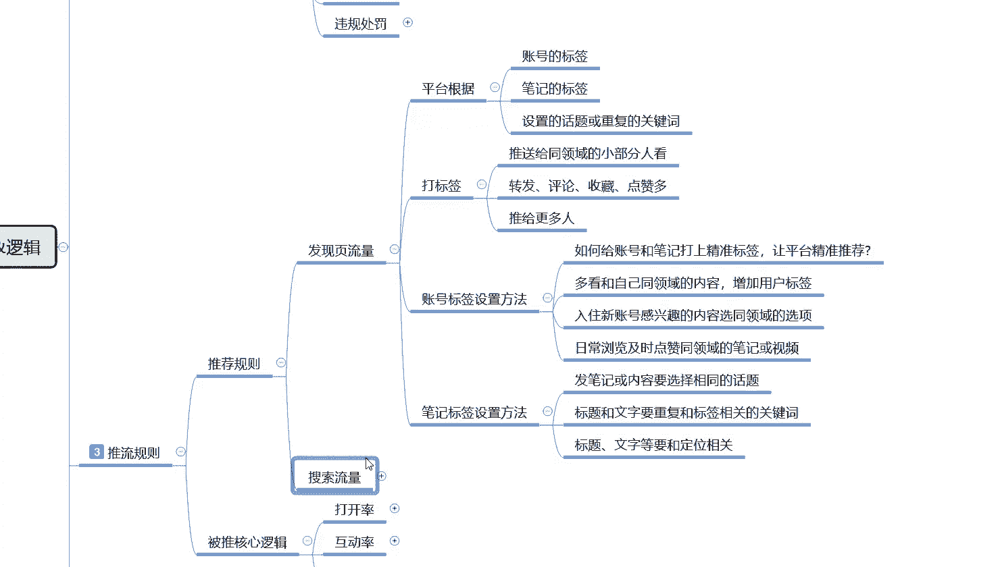

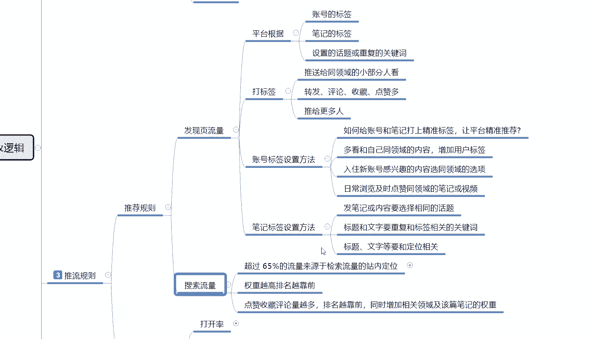

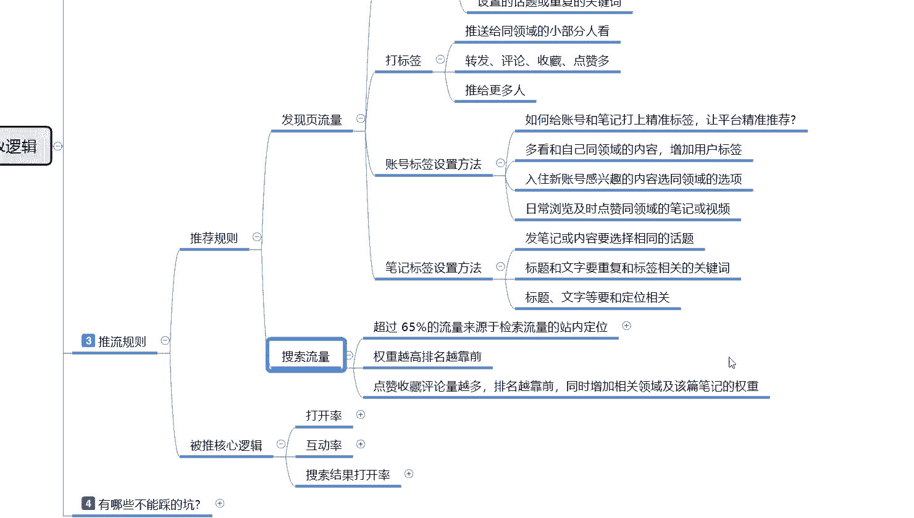

搜索流量里面超过65%的一个流量来源于检测搜索流量的一个站台定位。什么意思呢？就是说超过65%的流量来源，它都是小红书系统经过筛选以后，觉得你的。呃，笔记内容不错，你已经升段了。

就是说已经有一定的基础数据量了。然后或者说是你刚发的，然后你的账号平均的。嗯，你之前发的一个笔记已经获得过比较高的一个曝光点击。然后的话你发同样的一个内容，别人用户新用户去搜索同类的一个关键词。

搜索到你以后，然后经过排名竞争系统的话，有65%是随机匹配，35%是排名竞争进行分配的。

这个里面的话，它的一个搜索的话是默认提示词，然后搜索发现热门搜索补充联想关键词和热门关键词，靠这几个排名去操作的。这里面65%的流量来源基本上都是在这四个词汇里面，剩下35%的话是排名。

是整体你的笔记排名和你账号排名来进行划分的。这65的话是。呃。默认题词，然后的话发现搜索补充联想关键词。热门关键词就是我们在那个放大镜里面输入关键词以后，它下面那些联想词，它占比流量比例的话是65%。

他这65的来源就是靠关键词排名和你造号排名去做搜索的。然后呢，你的排名权重越高，你的。整体账号权重越高，排名也就越高钱获得展示曝光的机会也就越高。同样的，你的整个账号权重不够。

就是我们前面你的发现你业流量和你的账号技术权重不匹配的话，你基本上不会去进入到搜索流量排名阶段。你也就是说你在搜索流量里面的话，除非别人拿全关键词去搜索你的产品，不然的话你是没有任何曝光的。

基本上你就放弃了这近65%的一个搜索检测来源，剩样35%里面一个是商品，一个是商品关键词啊，和你们没什么太大关系的。然后这个里面的话呃权重越高，排名越高，越靠前，它是靠哪几个点。

第一个是点赞、收藏评论量越多，你的排名也就越靠前。同时增加相关领域及该片。笔记的一个权重。比如说你要把综合属性全部做好以后的话，系统才会给你更高的一个全综合属性。你如果说做不到位的话，那你整体。

属性它就会偏低啊，它就不会给你排名，给你展示曝光基础的话，呃，就是给你提升属性，你也提升不上去，最多给你一两百的一个曝光量。那一两百个曝光量，你在搜索里面啊，你做商品的话。

可能还有那么一单两单的一个转换。但是如果说你要是做引流的话，1001百两0百的一个搜索引流曝光，你想把这帮人引出去难度系数有点高啊。做商品还好，做搜索流量，做商品的话还好。如果说你做搜索流量，做引流。

做网红的话，那。难度就比较大了啊，搜索流量的话，它适用于商品啊，不适用于去做网红啊，做博主之类的。做引流也不好。

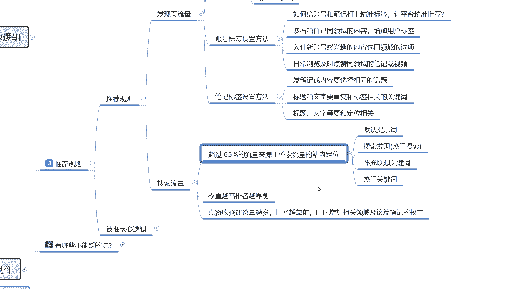

做引流的话，你基本上都是做发行业的一个流量啊，让大家了解一下小红书的一个推荐的一个规则，好吧。这节课呢就给大家分享到这儿，下一节课呢给大家分享一下那个被推的一个整体核心逻辑。

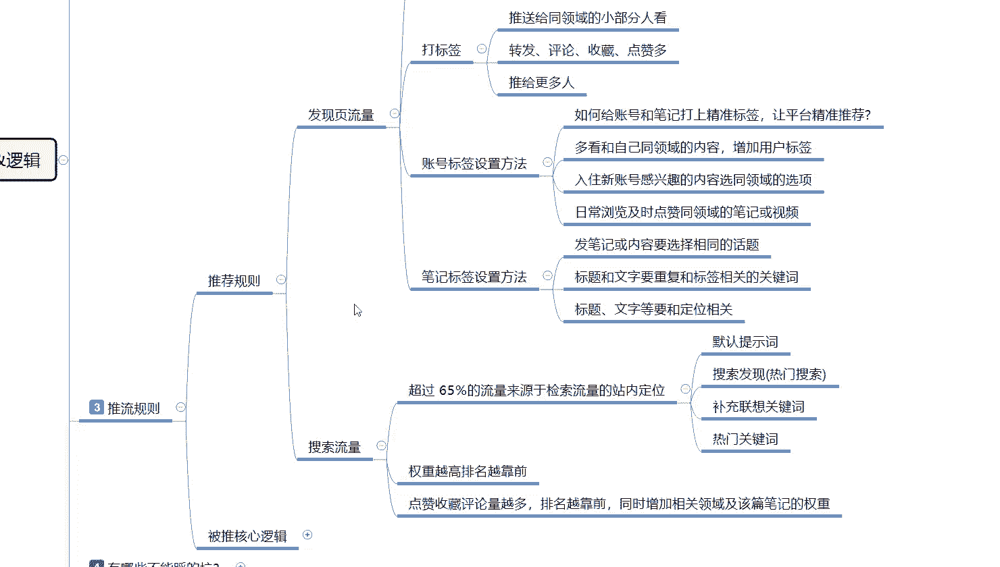