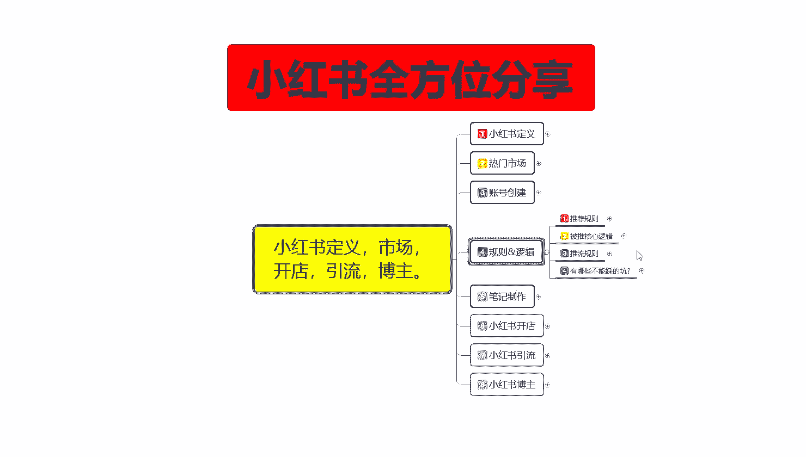
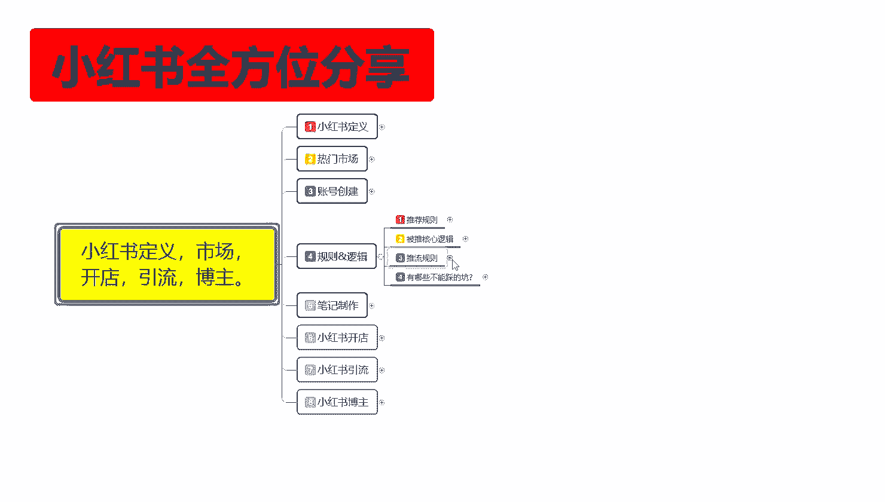
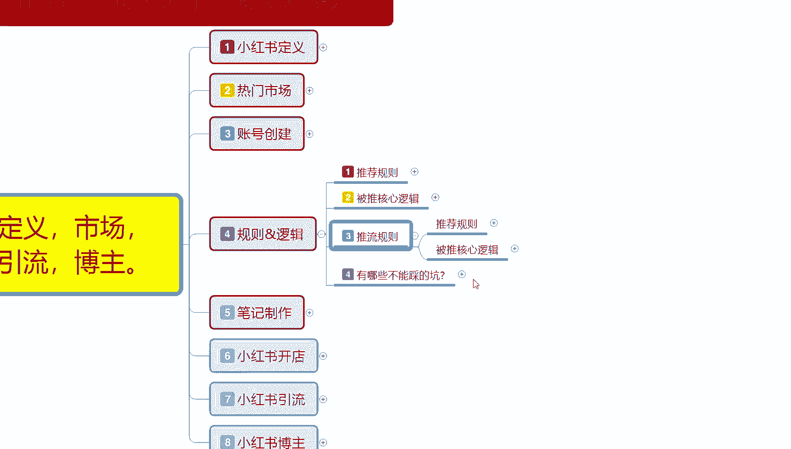
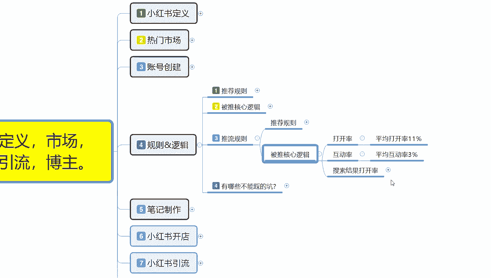
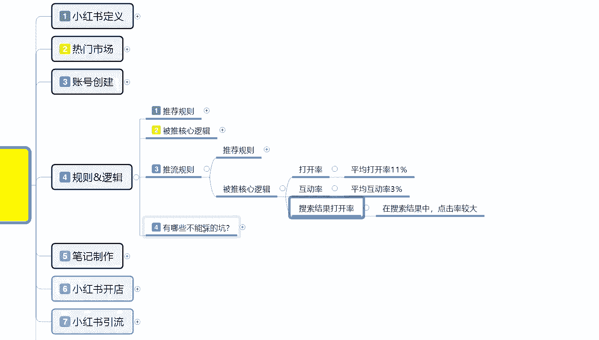
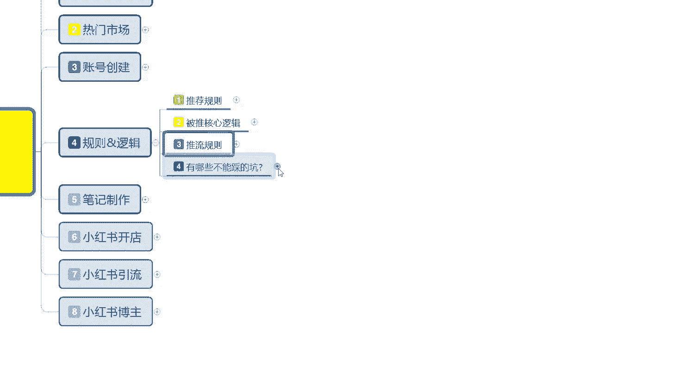
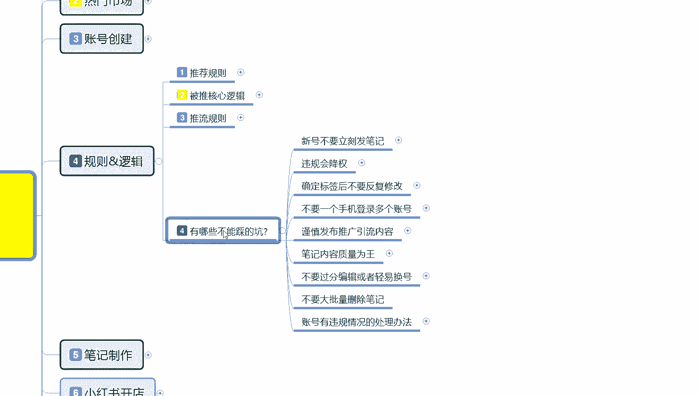
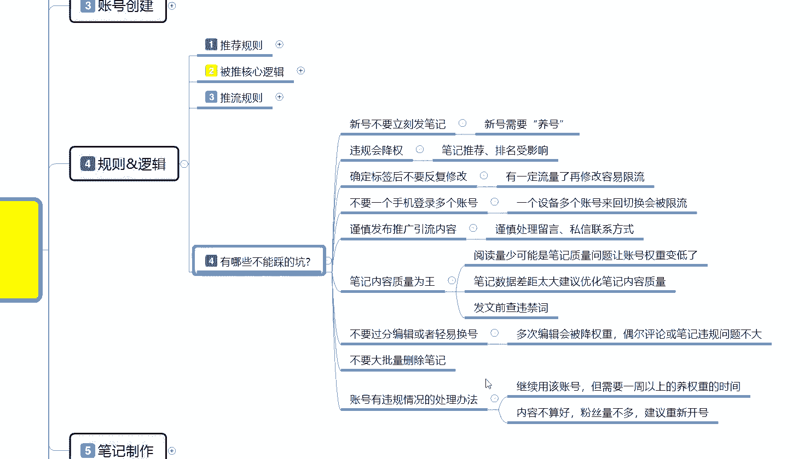
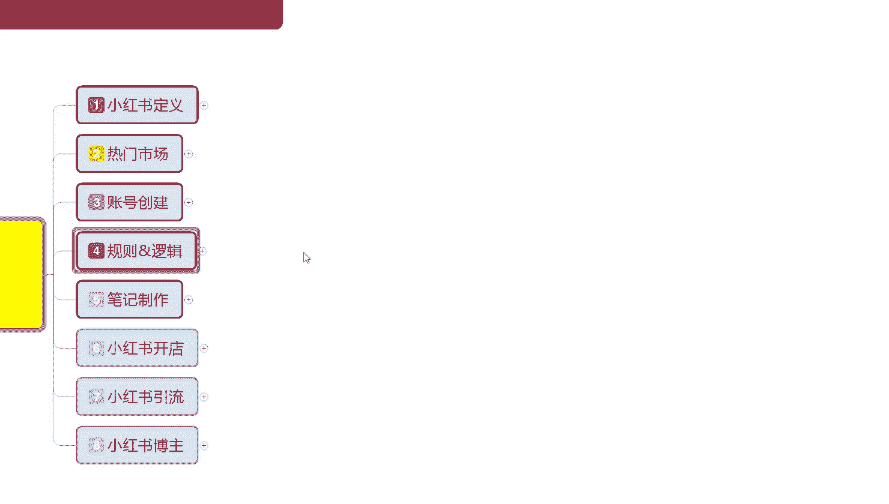
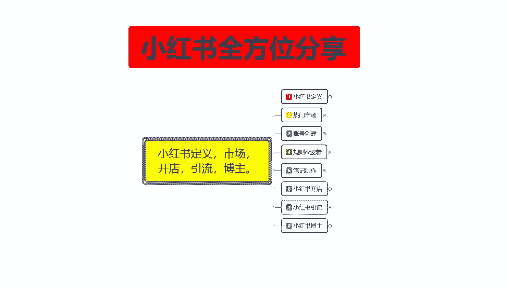

# 比刷剧还爽!!2024(全新)小红书运营网课，小红书运营大佬专为为学渣研制的小红书开店、小红书起号零基础保姆级教程，全程通俗易懂，纯干货无废话 - P7：6、小红书平台规则逻辑（3） - 秋枫不入睡 - BV1AAtHebEvj

大家好，今天给大家分享的是小红书全方位分享的第四大课时规则逻辑的一个内容。今天呢给大家讲第三节的一个内容，基本上可以把这一大节课给讲完啊。

上节课呢已经给大家把那个推荐规则已经给大家讲了，然后呢是被推的一个核心逻辑和有哪些根不人踩。

呃，被推的一个核心逻辑的话，其实是很好理解的。这个里面的话呃打开率互动率和搜索结果打开率的话，它整体占比你达标以后，你就有可能进入下一个阶段啊，只要你的数据量能保持在这个范围以内，一篇文章，两篇文章。

三篇文章，基本上三篇文章能保持在这个数据量以内，你就可以进入下一个阶段。一个是打开率，打开率是什么呢？你的小红书笔推广出去以后，比方说系统的话，它默认给了你1000个基础曝光量，你的平均打开率就是。

小红书我们打开以后，它界面上面显示了4个笔记，4个笔记里面就有你的产品。他会给你1000曝光，那有11个人观看。你的平均打开率就是11%。哦，应该说是100亿。110个小眼睛。

你就有百11%的一个点击率。达标以后，它会进入到互动率环节，平均互动率的话是3%。也就是110个平均点击里面有3个用户在你的笔记里面进行了评论，你就会进入第二个环节。啊，互动率互动率结束以后的话。

它会按照搜索结果和打开率，在搜索结果中点击率它占比是比较高的啊。先看点击率占比，然后看互动率占比互动率占比，然后给你排综合排名。你同类型的就是你在你们自己的社区范围内，同类型的笔记比例偏高。

它就会给你推广更多的一个流量，这个就是被推的一个核心逻辑。但是整体里面的话，这个里面还有呃。点击互动。收藏。点赞分享。啊，它这个都是包含这个这个里面的。但是你要是被推流的规则，你想获得更多的一个流量。

后三点的话其实。暂时。对你没什么用啊，你只是说升层级的时候，获得更高的评分，做搜索的时候有用。正常的话，你只需要看点打开率和互动率就可以了。也就是点击率和互动率，点击率平均在11%。

互动率保持在3%以上，也就是你的每篇笔例下面最少有3到4个评论。有110到150往算的一个。小眼睛，你的笔记才算是一个完美的笔记。就是。系统会给你推荐更多的流量。如果说你连技础属性都达不到的话。

那你后续的笔记的话，最多维持3天。然后这个笔记就不会给你在。带来任何的一个引流和引流效果。

这个是推流规则。然后呢，最后一点呢是有哪些坑不能踩，就是说我们。

小红书上面啊。

你了解整个小红书以后，有些东西是碰都不能碰的啊，你碰了以后的话，你后续想去再再去操作的话，嗯，你想把你的账号权重把它给归正过来。难度比较高。如果说你的账号没有基术权中，我建议大家是建个新号。

把原在的账号注销，然后建个新号，按照这种模式再去操作。都比你之前的账号权重要高得多啊。第一个呢就是新号不要立刻发笔记。除了你刚开始创建账号测试账号有没有权重的时候，发一篇那个呃自己的就是入驻小红书。

类类似于入驻小红书的那个呃自然笔记获得大概有50个左右的小眼睛，这个账号就基本上没问题。后续的话，你没有养号之前就不要发笔记了。号养好以后再去发笔记。第二个呢是违规会降权笔记推荐排名受影响。

第三个呢就是说确定标签后不要反复修改。你标签确定好以后的话，你不要去进行修改啊，不要不要说反复修改了，就是不要去修改。你的标签定完以后就定完了。你后续再去修改标签的话，你的整体流量会被限流。

第四个呢就是说不要一个手机登录多个账号，一个手机的话就是一机一卡一张号。然后谨慎发布推广引流的一个内容，谨慎处理、留言、私信和联系方式。这个的话后续我都会教给大家。

因为这里面的话就相当于我前面给大家讲的啊一样啊，你这里面的话用微信，其他方式。你如果说私信里面去聊的话，每天最多发三个，每天最多发三个，发5个是极限，你发多了以后的话，你这种。账号整体权重会降低的。

3到5天吧，基本上你这个号就死掉了。也就是说你一个账号，你把它呃陆陆续续用一个星期两个星期的时间把账号全部设置完以后，有人加你咨询你，然后的话你把它引流到其他地方的话，3到5天。最多用3到5天。

你这个号就没用了，基本上就是直接封号了。然后笔记内容质量为王是什么意思呢？就是说阅读量少，可能是笔记质量问题，让账号整体权重变低。就是你自己的笔记没有做好，笔记有问题。

跟你的账号权重其实是没有什么太大关系的。笔记数据差，距离太大，建议优化笔记内容质量，然后呢发文前检查你自己没放为词。就这三个点，了解一下，有些时候是你自己的笔记发出去以后，你有觉得自己没什么小眼睛。

但是有技术曝光，小眼睛不多，那是你自己的笔记没有做好，而且你账号权重，账号权重没有问题的情况下，就是你笔记没有做好。如果说账号权重有问题的情况下，就是你账号的问题。看你自己怎么去分类，自己去筛查一下。

然后发文前检查自己有没有那个违规词，就是违禁词。如果说有违禁词的话，那就是自己的那个笔记里面设计违规词不让放啊。后续的内容啊不要过分编辑或者说是轻易换号，多次编辑会被强权，偶尔评论或比及违违规问题的话。

它是不大的。呃，不要轻易换号是什么意思呢？你本来账号有一定技术权重了，但是前期有些数据你没做好。你比方说你有两两三千三五千的一个粉丝量的话，你就没必要换换号了啊，你只是需要把自己的权重拉回来就行。呃。

因为有些朋友以前可能会对小红书了解一下，然后自己去发一下，但是感觉没什么效果。然后现在想重新去学，然后的话有些那个账号有属性，有权做。其实这种账号能操作，它比你创建新号的话要好一点。啊。要比你创建信号。

自己再去编辑数据的话要好好一点。因为你已经有一部分的用户群体了，你的整体账号权重的话。隔一段时间基本上像这种号，两个月你不登录，基本上就相当于是属于新号。但是你上面又有粉丝，又有用户。

你然后再重新去设置你的账号的。怎么说呢？就是设设置你账号的一个社区，你把社区设置好以后的话，再去。观察你所要推广的内容。按照之前的步骤重新做就可以了。账号权重可以拉回来。因为基本上两个月到3个月的话。

小红书系统会把你设置成那个流失用户。流失用户你两个月以后登录，你就就是一个新号，但是你有基础权重，小红书给你保留的基础权重，你再按照之前的这种方式去做，那你的账号权重你就回来了，也就是7天到10天左右。

你的账号权重就回来了，那你就相当于多了3000粉丝啊，粉丝而且还不会流失。然后呢，就是说不要大批量的删除笔记。比方说你要换号，你之前的笔记内容和我现在想发的内容不一样，也不要去删啊。

留在账号里面没有什么太太大关系的。删除以后的话，那你之前的那个点赞收藏之类的，它会消失掉。也就是说你这个你把它删掉以后的话，你的那个平白无故损失了3000粉丝，没必要啊。

然后账号有违规的情况处理方法的话，就是说继续用该账号，但需要一周以上的一个养权重时间。就说违规不严的话，可以继续养。违规严重的话，那时间就翻倍。内容不算好，粉丝量不多。

建议的话就是说直接重新换号就可以了。你有个什么几百个粉丝的那种的话，你直接换号就行了。小红中上面你弄个几百粉丝其实非常简单的啊，粉丝过千，你就不要轻易的换号了。

这个呢就是整个规则逻辑的一些整套课啊，第四大节给大家分享完了，下一节呢给大家介绍一下小红书最重要的一个内容，笔记制作。

怎么去把笔记运营好？那今天呢就给大家分享到这里。

