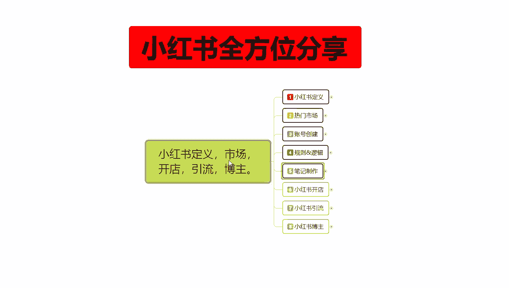
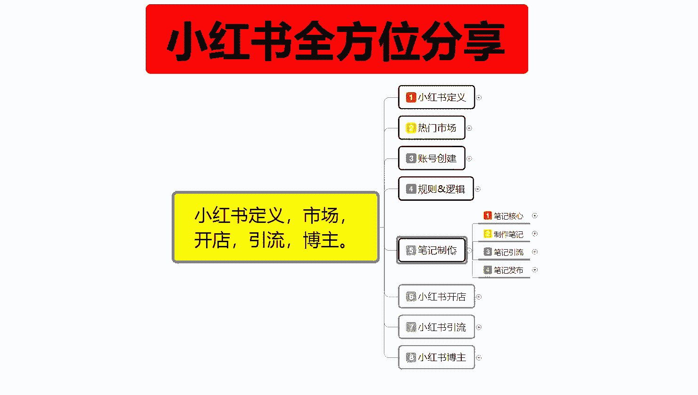
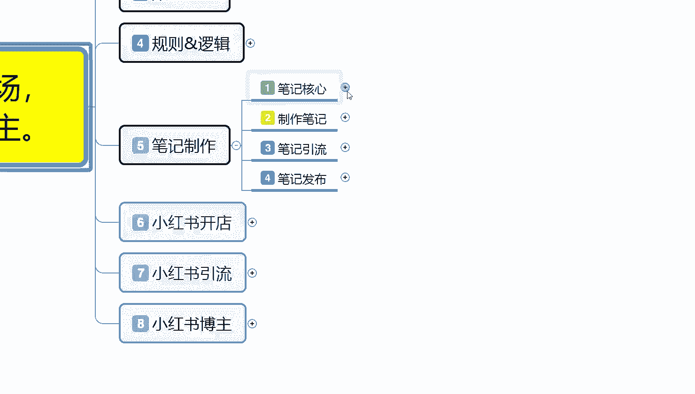
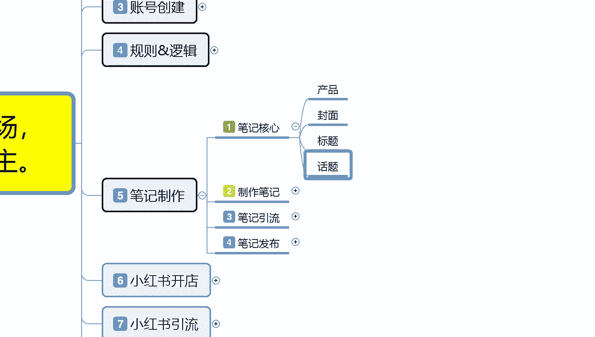
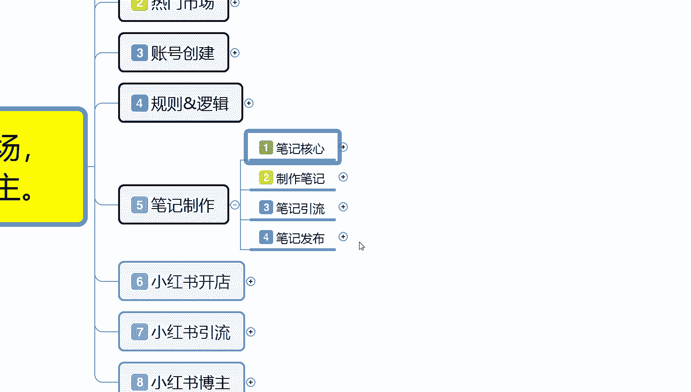
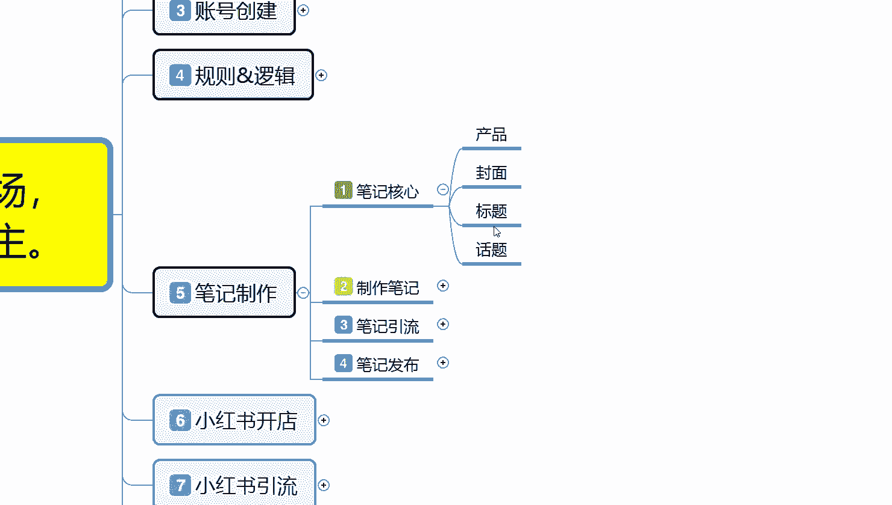

# 比刷剧还爽!!2024(全新)小红书运营网课，小红书运营大佬专为为学渣研制的小红书开店、小红书起号零基础保姆级教程，全程通俗易懂，纯干货无废话 - P8：7、小红书新账号笔记制作（1） - 秋枫不入睡 - BV1AAtHebEvj

大家好，今天给大家分享的是小红书全方位整体分享的第五大课时笔记制作啊。笔记制作这节课的话，它的整体内容往后续包括开店引流和博主，他们的内容都是比较大的啊，包括这个笔记制作，它都是多段课时。

而不是像上面的呃定义市场和账号创建这几个的话，其实归纳总结起来，它是非常简单的，就是小红书的一个技术入门。你到后面笔记制作开始，往后续的话，你包括小红书开店引流博主，它的整体内容的话都是非常多的。

我会分多个课时给大家进行讲解。但是这个的话还是第五大课时笔记制作的一个内容。

我们先了解一下啊，笔记制作我在这里呢是给大家把它分了4个点。第一个呢是笔记核心，第二个呢是制作笔记，第三个是笔记引流。第四个呢是笔记发布。这四个点，笔记核心是什么呢？笔记最重要的几个点是什么？

笔记制作制作笔记的一个内容。方式和方法，笔记引流引流笔记的一个做法。最后呢是笔记发布，就是我们笔记发布它里面包含的一些技巧。

首先我们了解一下笔记核心是什么？产品封面标题和话题四个点。这四个点里面产品啊，你做小红书。做商品，那你就有产品。你不做商品就没有产品，那你就是封面标题和话题这三个点。如果说你做商品宣传。

那你这里面就包含产品。那这四个点里面最重要的是什么？最重要的是封面。和花标题。产品和话题这两个点的话，其实它不重要。他是后续给你加分的，前期最重要的两项是封面和标题。你的一个小红书笔记核心封面做不好。

你的标题。就没有太大作用，你的标题做不好，你的封面做好了以后，你的点击率就上不来。他们两个是互动的。却一而不可。小红书的整体核心怎么说呢？就是说小红书笔记的一核心，我们打开手机的话。

你在小红书上面会很显示很多内容。不管我们怎么去搜索啊，第一个展示的永远都是图片效果，就是封面。懂意思吧？就是说我们先看小红书的话，你不管怎么去看小红书打开的第一要基本上都是封面。封面之后就是标题。

看完封面，看标题，你的封面图片效果还不错，那你就获得了接近70%的一个核心数据。标题占核心数据的30%，也就是点击率。观看到你的图片以后，他还看你的标题，然后再考虑点不点进来。

所以说这个就是小红书笔记制作的一个核心，有封面有标题才是一个完整的小红书。你封面做的再好，你标题不行，那你吸引不到一个点击率。你的图片做的太差，你的标题做的还可以，那你基本上别人看见你的图片就没有兴趣。

两者缺一不可，他们是互互相的是一个整体啊。那这个呢算不上我们整个小红书笔记的一个核心呢？其实它不算啊，你封面标题过后的话，其实还有刚刚我们计算的话，就是说计算的是整个小红书核心展示类目和点击。

它只是我们产品最基础点击的，就是你的笔记制作完成有最基础的一个基础核心点。所以说叫笔记核心是封面和标题。之后你笔记里面比用户点进去以后，里面还有关注、收藏、转发评论，对不对？还有4个选项。

那它涉及到的是什么呢？你有商品就是在商品里面啊，对你的商品进行评价，或者对你的笔记内容进行评价。如果说你没有商品，那他对你进行评价和展示和吸引的内容是什么话题。这个。先封面标题做好以后，然后上你的话题。

我们先不管你有没有产品啊，你在小红书上面，你是想开店做网红也好。啊，开店直接卖货也好，你做博主也好，你做引流也好，那话题排第三位，你的话题就是吸引用户的一个戏。留存时间。

你的话题如果说完美解释了用户所想看到的一个答案。那他会对你进行收藏点赞。转发。评论区里面，如果说你的互动机互动率高了以后，还有互动加成。互动加成的话，它是加你的百分比。

你的话题里面的点赞收藏那个是加评分。这个里面的话，我们把它结合以后的话，就是封面加标题等于展示和点击。产品爆款的必备。啊，条件。后面加标题。等于展示和点击话题加产品引导。就说你在话题里面带入了产品引导。

你如果说有商品就是产品引导。如果说你没有商品，那你就是内容引导也是一样的。只是说产品引导的话，在这个地方你可以把产品把它划分为啊，我们所推广的一个内容。你比方说引引流内容或者说是搞笑内容。

它都属于你的所推广的方式，只是产品内容不同而已。所以说话题加产品，那等于用户购买，或者说是你的一个账号的基础价值，有没有给用户带来一个情绪价值，它也在这个范范围以内。我们需要整体结合以后。

做好我们的一个分享，或者说是你去做店，或者说做分享啊，做引导。这个呢才是。笔记核心封面标题话题加引导。它整体流量计算公式的话，就是看到加点击等于点击等于什么呢？封面加标题。

看到等于第一波流量推流加之后点击的一个反馈。然后的话系统会给你更高的一个曝光和展示。整体来说的话，爆款基础第一要点就是说封面图封面图的话就是呃打个比方，给你们小红书，你笔发放出去以后。

你根据你的账号基础设定的话，小红书会给你1000的基础曝光量。以1000基础曝光量为基础点，1000个展示，点击比例的话，点击100下就是10%。正常的话上一节课给大家讲的时候也给大家说过。

点击量达到11%。他会给你推广更多的流量。1000个展示里面点击率5%，也就是50个点击。那你的一个属性点就会下降。就是没超过11%的数据量。那么平台系统它只会给你3天的一个展示曝光机会。

三天以后收集你这个笔记的综合性属性内容。如果说你的点击率在3天以内就已经超过11%了，那你的排名就会上升。如果说你在3天以后超过11%，那你的产品就是3天。之后他不会再不会再给你继续推流了。

因为你第一个时间段过了，第二个你的笔记推广整体效果不好，笔记内容不够吸引人，笔记封面和标题有问题。啊，这个就是笔记的整体核心。

那我们了解笔记完，了解完笔记核心以后的话，我们最先要做的其实是什么？封面标题做好以后，你然后去做话题，然后做引导你这个引导里面可以往商品上面引导，也可以往你自己想宣传的内容去引导。

你把这四个点了解清楚以后，你的笔记核心了解。你后续才能去制作笔记，才知道自己的笔记应该先做什么，后做什么。也就是说这些给大家分享的，是让大家了解，你再想无双面，你去做笔记推广的时候。

你要先做封面再做标题。标题和封面做完以后，然后再去做话题。话题做完以后再去做引导，这才是一个完美的一个笔记。

好吧，因为时间关系的一个原因，那这节课呢就给大家分享到这儿。下一节课的话给大家分享一下制作笔记的一个整体内容。

