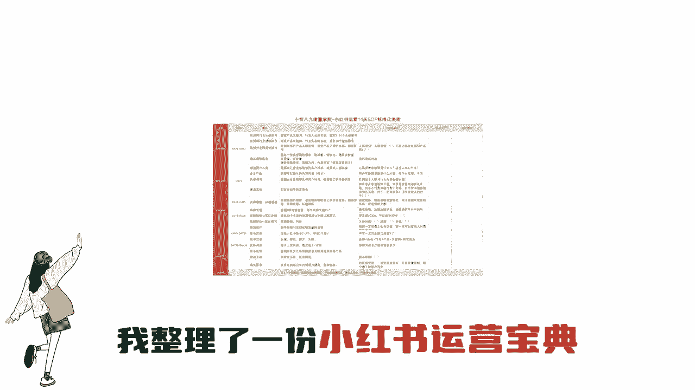
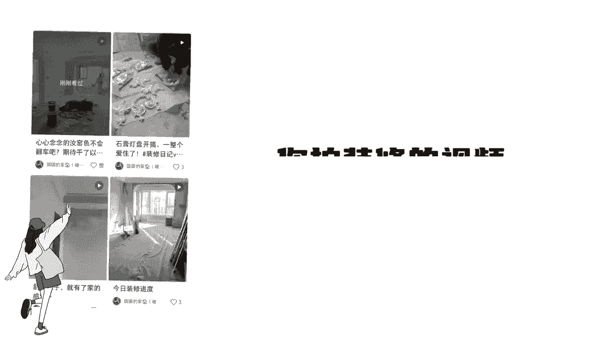
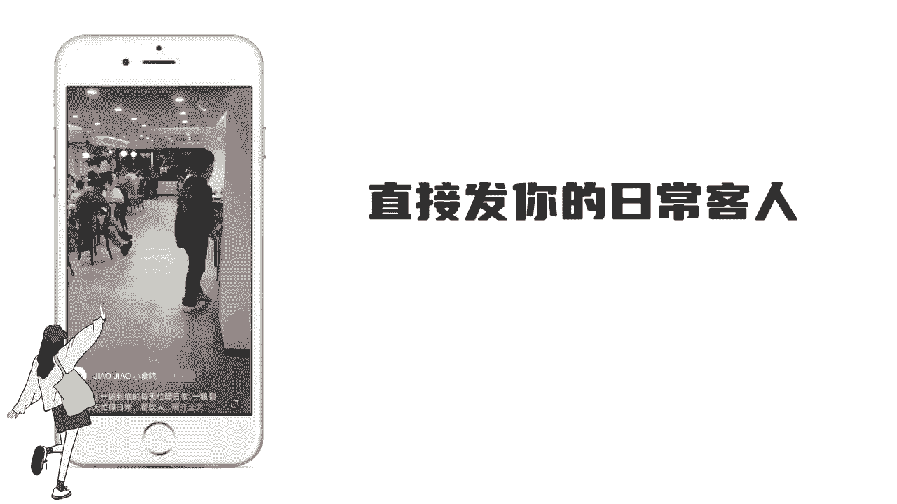
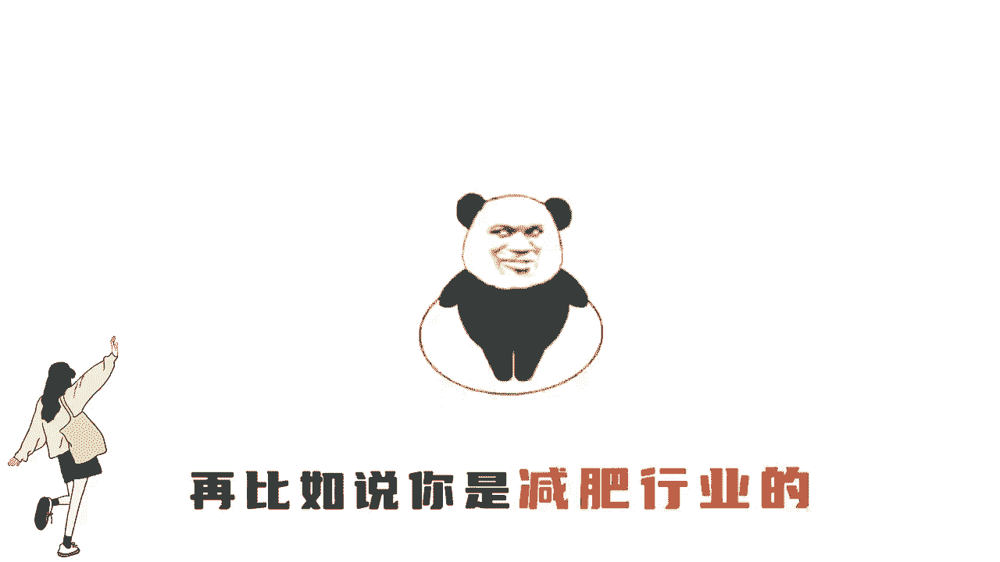
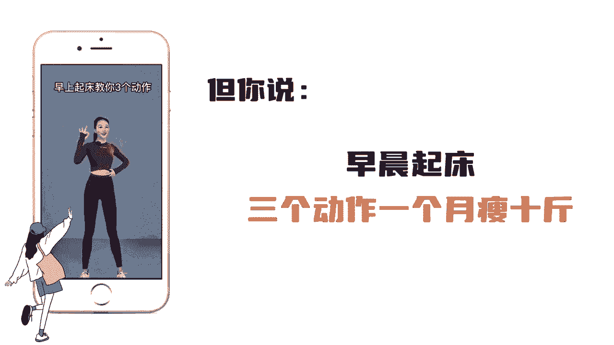

# 比刷剧还爽!!2024(全新)小红书运营网课，小红书运营大佬专为为学渣研制的小红书开店、小红书起号零基础保姆级教程，全程通俗易懂，纯干货无废话 - P8：小红书起号-数字故事法 - 一叽圈圈鱼 - BV1DCape9Epx

数非常恶心的起号方法，正直的人千万不要用，只要你在视频开头加上一串数字，你的流量就能超过80%的人。

我把这个方法称为数字故事法，我整理了一份小红书运营宝典。

放在了视频左下角，我们团队的人都在用，只要在你视频的开头加上正传数字。

一笔记的流量就能从几百到几万，而且适用于各个行业，比如你是做装修的，你拍装修的视频就没人看。

但如果你加串数字，凌晨两点跑30km来帮客户量房。

那你的作品就会有故事性的就会多，再比如你是做餐饮的，直接发你的日常客人一定没人看。

但是你发凌晨两点跑300km去，吃完粉是怎样的体验，再比如说你是减肥行业的。

你直接发减肥知识一定没人看，但你说早晨起床三个动作。

一个月瘦十斤，那你的流量就一定比现在高，聪明的人已经用起来了，类似的技巧还有很多。

你们可以说说你们的行业。