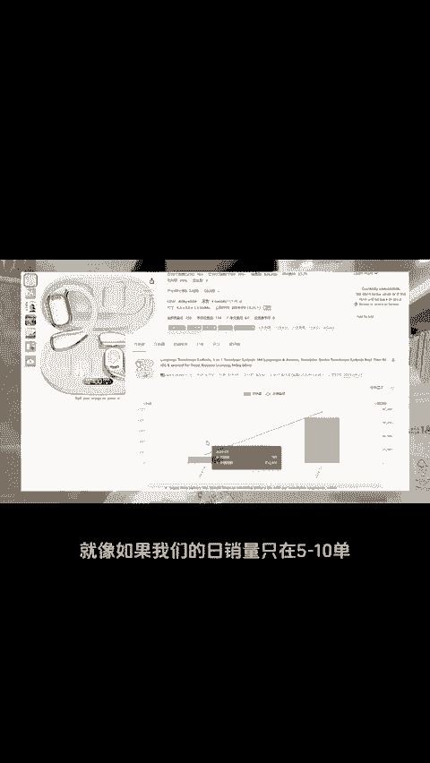
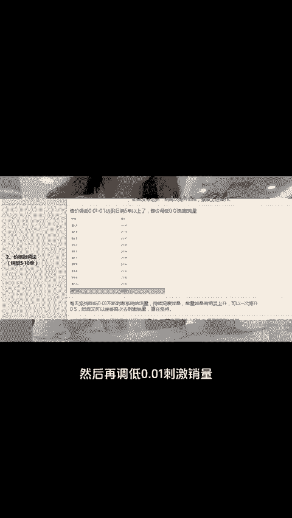
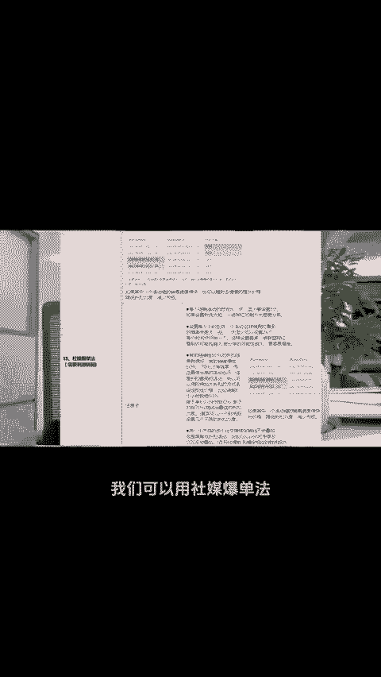
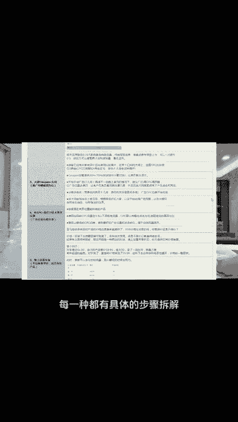

# 没人会告诉你的！亚马逊13种刺激销量的方法（可复制） - P1 - 小亚跨境研究 - BV1UYmVYyEyD

做亚马逊半个月出了1600家，这不是拼运气的来的那是因为我知道针对不同的商品商品不同的推广阶段，我们需要用不同的推广方案。就像如果我们的日销量只在5到10单，那我们就需要用价格微调法，先调低售价0。

01到0。1，让日销达到5单以上，然后再调低0。01，刺激销量每天降低0。01，不断刺激系统给流量，然后还有如果我们商品主在推广中期，我们可以用大额 couponon加大词，如果需要刺激销量的。

我们可以用社媒报单法。至于具体该怎么操作。这里提到了13种刺激销量的方法，每一种都有具体的步骤拆解完整版需要的三个零报走，一起跨境一起报付。😊。

