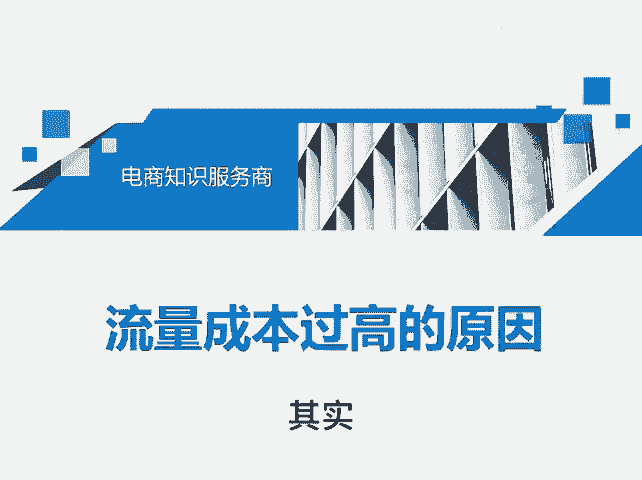
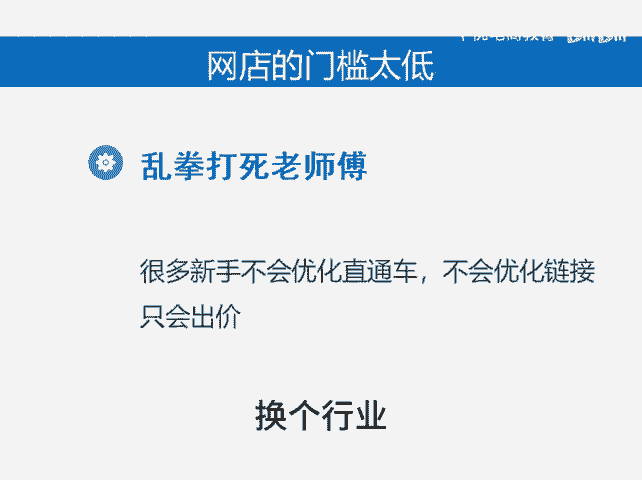

# 流量成本过高的原因 - P1 - 千优电商教育 - BV1PvshemEjh

现在付费购买流量的成本是越来越高。那昨天有朋友说他这玩意儿怎么降低？其实整体的趋势上来讲，流量成本会越来越高。为什么？首先平台要盈利，它流量成本必然一年比一年高。但另外呢拼多多每推出一个新的推广工具。

都是把流量又一次更贵的卖给你，这是第一个原因，平台要盈利。第二个，同行竞争激烈。我们知道如果呢你想获得更好的排名，因为排名高，你获得流量多，你的转化率也高吗？如果你想获得更好的排名，那么你只能出价。

现在很多行业竞争激烈，大家都出高价，那么你想获得更多流量，那你也只能出高价。再一个就是现在网店的门槛太低。有一句话叫乱拳打死老师傅就很多新手开店呢，它不会优化直通车，他只会出高价。

那么它出高的价格就会影响到你的流量，那你也只能出高。所以说呢有的时候新手进来的多，导致竞争更激烈。所以从整体上来看，流量成本会越来越高，很难降低。那你说我想降低怎么办？换个行业。😊。

换一个竞争不太激烈的行业会好一些。我是讲师大牙，欢迎大家扫码添加我的微信，不方便扫码的朋友可以添加我的微信号，80221430。在这里给大家准备到了一套新手运营入门的大礼包，希望能够帮助大家。😊。

