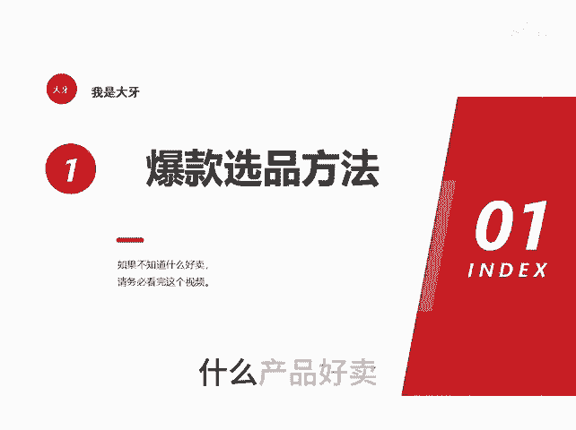
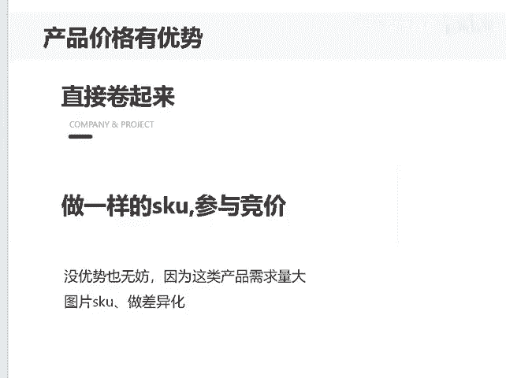

# 爆款选品方法 - P1 - 千优电商教育 - BV1Vn1kYbEAR

什么产品好卖，我们知道呢好卖的产品一般市场需求量比较大。那么什么样的产品市场需求量大呢？其实拼多多平台呢已经告诉你了，就在店铺营销的爆款竞价营销竞价平台招标。因为如果需求量不大。

拼多多呢它也不会让你竞价也不会让你招标。特别是平台招标里面的近期急招，那么是当下呢需求正旺盛。而且这类产品也马上进入旺季，那我们该怎么做很简单，你关注这三个地方，如果你的产品有价格优势，O那很好做。

你直接卷起来就行，做和竞品一样的SKU然后参与竞价。你说我的产品没价格优势，那也无妨。因为这类产品需求量比较大，我们知道并不是每个人买货的话，一定买最低价的，那怎么办？你的图片和SKU要做出一些差异化。

和竞价里面的不太一样，你可以贵一点。因为不同的消费者它有不同的需求嘛，这样的产品你也能够卖的不错，我是讲师大牙，欢迎大家扫码。😡。

添加我的微信，不方便扫码的朋友可以添加我的微信号，80221430。在这里给大家准备到了一套新手运营入门的大礼包，希望能够帮助大家。😊。

