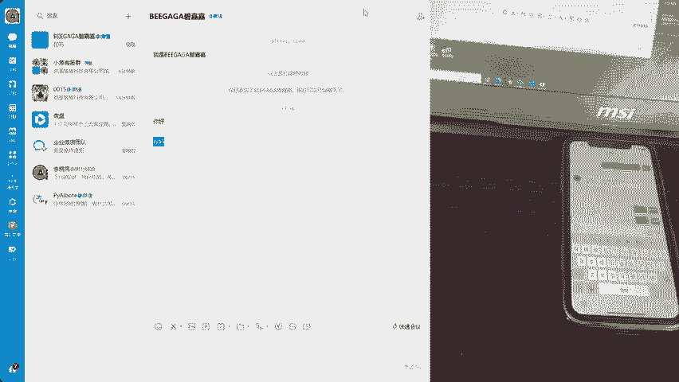
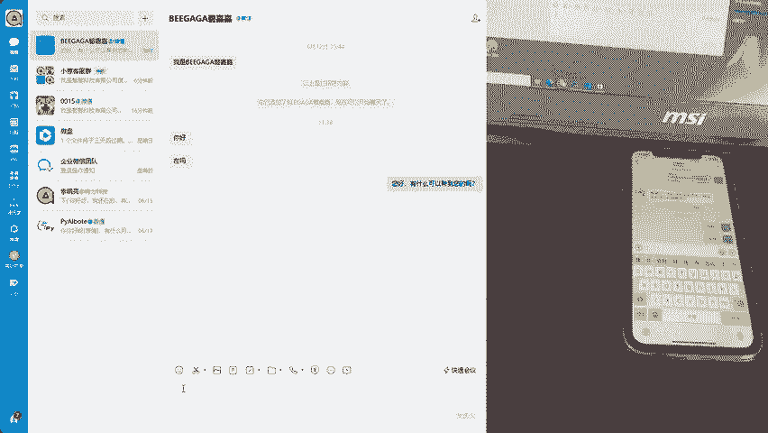
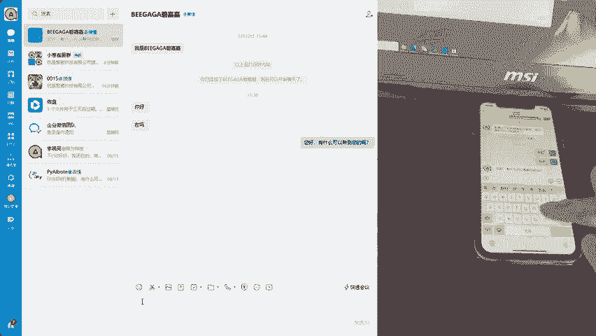
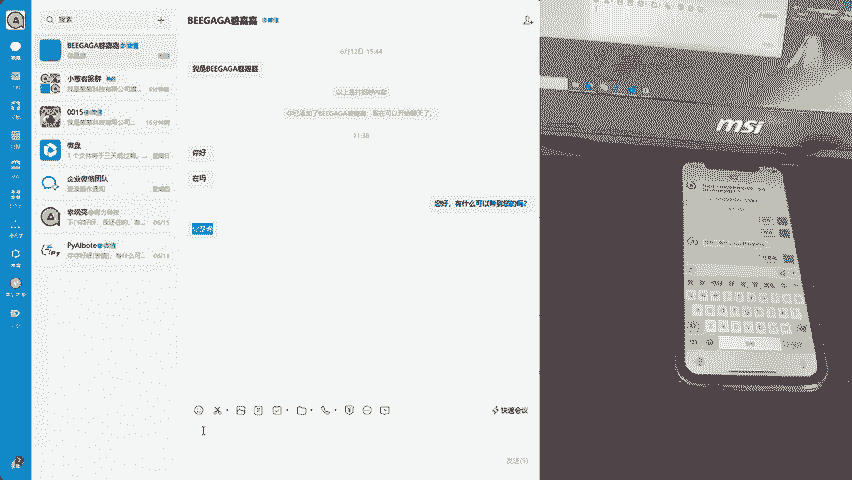
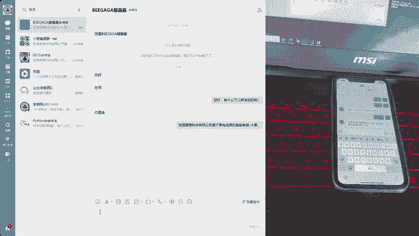
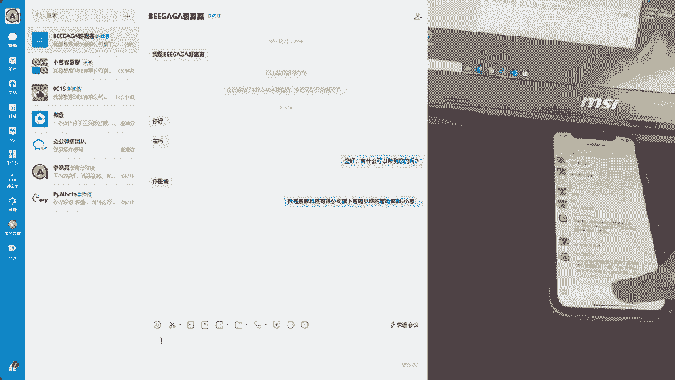
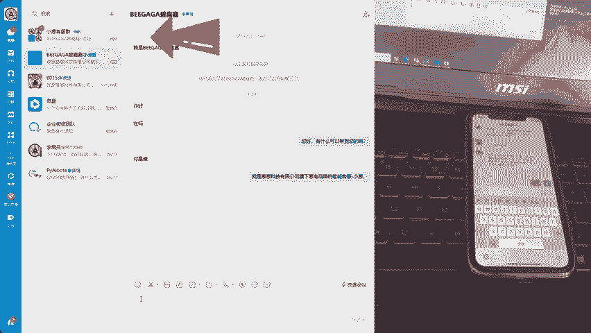

# 爱嘉客服🤖AI+客服，企业微信外部群聊如何@AI客服后再回答问题？ - P1：6月25日(1) - 爱嘉客服AI智能客服 - BV1hhgZePEuM

手机代表了客人去询问II客服。电脑是我们的I客服。检查到有新消息，直接打开。

我们再来试试企业微信群聊II客服是怎么回复的。

检查到群了新消息。

发现并没有艾特我们的艾客服。所以我们的爱客服不做回复。我们再来试试艾特我们的AI客服，看看他回不回答使用一样的问题去问。AI客服进行回答客人的问题。当然，我们也可以让AI客服将群聊的问题都回答。

我们会弄一个类似开关的，让你去选择群聊，是全部回答还是艾特再回答。我们这个鼠标不需要固定在这里的，鼠标可以随便动做你自己的事情。还不赶快找我定制你的专属AI客服。

