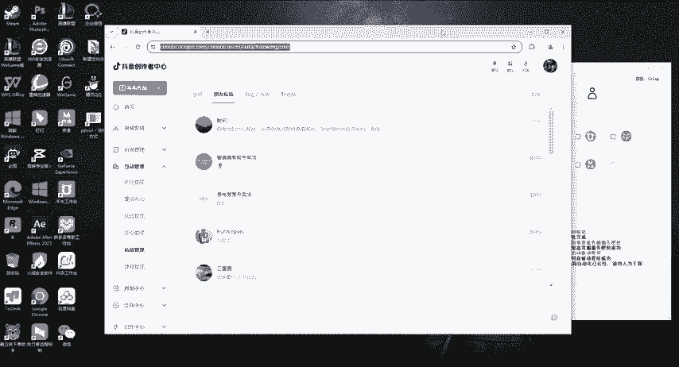
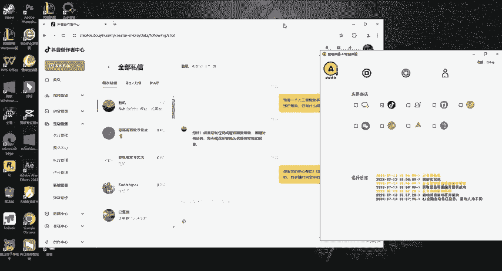
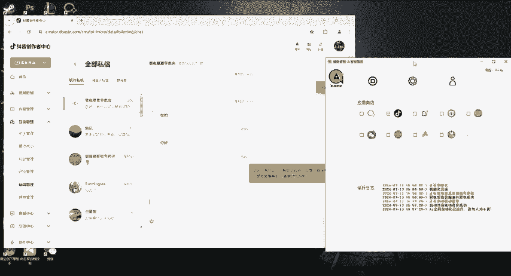
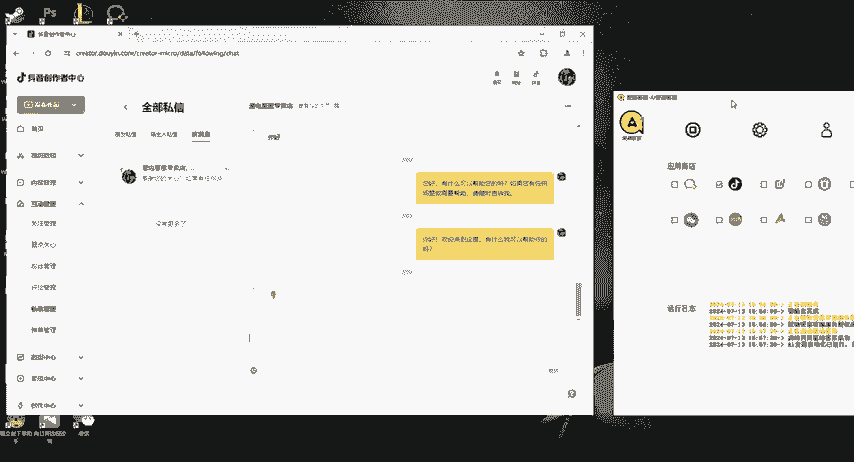
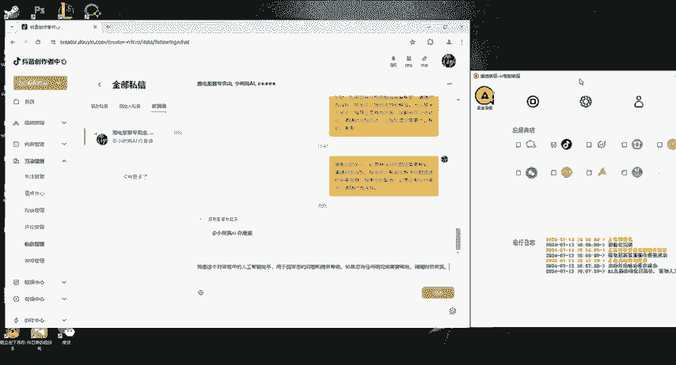
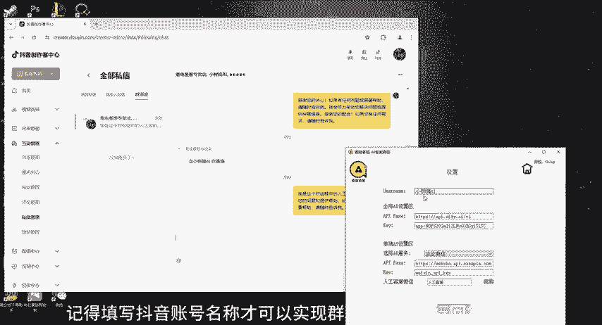
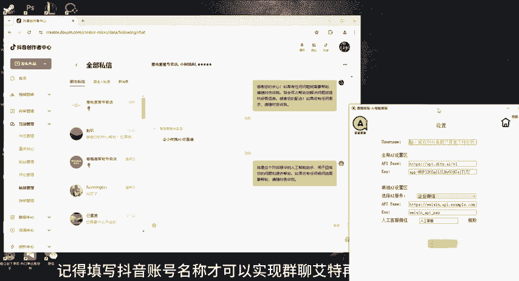
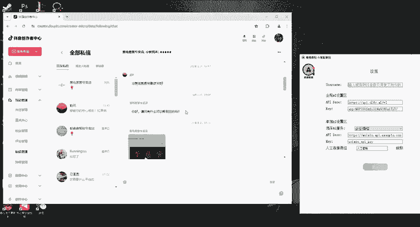

# 爱嘉客服🤖AI+客服，抖音私信自动回复功能 - P1 - 爱嘉客服AI智能客服 - BV1NnbMeYE9j

今天测试一下抖音私信的自动回复功能。登录进去就看见暂时有的一些平台。选择抖音私信。这里是填写自己的抖音号名称。填了抖音群聊艾特你，他才回复。如果不填，就是全量回复。

这里是填写所有平台都使用AI的地址和T，然后点击保存。这里是选择某些平台使用不一样II的地方。配置好了，直接启动AI客服。他会自动打开抖音私信的网页。

识别到了新消息。检测到有两条未回信息。

我们的客服软件也回复了两条消息。在事事群聊。

识别到了新消息。

记得填写抖音账号名称，才可以实现群聊艾特再进行回复的功能。

不然就会进行全量回复了。

快来找我定制你的专属AI客服吧。