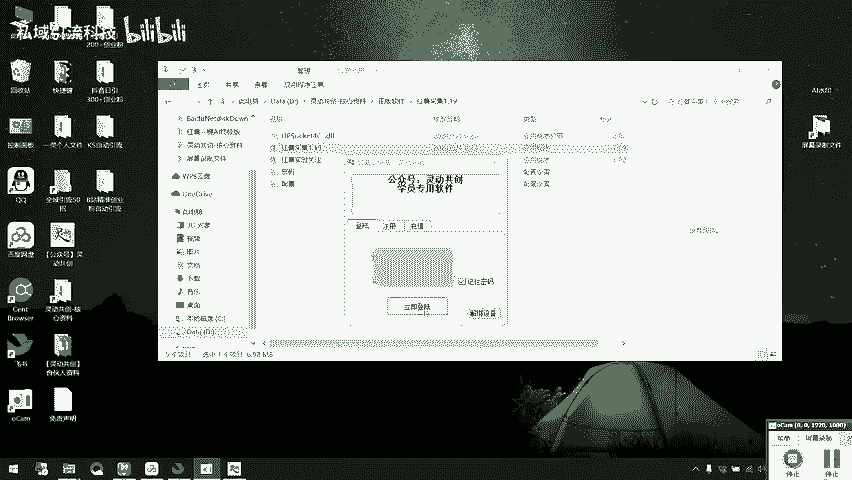
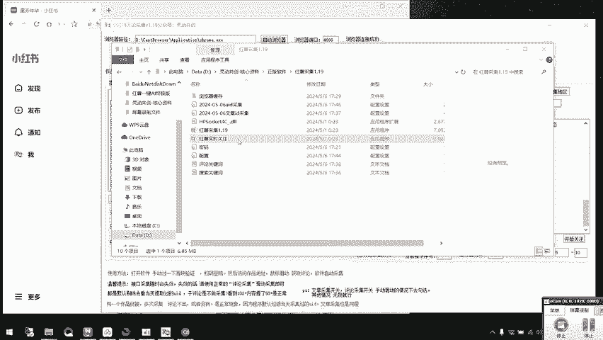
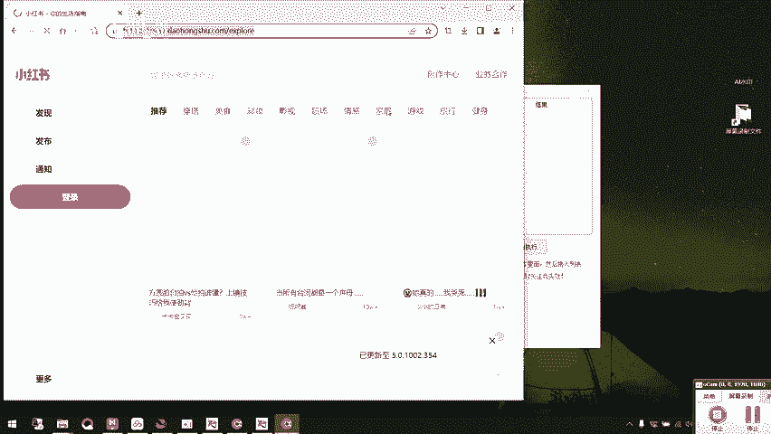
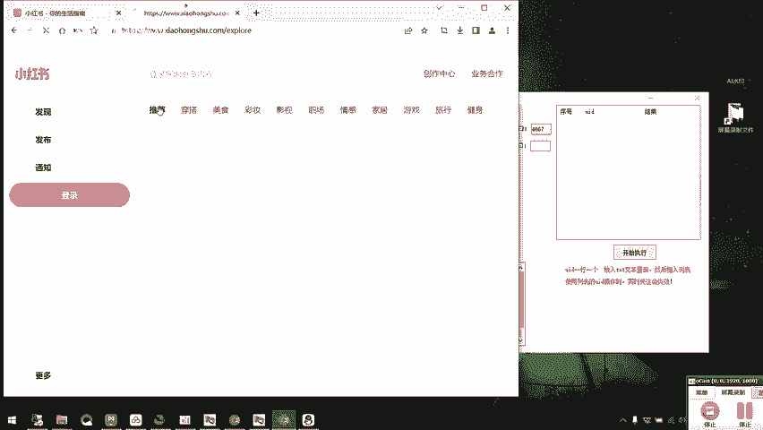
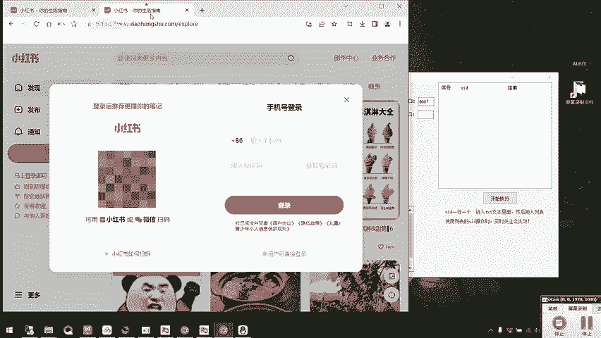
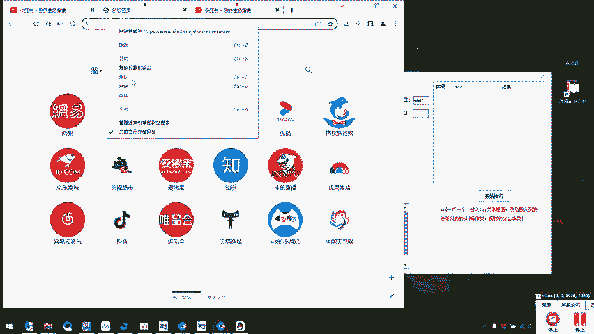
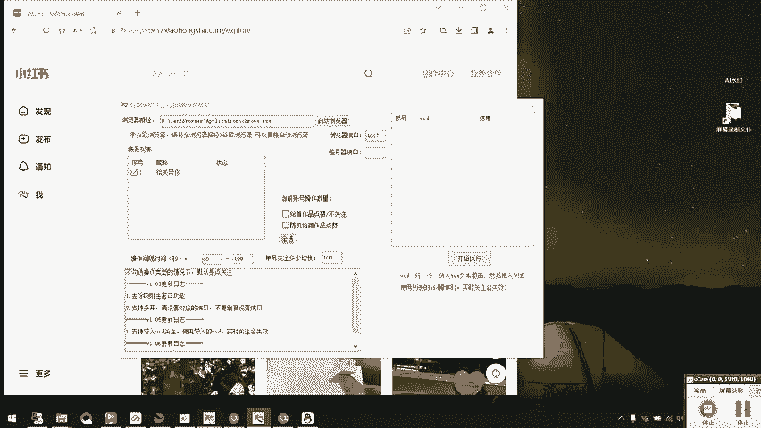

# 独家揭秘！小红书自动引流获客机，日引精准粉丝500+！同行不想让你知道的黑科技！ - P1 - 私域引流科技 - BV1pCh6eREDS

灵动共创的兄弟们，大家晚上好。咱们的红薯自动采集自动曝光的软件今天已经更新了，我给大家录一下最新版的教程。用过的兄弟们都知道软件的牛逼之处啊，它是全自动采集一下曝光的。今天咱们就废话不多说。

直接上软件操作。好吧，我给到的文件一定要打包下载，然后咱们直接打开这个红薯采集1。19。首次打开文件需要输入一个内部密码。咱们的内部密码是灵动共创牛逼。咱们之前有账号的就可以直接登录，没有账号的话。

在这里注册一下就可以了。然后我们点击登录。

这个版本和之前版本的区别啊是在这儿把内置浏览器改成了外置浏览器。所以现在的话咱们需要输入一个浏览器路径，我把这个路径删了，给大家演示一下在哪里找。还是建议使用我的这个百分百浏览器。

然后右键点击属性复制这个目标。然后把它粘贴到这里。就可以了。这个浏览器的安装包我也会一起打包好，放在文件里面。这个地方会有一个浏览器端口，浏览器端口是什么呢？你从每一个端口打开的浏览器。

它都是独立的账号登录不会相互冲突。所以说如果你需要多开软件，或者说用到实时关注那个软件，都需要输入端口。我给大家演示一下，然后咱们这个软件呢。

记得一定要从4666开始输入下一个就是46674668这样输入好之后，点击启动浏览器。这个时候它就会自动跳转到小红书的界面。然后我们登录一下账号，登录好了之后，跟咱们之前软件的使用方法是一样的。

既可以直接填写作品链接来采集评论，也可以根据关键词来采集文章，然后再采集评论。比如说我们要采集某一个特定的作品，就点开这个作品，然后复制它对应的链接就好了。复制之后粘贴到这里。

这个的话我就不具体演示操作了。我们来演示一下关键词搜索文章，在这里可以设置文章搜索关键词。比如说我们要引流创业粉，就可以搜索创业搞钱。设置好之后就可以直接给它关掉了，然后点击文章采集。

它就会自动开始采集文章。可以看到这个采集的速度是很快的。因为我是演示啊，所以就不采集太多了。点击这里停止采集。采集了文章之后，我们要去采集评论区的精准用户怎么设置呢？

我们在这里看到这有设置评论关键词采集。然后我们点击。创业粉的话，我们就搜球带。怎么做？这些都是创业粉最喜欢的评论词汇。当然，如果你不是做的创业粉，你的文章关键词和评论关键词都可以根据自己的行业来确定。

设置好之后就可以关掉了，然后我们全选。点击采集文章评论。它就会开始自动获取评论。然后还是说演示啊就不采集那么多了。如果采集遇到这种没有昵称，也没有红书号的情况，就是账号风控了。

这个时候呢就要去换一个账号或者过一下滑快。我演示的话就不换账号了，等用户采集好了之后，就可以在这儿点全选，然后开始关注，它就会自动运行了。这里可以设置关注间隔时间。

我个人建议是时间稍微设置长一点会比较安全。但因为现在我只是演示啊，就给大家设置1个5到10吧。点击开始关注。这地方它就会自动跳转了。像这种出现过滑快的情况。通过一下验证就可以了。

然后你看这已经显示关注成功了，已经关注成功两位了。停一下，像刚刚那种过了滑快之后，我们再进行评论采集。这个时候它大概率就会有昵称和红书了。因为解除风控了。然后今天还想给大家着重讲一下实时关注的应用。

它怎么用，也是在咱们的文件里面打开一样的，点击一下，立即登录。

咱们打开这个实时关注之后，浏览器路径一样的，要填一下，还是咱们之前说的百分百浏览器，我就不重复讲了。然后咱们这个浏览器端口号一定要改啊，刚刚是4666，现在改成4667，然后咱们点击启动浏览器。

这个时候就可以登录一个新的小红书账号，登录了之后，这个实时关注有什么用呢？跟大家讲一下，实时关注它是可以多账号去循环操作。也可以说配合咱们的采集系统，让它边采集边关注。像之前我们单独用这个采集系统的话。

需要采集完了之后，然后全选，然后再关注。但是如果我们配合这个实时关注的话，它就可以边采集边关注，然后我们还是来先登录一下账号啊，这个是需要CK登录的CK登录的方法，我之前讲过很多遍了。

这里需要注意一下咱们实时关注的这个账号和之前采集的那个账号不能是同一个号，不然会有冲突。我再给大家演示一下提取CK吧。咱们账号登录了之后按一下F12。然后找到这个network。

点击一下network之后，再按F5。等这些加载完之后。我们就上滑滑到最上面，然后这有1个EX开头的。点击之后再找这个head。然后往下滑。找到这个CK看到了吗？

然后咱们要把冒号之后的这一大串全部复制下来。然后在实时关注里面，点击添加账号粘贴。这样就完成了第一个账号的登录。然后说如果你想要登录多个账号怎么办？在这里右键，然后点击在右侧新增小号标签页。

然后把小红鼠的这个网址复制过去。

这样就可以登录一个新的小红书账号，同样的操作提取CK添加账号在这里。你要多少个小号，你就新增多少个小号标签页，不停的重复这个步骤就可以了。

这里有一个需要注意的点，就是当我们在这儿添加完了多个账号之后，你要记得把多余的标签页都给关掉，保证只有一个主标签页在这里。然后在实时关注这个软件里面啊，这里可以设置操作间隔时间和单号关注多少切换。

就算只有一个账号，这里一定要设置啊，一般设置1个100。因为它默认是操作一次的话，如果你不设置它操作一次就会停止。操作间隔时间关注的话，建议是60秒以上，60到100吧。

然后咱们要记得把要操作的账号勾选上。这个时候我们就需要两个软件配合使用。打开之前的采集软件。

大家可以看到这里有一个实时关注。他们两个软件可以配合使用。当我们勾选了这里的实时关注之后，我们这边点击采集文章评论。如果有了新的UID信息，实时关注就会自动运行。我这边演示的话，我就把时间调慢一点了。

然后咱们点击采集文章评论。看到没？这边采集到了新的用户，这儿就会自动关注。已经关注了。你看。一边采集一边关注。然后我们这个新版的话是加入了判断已经关注的用户，他不会再重复进行关注。目前这个版本是这样。

然后大家有什么不懂的，可以来我的公众号来找我。后续的话版本肯定也会更新。