# 现在做拼多多你必须要学会的两个玩法，稳定靠谱，新手也能操作！拼多多新手开店运营干货分享 - P1 - 钱老板电商 - BV1V8mKYeE2C

现在做拼多多，你必须要学会的两个玩法，稳定靠谱，新手也能操作。第一个玩法就是零车玩法，这个玩法很简单，就是成本价去售卖，售卖到一定的程度就进行涨价来得到我们该有的利润率，我们一个产品只需要花200大洋。

直通车一天开100开个两天就可以了。那有人就有疑问了。

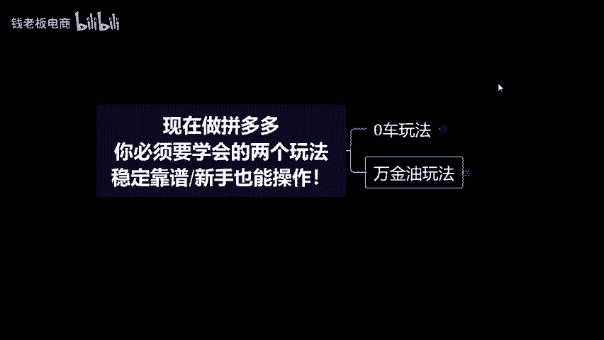

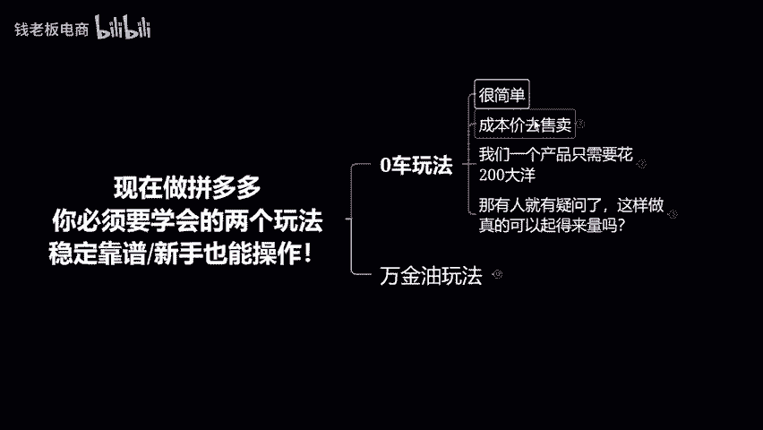

这样做真的可以起得来量吗？很简单的道理。如果说你成本价你都卖不动的情况下，你加了利润率，你还能拿到自然订单，那肯定是不可能的。我们成本价都没办法去获得到平台的比价机制，从而来拿到属于我们低价的流量。

那你带利润就更加的不可能拿到了，这就是零车玩法的核心点。第二个玩法就是万金油玩法，和零车有点相似。但是它的一个亏损点是在我们的直通车上，我把前期的定价利润率定在25%。然后开的一个二的投产。

当二的投产能开得动之后，我们去进行涨价，涨价和涨投产，涨到35%的利润率，然后投产卡在6前期我们用25%的利润率用直通车去抢自然流量链接的订单，到后面呢我们就开启付费，去抢付费流量的订单。

这个玩法就是免费流作为我们前期铺垫。付费流作为后期的稳定。

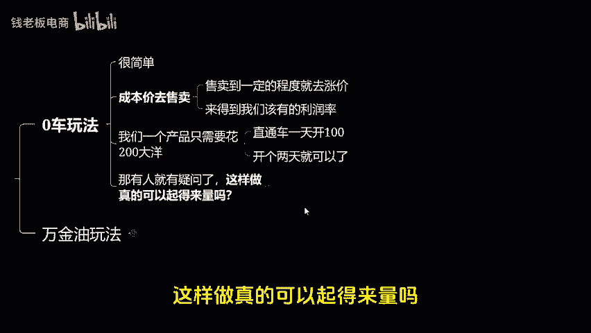

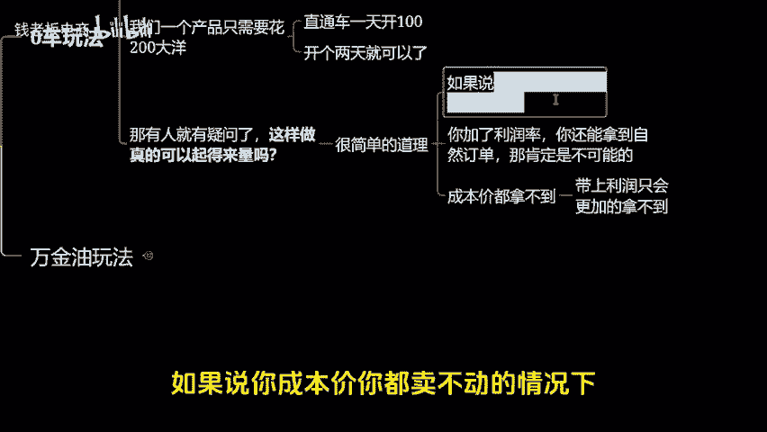

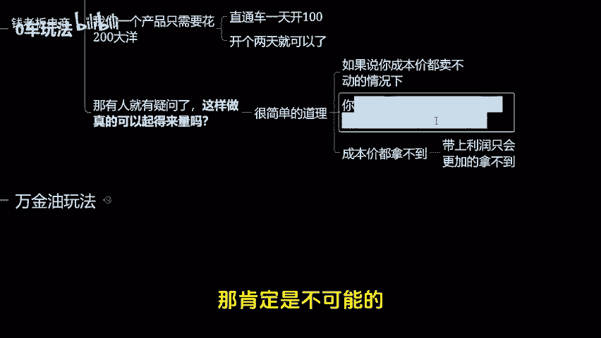

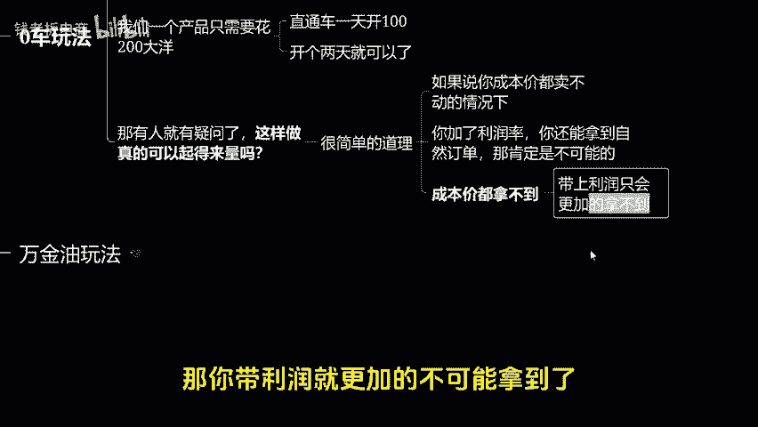

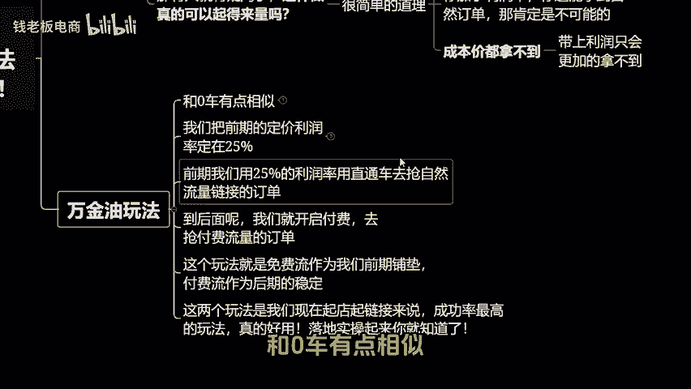

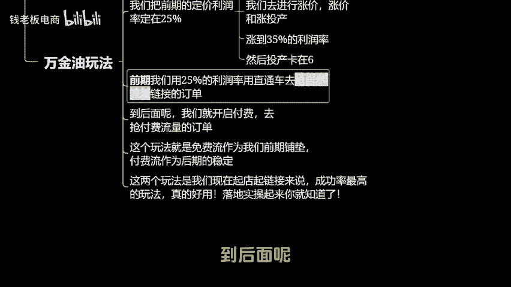

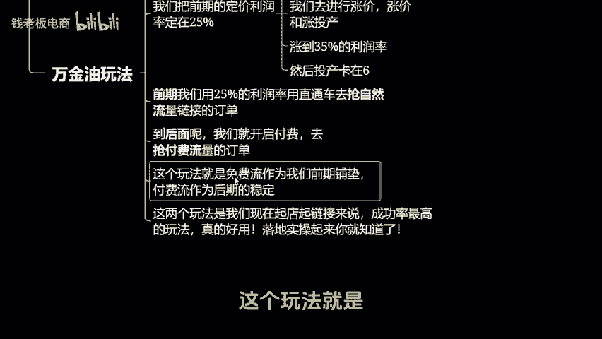

这两个玩法是我们现在起电器链接来说，成功率最高的玩法，真的好用，一个字绝落地实操起来你就知道还有什么不懂的。我这里也整理出了一个完整的操作流程课件。😡。

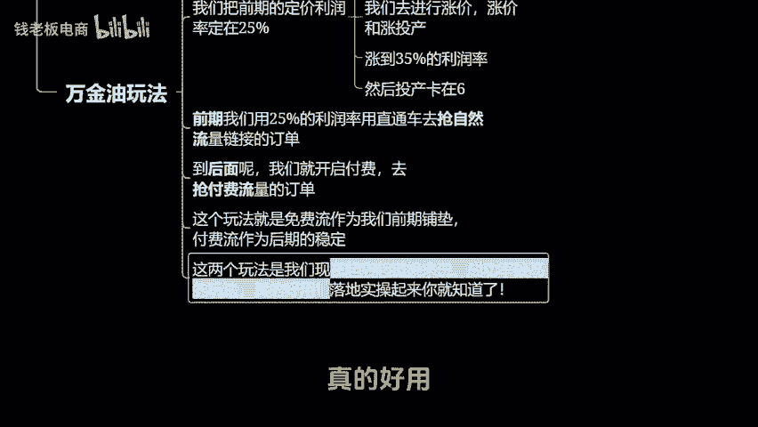

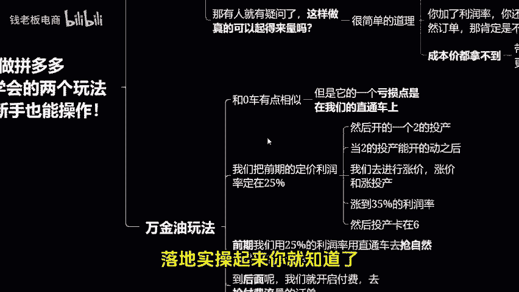