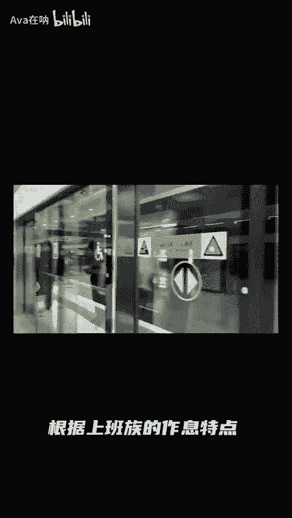

# 瑞幸咖啡品牌定位与客户激活策略分析 ｜ 营销组合全面解读 - P1 - Ava在呐 - BV1vgiGe3EVa

哦，大家好，好久不见。今天呢要讲的品牌，它是谁火就跟谁玩。说到热点。那瑞幸在蹭热点上玩联营销可以说是数一数二的了。瑞幸咖啡沉立于2017年是一家中国领先的咖啡连锁品牌，目前规模仍在扩张中。

今年的4月30号，瑞幸公布2024年第一季度财报财报数据显示，第一季度总净收入为人民币的62。78亿元，同比增长41。5。门店数量净增了2342家，目前门店总数达1万8590家。

但由于扩展业务带来的运营成本上升和利润率下降，瑞幸在这一季度整体经营亏损了人民币6510万元。可即使在这样的一个情况下，瑞幸还是把今年的营销费用增加到了3。258亿元，在2023年同期的1。994亿元。

增长了63。4%。为什么营销这么重要呢？营销在瑞幸品牌中又担任了一个什么样的角色？哎，我们来凑凑热闹。🎼首先我们需要了解到，目前瑞信有20%的订单都是来自小程序，超过70%的订单来自app。

这就是瑞信公司以科技驱动知民证模式为核心的关键。通过移动应用程序和广泛的门店网络为顾客提供咖啡饮料。

🎼截止2023年12月31日，累计交易客户数量达到2亿多。经零售模式比其传统零售确实更加强淡，主要特点就是地毯式覆盖全渠道销售，采用科技驱动，通过移动应用程序。

也就是咱们的手机上的各种爱小程序啊和800多家门店网络为客户提供高便利性的产品。结合线上和线下的优势，提高了运营效率和客户体验。哎，我们再看看他们的产品特色，任性在前期产品线单。

因客户量呢也始终提不上去。但是后期呢他们对于产品进行了一个深度的开发以及多样性的研究，并且为每一个系列产品呢都去做这个深度营销，不断开发新的产品包括咖啡、茶饮小吃等等，满足不同客户的口碑。

讲完的零售终端和产品，我们来看看他们的重品牌定位和与之对应的营销策略。🎼最信的品牌定位呢是喝得起喝得到的好咖啡。光看这个品牌定位，我们就知道肯定是做的一个价位不高啊，平民化品牌。再看看他们的目标客群。

瑞幸正在从白领商务人群转向更为大众的年轻人路线。品牌定位价格定位目标客群都是高度保持一致的这就让营销有地放兜一棒子一郎微库苍饮做完了品牌客群的定位就到了如何把品牌与客群链接的阶段。

那这个阶段就成为是营销。要说营销策略完的话，相信市场上瑞幸感受第二的每几个品牌感受第一跨界联名是瑞幸常用常新的营销策略，借用不同经典的IP的天然流量，实现联名制造巨大的声量，从而打造品牌的记忆点。

比如酱香拿铁突破资源币咖啡加酒成功戳中大众消费经早开业酒窝片一起名族5G红楼梦文化IP的合作，不仅将一票难求的名红楼梦搬到线上掀起热议其量更是撬动了瑞幸中国茶咖成功出圈这个经典IP猫和老鼠策划出了马斯卡洛拿铁出他的经典联名贴套纸袋周边品。

🎼能够引起消费者的怀旧情怀，获取了童年记忆符号，促持了消费行为。🎼这里有个小知识点啊，营销策略往往不会单个出现，而是以组合拳的形式出击。

以上咱们举例的营销案例中就综合了情绪营销、互动营销、仪式感营销、个性化营销等等。那在这里呢我就稍微讲一下每种营销的策略和目的，让情绪营销，它就是抓住客户群体的痛点，话题热度持续提供情绪价值。

引导用户参与讨论。这点对于年轻人来说是非常有利的。互动营销呢就是高度参与与用户的话题，鼓励用户进行二次创作，再加强用户与品牌的链接。而个性化营销其实也就是字面意思。瑞幸在产品上市的时候。

不仅与明星合作上有花式创意。每款产品下市的时候呢，也会专门去发布通知，这不仅是为产品回归做预热，也是链接了产品和与之对应背后的口味客户传来一个信息，有很重视你们。

而说到个性化营销呢就不得不提瑞幸的另一个重量及经营手段。私域域名。瑞幸的私域社群每日可贡献39万到110万杯左右。日均总碑量在352万左右，占比约为11%到30亿。其中社群直接转化率为1。94%。

🎼那么这些私域流量是从哪里来的呢？首先是自有渠道的二次导流裂变拉新。基于LBS定位全称也就是location说白了呢也就是咱们的手机定位在提一嘴广告投放也是目前瑞信主要的流充形式营销费用的占比来看呢广告投放费虽然不如联合的多。

但也举足轻重的渠道的二次导流对多放品牌呢其实是非常有用的拉新策略。因为很多品牌短期内还无法有强劲的后备资金去进行这个联名合作便利撒网。

但是他们还可以把大投放在运营上的渠道的二次导流平门店的只是引众推文菜单引流微信生态的触点引流。们平时看到的朋友圈信广告啊啊这个信公众号文章都会有个社群的添加。

是不是感觉我活的方方面面都充了营销思就是营销魅力社会心理经济息息相关。但最裂变拉在业微信的聊天群里众号信都设计了裂变引流的机制，其经典是注册首获得奖一般的径呢就是企业微信社群。

🎼到公众号或者到这个app或者到小程序或者是到这个好友申请。但无论的是哪种路径，最终的目的就是为了让客户拉客户进行消费。这种机制呢也被广泛应用于啊这个各种平台的推广，向拼多多美团买菜等等。

都在使用这种招不胜多管用就行的拉新机制。企业微信的聊天群不是说在里面拉了人就不管了，而是要有效的去激活客户，指向最终的销售额，微信社群激活客户最主要的手段，就是发券提醒。根据上班族的作息特点。

在群内设置周一到周日不同的时间微调。不仅如此，精细化运营比的就是谁更惊喜，瑞信的后台机制会根据用户消费习惯设置不同的标签，在不同时间给出折扣力度，给出消费者不同的消费券类型，精准投放。

如果某些门店的销售目标未达标，也会通过门店社群和私信的方式，向未触达的周边人群发券，不断提高优惠券的力度，直至激活沉默的老客户。低下产品竞争花样百出的营销策略。

超强的供应链与零售网络为瑞信架起了品牌的过城河。瑞信能走多远，我们且拭目以待。

