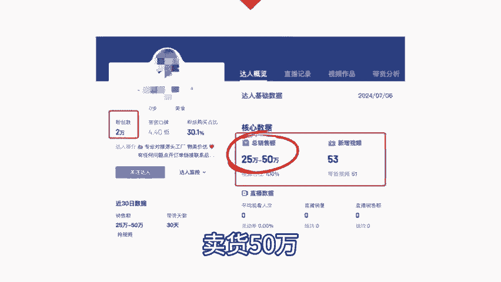

# 用AI数字人混剪带货，新号仅55条作品，带货50万+，玩法简单易上手，保姆级教程分享 - P1 - 粉笔创业笔记 - BV1gsWLeLECZ

🎼用AI数字人制作农产品的带货混节视频，一个月发布55条作品，卖货50万。大家好，我是粉笔。那今天呢跟大家分享了1个AI数字人的爆款带付玩法。最好的一套作品呢是一条卖八角香料的视频，光这条视频啊。

就卖出了7。5万件商品，销售额呢达到25万，这个账号类似的视频还有很多。比如说卖月饼卖大米卖银耳羹的给大家看一下它的视频案例啊以及画风家人们就这个百思不厌的东北大碴子又降价了。如果说前两天你没有拍的。

那么恭喜你今天你可赶上大漏了，之前还是29。9块发5斤的啊。今天刚刚接到厂家通知，给咱拿出来180单的福利尝鲜价。基本上我们可以看到它的结构都是如出一辙的。用AI数字人口播，然后加上混剪商品实拍的视频。

统一的文案结构构成这样的一个带货视频，然后呢就是不断的去选品测评，按照这个结构去制作视频测试和放大。那这种账号呢，我们应该怎么做普通人应该如何快速复制，重点啊需要去解决几个核心的问题。第一个问题。

选择什么样的产品。第二个问题啊，如何定制AI数字。😊。

🎼带货视频。第三个问题呢就是如何制作混解视频。首先就是选择什么样的产品。那这种视频啊看的用户基本上就是年龄比较大，下层城市的用户。比如说四五线城市的中老人群体。

因此呢选品上基本上就围绕着他们比较容易的单价不贵的农产品去选择。比如说这个号带的品呢基本上都是农副产品像八角香干五谷杂粮东北大碴子东北豆皮等等都是这个店铺的爆款产品，那最好的包角大掉这个产品呢。

就已经卖出7。5万份。那因此在选品上我们可以直接对标这个账号的爆款选品去选品广场中找到合适的品就可以了。接下来呢就是定制AI数脂的带货视频了。我们需要先拆解一下这个号它爆款视频的带货文案。

比如说这条卖了20多万的爆款视频啊，它的文案结构就是这样的，一开始呢先有一个高潮前置的部分，吸引用户观看。我不管别人怎么卖，我就这么卖。反正我家今天中的4。8毛一罐的茴香八角，你们都抢到了吗？

那第二部分呢就是强调这个是一个厂家的直销活动，价格非常便宜，活动马上就结束了，来提升用户的一个。🎼第三部分呢就是强调这个产品的品质非常好。做一个部分就是引导用户去小黄车里面下单。

这个文案结构啊简单粗暴并不复杂。那用AI去洗稿或者呢是自己改稿，基本上呢就可以出一篇原创的爆案。接下来呢就是生成数字人我们打开这个数字人生成工具，然后呢点击智能成编再把准备好的文案复制进去。

接下来呢选择一个合适的数字人的形象，在找到一个合适的声音，点击立即生成几分钟时间呢就制作好一个数字人的视频了。视频制作好之后呢，再去找到我们想要带的这个产品，它的实拍视频。

然后导入到简映里面参考这个对标账号的爆告视频，一帧一帧的去做混剪就可以了。熟练之后呢一个视频啊可能3到5分钟就可以搞定了。

AI数字人的优势呢就是可以高效的替代智能主播进行口播代播对下层市场的中联人群体呢？他们对于主播是不是数字人其实是没有感知的。在他们视角里就是一个漂亮的美女主播在卖厂家直销。

并且很便宜的农产品不下单就没有了。那是不是有点像早期的电视购物一样这个下呢目前。🎼比较小众的，可复制性比较强，空间大，不仅在抖音视频啊也可以全量的去铺。感兴趣的朋友呢可以尽早去尝试一下。

那因为视频中啊不方便公开对标账号的信息，所以呢我也单独整理好了这个爆款账号的所有数据，包括账号信息，爆款的全品信息啊，以及呢爆款带货视频的一个数据都帮大家准备好了，这里呢就可以看到这个账号。

最近一个月的所有的具体数据了。感兴趣的朋友对着它去一比一的复刻，然后做出一个类似的账号还是比较容易的。那需要这份时长手册的朋友呢可以一键三连评论区回复666，我会按个小数点示范给您。好了。

本期视频呢就到这边，关注粉毕，每天再解个热门项目，我们下期再见。