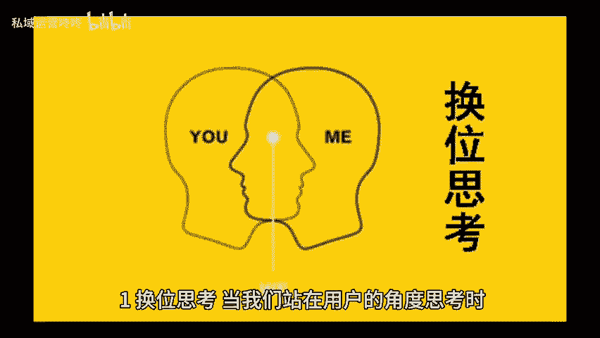
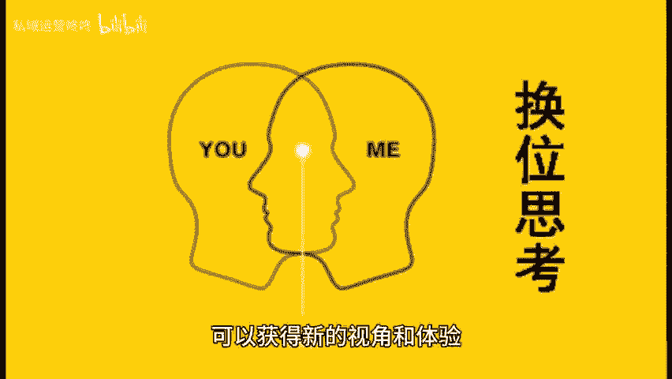
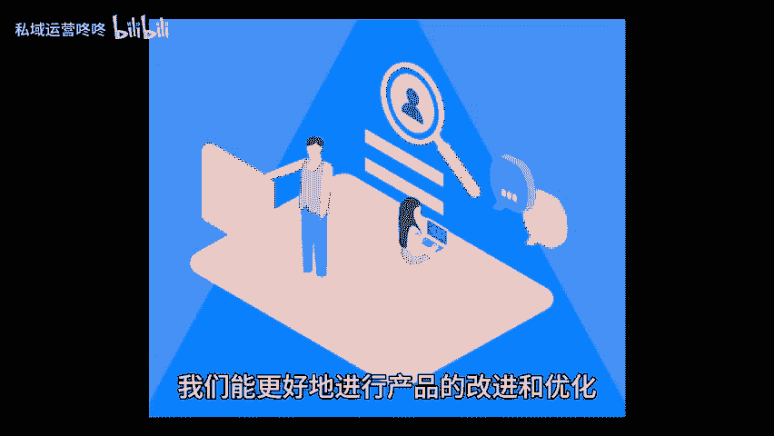

# 用户心理你懂多少？三步快速提升你的用户洞察力！ - P1 - 私域运营咚咚 - BV1y6vYeEEy3

🎼你是否曾思考过怎样才能深入了解目标用户的内心想法？今天我将分享三步快速提升用户洞察力的方法，让你更贴近用户的需求。一、换位思考。当我们站在用户的角度思考时，可以获得新的视角和体验。

想象一下用户在使用产品时可能面临的困难，疑虑和期待，通过了解他们的真实感受。比如在使用过程中遇到的障碍或心理负担。我们能更好的进行产品的改进和优化。2、和熟悉的信息或领域做关联，将用户的需求。

与自己熟悉的信息或领域联系起来，可以帮助我们更好的理解他们的行为。例如，如果你在营销一个健康食品，可以思考用户在选择这一产品时，可能会考虑的健康趋势、饮食习惯或是社交影响。

这种关联不仅有助于你设计更符合心理预期的产品，还能在推广时更好的传达价值，吸引目标用户的关注。三冬问如何合适吗？通过询问用户使用某项产品时的具体情境和感受，可以揭示潜在的需求。😊。

🎼和期望。比如用户喜欢在什么环境下使用你的产品，使用过程中，他们最关心的是什么？这些问题不仅帮助你理解用户的使用习惯，还能发现产品改进的方向，提升用户洞察力并非一蹴而就。但通过换位思考，建立关联。

以及不断提问，我们能更全面的了解目标用户的心理。今天的分享到这里就结束了，咱们下期再见。😊。

