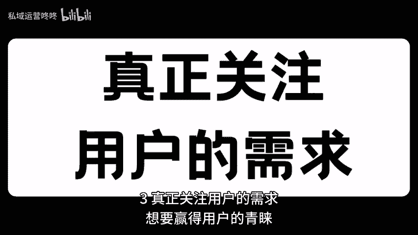

# 用户思维不是说说而已：三个标准让你真正懂用户！ - P1 - 私域运营咚咚 - BV1mKWWe8EAt

🎼宝子们，今天我们来聊聊如何真正理解用户，成为一名合格的运营者。下面我为大家总结了三个标准，让你轻松掌握用户心理，快来一起看看吧。以观察和洞察力。首先，我们要学会用心去观察身边的每一个细节。

用户的行为习惯，甚至是他们的小情绪，都能给我们带来巨大的启发。所以动动脑筋，别放过任何一个细节哦。2、听取用户的声音，不管是通过社交媒体问卷调查还是面对面的交流。用户的反馈都是金贵的宝藏。

我每次都认真记录用户的建议和意见，哪怕是一些小小的改进点，也会让我兴奋不已。比如我曾经因为用户建议改进产品功能。结果销量翻了一番。3、真正关注用户的需求，想要赢得用户的青睐，就要站在他们的角度思考问题。

我时常试着体验用户的痛点，将自己放在他们的位置上，换位思考的解决他们的问题，让用户对你产生信任感。小伙伴们用户思维不仅仅是口号，他需要我们的行动和努力。😊。

🎼希望大家都能在这个过程中找寻到更多的灵感，与用户建立更深厚的连接。