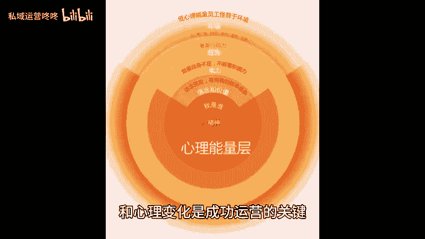
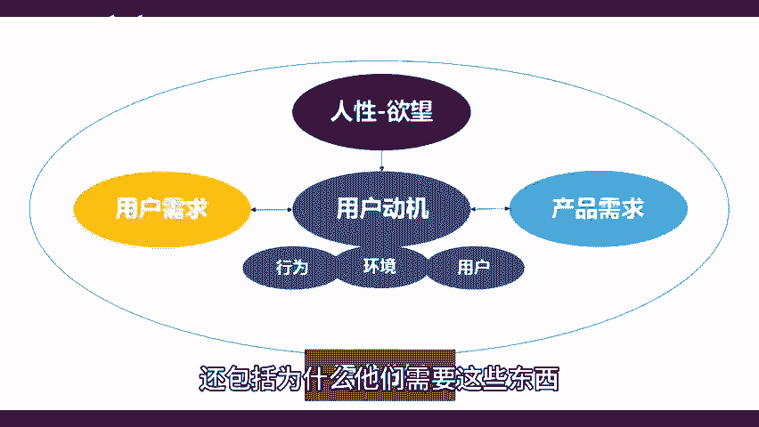
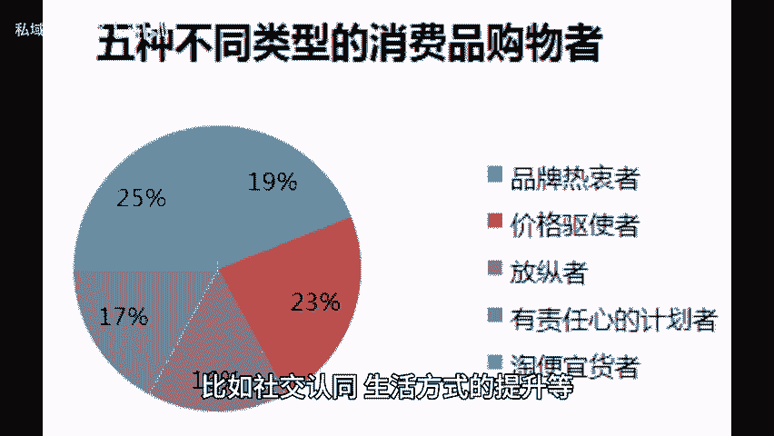
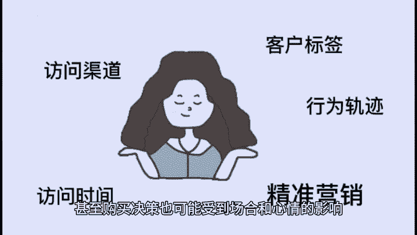
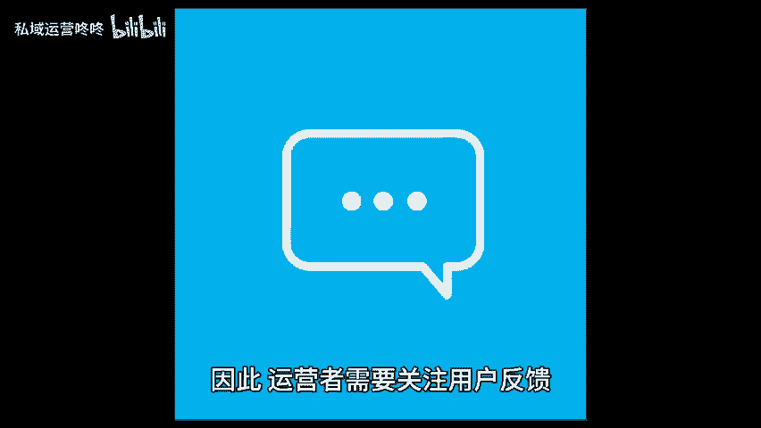

# 用户洞察三大类别，让你的运营更贴近人心！ - P1 - 私域运营咚咚 - BV1ZmtKeGEMW

🎼在运营中了解用户的真实需求和心理变化是成功运营的关键。而用户洞察的这三大类别，能帮助你更好的与用户沟通，提升运营效果。一需求洞察。这不仅仅是了解用户需要什么，还包括为什么他们需要这些东西。

例如许多消费者在购买某种产品时，并不只是为了满足基本需求，往往还包含了其他因素，比如社交认同生活方式的提升等，因此进行需求洞察时，运营者应当从多个维度进行调研，包括市场趋势，竞争对手分析用户访谈等方法。

以全面把握用户的真实需求。2、行为洞察，用户的行为是动态的不同的时间段和场景下，他们可能会呈现出不同的行为模式。例如在工作日和周末，用户的在线购物时间可能有所不同。

甚至购买决策也可能受到场合和心情的影响。因此，运营者需要定期分析用户的行为数据，及时调整自己的营销策略，确保内容和产品能与用户的当前状态和需求。😊。

🎼相匹配。3、情感洞察。当用户对某个品牌产生积极的情感连接时，他们更可能成为长期客户，并愿意为此支付更高的价格。因此，运营者需要关注用户反馈，及时处理问题，以减轻用户的负面情绪，增强他们的满意度。

在未来的运营中将用户洞察作为核心理念，持续进行数据收集与分析，灵活调整策略，会让你的运营效果更好哦。😊。

