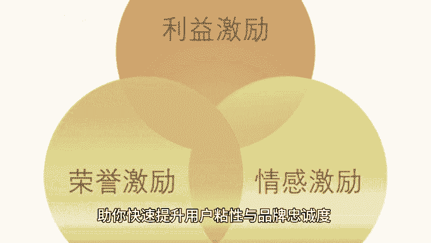
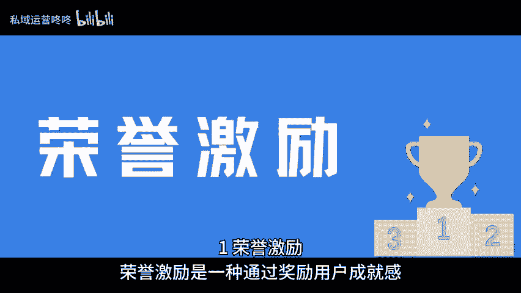
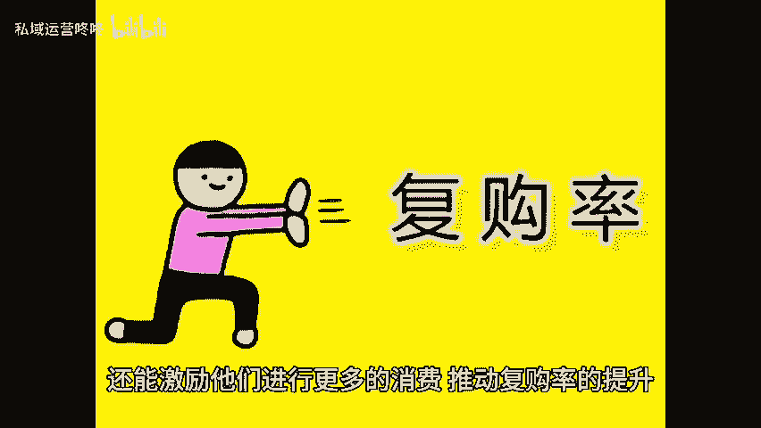
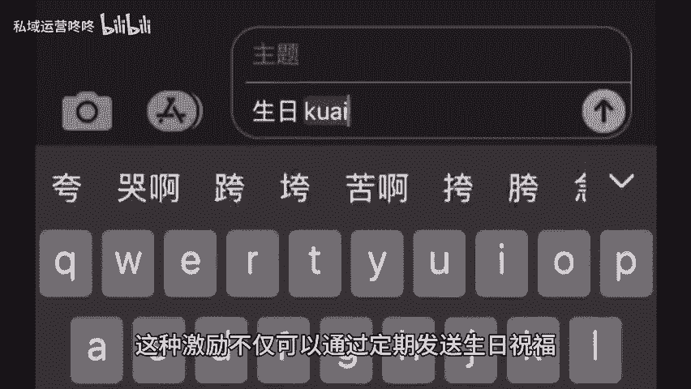
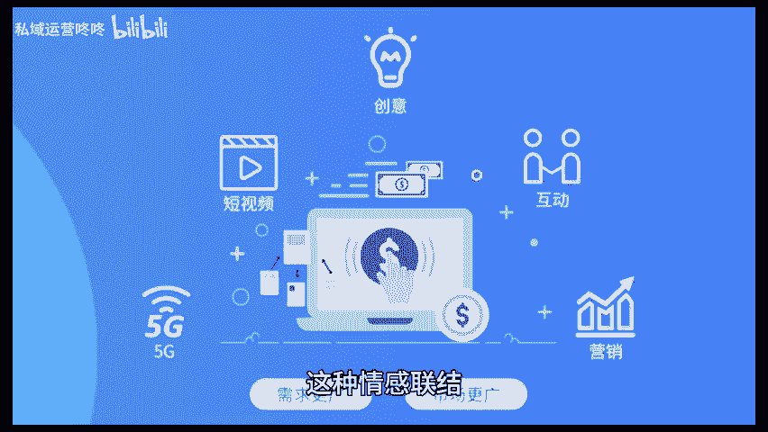

# 用户活跃度和复购率暴涨：三类用户激励体系快get！ - P1 - 私域运营咚咚 - BV1j6iMeNEr9

🎼你知道为什么别人的用户不仅活跃度高，复购率也高，而自己的却不理想吗？原因很简单，那是因为你没有做好用户激励体系。今天就给大家讲讲用户激励体系的三大种类，助你快速提升用户粘性与品牌忠诚度，亦容易激励。

容誉激励，是一种通过奖励用户成就感，来促使其积极参与产品或服务的方式，常见的形式包括积分系统和等级体系。当用户在使用产品时能够积累积分或提升等级，会让他们感受到自身的价值与成就。

这种做法不仅提升了用户的参与度，还能激励他们进行更多的消费，推动复购率的提升。2情感激励情感激励，侧重于与用户建立情感联系，通过个性化沟通和关怀，让用户感受到品牌的温度。

这种激励不仅可以通过定期发送生日祝福。节日问候或定制化的推荐内容来实现。更可以通过用户社情的建设，加强用户间的互动。这种情感。😊。

🎼节用户会更加愿意与品牌保持长期的互动，形成高粘性的用户群体。3、利益激励利益激励直接通过物质奖励来吸引用户，例如折扣优惠券和返现等。用户通常更容易被直接的实惠所吸引。

定期推出限时特惠满减活动或推荐奖励，可以有效的刺激用户的购买欲望。这是一种双赢的激励模式，非常有效的推动了用户的活跃度和复购率。在这个用户为王的时代，抓住这些激励方法，不仅能够提升用户活跃度。

还能显著提高复购率哦。😊。

