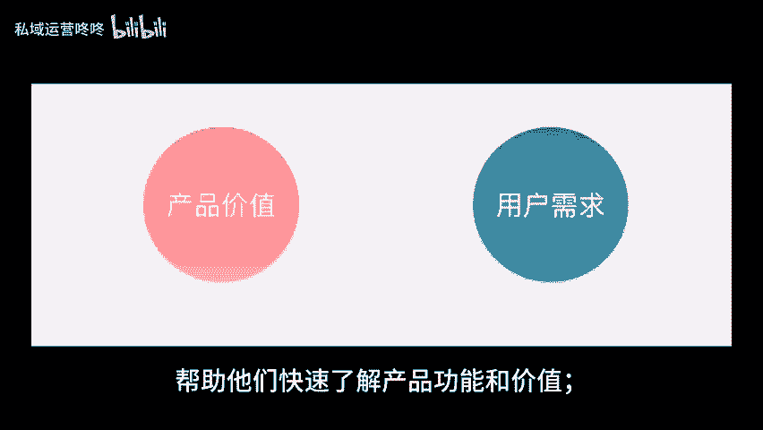
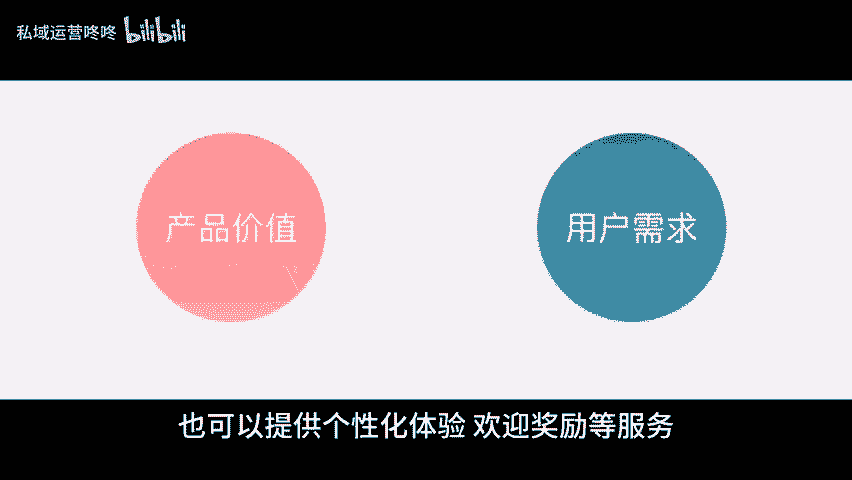
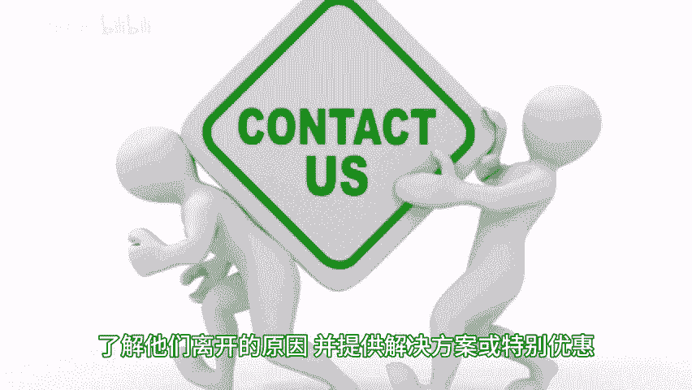
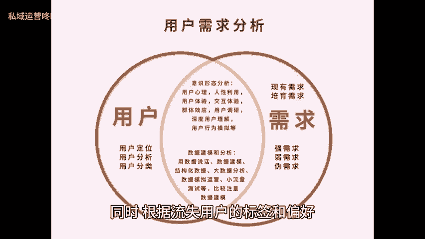
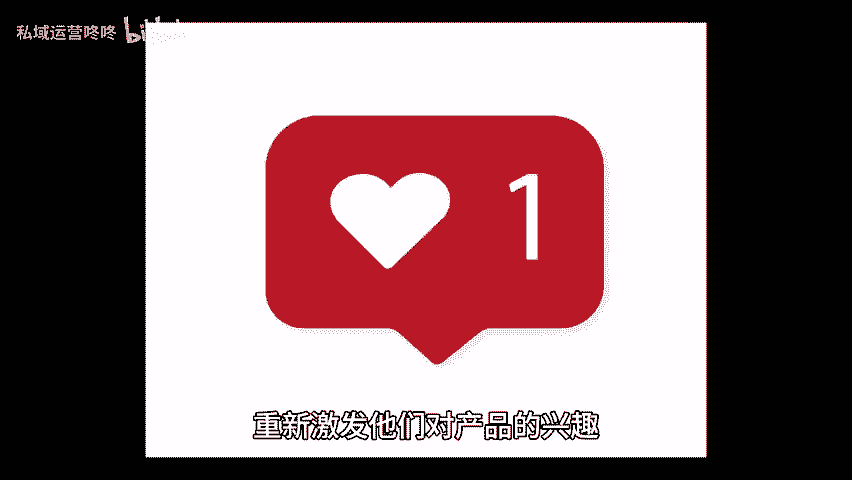

# 用户生命周期管理指南：3个关键点助你提升用户黏性！ - P1 - 私域运营咚咚 - BV1a4421S73E

🎼用户生命周期管理对于运营来说是一个重要的营销策略。它可以通过不同阶段的用户关系来提高用户粘性。下面就分享三个关键点，帮助大家更好的管理用户生命周期、一新用户，新用户是组成用户基础的重要一环。

如何引导他们快速上手，建立良好的第一印象，是、提升用户粘性的关键所在。我们可以为用户提供便捷的用户指导，帮助他们快速了解产品功能和价值，也可以提供个性化体验，欢迎奖励等服务，增强用户对产品的好感度。

激发其更多的使用欲望。2、成熟用户成熟用户是已经熟悉和使用产品一段时间的用户，他们对产品有着较高的参与度和忠诚度，我们可以通过持续的价值传递，保持互动，根据用户的偏好，和行为来进行沟通等方式。

维持用户的活跃度，进一步加强用户粘性，增加复购率。3、流失用户，流失用户是曾经使用过我们的产品或服务。但后来停止使用的用户。虽然他们已经离开。😊。

🎼但通过一些措施还是可以尝试重新吸引他们回归并提升他们的用户粘性。针对这一类别的用户，我们可以重新与用户进行联系，了解他们离开的原因，并提供解决方案或特别优惠，以重新吸引他们回归。

同时根据流失用户的标签和偏好，向他们发送个性化的在营销内容，重新激发他们对产品的兴趣，或者主动征求流失用户的反馈意见，并持续改进产品，这不仅可以向用户传递关怀。也为未来的用户吸引，提供了宝贵的改进方向。

总的来说，无论用户处于哪个阶段，都要注重个性化体验和持续的价值传递。以上就是今天分享的内容，希望能帮助到大家。😊。

