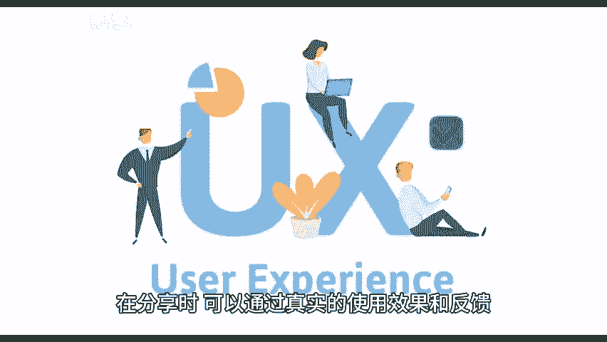
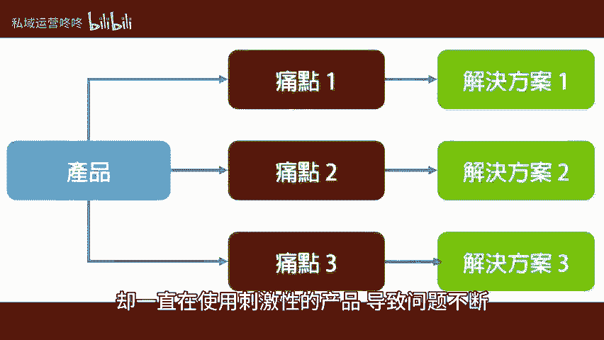
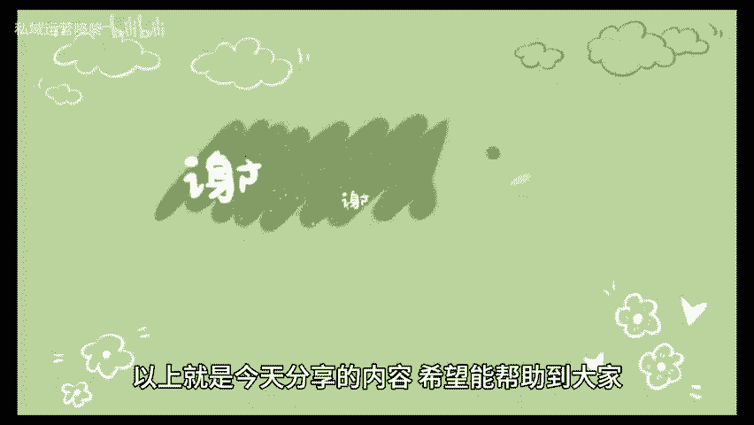

# 用户痛点的四种类型，让你的产品直击用户心声！ - P1 - 私域运营咚咚 - BV1Yh4heTEhu

🎼不管是什么类型的产品内容，要想直击用户心声，了解用户的痛点是必然的今天就和大家分享用户痛点的四种类型。快来一起看看吧。一功能痛点功能痛点指的是用户在使用产品时遇到的具体问题。

比如产品不够强大、功能缺失等。那么在我们的内容中可以分享一些真正有效、功能全面的产品，让用户心甘情愿为之买单。2、体验痛点，体验痛点就是用户在使用过程中，感受到的种种不便或不愉快。

我们可以给用户分享一些能满足他们需求的好物，帮助用户提升使用体验。3、心理痛点，心理痛点是用户内心深处的不安与焦虑。比如对外貌的自卑，对生活的焦虑等，很多姑娘在面对美容产品时，常常担忧效果是否真的好。

这就是一种心理痛点，在分享时可以通过真实的使用效果和反馈，去打消用户的疑虑给他们带来安心感。4、隐性痛点、隐性痛点并不是所有用户都能意识到的。她往往隐藏的很。😊。

🎼比如一些用户可能没有意识到自己的肌肤敏感，却一直在使用刺激性的产品，导致问题不断。在你的内容中可以通过教育和引导来帮他们发现这些问题，并推荐合适的产品来解决这些隐先痛点。以上就是今天分享的内容。

希望能帮助到大家。😊。

