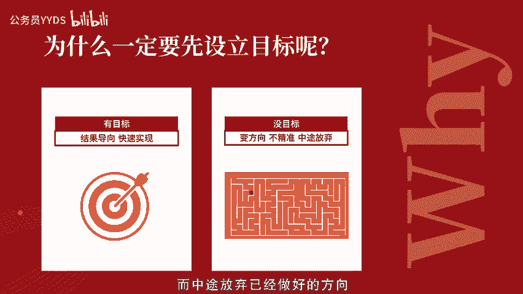
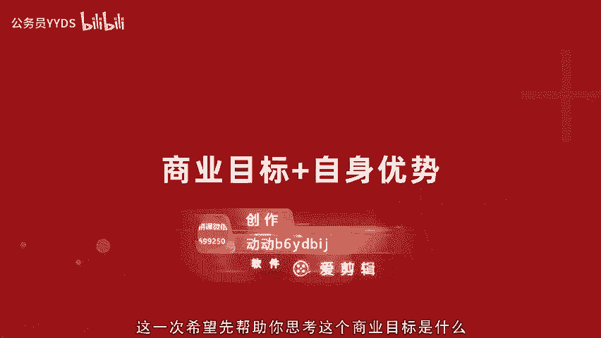
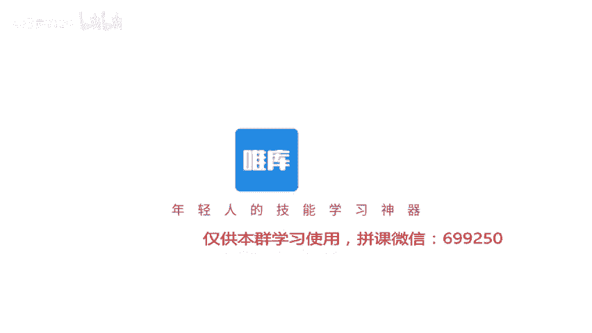

# 用短视频打造百万级IP内容号第2课（上）-短视频运营策略，有目标有计划让你事半功倍 - P1 - 公务员YYDS - BV1PqsdepEdR

。🎼。

🎼hello你好，我是短视频行家Maggie。上一节我们了解了短视频的基本传播逻辑。相信你对于要努力的方向已经有了大体了解了，要做知彼知己与我有关的内容。那这一次我们来了解短视频运营策略。有目标有计划。

让你事半功倍。为什么一定要先设立目标呢？有人说我先把号做起来之后再找这个目标行不行呢？当然可以，只是这个路径就会比较艰难了，前期目标设立不清晰，往往会导致在做短视频的时候经常变化方向。

这就会让你的账号标签不明确而无法被准确推荐。如果你的号粉丝涨起来了。但由于前期没有写好商业化目标，就会面临一个粉丝虽然多，但根本接不到广告或者无法带货的问题，给自身发展带来非常大的局限。

而中途放弃已经做好的方向，风险和代价都很大。比如同样是短视频大号不同领域短视频账号变现能力完全不同。美妆博主账号。😊。

🎼广告的频率和电商带货变现的机会就会比动漫IP的账号要高很多。因为这个垂直领域商业化已经非常完善了。这个品类属于高频刚需利润高，目标受众很明确。所以一个美妆博主可能不到100万就可以带货接广告了。

但是动漫人物账号可能已经有了上千万粉丝报价也还行。但他与商业化融入的场景太少了。那相较于真人真实场景之下，就不那么容易商业化了。所以既然开始要做短视频，相信除了一部分人本身就爱好拍视频之外。

更多人步入这个领域还是因为看到了短视频这种形式带来的影响力和变现能力等好处。那么前期想好这个目标就可以帮助你找到一个具体清晰的可落地方向。😊，🎼如何结合自身入局内容商业化领域设定商业目标呢？

运营策略是基于你业务和长远发展的。对于视频商业化，一般有三种变现模式。接广告投放抖音视频链接带货。直播中的打赏和带货。虽然形式各有不同，但相同的是，做起来的账号，商业目标、人物标签、内容标签。

账号标签都非常明确清晰。我们需要逐步明确以下几点。商业目标以后你要干什么，就是你需要在一开始就想好这个号做起来之后，你希望的终极的商业化方向，比如科普领域的个人影响力之后，卖客还是做某个行业。

美食或美妆的电商带货。第二，人物标签基于你想要表达的商业化方向，你需要满足什么样的人确定之后，基于他们你能展现出什么。最终得出你内容自身的人物标签，基于这个标签。

🎼就可以延展一切内容。而你的内容标签，你是通过什么内容形式来与目标受众建立关系，找到一个最恰当的方式，浓缩成一个标签，比如脱口秀、情景剧vlog。第四，账号标签综合以上得出你账号归类。

🎼标签比如测评、搞笑、探店，毫无分享，你的商业目标越来越明了了。做内容计划和人物设定的时候也就越来越清晰，而且也会容易快速做起来。举例来说，如果你是有商业目标的，你的商业目标是通过接车类客户广告挣钱。

你需要转化的人物目标是男性，你自己也是男性。那么你们之间就可以是兄弟关系。所以说车的账号经常是什么歌，比如虎哥说车猴哥说车，那就很快就能得出你账号要做的方向。汽车男性脱口秀加测评。

这是一个基础的内容模型，在抖音粉丝超过1000，作品超过10条就可以开橱窗带货了。有一个叫好凡的抖音，他对于带货的脑洞很大。作品经常很有创意，传播度也很广。他的商业化就比较偏日用品的产品。

而且都是比较大众亲民的路线。🎼还有一个叫董代表的账号，就是在一开始的时候，商业目标就很明白的一个账号。一个叫董代表的男孩，他反串了几个年龄层的女性，一人分世多绝，演绎各种不同风格的女性。

而且这些人都会反复出现相互关联。所以短短三个月，他的播放量粉丝快速增长到了300万加的同时，美妆带货上也非常迅速的能够变现，完美融入人物造型，而且由于他个人表现力很强，刻画人物展现生动。

所以观众都非常喜欢和信任她。这就是一个很典型的内容优质，商业化也很成功的案例。还有一个商业化模式就是直播，但是在短视频直播里其实是分两种，一种是短视频博主开直播，还有一种是直播主播开短视频。

听起来是不是有点绕。短视频如果内容做的好，就像之前提到的董代表，大家喜欢你这个人开直播，其实会非常受欢迎。😊，🎼但内容商业化取决于你所卖的产品与你受众的关联度，还是之前我们提到的与我有关。

那另一种直播主播带货，比如李佳琦辛巴如雷冠耳的带货王。虽然是很直接的内容，但是这个信任关系的建立和自身的标签的强势是制胜的关键。由于这一部分往往竞争非常激烈，无论是差异化，个人表现力，建立关系的能力。

以及对于产品的了解的专业性要求都很高。所以建议你结合自身优势来判断，到底是适合直接的直播带货，还是多做出好的短视频作品，在配合直播相辅相成。如果你没有产品是从内容出发的。

那你就需要基于你这个人本身的一个特点和专长来找到你潜在的商业目标。比如你会某种才艺或技能，比如唱歌跳舞或者说一门外语。谈一个乐器，其实这就比较好办，你可以成为这一门类的达人。

🎼一种是你的职业或身份标签，比如你是快递员，一个前台，一个司机，一个果农，都可以基于你的职业身份来展开场景内容呈现。以下类目，你看看是否有符合你自己的一些标签。

人物类小哥哥小姐姐萌娃、老外大叔、大妈、辣妈、奶爸、才艺类、技术流、音乐、唱歌、舞蹈、手工、声优、魔术、搞笑、画画、兴趣类健身、美食、美妆、萌宠、情感、摄影、旅拍街拍。

🎼教学类、母婴、亲子外语、商业乐器等等。如果你实在觉得难以挖掘，那么我建议你找个人咨询一下他们对你的印象标签身份标签，再与自己的认知做一个结合，如果实在不行，那就可以先开一个小号来测试一下。

看看用户反馈，他们认为你是怎样的。然后当你正式做的时候，就充分刻意调动自己最有优势的特点来表现，给自己建立目标。在基于这个目标延展出商业化的目标的可能性。🎼你需要基于你的商业目标和自身优势。

找到属于自己的标签，因为算法都是基于标签与相应的标签的用户来做匹配的。你的标签针对性越强，被系统快速识别出来，获得准确推荐，可以仔细的按照思路进行一下自我梳理。关于如何通过精准定位。

实现目标以及商业化变现之后，还会有课程专门来详细拆解。🎼这一次希望先帮助你思考这个商业目标是什么？下一节我会基于运营工作方法详细讲解短视频运营的工作方法、基本原则、不同阶段的侧重点、运营步骤以及岗位分工。

我是短视频行家maggie，下次见。

