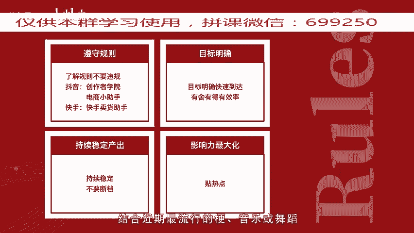
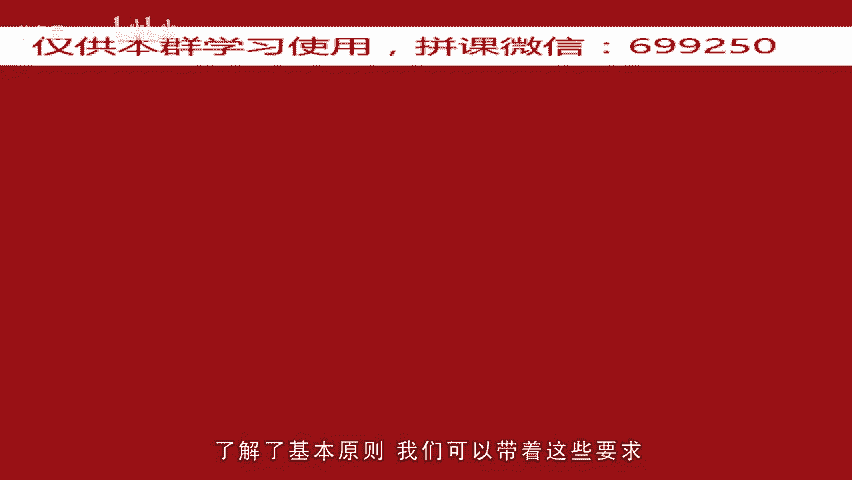
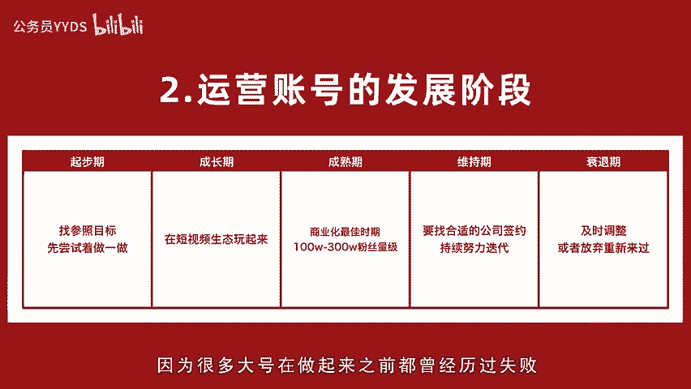
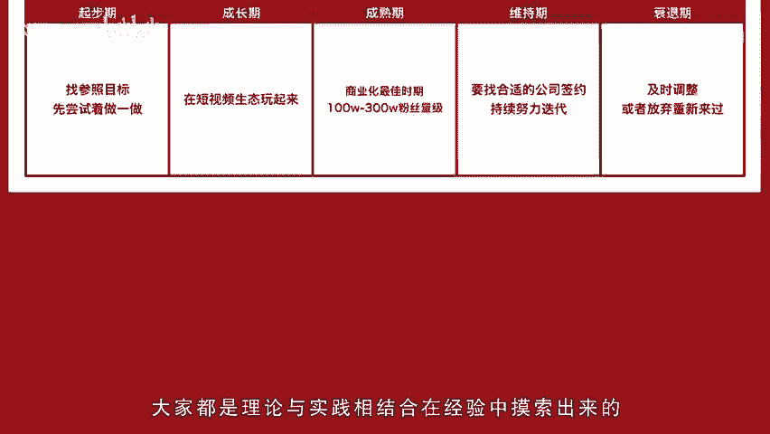
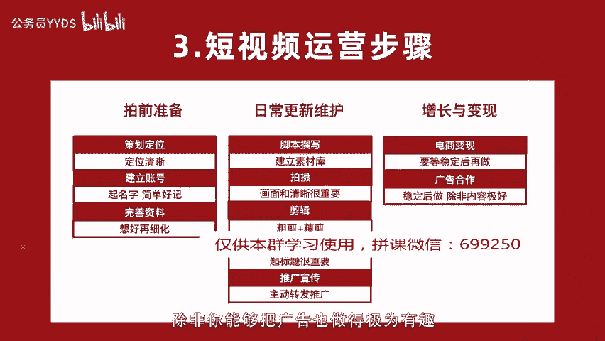
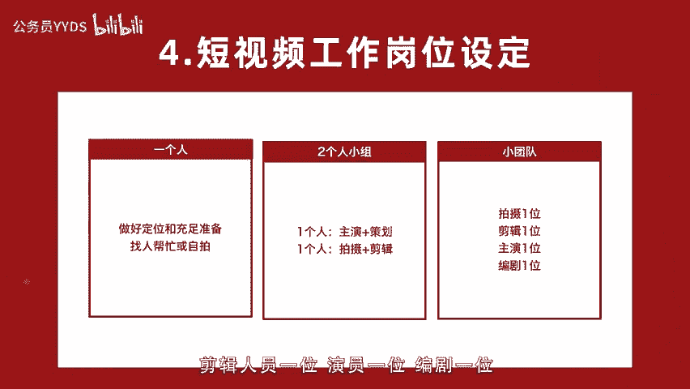
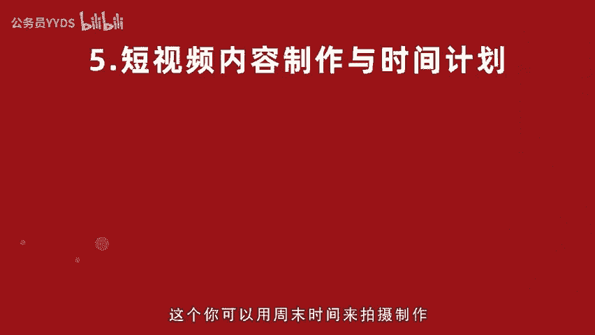
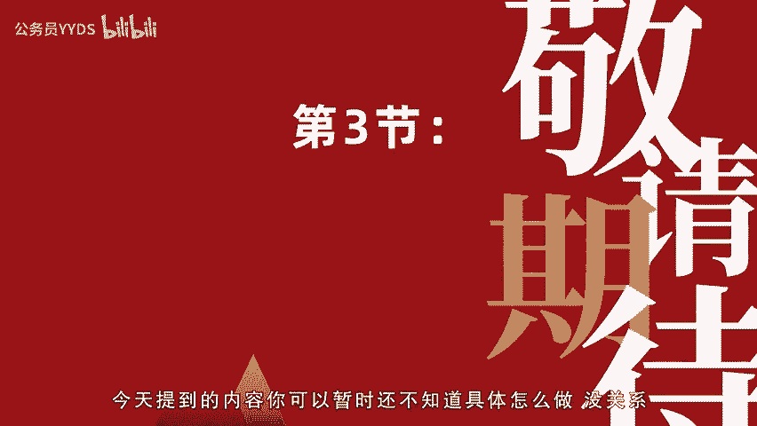
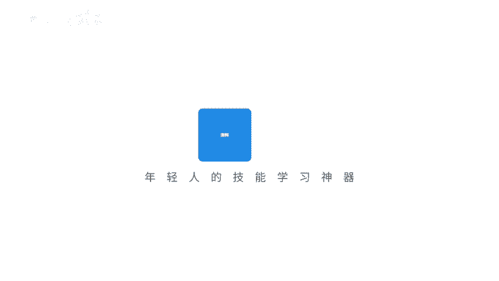

# 用短视频打造百万级IP内容号第2课（下）-短视频运营策略，有目标有计划让你事半功倍 - P1 - 公务员YYDS - BV1kFsdemEDv

。

🎼嗨你好，我是短视频行家maggie。上一次说到了我们要建立目标。这一次我们看该如何做计划落地执行。在没有做起来的朋友当中，半途而废的特别多，无法持续稳定产出内容是一个通病。而做起来的人。

无论是百万、千万量级还是正在增长的。都有一个最基础的共性，就是能够持续稳定的产出。这与清新的目标和计划都密不可分。😊。

🎼关于运营内容，我会从5个维度运营基本原则、账号运营发展阶段、整体运营步骤，工作内容与岗位设定，还有短视频内容制作与时间计划，帮助你思考如何前方位做好准备计划。关于运营规则，做账号前。

你一定要知道这些事情。首先就是要了解平台规则，不要违规是一个关键基础。因为一旦违规封号什么的，好多努力就全都白做了。哪怕你没有开始卖货，我也建议你先了解清楚规则，不然违规被限流，你都不知道。

对于抖音来说，你需要仔细阅读抖音官方后台发布的创作者学院，以及电销小助手账号上会有官方发布的各种规则和教程，做快手需要关注快手卖货助手，平台的规则总是有实时更新。更新完了都会融入到算法里。

所以一定要定期了解清楚。第二点呢，要有明确目标。上一次我们讲过了目标的重要性以及如何设立目标。目标。😊，🎼明确我们才能更快到达。在资源条件有限的情况下，有舍有得有效率。第三点是要持续稳定产出。

持续稳定产出至关重要。如果你有非常好的想法，但是半个月或者一个月才更新一次，是不能被识别为优秀创作者的。也很难获得推荐。第四点呢要影响力最大化，就是不管在哪个阶段，也许你对于一个视频有N多想法。

当你做实际选择时，一定要选择最有利于传播最有影响力的方向，比如操热点，结合近期最流行的梗音乐舞蹈，融入到自身的创作当中，了解了基本原则，我们可以带着这些要求进入短视频账号的每一个运营阶段。

起步期成长期求熟期维持期和衰退期，起步期，对于从容开始的小白来讲是比较艰难的因为没有经验或者思路不够清晰，往往迟迟不能开始启动。这时候我建议你找到一个具体的参照目标，再在这个内容的基础上。

结合自身去创作会容易很多。😊。

🎼或者你可以先开一个小号做个尝试，先去体会这件事情的过程和感受是怎样的。自己到底喜不喜欢擅不擅长拍视频。成长期，随着你更新的作品数量增加，你开始掌握了拍摄技巧和创作技巧，也逐渐积累了粉丝有百到千再到万。

这个时候是非常快乐的成长阶段，努力终于有了些回报。这时候一定要注意咱们之前说的几点原则，不要违规目标明确，持续稳定影响力最大化，逐渐去在这个生态玩起来，增加与其他同类账号以及热门作品的互动。

多去评论和点赞。成熟期，当你的播放量整体有一个幅度的提升，粉丝有几万到几十万的量级时，并且不会有断崖式下跌的情况出现时，那么恭喜你在逐步进入成熟期。这时已经逐步商业化。

短视频账号粉丝能进入100到300万是一个账号相对来说比较稳定和健康的时候，也是商业化接广告最佳时期。维持期。通常来讲，如果你的账。😊，🎼号超过一定量级，会有MCN或视频公司想要签约你。

那这个时候你可以选择最符合自己账号掉线的公司来合作。因为不同公司擅长的资源和领域各不相同，不同体量的公司能够对博主负责程度也不同。而此时你不能掉以轻心，要更加努力不断优化和迭代自己。

让自己的不可替代性更强。衰退期，当你发现自己的账号内容质量和粉丝数已经不能上涨，反而下降时，就该看看到底出现了什么问题，是不是有遵循之前说的那些原则，是否还顺应平台的最新动态。市场不是一成不变的。

变化才是永恒的。内容和运用方法都要紧跟平台政策大趋势及时调整。如果还没有起色，就该考虑是否要重新定位和迭代了。也有可能有的人没有达到成熟期就直接衰退了。那么想好新的方向去尝试，放弃旧的也是可以的。

因为很多大号在做起来之前都曾经历过失败。大家都是理论与实践相结合。😊。

🎼在经验中摸索出来的具体的操作层面，短视频整体运营步骤，你需要做以下几点。开前准备步骤。这个准备工作可能是一周到一个月不等，认为每个人自身条件和程度各不相同。策划定位基于你的商业目标定位受众。

制定人物定位内容账号定位，具体操作方法，上一次已经讲过了。不清楚的朋友可以再重温一下，建立账号基于定位来起名，你的名字最好能一下让人明白是什么调性，好，记忆好理解，不要有生僻字是做什么的。

与用户关系是什么，最好一眼就能看明白。如果还得用三句话来解释这个名字的含义，那传播成本就太高了。比如有的人用一个表情符号英文字母当名字。这个别人能搜到你的概率呢就会非常低，也非常麻烦。

不体刷到主要就靠随员了吧。完善资料同样基于商业目标和账号定位来完善资料。注意资料不要违规，如果一开始没有太想好这个定位。我建议资料不要写的过于具体。😊。

🎼不要总是来回更换。日常更新制作与发布的步骤呢，拍摄脚本撰写一般情况为了保证持续更新会先建立一个选题库。基于定位，按照我之前说的，这比自己与我有关的设定，把所有与我有关的内容，做一个内容话题库。

基于话题库做一个选题排序。选3到5个可以拍或者最有感觉的内容进行细化，写成拍摄脚本，这个时间一般是1到3天，到了拍摄步骤，按照脚本准备的场地一化到，然后就是拍摄。如果你是一个人，你可以找个人帮你拍。

或者找一个三脚架，把手机立在一个固定的地方，只要光线要明亮，画质要清晰，声音也要放大清晰很重要。如果声音背景是在很嘈杂的情况下，那就需要之后再补录，然后合成上这个声音。

这时间一般会基于剧本的复杂程度各不相同。简单的可能一天就能先到5条或者更多。场景多，复杂的可能一条就要拍上2到3天。🎼所以在做创意上，我们一般都是脚本上尽可能体现创意。

以小过大拍摄完了就到了剪辑素材步骤。粗剪呢就是把原始拍摄的素材买在时间线上，先出一个粗剪的版本，再把顺序做一个调整。然后精简呢就需要加上背景音乐上字幕，如果发布软件是直接拍摄的。

那以上拍摄和剪辑就可以合并为一个步骤了。这个步骤呢也是要取决于素材的多少或片子的长短。一般一条片子作加修改呢，正常是1到2天，当然快的可能一天就能做至几条来。把素材剪辑好后进行发布与运营。

一般呢就是一两个小时就可以搞定。发布内容需要编辑一个可传播的文案在发布之前，一般这个会在脚本策划阶段其实就同时想好了，同时还要想可能要多平台同步。推广宣传当你的内容有了一定持续稳定的更新后。

可以尝试多在微博微信来做一些推广，让更多的好友和相关。😊，🎼是知道你关注你或者买些推广来看看是否能够带来流量增长。增长与变现步骤。这一步要看你内容质量是否得到了市场检验是受欢迎的。你的内容越受欢迎。

这个周期也就越短，而到了电商变现。虽然现在电商开店的门槛非常低。但是我也不太建议你的视频播放量还没有达到一定量级，就开通了这个链接，因为很可能在内容质量和用户年限都还没有完全稳定的情况下。

就限制了账号的发展。商务合作，抖音超过10万可以入住星图接广告。但是我依然建议粉丝没有超过50万，不要太早的开通电商和接广告。因为有可能因为过早消耗你的用户热情，很可能限制了你账号未来的持续增长。

除非你能够把广告也能做的极为有趣。接下来是短视频工作岗位设定。一般情况下，如果你只有一个人，那我建议你前期准备工作一定要做的充足一些。定位想的越清楚，你就越知道自己该开什么。😊。

🎼可以在正式拍摄前提前准备一个选题库，像之前说的，先写个3到5期内容，再开始拍摄，一次拍三期内容素材再做剪辑。如果你是一个小团队，那么你至少需要两个人一组来完成一个账号。一个是主演。

同时可以兼内容策划和脚本撰写。而另一个人呢是编导负责拍摄和剪辑。这样脚本创作和剪辑可以分工开来相互配合持续更新。当然，如果你是一个比较大的团队，想要保证更新频率。

那么你的团队需要摄像人员一位剪辑人员一位演员一位编剧一位，但这不是绝对的，要看不同团队预算以及人的综合能力。短视频内容制作时间计划，以一周时间为周期，这个你可以用周末时间来拍摄制作。

假如你设定目标是一周三更，那么你可以先用一个周末来写3到5个选题，周一到周三细化拍摄脚本，周四周五开始做拍前场地和孵化到的准备。周六就可以。

🎼拍摄了，然后周日把它剪辑下来，在下一周的时间一个一个发布，同时写下一周发布的内容，再在周末制作，然后以此类推。当然你也可以当天拍当天就发这个情况呢也是在当你已经找到了非常好的一个模式之后。

越来越熟练了。当然产出的效率都越来越高了。以上就是本期内容，相信对于短视频具体操作执行计划，你已经有了比较多的了解了。今天提到的内容你可以暂时还不知道具体怎么做，没关系，在以后的课程中。

我会教给大家具体的操作方法。下一次我们具体来讲精准定位的账号定位。我是短视频行家mgie，下期见。😊。

