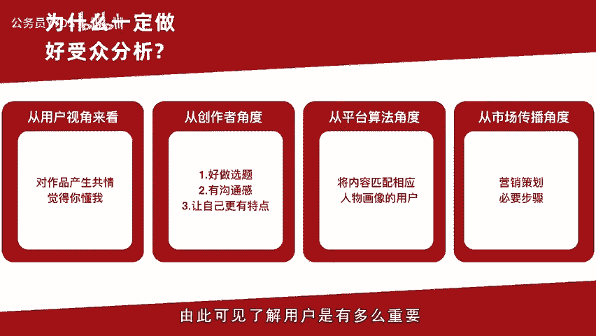
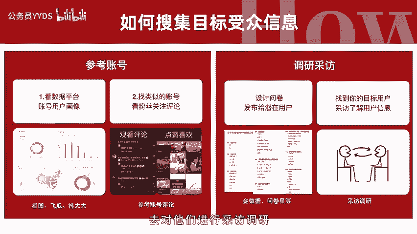
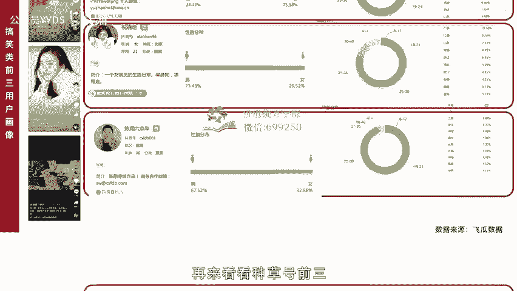
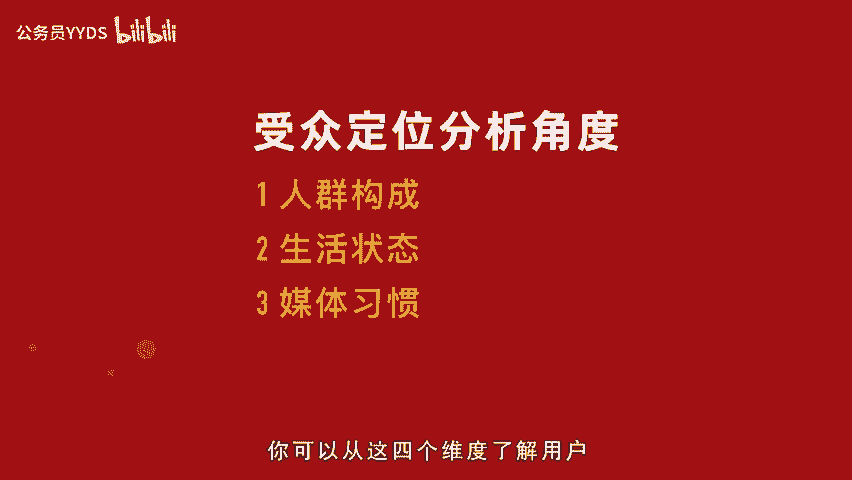
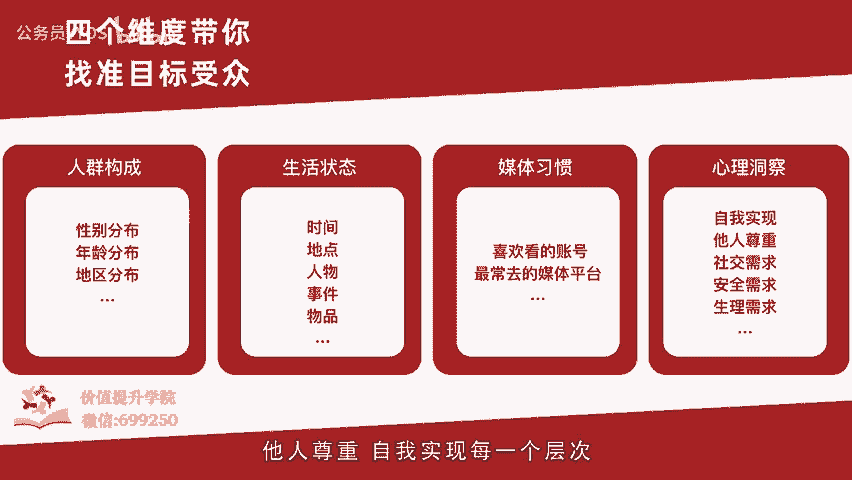
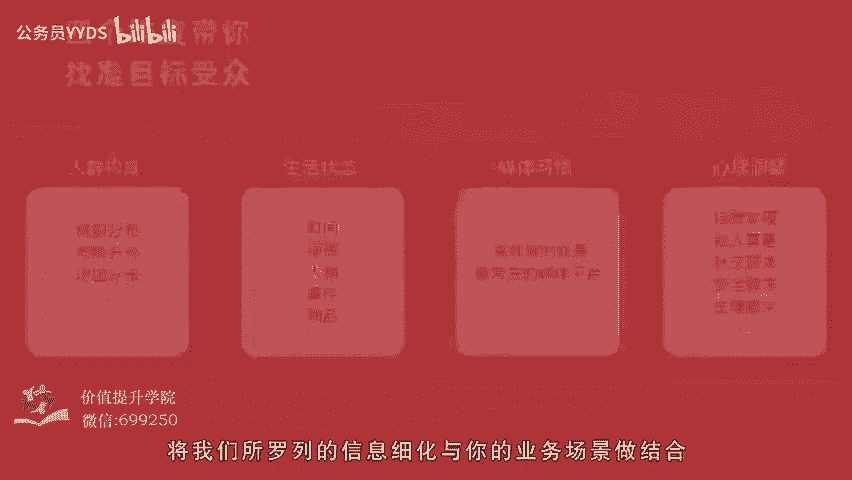
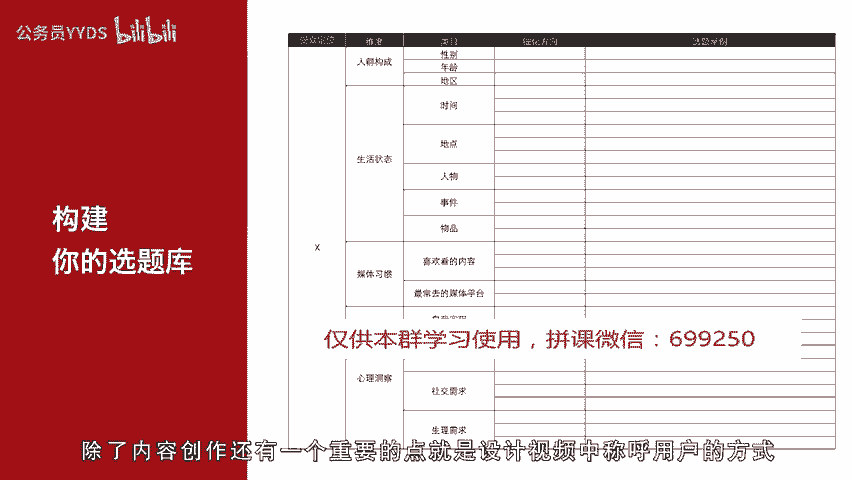
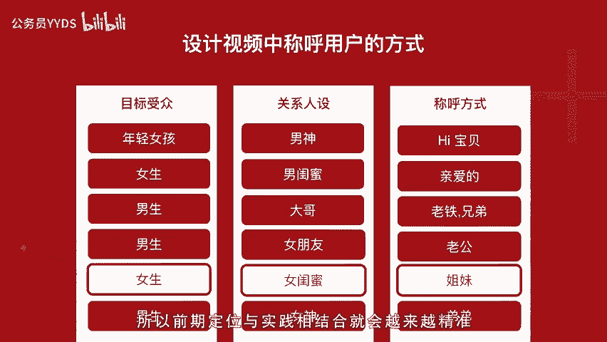

# 用短视频打造百万级IP内容号第4课-洞悉用户，分析用户，需求四个维度带你找准目标受众 - P1 - 公务员YYDS - BV1TvsZeaEVm

。

🎼嗨你好，我是短视频行家maggie。这一次我们来讲讲如何动悉用户，分析用户需求四个维度带你找准目标受众。先说说为什么要研究目标受众呢？从用户视角来看，我们在刷短视频的时候。

不知道你有没有这样的观看体验。哇，这个视频完全就是我有能看到很多留言说，我怀疑你在我身上装了摄像头这样的回应，或者一个视频非常具有沟通感和对话感。你感觉就是在跟你说话，这样的视频创作需要很强的共情能力。

而这种共情能力，往往来自于对特定目标人物的生活观察，从创作者角度来看，如果不清楚用户是什么方向，做内容也会经常思维枯竭。没有用户思维内容，往往停留在作品思维上，只想着输出自己想说的。

往往产出的作品像强硬的广告，没有沟通感，没有代入感或者过于抽象，难以产生共情。数据自然就不会好。有人说我有具体沟通。😊，🎼对象会不破就窄了呢？指性向强的沟通会让你更加聚焦能量，更有穿透力。

就会因此吸引更多喜欢你这种有鲜明特点的观看者。从平台算法的角度来看，在区中心化算法里，每一个我都会接收到自己观看标签最强相关的内容推荐，从市场传播的角度来看，一个具有商业目标的品牌。

通过内容和用户进行沟通，从而实现影响力最大化，也都是从市场调研、消费者洞察数据分析、座谈会等等一系列广告营销策划前期必不可少的工作得出结论的，很多广告公司和品牌企业都会有专门的部门投入专门的预算。

请专业的调研公司来做这样的工作。由此可见，了解用户是多么重要。那目标受众信息如何收集呢？一个是找账号参考，在星图抖大大、飞瓜等视频数据平台搜索你要参考的账号。

看看他们的人群构成、性别年龄、地区手机型号比例。在这些数据平台都可以看到。😊。

🎼还有一个特别直接简单的，就是你直接去看你想参考视频账号下面的评论，尤其是排名比较靠前的活跃用户。一个是看看他们留言是什么样的观点态度，就大概能判断出他们的身份、年龄、性别。

另一个是点进去他们的页面去看看他们还喜欢了哪些视频。这个方法看似简单又笨拙。但是却是你了解一个用户观看视频习惯，最最直接的方式。我建议你去下下这个笨功夫一定收获不小。

账号参考能让你对于自己要做的内容方向，有更加的具象的参照。另一种就是基于你的业务目标去做。你可以应用金数据、问卷星等网络调研工具，设定相关问题，去了解目标受众、态度和生活形态，或者采访现实参考对象。

就是你在生活中直接能够找到最符合你定位的目标受众，去对他们进行采访调研。也许他们还能给你提供更多的灵感线索。在这里我们一起来看看数据平台搞笑类。😊。

🎼前三的用户画像，我列举了几个基本因素，性别年龄地区，这样看就非常有意思了。排名第一的毛毛姐75%以上都是女性，18到24岁的用户占比最多。

地区上广东贵州、四川、浙江、江苏是排名前五的省份有一定偏南部的地方偏好，对应他的内容和沟通方式，你都能看到，他在以闺蜜视角与用户沟通，而她的内容也都是在反映女性生活里的洞察故事。祝小涵73。

48都是男性用户，年龄占比最大的用户群是25到30岁，地区占比排名最靠前的是广东、江苏、山东、河南、浙江既有南方也有北方省份，比起另两个账号更受北方欢迎。内容商也是以男性沟通和老丈人说车是一脉相承的。

陈翔6点半也是男性用户占多数，67。12都是男性。18到24岁和25到30岁的用户占比更高。广东。🎼江苏、浙江、河南、四川是占比前五的省份，这里有一个北方省份，四个南方省份。

会发现他多年以来坚持的剧情内容，更新覆盖的活跃用户圈层范围很大。再来看看种草号前三兔兔的臭猪猪是一个情侣vlog种草号明显以女性居多，18到24岁人数占了一半。恰欢开戴式直男种草号，73。36都是男性。

在年龄分布中，6到17岁，18到24岁的人占了大多数，用户非常年轻，柚子买了吗？是以柚子CC这个达人为核心开的种草号，女性占比达到了89。79。6到24岁，用户是占了绝大多数，以上是比较浅的基本分析。

我们能够看到不同受众定位。在面对不同性别，不同年龄层，不同地域的用户时候，他们的内容风格和沟通方式是千差万别的。看完其他账号，相信你已经对用户分析，有了一个。

🎼清晰的认识了。当我们自己在左手座的时候，你可以从这四个维度了解用户。一、人群构成。你的内容是给谁看的？从你的定位标签出发，人群定位不同，从沟通的语言、场景、人物对话都决定了内容和沟通方式的不同。

第二点是生活状态。这些人生活状态是什么样子的外貌形态、时间、地点、人物事件、物品是什么。通过这一点，你可以找到你自己的选题方向，建立选题库。媒体习惯，他们平时都在什么媒体渠道获得信息。

比如有一些人就喜欢看电影，看英剧美剧上小红书上豆瓣微博，而另一类人则喜欢在知乎上发表见解，还有的人只看抖音和朋友圈，基于不同的媒体习惯，也能够找到不同人的生活态度和生活形态。第四点是心理洞察。

他们的心理需求是什么样子的，依然可以根据马斯洛心理需求、金字塔，从生理需求、安全需求、社会需要他人尊重自我实现的每一个层次，基于这样。😊。

🎼特定的人群把需求细化写下来，将我们所罗列的信息细化与你的业务场景做结合。你会发现不用去努力想，就已经能够罗列很多的选题方向。我们把所收集的信息放在表格里，就可以建立一个选题库。

还可以设计我们与用户沟通的方式，最终我们把这些调研出来的因素列成表格帮助我们去思考做选题，拿职场定位账号举例，我们可以基于受众定位维度、类目去细化方向，从而建立选题库。比如我们定位是初入职场的女性。

将人群构成细化方向、性别年龄地区时间、地点、人物事件、物品喜欢看的内容长去的媒体平台以及自我实现他人尊重社会需要、安全需求、生理需求。这一系列的心理需求再去做场景化的细化。

就可以定位一个女孩年龄在22到28岁居住在一线或二线城市里，她会经历职场的生活有面试入职。

🎼上班回家地点有办公室、工位、会议室，会接触的人有老板、同事在职场经历年会、团建等事件，会用电脑、手机这样的物品，他喜欢看情感类和搞笑类的内容，喜欢追星，会上微博和刷抖音，有职业理想和个人成长的愿望。

希望收到领导的认可，被其他同事夸赞，喜欢结交办公室的朋友也会参加职场里的兴趣小组会经历吵架事件，追求内心安全感和身心健康。这么说下来，是不是具体了不少。如此下来，你还能往下细化，得出更加具体的内容话题。

比如办公室之间，女生的友谊，入职一年、三年、5年的区别，在大城市上班和过年回家的。我1个面试中的尴尬瞬间等等等等。这只是我简单的举例，是不是一下就有画面了。想内容也没有那么难了吧。

剩下的就交给你来完成吧。把你锁定的目标，用。🎼一切按照这个表格的维度丰富细化出来，看看是不是你也能够非常容易的得出了很多选题方向呢？除了内容创作，还有一个重要的点，就是设计视频中称呼用户的方式。

就会让你的视频更加有指向性和沟通对话感，以简单的目标受众和人设为例。如果你定位是女生。而你是女闺蜜人设。那你就可以在打招呼的时候，称呼用户是姐妹们，如果你是一个大哥人设，面向的是男生。

你可以称他们老铁或兄弟，除此之外，还可以有更加个性化的设计。比如如果你有了自己的粉丝，可以用自己的名字结合粉丝，取一个特定的专属名字，以上就是关于受众定位的方法和应用，你学会了吗？很多时候做内容越多。

越能从用户反馈中获得指引，方向也会更加明确，所以前期定位与实践相结合，就会越来越精准，传播效果也会越来越好。下一期我们来学习市场研究，学会洞察。😊。

🎼平台行业竞品，让你拥有玩家全局视野。我是短视频行家maggie，下期见。😊。

