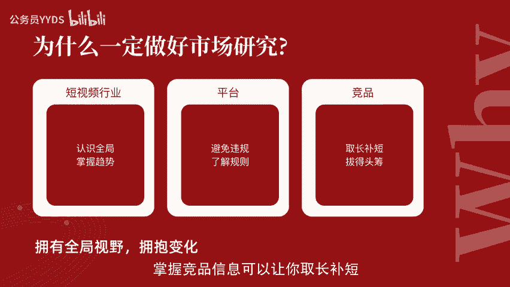
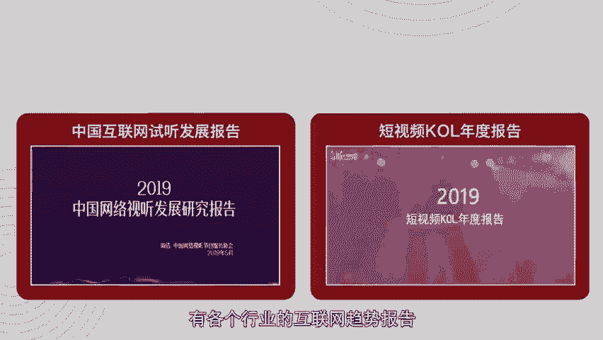
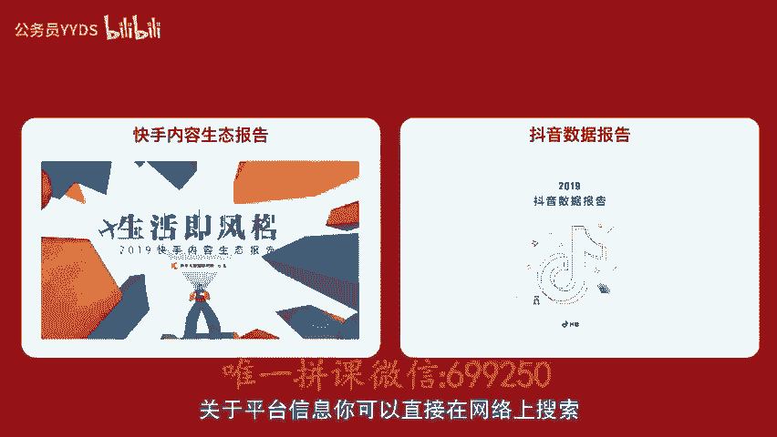

# 用短视频打造百万级IP内容号第5节-市场研究：学会洞察平台行业竞品，拥有玩家全局视野 - P1 - 公务员YYDS - BV1TvsZeaEEr

。

🎼嗨你好，我是短视频行家viy。这一次我们来讲讲如何市场研究，学会洞察平台行业竞品，拥有玩家全局视野。先说说为什么要研究市场平台和竞品呢？很多人可能会觉得说，哇研究市场行业混不会太大太遥远了。

我就做好自己该做的事儿不就可以了吗？不了解市场，你可能会错过了解市场发展和转型的好时机，不了解平台可能容易违规，所做的努力，前功尽弃，不了解竞争对手，很容易丧失竞争力。😊。

🎼前几期的内容我已经告诉大家该去如何了解其他账号的方法。这一次我们来一起看看我们还能怎么获取对我们做视频更有帮助的信息技巧。掌握市场趋势，可以让你对整个大环境有一个全局的认识。找准方向顺势而为。

掌握平台规律，可以避免违规，找到上热门的规律。掌握趋势，还可以让你了解这个行业发展状况和机会点，抢占先机，掌握了竞品的信息，可以让你取长补短，获得领先的机会。市场趋势一般来自市场上公开的报告。

当你在搜索引擎搜索短视频报告、抖音报告、快手报告这样的定向关键词，就能够看到很多文章和报告。这里我要强烈推荐几个网站，是行业里获得报告常用的网站。

你也可以常来这里看看学习一下中文互联网数据资讯网爱美网爱瑞网CBNdata第一财经数据中心。😊。

🎼内容产业服务平台新榜视频内容行业风向标、卡斯数据有各个行业的互联网趋势报告、人群消费报告、影响力报告、洞察研究行业白皮书在这里能了解到很多短视频行业的相关报告。比如中国互联网视听发展报告。

短视频KOL年度报告。一份报告一般会有几个部分组成。数据来源统计方法，结论概况，关键数据和具体的分类分析。以2020年2月发出data急速发布的2019年中国短视频行业发展趋势报告为例。

数据来源统计方法是帮助你判断这个报告的权威性和可参考价值。结论概述关键数据通常在报告的开篇或者结尾，往往有总结的洞察发现，通常来讲，这些总结是整个报告最最核心的部分，可以重点的看一下，除了了解行业动态。

对于自身的内容做适当调整也是非常有帮助的。比如这个报。😊。

🎼告的关键型数据里面显示，短视频每分钟观看集数是一个人平均值是6。7次，平均留存时间8。9秒，说明什么？我们在做短视频内容的时候，一定要考虑如何在这个时间里抓住用户，无论是设置特定的音乐表演。

还是把时长缩短。那么再往后呢，就是具体的分类分析。每一页数据分析的标题都会有结论性总结。而有的报告还会有非常具体的建议，都可以帮助咱们掌握趋势，比较有时效性的趋势呢。

看看背后的洞察究竟是为什么之后是增长还是衰退。😊，🎼增长就一定要抓住机会，而衰退时就要尽量避免。举例来说，在卡斯数据出品的2019短视频KUL报告中，可以看到的是很多结论型的报告内容。

这会让我们看到更加直接的趋势分析。2019年，短视频内容创作增速明显放缓。但增长秩序更加良性了。从内容类型占比上，娱乐化内容仍然占主导地位，但是跟去年相比下降的非常明显。

其他内容领域泛生活类内容增长最快，其次是垂直类别，在各大垂直内容类型中，以时尚美妆、汽车运动等表现最好。这说明，用户短视频内容升级，从娱乐诉求向获取知识、自我价值实现等其他诉求转移了。

所以要想长期存活下来，比拼的不仅仅是内容出品质量，还包括了特色的人物设定、精细化内容、粉丝运营和操盘流量的综合能力。搞笑。😊，🎼情音乐舞蹈小姐姐小哥哥爆红机会变小了。

时尚情感美妆类的内容类型火热之中已经到达了最高限度。再来看快手快手红人活跃程度不及抖音，但红人类型也呈现了多元化垂直化的趋势。从卡斯指数报告来看，小哥哥超越了搞笑类内容类型成为快手平台中最强的类别。

而美食萌宠类账号的卡斯指数增幅也很快，说明这两类账号，无论是粉丝量上还是粉丝粘性，粉丝互动活跃上都表现优秀。2019年B站各类别内容类型都在上涨，小众且有特色的类别越发强势。

游戏类的内容超过了鬼畜类成为B站的榜首类别。抖音快手红人带货的情况，我们可以在报告中看到，抖音平台开设有商品橱窗的红人数已经超过了五成。其中，粉丝量10到30万的尾部账号占比最多41%。😊。

🎼从带货红人发布的视频频次看，较平台红人整体表现更加勤奋。周发布视频数量为3。9条。在快手平台，粉丝量过百万的红人有超过九成开通了直播，从直播频次看，周播五场，单场直播时长2小时为平均状态。

直播次数随着粉丝量级的减少而下降。由此你可以参考得出平均更新的频率，在抖音可以一周3到4次。而在快手则是需要参看同量级的频次，因为更新频次高，在这个平台未必能够起到很好的带货效果。从带货品类看。

时尚穿搭美食KOL带货能力更优秀。带货商品销量和销售额都名列前茅。从带货品类看，各户美妆生活日用食品不是是快手最畅销的商品品类。更多的信息呢，你可以自己来具体看看这份报告。关于平台信息。

你可以直接在网络上搜索。

🎼或者在上面的行业网站找到这些信息，比如抖音数据报告、快手内容生态报告，都能够让你去了解过去一整年这些最主要的平台的宏观情况。以抖音报告来举例，看了这个报告你就能了解。对于个人来讲。

抖音报告其中一页来举例。这里提到了几个最常被提到的情绪关键词，我太难了，加油失败打拼漂浮想家除了字面上其实能够看到背后的东西，就是困难与失败是一个大家共同的情绪主题，但我们同时需要振作和正能量。

这样的情绪能量会是一个持续能够引起共鸣的话题。我们在创作的时候就可以在视频中加入这个方向的内容。因为不光是平台推荐鼓励。而且也是被大众认可需要的方向，对于怎么了解平台，除了之前课程里介绍过的。

在抖音后台抖加推广的运营学院中看过。🎼攻略在快手的作品推广中推广小课堂了解审核须知。你还可以关注抖音账号，在抖音小助手里看看什么样的内容是热门视频。在电商小助手看看怎么开通购物车。

在巨量课堂看抖音运营机制发视频的小技巧，在企业号小助手解决企业账号运营问题，看抖音广告助手教你如何带货商业变现，对于竞争对手，我们一定要锁定一些账号去学习研究，一方面看同类竞品数据分析。

一方面解析优秀账号运营规律和内容。举例来说，一方面你可以按照品类标签二级标签账号名称、人数横竖屏地区性别人设、性格特点，外貌特点是否有剧情设计内容特点，风格特点差一点来分析同一类别的不同账号。

你还可以基于你自己的喜好以及欣赏的竞争对手账号进行更加细致的分析学习。同样以表。😊，🎼格的方式将他们发布的每一条视频，从第一条开始。

根据发布时间、标题、故事梗概、热评、点赞数、评论量、转发量这些公开的信息做一个文字化的描述，就能够特别直观的发现，原来有这么多值得学习借鉴的地方。比如将时期是一个增长超级快的剧情账号。在分析它的内容时。

我看到它的每期内容的信息密度，剧情的紧凑性以及反转的设置，内容都非常非常丰富。在情绪上引人深思，表现力张力很大。而评论区也恰恰能印证这一点。大家对于剧情的代入感非常强，并且愿意讨论，发表观点。

以上就是关于研究市场平台和竞品的方法应用。你学会了吗？很多时候了解市场越多，越能找到自己的方向，把握全局。因为事野决定高度，你还可以把课程分享给同样在学习的团队小伙伴。下一期，我们来学习建立关。😊。

🎼有情有趣有用的内容，引发用户共鸣，建立强关联。我是短视频行家maggie，下期见。

