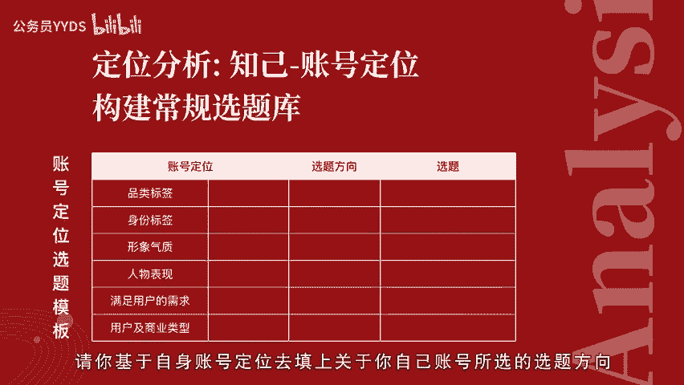
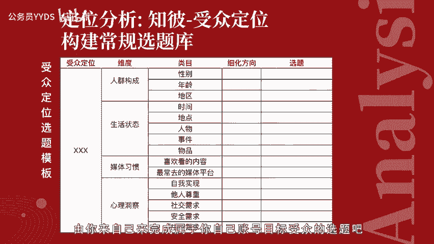
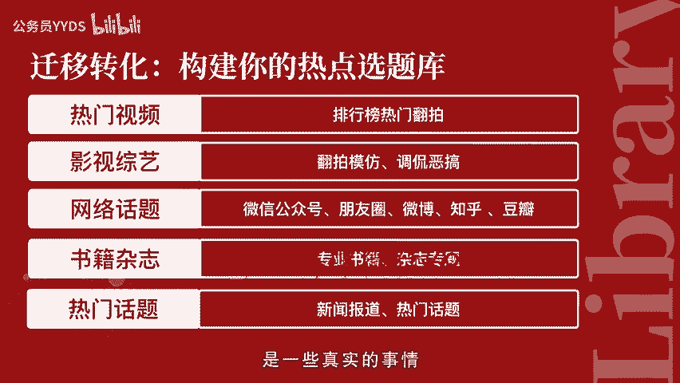
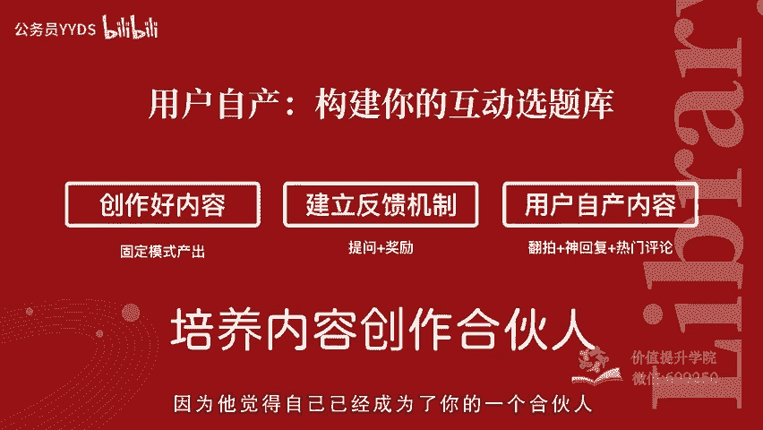
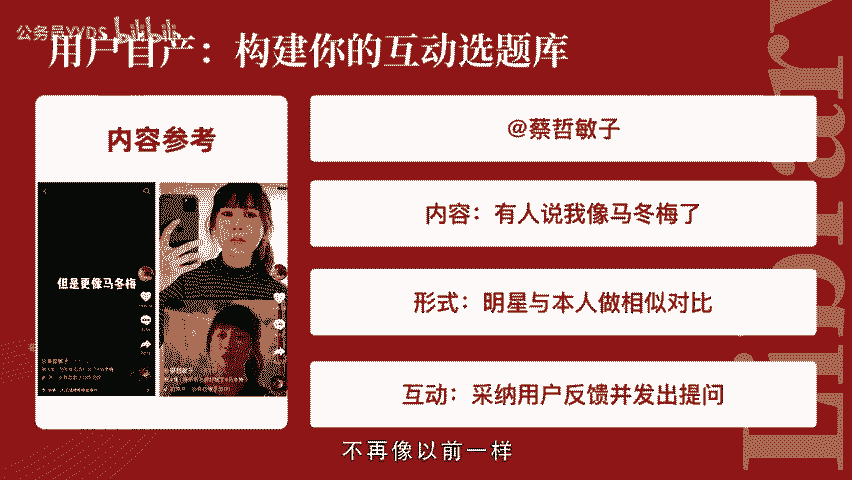

# 用短视频打造百万级IP内容号第7课-爆款选题揭秘：3个方法让你保持高效而持续地产出创作 - P1 - 公务员YYDS - BV1TvsZeaEz5

。

🎼嗨你好，我是短视频行家maggie。这一次我们进入了第三章内容创作片第七节爆款选题揭秘三个方法，让你保持高效而持续的产出创作。很多新手在做短视频的时候，最担心的就是不知道该拍什么。

或者一时兴起拍了5到10集之后，不知道该拍什么了。选题是一个大概的内容话题方向，具体的视频脚本和文案，在正式做内容的时候，可以基于选题，直接细致优化，而不是临时想起什么就拍什么。

短视频选题最大的目的就是为了持续产出，能够做好内容储备，保证更新不断更，这是做任何视频账号博主的一个最大前提。其二一目的呢就是保证视频的系列感。完整的系列才能够吸引人持续关注。然后就是保证视频的质量。

充足完善的准备计划，能够让你的短视频内容更加优质稳定的输出。短视频选题原则，遵循以下三点，符合目。😊，🎼定位贴热点和保持互动。首先，符合我们短视频最开始的定位目标，符合商业目标，符合人设目标受众定位。

符合你账号内容设定。第二点是贴热点，也就是在汲取时间节点上热门事件话题元素，能够让我们在大众的注意力都集中在某一个人事物的情况下，搭上流量顺风车届势让我们轻松获得关注。第三一点呢就是保持互动。

之前我们一直都在强调一定要做与我有关的内容，而持续互动，能够让用户粘性增强，让用户不管喜欢，还特别有归属感和存在感，被Q到的用户呢更愿意帮助你去做传播，成为内容创作合伙人队友一般的存在。

让你的思维灵感如虎添翼。短视频选题大概有三大方法，定位分析法做常规选题。迁移转化法做热点选题。用户自产法获得互动选题。第一，所谓定位分析法构。😊，🎼常规选题就是在没有任何外界干扰的情况下。

专门构建属于符合你自己商业目标的一个日常更新的选题，必须要通过定位分析的方法获得。也就是知己知彼与我有关，基于品牌产品的自我账号品牌定位和目标受众定位分析，贴热点的原则呢，我们的热点选题。

可以通过迁移转化的方式，把其他平台热门话题转化成短视频形式的内容选题。包括通过视频的数据排行榜看热门视频通过电影综艺书籍以及杂志、微博、豆瓣、知乎等社交媒体平台获取内容信息。

第三1点呢就是用户自产内容构建互动选题，通过一些奖励或提问的方式，激发用户产生自产内容，然后从用户的私信反馈，或是神回复热门评论里得到这个选题方向应用在内容里，不断形成良性循环。😊。

🎼那么我们逐个看一下每个方法怎么操作吧。首先，以一个人设定位女老板为例，段子剧情类的账号为例，定位分析构建你的常规选题库呢，就像我们之前所说的，明确品类标签身份标签、形象气质、人物表现，满足的用户需求。

商业目标类型一一对应罗列品类标签是段子剧情身份标签女老板形象气质是成熟知性。人物表现大度宽容有担当，满足用户的需求呢，就是代入式的职场话题。商业类型目标，就以这个老板的身份去带货。

包括时装美妆珠宝配饰等等。在选题方向上，我们可以基于这样的账号定位。每一个项目的特质做延展。这个列举呢不是非常全面，只是简单的举例，但是你可以用这个应用的方法，基于你的账号定位做一个延伸。

比如说我们在选题方向上来讲。🎼基于段子剧情这个方向，我可以做反转反差。那基于反差这一点呢，我就可以去做一些延展。比如面对客户下属和闺蜜时的不同状态。那反转的话就是老板表面说的话和实际的意思。

具体标题和内容呢之后可以再细化。但是呢我们先把这个大概的意思，一句话的故事梗概放在这里。那基于女老板这个身份又可以通过她的时间地点、人物关系，与女老板的视角去做延展。比如高管会有人迟到了怎么办。

🎼在去找客户开会的路上，与对手在同一个项目竞争时，员工提离职时我的态度。从形象气质的角度上，基于成熟知性，可以做一个造型对比。比如上班前和上班后，从人物表现的角度上，如果我设定的是大度宽容有担当的话。

就可以通过具体的事件去体现，也可以直抒胸臆的去做一些内心表达。那具体事件呢，比如说员工出事了，老板是如何体现出有担当的。从内心表达上来讲，就可以有一些真诚的建议，老板真诚的建议，还可以再去延展。

比如对于职场新人的建议，对工作十年员工的建议，对有工作生活无法平衡的、困扰的员工的建议。然后带入职场话题，可以带入员工身份也可以以客户的身份带入。比如决定辞职去创业前，老板谈话，签约前的谈判等等。

基于商业目标设计品牌。🎼或产品的使用场景就可以进行话题延展。比如办公室时装搭配，办公室礼仪，不同老板的穿着工作三年或5年，不同的人的穿着，从内容设定上就主动向这个商业目标渗透。

所以在这里给大家一个空白的表格，请你基于自身账号定位去填上关于你自己账号所选的选题方向，在定位分析角度构建常规选题库的时候，我们之前提到了知己的角度，就是通过你的目标受众定位去构建选题。

在第四课有非常详细的讲解，可以再去回顾一下这里呢我们在简单对受众定位进行温故之心，看看是不是有更多的新的启发。以初入职场女性举例。我们这个人群的属性可以划分出这几个维度，人群构成基本属性，人的外在表现。

生活状态媒体习惯。人的内在也就是心理洞察。从这些维度做分类。人。

🎼群构成按照性别年龄地区划分，比如一线、二线城市、22到28岁女生作为基础目标受众属性。关于女生的话题，可以有办公室女生之间的友谊，办公室里男生和女生的差别。如果是一二线城市呢。

又可以得出大城市上班的我和回家过年的我的区别，或者讲一讲一线城市打拼的艰辛，同样也是在这里简单举例，是不是你现在已经有好多可以延展的idea了呢？思如潮涌，脑海里有画面了没有？以年龄分类。

我可以说不同工龄职场人的区别，也可以讲讲驾龄职场女性和年轻女性比有什么优势，有什么困难？基于时间地点、人物、事件、物品再去拆分。

可以有面试、入职上班、下班、家里、工位、会议室、茶水间、老板、同事下属竞争对手、客户、年会、团建，这么多细化的场景得出的选。😊，🎼题我们来举一些例子，比如1个面试中的尴尬场面。

第一天上班如何让新同事眼前一亮，上班迟到的理由，不同人下班前的表现，在家办公室一种怎样的体验？高手是怎么在工位上开小差的？会议为什么总是那么长？茶水间遇到不熟的同事的时候，不同风格的领导。

你遇到了哪种你的办公室一定有这样的同事，你的下属比你强，你该怎么办？如果在职场像宫斗剧，想象中的客户和实际的客户，年会上的尴尬，当领导组织团建时，媒体习惯上从喜欢看的内容和喜欢去的平台。

又可以设定为情感类、搞笑类的内容有追星行为，喜欢看微博刷抖音，发散出这些选题。不同岗位的人是怎么用电脑的？开会时玩手机怎么不被发现？当你在办公室拿出零食的时候，办公室恋情。办公室总是一箩筐。

当你发现你和。😊，🎼同事喜欢同一个爱豆时，假期刷微博和上班刷微博的我。如果同事刷抖音刷多了，那么在心理洞察上。

基于马斯洛心理需求金字塔的每一个层级去体现自我实现他人尊重社交需求、安全需求、生理需求又可以拆分出职业理想个人成长一举成名，受到领导认可，被其他同事夸赞。

办公室里的朋友职场里的兴趣小组、职场里吵架、心理安全、生理安全和健康。比如可以有这些选题，小时候的职业理想和现在的职业理想。你在工作中的成长瞬间，在办公室最出名的瞬间，最受领导认可的员工是什么样的。

最令同事夸赞的瞬间，职场里是否有真朋友，职场里的兴趣小组职场吵架常用语，做一次评级没有你的时候，身体不适，还有上班的你上班最容易得几种病。你会发现，用这样的方式得出的特别多的具体的选题。在。😊。

🎼这样基于与我有关的原则设定选题是非常符合目标受众自然而然的生活状态的。这些话题本身并不难想到，但通过这样的架构工具，可以帮助咱们唤醒对于人物生活状态的理解和细节的体现。

所以接下来这个受众定位选题模板给到你，就有你自己来完成属于你自己账号目标受众的选题吧。第二个方法，咱们详细看一下，怎么用迁移转化法创作热点选题库。基于热门影视的翻拍或借鉴故事模型表现形式。

提取出与我们账号主题相关的贴热点选题。关于热门的视频去哪里寻找呢？我在第五课里有提到如何做市场研究，就是可以去看看飞瓜数据抖大大等视频数据平台，当日或当中热门排行榜里最最热门的视频。

这个好处其实不必多说了。因为所有人注意力都在这里，你借势就容易去。😊。

🎼获得曝光和转化。在影视综艺这一块呢，有很多可以玩的东西，比如套用影视作品的经典故事模型，翻拍、模仿、调侃、恶搞，也就是在大家已有的认知基础上进行结构重建。

比如有很多视频在这个剧情里面加入模仿周星驰电影的片段台词。哎，不上班可不可以呀？不上班，你养我呀，还有像琼瑶剧里面紫薇的声音去吐槽现实生活中的小麻烦，还有像模仿TVB腔。

也同样综艺其实是阶段性被大家关注的热点内容形式。比如选秀节目评委和选手的表现。演员的诞生这个节目在热播期间就有很多的人去模仿评委和明星演员之间的冲突状态。近期非常火的青春有你2，也被很多内容创作者。

将其中的选手表现，模仿哇哦加入到这个创作里。在网络话题当中进行内容转化，可以。😊，🎼在朋友圈微信公众号看到的文章以及微博热门排行榜、知乎热门话题榜以及许多非常活跃的豆瓣小组豆瓣话题都能够找到非常多的选题来源。

对于垂直类型的短视频来说，你可以去锁定你行业里非常热门的一些自媒体或平台的账号。关于书籍杂志上呢，听起来是传统媒体，但你会发现这些杂志上很多专栏策划都是非常系列化的，和我们做系列短视频的思路非常相似。

你同样可以对于传统的文字形式和系统的知识，把它们进行视频化改造，当然不是说要你把它们直接搬运过来，而是把它作为一个选题思路来源，你可以在这个结构和内容的基础上进行加工，就会非常游刃有余。

热门话题来源可能非常多。除了以上提到的一些网络平台影视综艺，也有可能是当下发生的一些事件被报道出来，会发布到新闻。😊，🎼平台上是一些真实的事情。在这里呢我就介绍一个近期我看到的一个热点话题。有报道称。

网友被邻居蹭网wifi改了密码之后呢，还反而被训斥，斥责说孩子考不上大学，你负责，然后这则新闻激发了很多网友的愤怒之情，是一个非常非常有情绪的热点话题。呃，我就看到不止一个博主翻拍了。

把这个话题呢凌晨wifi改密码被邻居训斥的过程。用剧情的形式活灵活现的充分的展现了出来，然后和网友形成了一个情感共鸣，帮助大家发泄了情绪，获得了播放量和点赞量都表现非常优异。当然。

不同的博主他们在加工这个内容的时候呢，会基于他们不同的账号定位，有他们各自对于这个话题的理解，发挥的各有千秋。比如说有的人在剧情里是一个挨欺负的月色，也有的呢代表受害者给蹭网邻居一个反击教训。😊。

🎼看着很爽，感觉情绪得到了释放，以这故事形态展现，表达态度宣泄情绪，还有一定的教育意义，非常符合我们之前说的好内容三要素，有情有趣有用。通过用户自产的方式构建你的互动选题库，有这样三个步骤。

首先呢就是要创作好内容。因为你只有创作出好的内容，才能激发出别人持续关注你和你互动的这个热情。第二点呢，在内容设定的时候，专门加入反馈机制。比如在视频末尾提出问题，在评论区发起讨论。

或者在直播的时候设定奖励机制，刺激用户不断的给你留言互动。在这之后的内容发布里面体现出用户的这些反馈，比如他们的神回复，或者是用户的翻拍恶搞热门评论。这样被Q到的用户会更加有激情，和你互动。

形成非常强的粘性，更愿意为你去做传播。因为他觉得自己已经。😊，🎼成为了你的一个合伙人。这里面举个例子就是蔡哲敏子。在他的视频发布的时候，经常有人说他长得像谁谁谁某位明星艺人、网红甚至卡通人物。

长得像的人非常多。所以呢他就把这些明星本人和他自己本人的相似对比拍了出来，开场就是说又有人说我像谁谁谁了，把这些用户评论贴上发现不止一个评论这么说，于是他就采纳了这些建议，进行了照片对比。

发现还真挺像的。然后大家就觉得这个非常有趣。在视频结尾，他发出提问，还说我像谁呢，然后这条视频发布了之后，底下又有很多评论，说他像另外的人，这样就是非常有粘性的一个闭环的互动。

而当他在展示他像谁谁谁的时候，也会间接的去借示其他人的流量。关注者和粉丝不管是有争议的还是拥户的，都可以形成一系列的话题讨论，而用户参与其中也能够感受到非。😊。

🎼非常多的乐趣，成为内容创作合伙人。当你学会使用上三个方法收集选题的时候，是不是发现自己已经能够做到选题真的是非常非常的多，不再像以前一样，一想到拍视频就不知道该怎么持续下去了。

选题创作步骤从最开始的商业目标推导出来的账号定位受众定位，得出的内容模式，在日常中有意识有目的等，基于这个模式，收集素材。因为有输入才有更好的输出，要注意阅读留言，观察生活，随手保存、随手记录。

第三步呢，我们按照之前提到的方法，把这些选题按照框架整理成文档。必要的话，在选题后面可以附上参考链接，然后排序分类，在合并各类选题库精细分类整理，相同大主题下进行系列化整理。对于选题进行时间上的排序。

比如有些热点要及时贴。那么常规内容呢就可以先往后顺一顺。😊。

🎼下一步就可以将选题丰富细化，转化成可拍摄的内容脚本。下一节我们就来具体讲解如何把我们的选题细化进行创意脚本的创作。我会列举几个常见的短视频类型分析，帮助你掌握短视频创意脚本的创作秘诀。

快把课程分享给你的搭档或是团队小伙伴一起来学习吧。也可以在评论区留言，说说你的学习感受。我是短视频行家maggie，下次见。😊。

