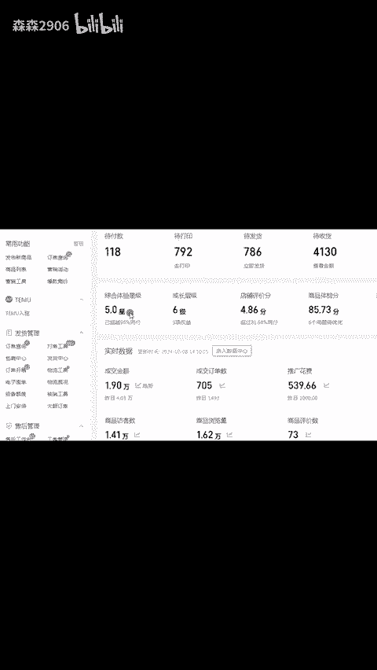
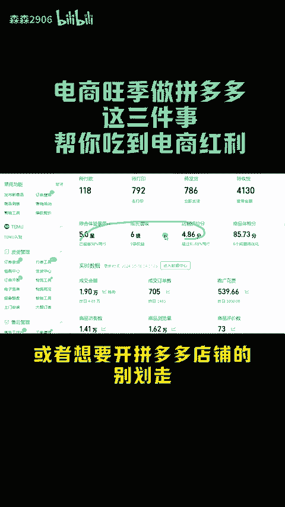
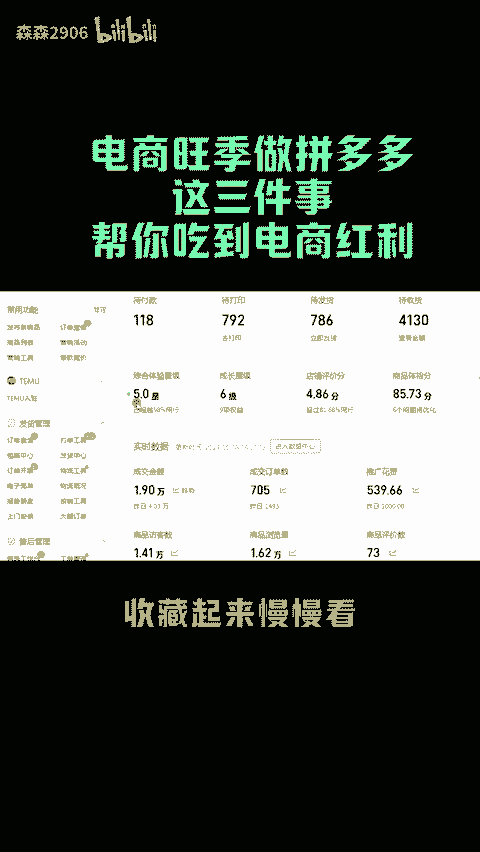
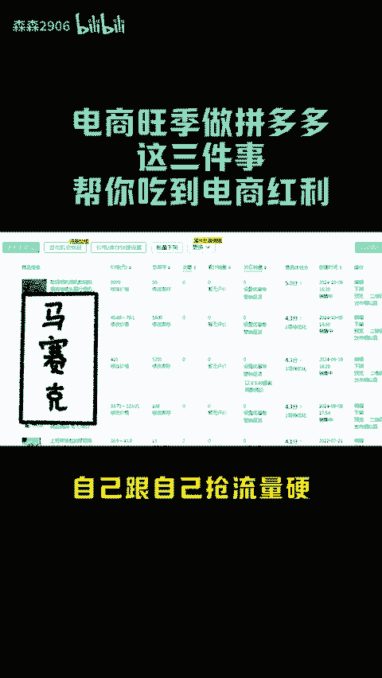
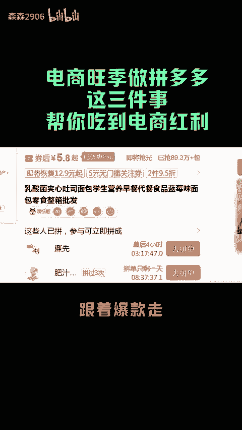
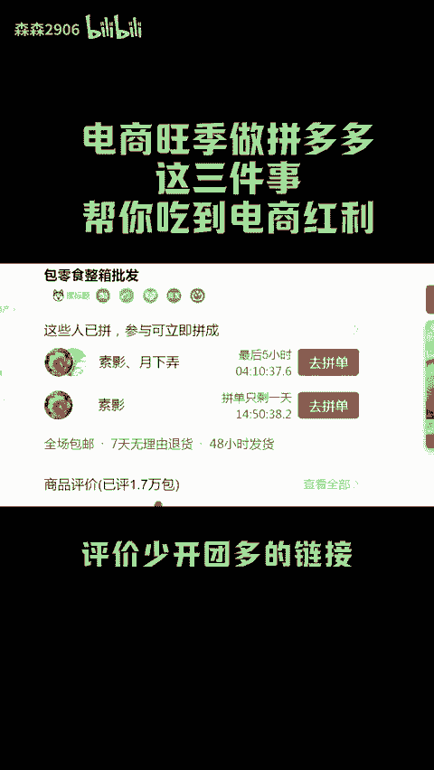
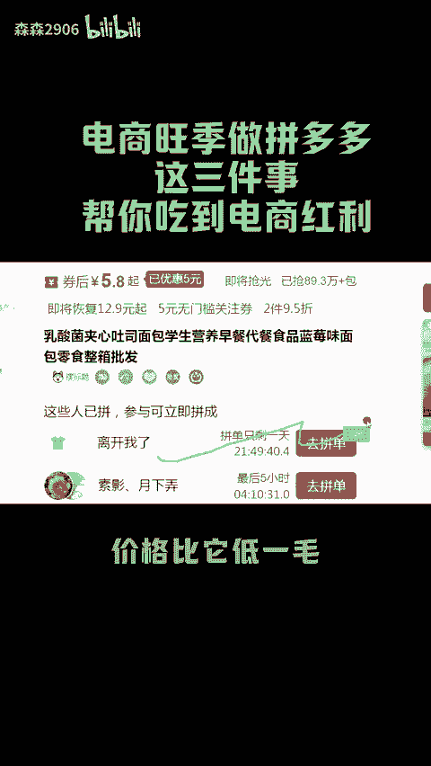
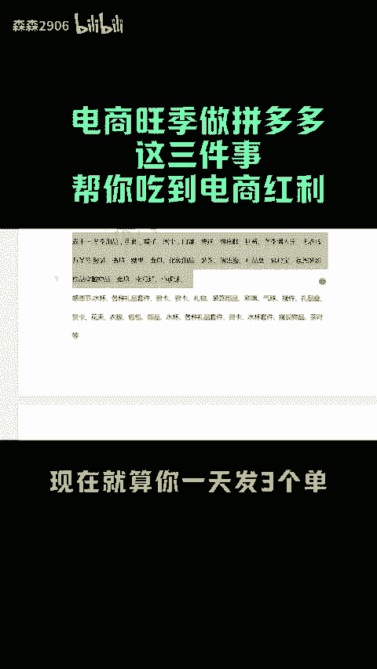
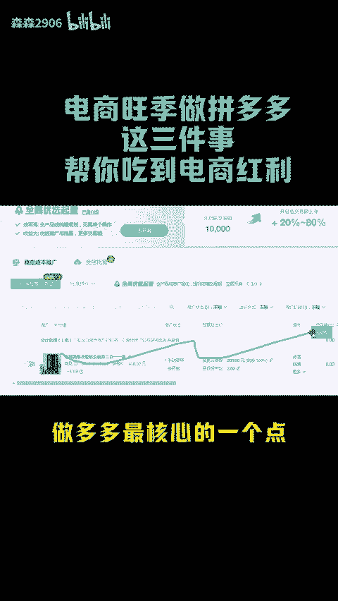
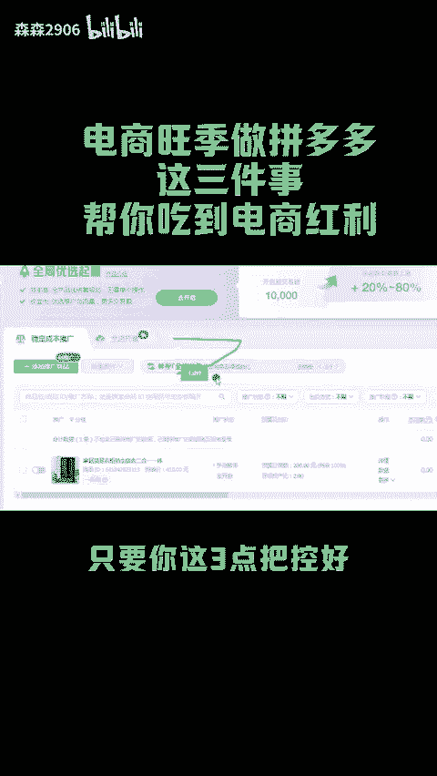

# 电商旺季布局拼多多，一定要做到的三件事 - P1 - 森森2906 - BV11i2NY2EkY

拼多多双十一来袭，还没有把店铺做起来的，或者想要开拼多多店铺的，别划走。接下来我说的几个点一定对你有帮助，不要觉得现在才开始做拼多多布局太晚，就索性摆烂了，一点都不晚，迎接双十一布局双十二。

按照我说的这几样去做，肯定能知道这波电商红利，点赞关注，收藏起来慢慢看。首先第一点，每天最少需要上20条链接，自己跟自己抢流量一好过别人给你抢流量，链接铺的越多，出单概率肯定越大。第二点。

一个月最少找10个产品，不要想着一个产品做到底，这几乎不可能跟着爆款走，每吃到肉也能喝到它，我们就去找那种销量高，评价少，开团多的链接，这种都是刚起报的链接，一比一复制下来，价格比他低一毛。

链接起得很快。而且冬天的品特别多，现在就算你一天发三个单，工厂也会给你代发，放手去做就行。三五个产品做起来，你就可以选出一个最赚钱的产品，继续优化，继续复制，继续裂变。产品不行了。😡。

就直接换我们的目标不是这个链接能做多久，而是在链接势投最剩的时候完成收割。第三点就是投入资金，操作资金，免费留一个产品，多少条链接都只能投入1000块钱以内强付费。

强付费一个产品只能投资在2000块钱以内，超过这个限额，这个品就直接放弃做多多最核心的一个点，千万不要亏钱，因为亏钱容易，赚钱难。只要你这三点把控好，在这个几个月的电商旺季，这么多个品。

随便写来写来一两个都能吃到电商红利了。今天分享就到这里了。下期给大家讲讲直通车开车技巧。😡。

