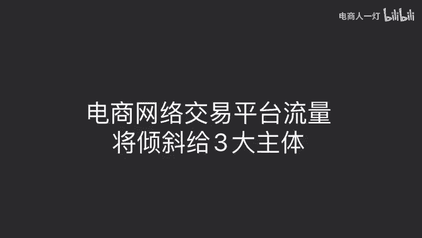
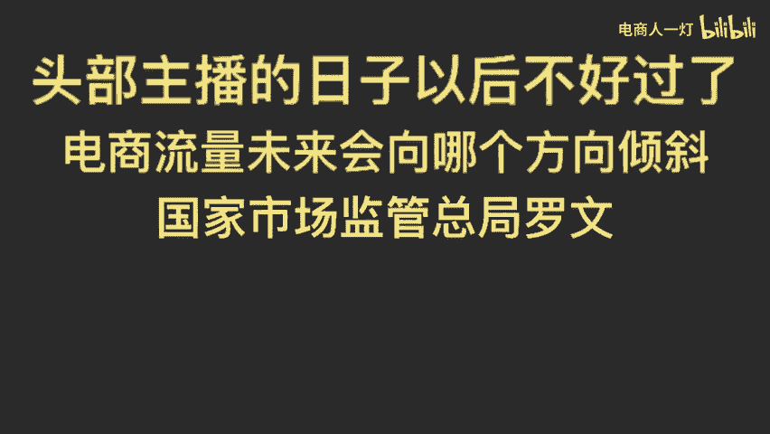
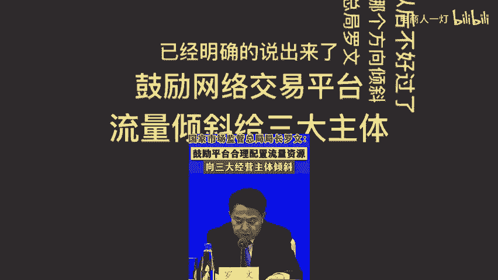
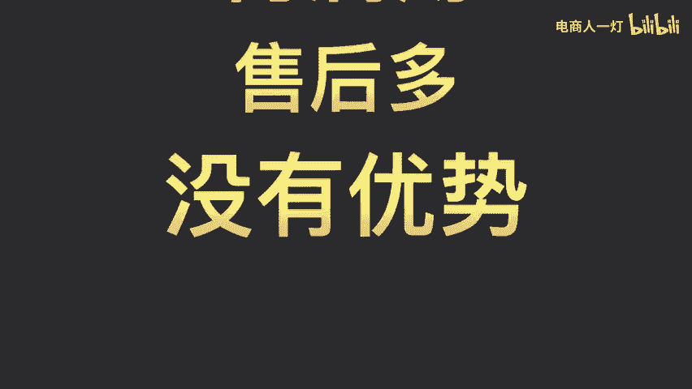
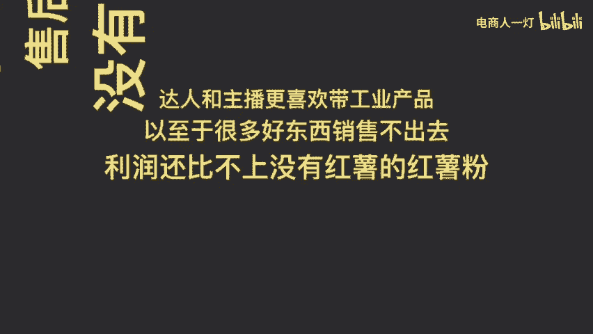
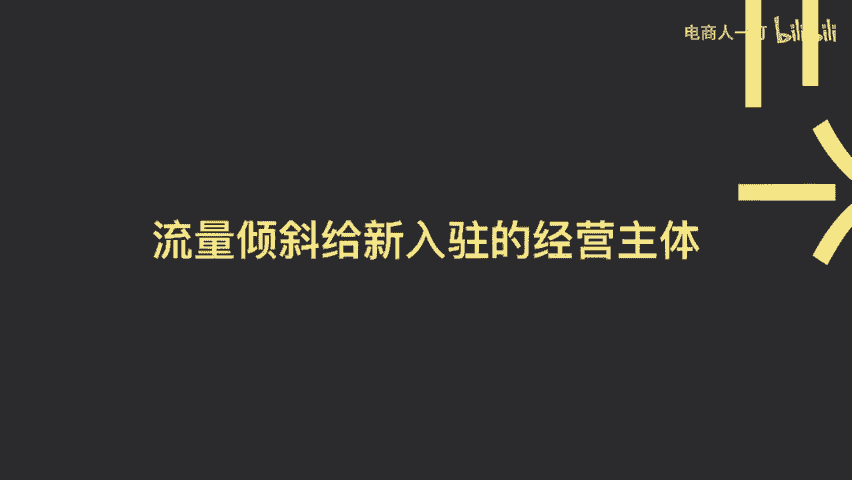
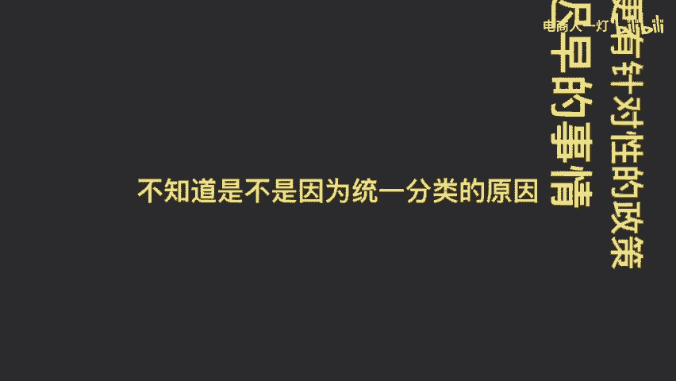

# 电商网络交易平台流量将倾斜给3大主体 - P1 - 电商人一灯 - BV1HhC2YnEm7

头部主播的日子以后不好过了，电商流量未来会向哪个方向倾斜。国家市场监管总局罗文已经明确的说出来了，鼓励网络交易平台流量倾斜给三大主体。第一个，农产品倾斜农产品国资命卖。

向吐鲁番葡萄阳澄湖的蟹盘锦的大米诸如此类，可以直接为本地提供经济效益，从而增加地方财政收入，初级农产品它一腐烂难储存货架期短，利润薄，售后多，没有优势。达人和主播更喜欢带工业产品。

以至于很多好东西销售不出去，利润还比不上没有红薯的红薯粉。第二个，流量倾斜给特色经营主体。第三个，流量倾斜给新入驻的经营主体，个体工商户是中国数量最多的经营主体，到今年8月底已经有1。25亿户。

今年年底前会全国统一的分型分类，然后在税收、社保等领域出台更有针对性的政策。电商税是迟早的事情，不知道是不是因为统一分类的原因，很多虚假地址代办的执照出现了问题。个体工商户还要注意一下，它是无限连带责。

想要进交流群，点我头像，这里可以给我发私信。

